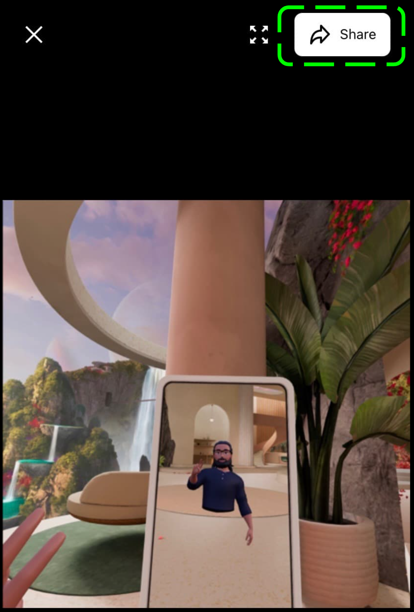

# [How to Attach a Media File from the Headset to the Ticket Submission Form?](#how-to-attach-a-media-file-from-the-headset-to-the-ticket-submission-form)

**1. In Headset:**

1. Open **Apps** from the universal menu. 
2. Select the **Files** app.
3. Navigate to a specific file and select **Sync to Mobile App**. 

**2. From Mobile App**

1. Navigate to the **Menu** tab.
2. Select the **Devices** button and pair with the headset the media file is saved on.
3. Select the media file(s) you want to attach to the submission form.
4. Click on the **Share** button on the top right corner 
5. Select the **Email** option and email the file to yourself.
6. Attach the file from your email to ticket submission.

