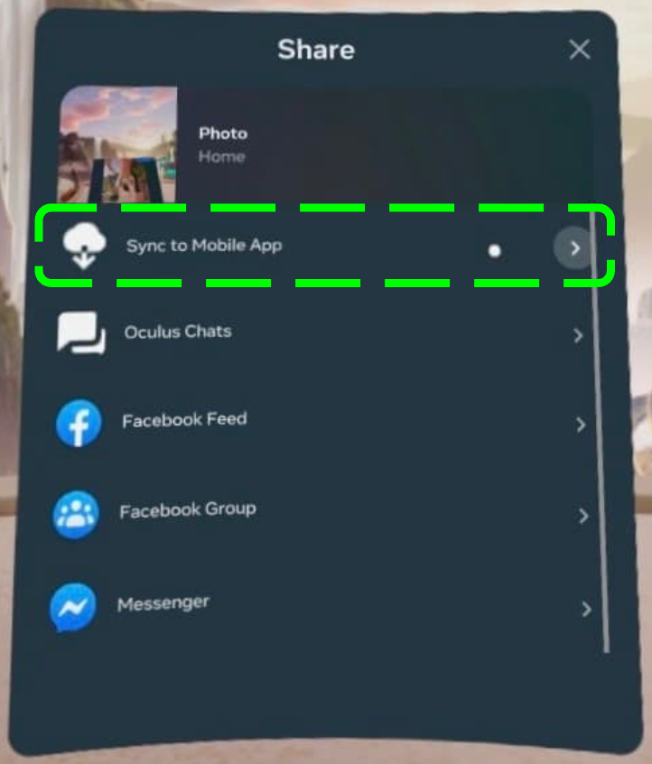

# How to Attach a Media File from the Headset to the Ticket Submission Form?

**1. In Headset:**

- Open **Apps** from the universal menu.
  
- Select the **Files** app.
- Navigate to a specific file and select **Sync to Mobile App**.
  

**2. From Mobile App**

- Navigate to the **Menu** tab.
- Select the **Devices** button and pair with the headset the media file is saved on.
- Select the media file(s) you want to attach to the submission form.
- Click on the **Share** button on the top right corner
  
- Select the **Email** option and email the file to yourself.
- Attach the file from your email to ticket submission.