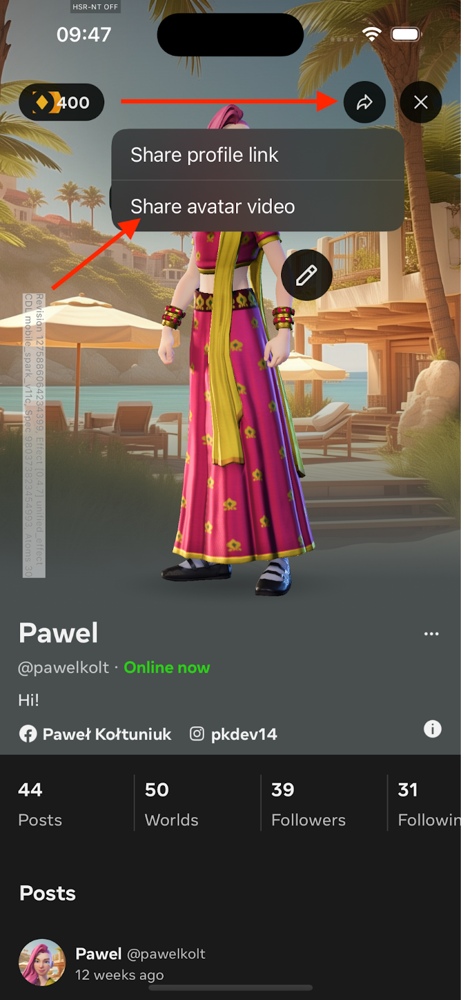
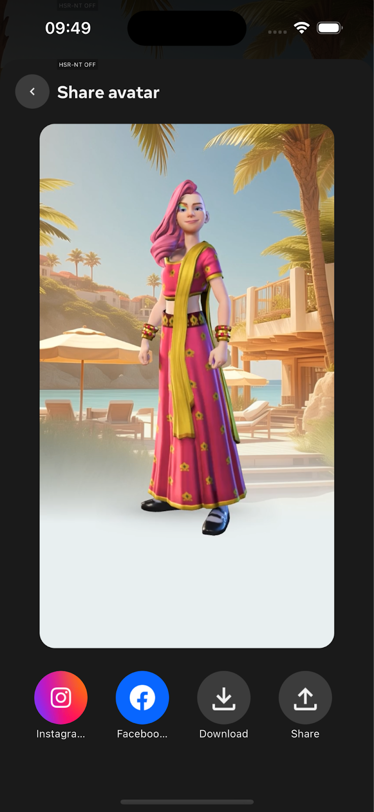
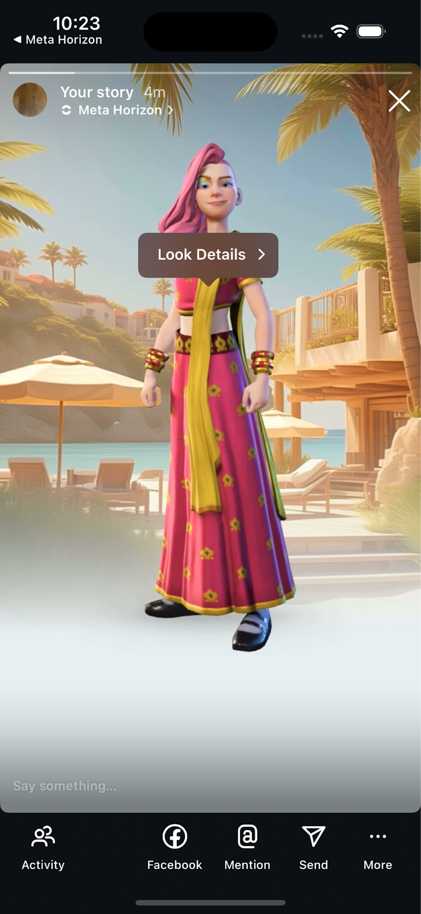
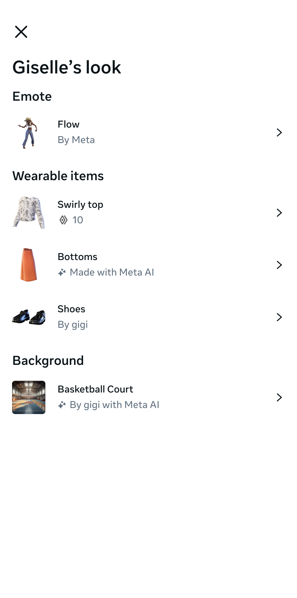

# [Avatar Posts](#avatar-posts)

Avatar video sharing is designed to enable the creation of avatar-centric videos on Horizon and sharing to other surfaces such as Facebook, Instagram, and other social media platforms. By using avatar video sharing, creators can enhance the visibility and engagement with their created digital goods. Avatar video sharing addresses the need for increased visibility and engagement of digital goods by leveraging avatar videos, which have shown to perform better than static images.

By using avatar videos you can benefit from:

- **Increased Engagement**: By sharing avatar videos on IG stories, creators can reach a broader audience and drive more engagement.
- **Enhanced Discoverability**: The feature allows viewers to inspect the avatar’s look and explore 3P goods, potentially leading to increased sales.
- **Integrated Ecosystem**: Avatar videos aims to create a flywheel effect within Horizon, encouraging users to engage with and purchase 3P goods.

## [Prerequisites](#prerequisites)

Before using Avatar Video Sharing, ensure the following conditions are met:

- Horizon and IG apps are installed on the user’s device.
- The user has access to the Video Composer feature on their profile.
- The user has 3P goods available for styling their avatar.
- The user has a Facebook or Instagram account linked to their Horizon profile.

## [Get started with Avatar Video Sharing](#get-started-with-avatar-video-sharing)

To start using avatar video sharing, use the following process:

1. Open the **Meta Horizon** app and tap your avatar icon at the top of the app view.

2. Tap the **Share** icon, then tap **Share avatar video** from the listed menu option.

   

3. In the share avatar view, set an **Emote**, generate a **Backdrop**, and customize your **Avatar’s** look prior to sharing. You can also resize and move the Avatar around. This is an opportunity to add digital goods for purchase to your avatar for your audience to see.

4. Once you’re done customizing your avatar video, tap **Share** in the top right corner to open the share menu and select a platform to share your video to.

   

5. Once shared, your friends and connections can view your shared video and tap. On IG Stories, by tapping **From Meta Horizon** they will be taken to your Horizon profile.

1. By tapping your avatar they can view the digital goods your avatar is wearing and optionally purchase them for themselves. Tapping the listed items will take users to that items PDP (Product Description Page). You can additionally add a text sticker to the shared story to encourage viewers to tap on the avatar.

   

## [Best Practices](#best-practices)

- **Optimize Engagement**: Encourage creators to add text overlays and emotes to make posts more engaging.
- **Monitor Performance**: Track engagement metrics to understand the impact of Avatar Posts on sales and visibility.

