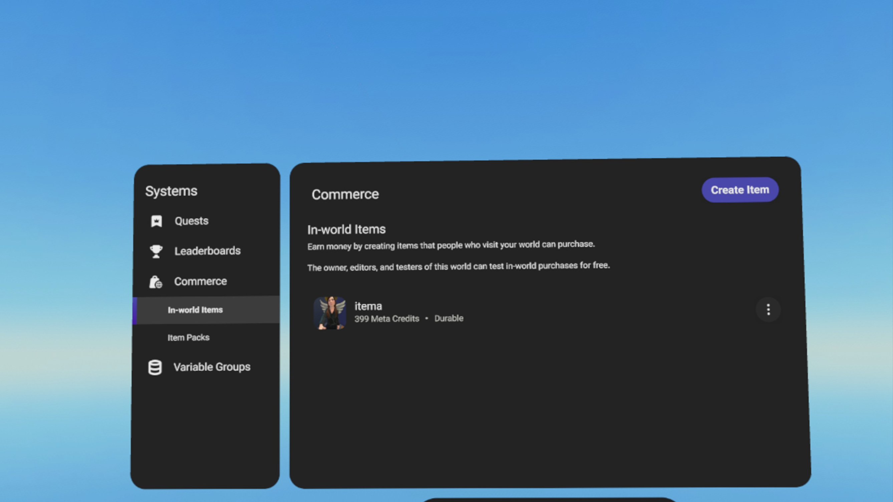
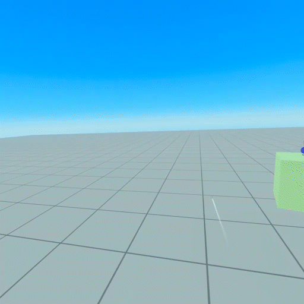

# [In-World Test Purchase](#in-world-test-purchase)

This feature allows the world owner to test in-world purchases for free, making it easy for creators to test their in-world purchases (IWP) before publishing or updating a world. World owners are able to test purchase items at no cost and delete items from their inventory, allowing for simple iteration and testing of scripted logic around items before making them available to visitors for purchase.

## [Prerequisites](#prerequisites)

Enrollment in the Meta Horizon Creator Program is a prerequisite to accessing monetization tools offered to creators in Meta Horizon Worlds, including test-world purchases. Program members must also agree to the [IWP Offering Terms](https://horizon.meta.com/creator) in order to access the Commerce tab in their Creator User Interface (CUI).

For more information and instructions on how to create an IWP item, please review the [Meta Horizon Worlds In-World Purchase Guide](In-world%20purchase%20guide.md).

## [Test purchasing an IWP item](#test-purchasing-an-iwp-item)

This functionality is available in Edit/Preview Mode and in Visit Mode. To most accurately test the visitor purchase experience, we recommend testing in Visit Mode. On the World detail page, select “Published world page” and “Visit” to travel there.

### [To test purchase an item:](#to-test-purchase-an-item)

1. Trigger the in-world item gizmo and a purchase panel will appear with item details including the price set by the world owner.
2. When you click the “Test Purchase” button, a modal will appear confirming this is a test purchase and you will not be charged for the item; click “OK” to close.
3. Open your Player User Interface (PUI) and click the backpack/“Inventory” icon.
4. The new item will appear in your inventory page; click the item image to view the item details page.
5. To test the item, click the “Use” button.

<video controls><source src="../../.assets/video/f2d4cf6a2dd42a13c3099d5cd62fc9bd698d0a1b6ef55484776907ef3635ea6a.mp4" type="video/mp4"></video>

> [!Note]
>
> Items set to ‘auto-consume’ will not appear in your inventory. Items without a spawnable asset will not have the “Use” option.

## [Deleting an IWP test purchase item](#deleting-an-iwp-test-purchase-item)

1. After completing an IWP Test Purchase, open your PUI and click the backpack / “Inventory” icon.
2. Click on the item image to access its details page.
3. Navigate to the red trash can and click it.
4. You will get a confirmation asking if you want to delete the item.
5. Click the “Delete” button to remove the item from your inventory.

<video controls><source src="../../.assets/video/049b8a7c6afa063b9d5be057822778d5022286b2ed58d25ce9a2190dfe7a0e23.mp4" type="video/mp4"></video>

