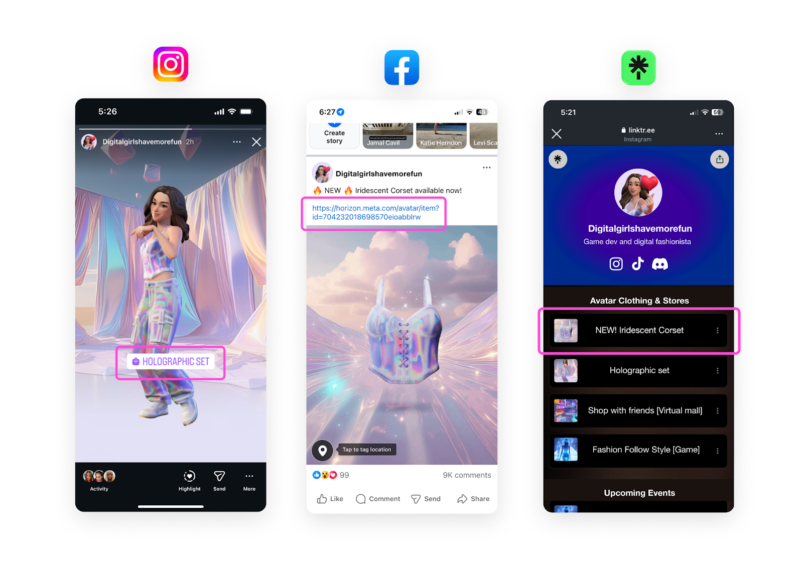
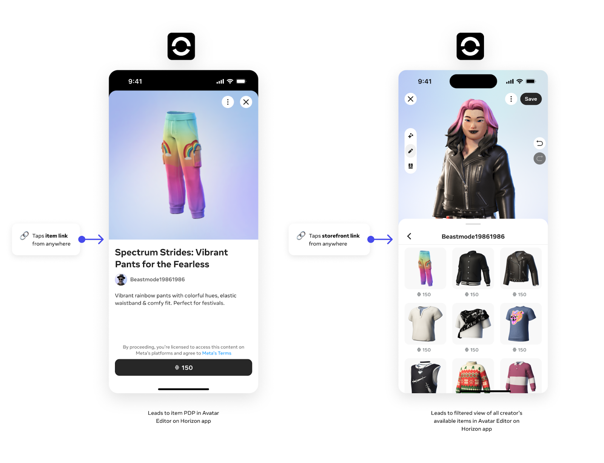
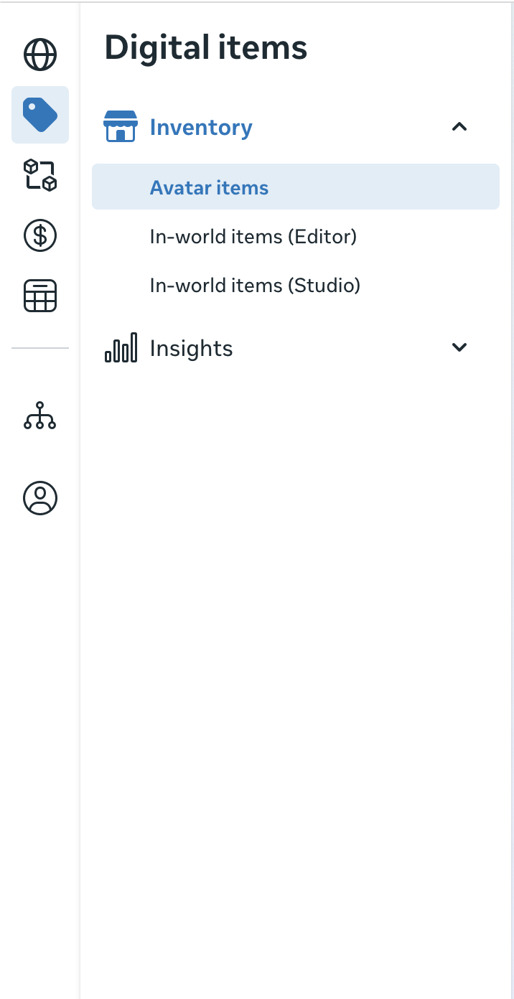
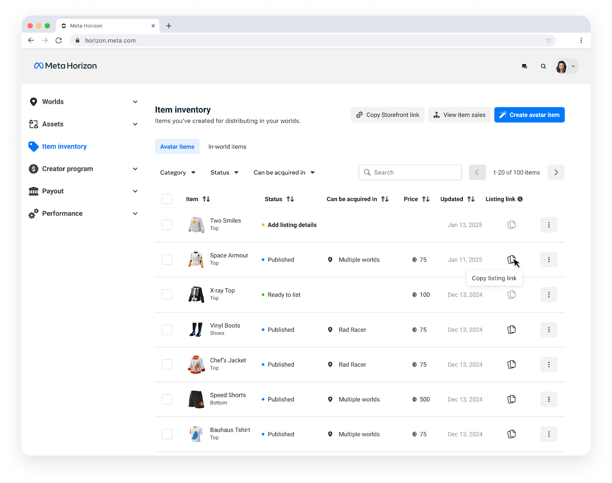
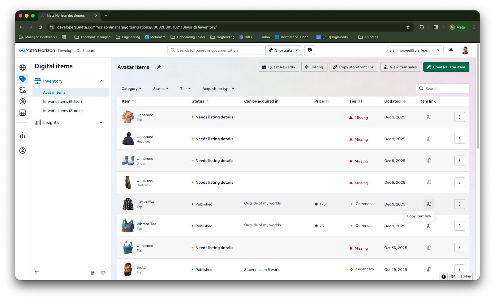
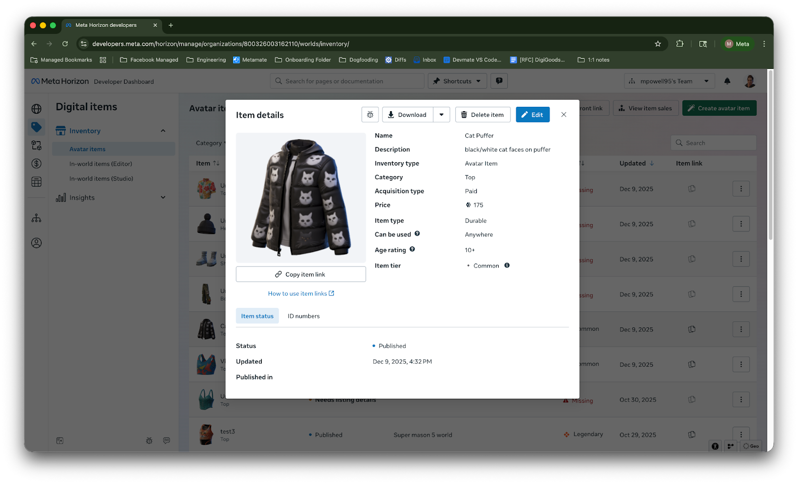
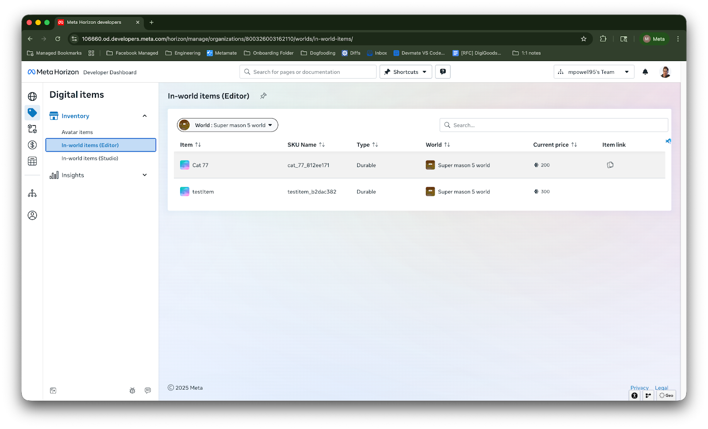
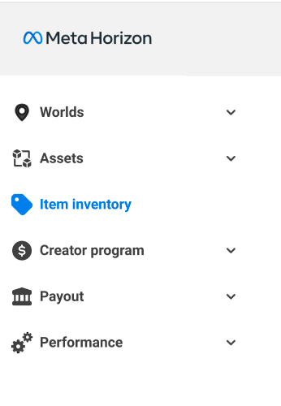
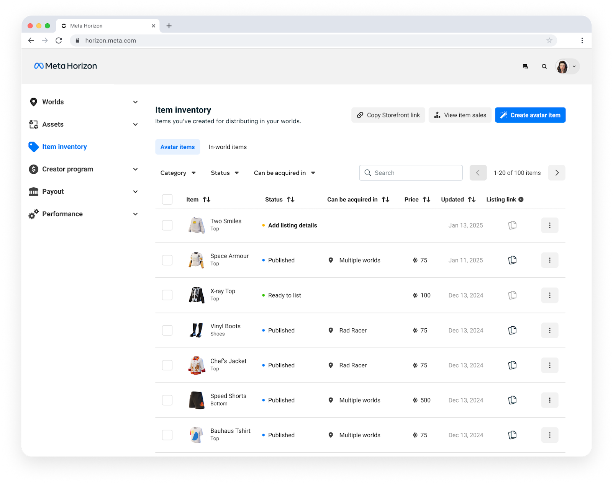

# [Link to listed items](#link-to-listed-items)

Once you have created an item and allowed people to acquire it outside your words, you can amplify its visibility and drive engagement using listing and storefront links. A link is a shareable URL that can be pasted on various platforms like Facebook, Instagram, and other locations to help increase user engagement.

When used well, item listing links and storefront links can maximize the reach and impact of your created items. By strategically integrating them into your promotional efforts across various digital channels, you can significantly boost visibility, enhance user experience, and ultimately drive greater success for your creations.

## [Copy an item listing link](#copy-an-item-listing-link)

Once you’ve created and listed an item or linkted the item to a quest or listed an in-world item through the editor, you can generate links for those items.

To copy a created item’s link, use the following process:

1. Open your browser and navigate to the [Developer Dashboard’s Inventory](https://developers.meta.com/horizon/manage/org/inventory) or select **Avatar Items or In-World Items** from the left menu options. 
2. In the Avatar items tab or you will see a list of your created items. You can click the item link for items you’ve allowed to be listed or linked earned as a reward in and outside your worlds. You can also click the three dots in the right hand column and select the **Copy item link** from the menu. 
3. You can also select the item entry, and in the **Listing detail** page click **Copy item link** button to copy the item URL.  You can now paste the copied item URL and it will link directly to the selected item’d product description page in the Meta Horizon mobile app in the avatar editor.

You can now paste the copied item URL and it will link directly to the selected item’s product description page in the Meta Horizon mobile app in the avatar editor.

In-World item Example UI pic:

Note: In world items only have the Item link Column with the icon

## [Copy a storefront link](#copy-a-storefront-link)

You can also link directly to your storefront so users can view all of your created items that you’ve allowed to be acquired outside your worlds.

To link to your storefront, use the following process:

1. Navigate to and select the **Item Inventory** from the left menu options. 
2. On the inventory page, you will see a list of your created avatar items. Select **Copy storefront link**. 

You can now paste the copied storefront URL and, when clicking it, users will be linked directly to your storefront page in the **Meta Horizon** app in the avatar editor.

**Note**: Users who click on an item or storefront link will be prompted to install the Meta Horizon app if they don’t currently have it installed. Item and storefront links can be shared everywhere, but will only direct users to the link destination when visited on mobile.

