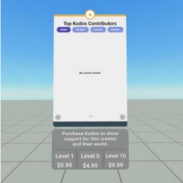
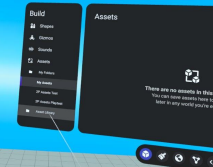
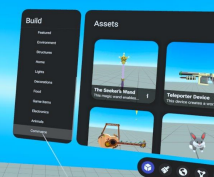
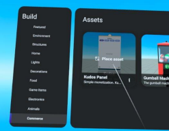
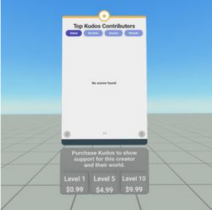

# Meta Horizon Worlds: Kudos Panel Instructions

**Note**: This functionality is not currently supported for Meta Horizon Worlds on web and mobile.

Hey Creators! The Meta Horizon Worlds team has created a new “Kudos Panel” asset to help with monetizing your worlds. The Kudos Panel is a ready-to-use component that automatically configures your world with everything you need to allow people to purchase Kudos as a way to show their support for your creations.

## Benefits of the Kudos Panel

As mentioned above, the Kudos Panel will automatically configure the needed components in your world to allow you to start earning from your creations. When you place a Kudos Panel in your world, it will add the necessary player variables, Kudos leaderboard, and commerce items that will properly configure the required scripts to enable purchases. No additional scripting or coding is required to implement the feature.

Additionally, Creators can edit or tie scripts into the Kudos player variables. This allows you to use Kudos Panel as a starting point for creating your own purchasable items or use Kudos as a gating mechanism for areas of your world with restricted access.

Once created, the Kudos Panel will allow users to purchase Kudos. They are automatically consumed commerce items that will increase the purchaser’s Kudos score. This score is shown on the Kudos Panel leaderboard.

## Kudos Panel Components

The Kudos Panel asset will add the following components to your world:

● **“kudos\_total” player variable:** a persistent player variable to track the total Kudos score for a player. Level 1 Kudos purchase will give 100 Kudos points, level 5 will give 500 Kudos points and level 10 will give 1000 Kudos points.

● **“Kudos” leaderboard:** leaderboard for tracking current Kudos score ranks for all users in this world.

● **Commerce items:** Kudos Panel will create three commerce items with the base names of “Level 1 Kudos”, “Level 5 Kudos”, and “Level 10 Kudos”. These will have the purchase prices of $0.99, $4.99, and $9.99, respectively.

> **NOTE:** If you want to adjust the Kudos commerce item prices, you can! You will need to create new commerce items and update the scripts, text, and In-App Purchase gizmos accordingly.

● **Scripts, In-App Purchase, and leaderboard gizmos:** Kudos Panel also adds all the scripts and visual elements needed to purchase Kudos and show the Kudos score leaderboard.

## How to Use Kudos Panel

In order to access the Kudos Panel, you will need to be part of our Creator Monetization Program and have your payment information properly configured.

The Kudos Panel can only be added to your world once. It is not currently supported to add multiple instances of the Kudos Panel to a single world. If you have previously added a Kudos Panel to your world and fully deleted it, you can add a replacement Kudos Panel to your world.

Adding multiple Kudos Panels to your world will result in Kudos Points being awarded incorrectly and Kudos Leaderboards showing inaccurate Kudos scores.

## Adding a Kudos Panel to your world

To add a Kudos Panel to your world, please do the following:

- Confirm that you have no more than two leaderboards in your world. If you have previously added a Kudos Panel to your world and have a leaderboard called “Kudos” you can skip this step.
- Open the Creation UI and select Assets->Asset Library.
  
- Select the Commerce folder.
  
- Select the Kudos Panel asset and place it in your world.
  
- Once the Kudos Panel is placed in your world, Publish your world. The Kudos Panel asset is now ready to use.
  

> **NOTE:** If you do not see these options, it means you have not been correctly added to the Creator Program. You must be invited to join the Creator Program before you can use the Kudos Panel.

### FAQ

**● Can I add multiple Kudos Panels to my world?**

○ No, while the system doesn’t prevent you from adding multiple Kudos Panels to your world, doing so will cause Kudos scores to be updated incorrectly and Kudos leaderboard panels to show incorrect scores.

**● Can I customize the Kudos Panel components once they are placed in my world?**

○ Yes, you can update Kudos Panel components after they have been placed.

○ Common updates include changing the leaderboard gizmo title.

○If you want to adjust the Kudos commerce item prices, you would need to create new commerce items and update the scripts, text, and In-App Purchase gizmos accordingly.

> **NOTE:** If you update the leaderboard name or create new commerce items, those changes will not be automatically reflected in new instances of the Kudos Panel added from the Asset Library.

**● Do Kudos Panel scores reset?**

○ Kudos scores do not automatically reset.

○ If you want to add scripting support to reset Kudos, you are welcome to.

**● Can I remove the Kudos Panel from my world?**

○ Yes, to fully remove the Kudos Panel from your world, delete all the gizmos associated with the Kudos Panel. You will also need to delete the “kudos\_total” player variable, the “Kudos” leaderboard, and the “Level 1 Kudos”, “Level 5 Kudos” and “Level 10 Kudos” commerce items. If visitors have purchased any of these commerce items, you will not be able to delete them, but as long as they are not attached to an In-World Purchase object, visitors will not be able to purchase them.