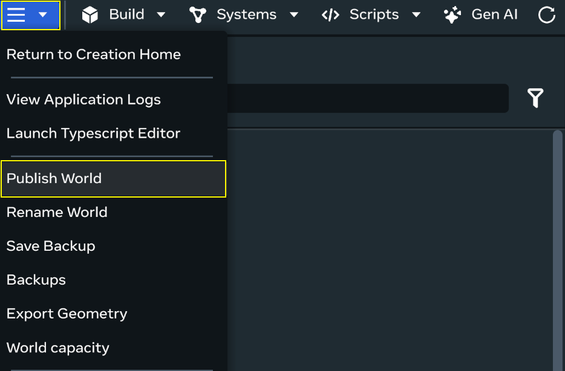
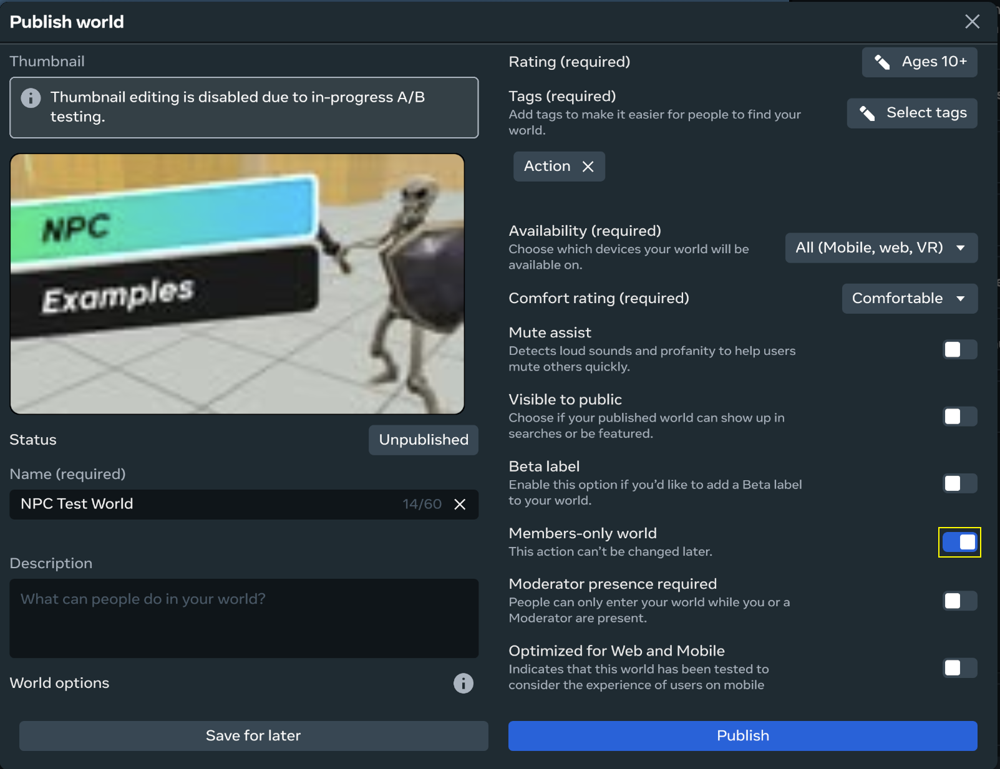
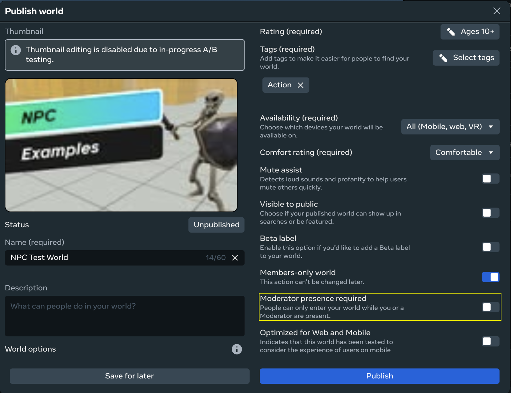

# How to set up a members-only world in desktop editor

Members-only worlds deprecated

 Members-only worlds have been deprecated. With the launch of Home Worlds, we recommend using home worlds for private, membership-based experiences. For more information about Home Worlds, please refer to the updated Horizon Worlds documentation.

**Note**: Members-only worlds come with specific responsiblities and best practices. Learn more about [governance responsibilities](Creator%20governance%20responsibilities%20for%20members-only%20worlds%20in%20Meta%20Horizon%20Worlds.md), [governance best practices](Members-only%20worlds%20governance%20best%20practices%20in%20Meta%20Horizon%20Worlds.md), and [how to manage reports](Manage%20reports%20for%20members-only%20worlds%20in%20Meta%20Horizon%20Worlds.md) for members-only worlds.

## Members-only worlds

Members-only worlds are a type of closed space, that is membership-based. World creators and admins select who is able to join their world. Learn more about [members-only worlds](https://www.meta.com/help/quest/articles/horizon/explore-horizon-worlds/members-only-worlds/).

## Members-only world setup

Once a creator has completed the standard world creation flow and is ready to publish their world, they can take the following steps to enable membership for a world:

- From the desktop editor, navigate to the three-dot menu and select **Publish World**

  
- Toggle the **Members-only** setting to **On**.

  
- Once enabled, a setting option will display for Moderator presence required.

  

* The default for this setting is **Off**, which means that members can visit the members-only world without a moderator present.
* Toggling this **On** means members cannot visit the members-only world without a moderator present.

**Note**: If a member attempts to enter a members-only world where moderator presence is required and a moderator is not present, a notification will display and explain that the world is unavailable.

During the alpha test period, all members-only worlds will remain hidden from search and world menus; members-only worlds will only be visible to those invited by the creator to join the world as a member.

## Additional features of members-only worlds

* Once a world is designated a members-only world, it cannot be converted it to a public world.
* Members-only worlds can be duplicated, but the membership list and world privacy settings will not carry over to the new world.
* Members-only worlds can currently support up to 150 members and 25 members visiting the world at a single time.
  **Note**: The maximum concurrent visitor count depends on [world capacity limits](../Desktop%20editor/Get%20started%20with%20Desktop%20Editor/World%20Capacity%20dialog.md).
* Collaborators (including testers, editors, and moderators) are considered members and count towards the 150 world member cap and number of concurrent members.
* During the alpha, members-only worlds are restricted to a single instance and do not support events. At this time, events cannot be scheduled and hosted in your members-only world.

## Invite Members and Select Roles (Tester, Editor, Moderator)

World creators can invite members and collaborators to their members-only worlds using the Collaborator Management menu and clicking **Invite People**.

See the documentation on [Collaborator Management](../Desktop%20editor/Get%20started%20with%20Desktop%20Editor/Collaborator%20Management.md) for more information.

The world creator, members, and moderators do not need to follow each other to be part of the same members-only world. Members-only worlds feature a **moderator** role. World members with this role can mute someone globally or temporarily remove members from the world.

World creators will remain the responsible party for anything that occurs in their world.it is important to assign moderator roles to members who are trusted.

Anyone invited to join a members-only world can hold a combination of roles including:

| **Role** | **Description** |
| --- | --- |
| Member | Can visit a published members-only world, but cannot modify or publish it. |
| Collaborator | A collaborator can be any combination of the following three different roles:  - Tester: Can go to an unpublished world, but can only review it. They can’t edit, copy, invite, manage collaboration or publish.  - Editor: Can go to an unpublished world, edit it, and view feedback. They can’t copy, invite, manage collaboration or publish.  - Moderator: Can visit published worlds, but cannot modify them. Can mute or remove members from the world. |