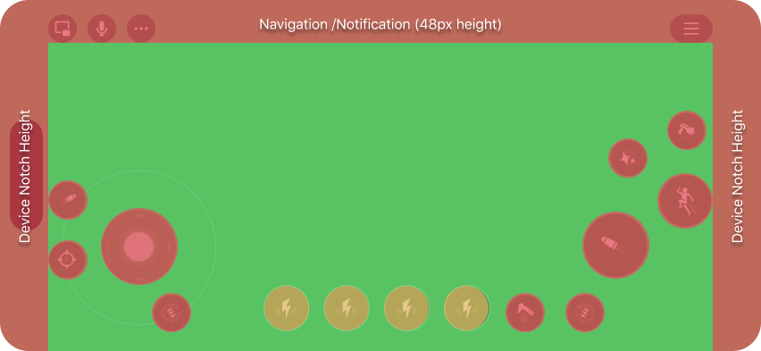
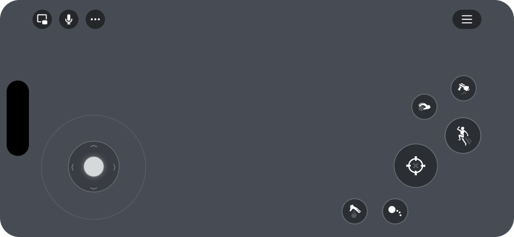
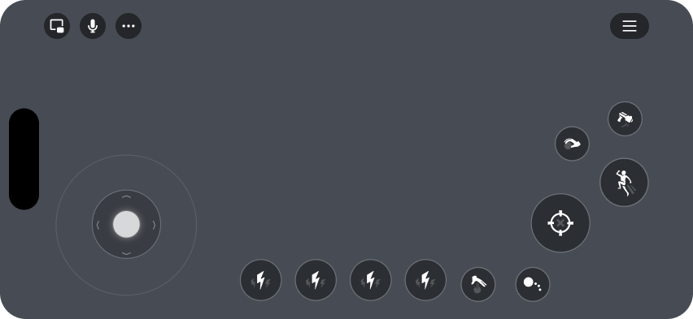
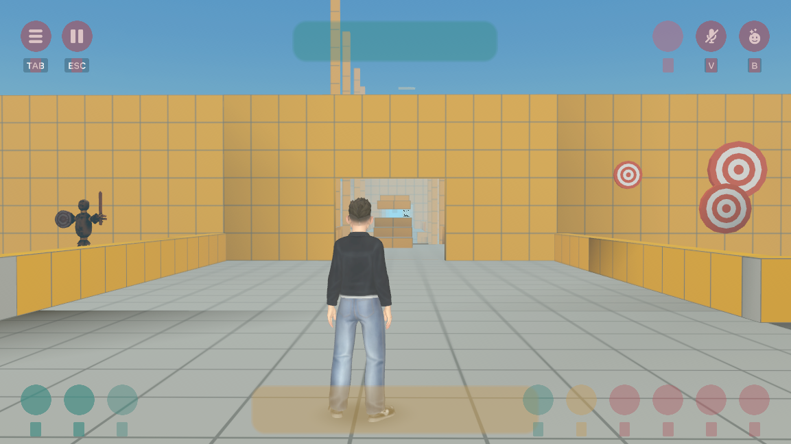
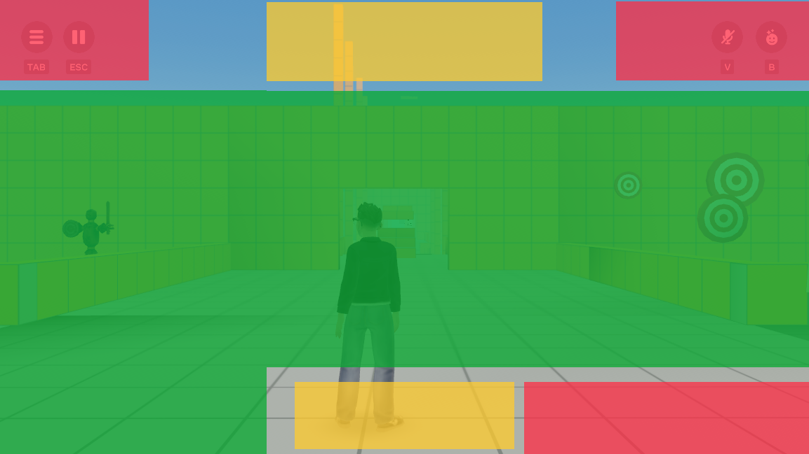
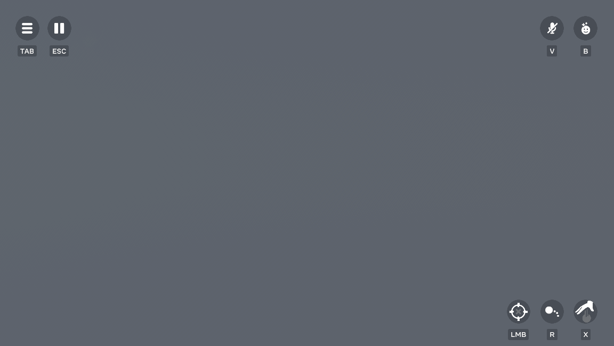

# [Safe Placement of UI Controls](#safe-placement-of-ui-controls)

When designing your game’s user interface, consider both the gameplay controls and transient platform UI (such as notifications, NUX prompts, and world chat). These elements can partially or permanently obscure your interface.

The following illustration provides general guidance for where you can place UI, combining both desktop and mobile surfaces:

*Mobile (@852x393 screen - iPhone 16)*

## [Portrait orientation considerations](#portrait-orientation-considerations)

When designing for portrait orientation on mobile devices, the available screen space and UI placement considerations differ significantly from landscape mode. Portrait orientation typically provides different safe zones due to status bars, notches, and navigation areas.

When testing your world’s UI for portrait orientation:

1. Use the [**Preview Configuration**](../../Desktop%20editor/Get%20started%20with%20Desktop%20Editor/Preview%20mode.md#setting-the-preview-device) options to ensure safe zones are kept clear to avoid overlapping UI.
2. Consider how UI elements stack vertically rather than horizontally in portrait mode.
3. Test with different device models to account for various screen aspect ratios and safe areas.

**Note:** You can configure different camera parameters for portrait and landscape orientations using the [spawn point gizmo](../../Gizmos/Spawn%20point%20gizmo.md#mobile-camera-options) to optimize the visual experience for each orientation.

-  Unobstructed.
-  Potentially obstructed.
-  Permanently obstructed.

> [!Note]
>
> The amount of space will vary depending on the features your world has enabled, how you set up grabbables, and the user’s screen size.

Always test your world on both mobile and desktop, to check for any overlapping or obscured UI.

For a deeper look at why these regions, let’s take a look at each surface with all possible UI states enabled:

*Mobile (@852x393)*

Taking into account the typical usage percentage of each gameplay control and the frequency of each transient UI element, the per-surface safe zones look like this:

*Mobile (@852x393)*

## [Mobile](#mobile)

The most important thing to note for mobile controls is that they are contextual. The number of on-screen buttons is determined by how you set up your grabbables.

For example, if you have a simple world with grabbables that have either one or no actions, then you’ll have more available UI space than a world using complex grabbables, custom input etc.

No held item:

Item with Primary & Secondary actions:

Item with Primary, Secondary and Tertiary actions Holstering enabled on world:

Item with Primary, Secondary and Tertiary actions Holstering enabled on world Using Custom input:

## [Desktop](#desktop)

Desktop controls are also contextual, but they’re limited to a list anchored in the bottom right portion of the screen.

You generally have more space available on desktop, because the on-screen elements are confined to the top left, top right, and bottom right corners.

*Desktop (@1920x1080)*

*Desktop (@1920x1080)*

*Desktop (@1920x1080)*

