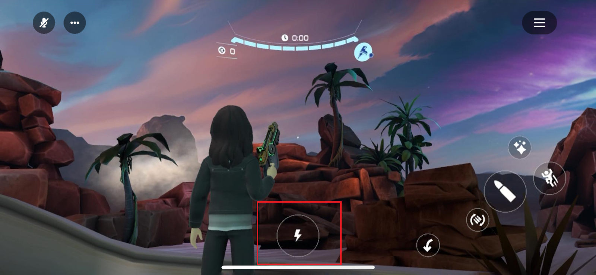

# Action Buttons

You can use the action icons system to determine which control icons are visible on mobile devices. You can select which icons are visible for grabbable entities by selecting the entity and then choosing the action icons for **Primary Action Icon**, **Secondary Action Icon**, and **Tertiary Action Icon**. Setting action icons for any of these is optional.

To select an action icon, click the **Primary Action Icon**, **Secondary Action Icon**, or **Tertiary Action Icon** dropdown, and then choose the most appropriate icon for the intended action. Selecting **None** removes the control from the screen. You should select **None** if you don’t intend to use Primary, Secondary, or Tertiary actions on the grabbable entity.

| VR Editor | Desktop Editor |
| --- | --- |
|  |  |

## Hide Action Buttons by default

This setting is available in the Player Settings in the desktop editor, or within the Player Settings of the Publishing menu when creating in VR.

Hide Action Buttons by Default will change the default visibility of action buttons for mobile players when a grabbable object is held.

* **Toggled on:** Hide the action buttons unless the action icons have been explicitly set in the object properties.
* **Toggle off:** All action buttons will be visible when holding a grabbable object, regardles of whether the action icons have been set.


## How to handle button presses

Each action button is hooked up to a scripting event and a CodeBlock event that fires when the player holds the grabbable entity with the script attached, and then presses the appropriate input action button. You can use script or CodeBlocks to catch these events, and then trigger functionality in the world.

| Action Button | Scripting Event | Codeblocks |
| --- | --- | --- |
| Primary | ScriptingIndexTriggerAction | When Trigger is pressed |
| Secondary | ScriptingButton1Action | When Button 1 is pressed |
| Tertiary | ScriptingButton2Action | When Button 2 is pressed |

#### How to handle custom inputs

> **Note:** Local Script required

As well as the grabbable based action icons (defined above), you can dynamically spawn icons that appear along a bar at the bottom of the screen, which can fire-off any given scripting event.

```
import {
  ButtonIcon,
  ButtonPlacement,
  PlayerControls,
  PlayerInput,
  PlayerInputAction,
} from 'horizon/core';
import * as hz from 'horizon/core';

class SimpleInputAPITest extends hz.Component {
  static propsDefinition = {};

  specialAbilityInput?: PlayerInput;

  start() {
    if (
      PlayerControls.isInputActionSupported(PlayerInputAction.RightSecondary)
    ) {
      // Maps to the F button on desktop
      this.specialAbilityInput = PlayerControls.connectLocalInput(
        PlayerInputAction.RightSecondary,
        ButtonIcon.Special,
        this,
        {preferredButtonPlacement: hz.ButtonPlacement.Center},
      );
      this.specialAbilityInput.registerCallback((action, pressed) => {
        // Fire Special Ability
      });
    }
  }
}

hz.Component.register(SimpleInputAPITest);
```



In the above screen shot, the icon is hidden when no special ability is available.

```
this.specialAbilityInput?.disconnect();
```

You can summon multiple buttons on this bar to provide a broad range of available inputs for mobile.

## Available Action Icons

The pool of available icons grows continually. The following table lists examples of the icons that you can select for controls on web and mobile.

| Ability | Aim | Call Overlay | Close | Contract | Door | Drink |
| --- | --- | --- | --- | --- | --- | --- |
| Drop | Eat | Emotes | Exit Full screen | Exit Meta Horizon Worlds | Expand | Fire |
| Fire Special | Grab | Home | Information | Inspect | Interact | Jump |
| Left Chevron | Map | Menu | Mouse Left | Mouse Middle | Mouse Right | Mouse Scroll |
| Pause | Ping | PUI | Punch | Purchase | Reload | Report Bug |
| Right Chevron | Rocket | Rocket Jump | Shield | Speak | Special | Sprint |
| Swap | Swing Weapon | Throw | Unholster | Use | World Chat |  |