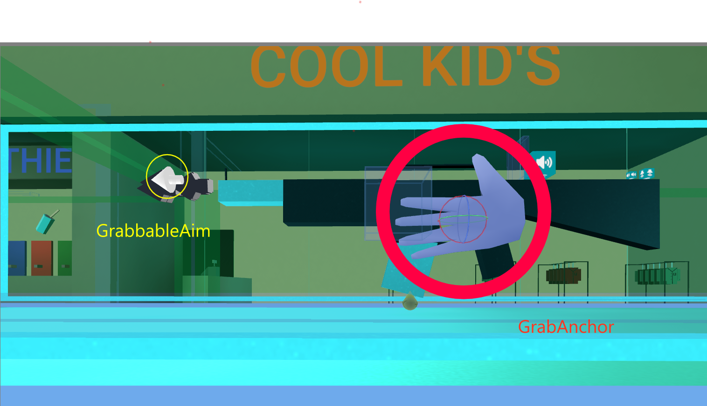
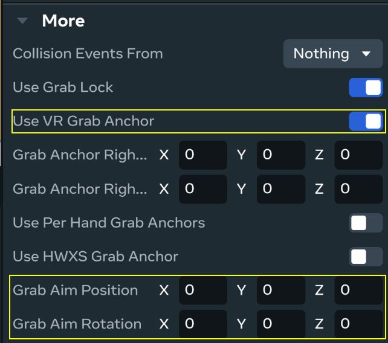

# [Aim Direction](#aim-direction)

## [Overview](#overview)

You can use the **GrabbableAim** property to specify the direction a weapon points when it’s held. Without this, the firing direction of the weapon is driven by animation, which leads to unpredictable results. The aim direction allows you to specify a true aiming reference for projectile launchers that are linked to a grabbable entity, for web and mobile players.

For example, a shotgun setup is displayed below:

### [GrabbableAim property](#grabbableaim-property)

The **GrabbableAim** property represents the position and orientation in which bullets travel, and you can click and drag it into a new position. This setting ensures that the gun aims towards the reticle in the center of the screen, while maintaining any **ProjectileLauncher** offsets for web and mobile players.

From the desktop editor, when a grabbable object is selected you can adjust the GrabbableAim property from the **More** section by enabling **Use VR Grab Anchor**. You can then adjust the **Grab Aim Position** and the **Grab Aim Rotation**.

Grab Aim Position and Rotation only apply to projectile launchers owned by the player. Make sure to set the player as the owner of the projectile launcher during grab for this feature to work correctly. Setting the local player as the owner of the launcher also provides a better player experience, giving the player instant projectile launcher feedback.

