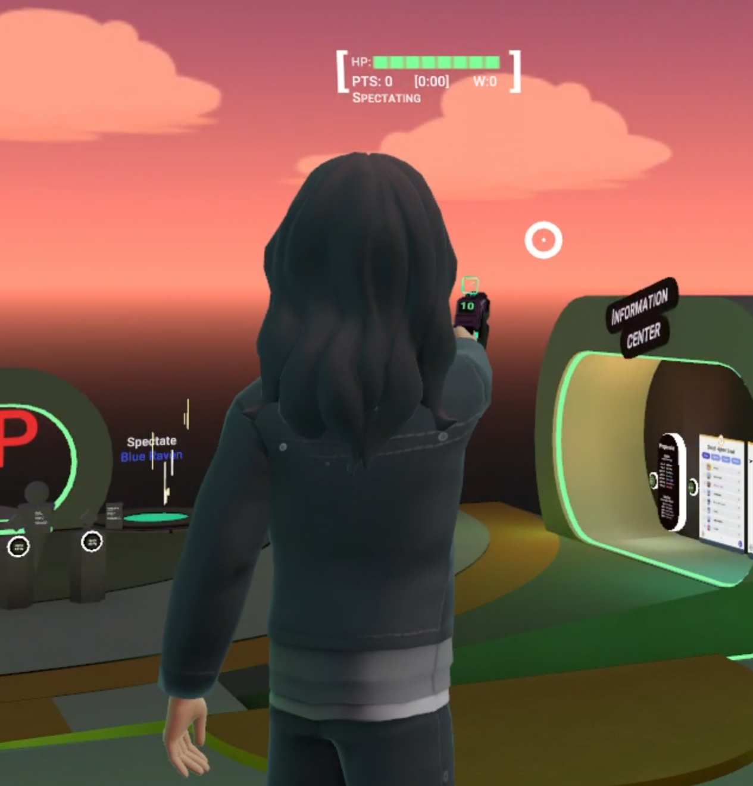
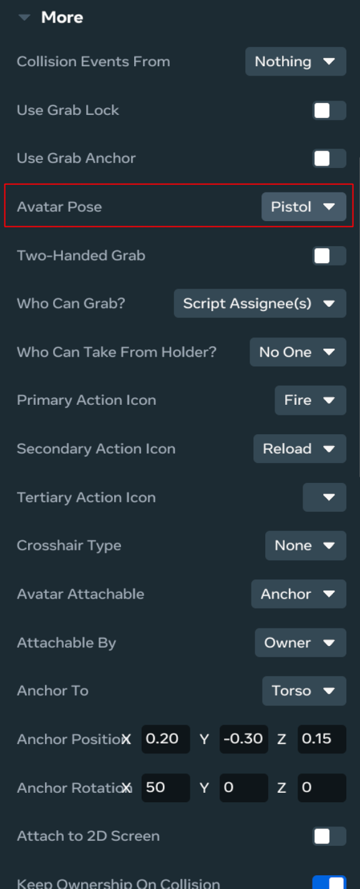
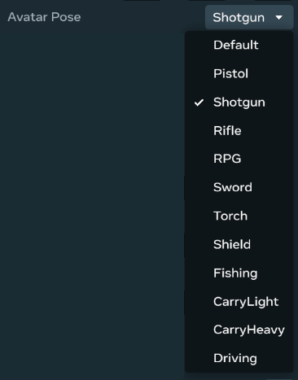
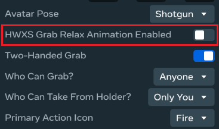
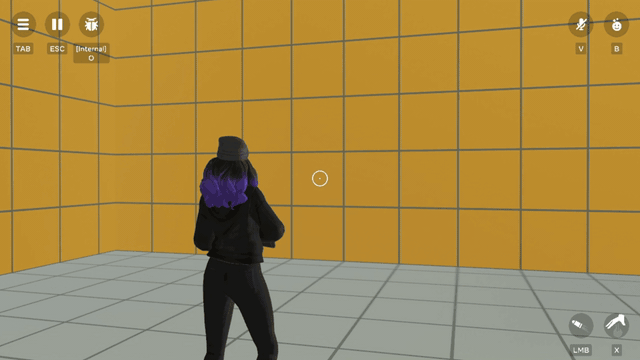
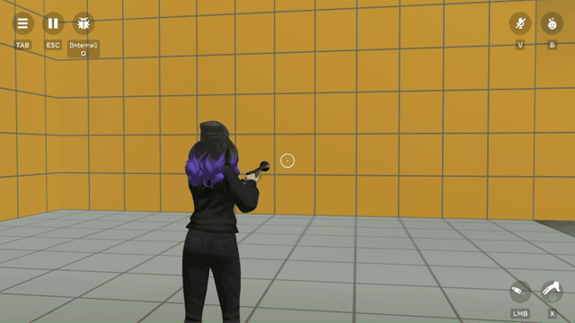

# [Avatar Poses](#avatar-poses)

# [Avatar Poses](#avatar-poses-1)

The avatar’s pose specifies the position of the avatar, and the animation-set that plays when a grabbable is held. For example, in Arena Clash, if you set the starting pistol to use the **Pistol** avatar pose, it looks like this:

When editing an entity, you can find the **Avatar Pose** property in the **More** section.

# [Setting the Avatar Pose](#setting-the-avatar-pose)

You can choose an avatar pose according to how you want the user to hold and use the grabbable entity. The default pose holds the entity in the player’s hand with default animations. For example, running normally rather than aiming a weapon.

Different avatar poses play different animations. For example, **Sword** plays a swinging animation when playing **AvatarPoseAnimationNames.Fire**.

\|  |  | | :---- | :---- |

# [Disable HWXS Grab Relax Animation](#disable-hwxs-grab-relax-animation)

On mobile and web devices, avatars automatically relax their grip and lower the weapon after a few seconds.

To prevent this and allow the avatar to hold their pose, **disable** the **HWXS Grab Relax Animation** toggle found in the More section of the Properties panel.

| Enabled                                                                                      | Disabled                                                                                     |
| -------------------------------------------------------------------------------------------- | -------------------------------------------------------------------------------------------- |
|  |  |

