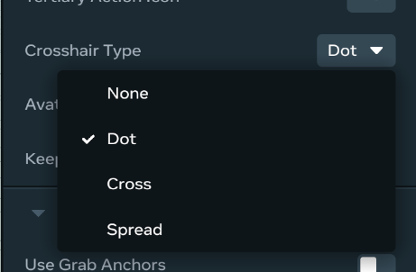
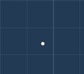
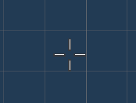
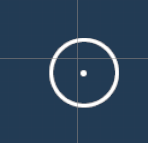

# [Crosshair](#crosshair)

Picking up a grabbable item on Meta Horizon Worlds for web and mobile displays a crosshair in the center of the screen. By default, this is simply a dot. You can change the crosshair type using the **Crosshair Type** property on grabbable objects.

The following table lists the supported crosshairs.

| Option | Visual                                                                                         |
| ------ | ---------------------------------------------------------------------------------------------- |
| None   | No crosshair visible                                                                           |
| Dot    |  |
| Cross  |  |
| Spread |  |

