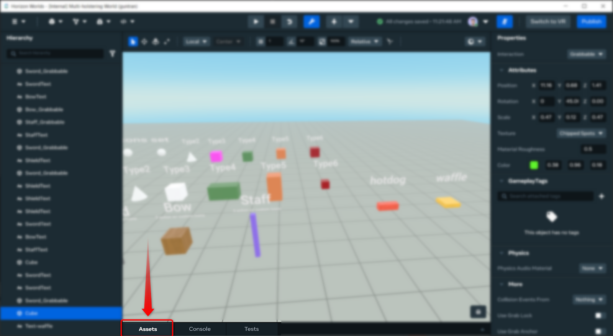
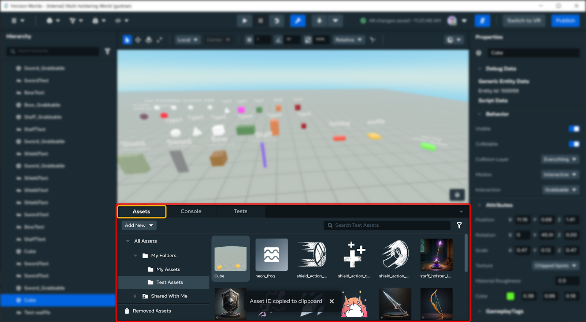
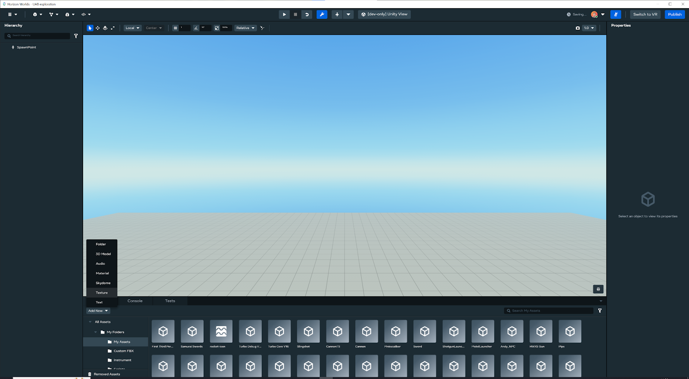
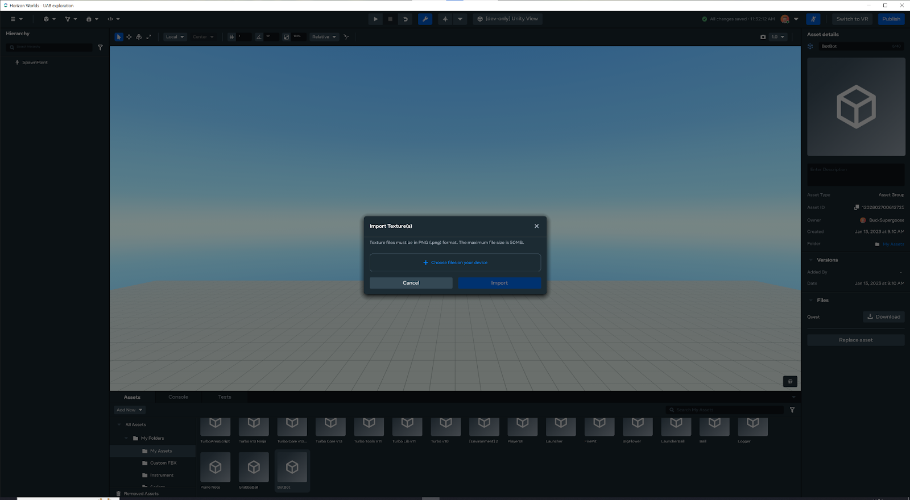
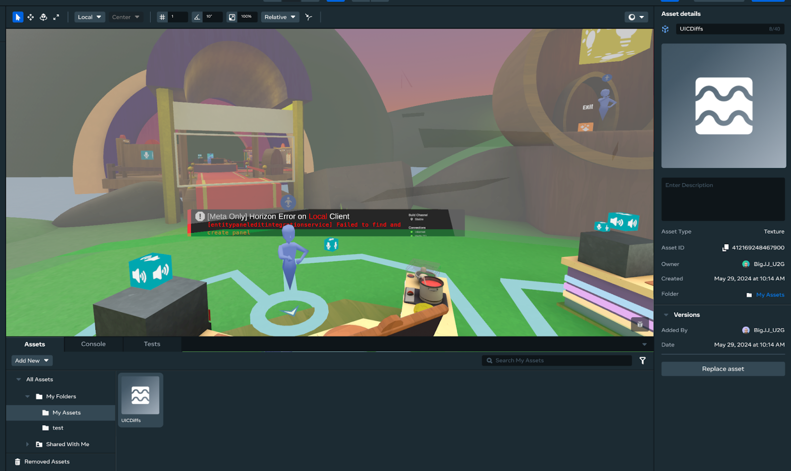
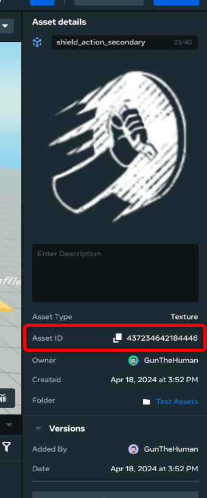
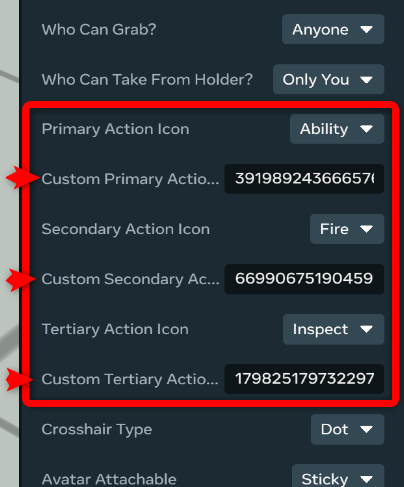
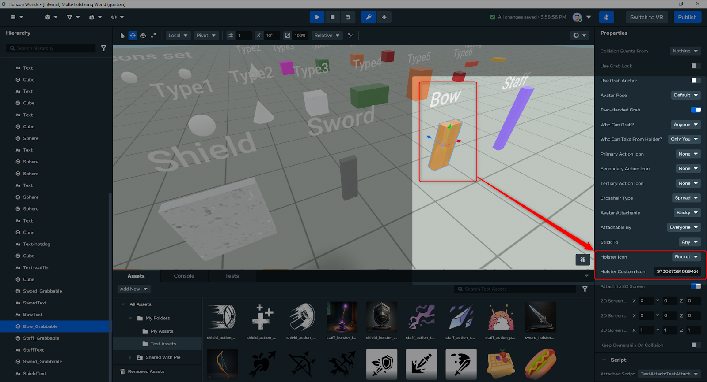
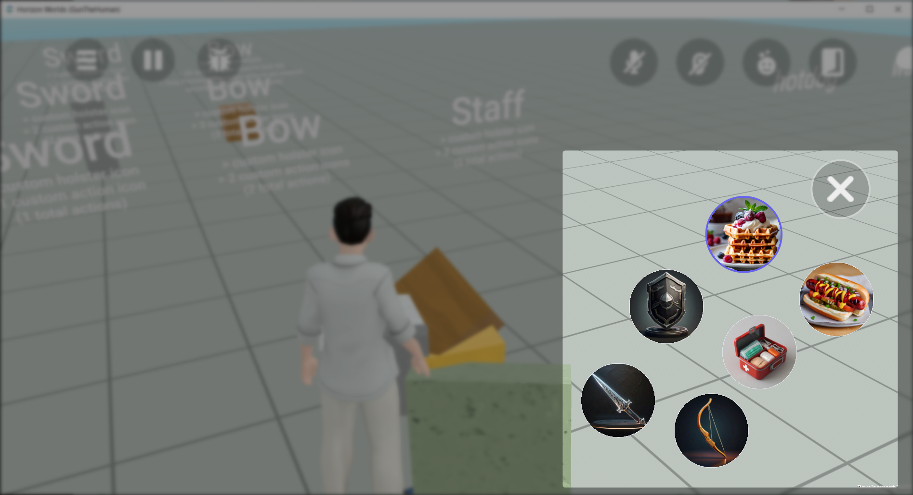
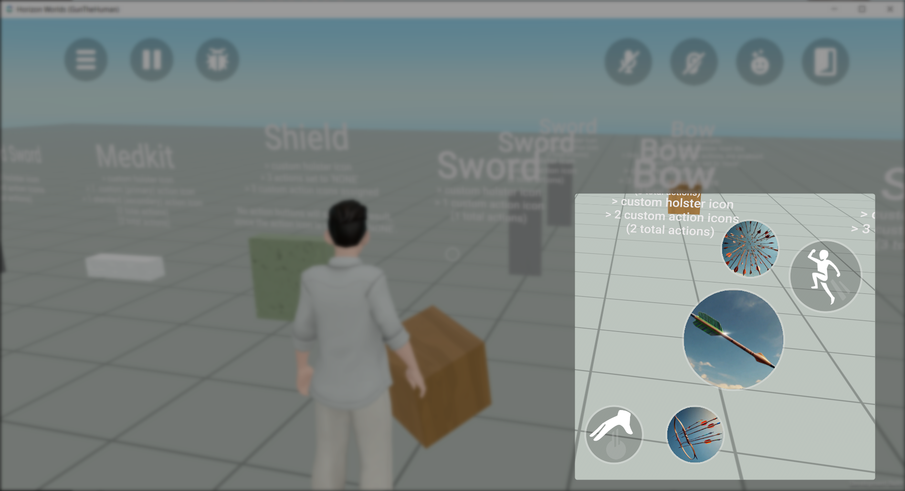

# [Custom Action Button Icons](#custom-action-button-icons)

It is possible to use a custom texture for the action button icons available to players on web and mobile. The example shown below sets custom asset icons for action buttons (primary, secondary, tertiary), but this is the same process for other button icons such as the multi-holster icon.

## [Custom icon image requirements](#custom-icon-image-requirements)

- Images must be in .png format.
- Images must be within the maximum asset upload size (5MB) though it is good practice to use the smallest asset size possible as large assets increase the travel time to the world.
- Using a square (1:1) image is recommended, however the icon will be automatically cropped around the centre based on the smallest dimension of the texture.
- Custom icons work with or without a transparent background.

## [Uploading a custom texture](#uploading-a-custom-texture)

1. Open the **Assets** drawer 
2. Upload your custom icon by selecting **Add New** and choosing **Texture**. 

## [Finding the Asset ID of a texture](#finding-the-asset-id-of-a-texture)

1. Select the texture asset in the Assets drawer. 
2. The Asset ID is located in the properties panel 

## [Applying custom icons](#applying-custom-icons)

1. Select the grabbable object.
2. Find the **Primary Action Icon** in the property panel (you may need to scroll down in the property panel).
3. Set the primary action icon to **anything except ‘None’**.
   1. ‘None’ means that you do not want any icon for this type of action to show.
   2. The standard icon will be used as a fallback if the custom ID is empty or invalid.
4. You can paste the previously copied ‘Asset ID’ in the custom field under this dropdown field. 

## [Restart server](#restart-server)

After applying changes to your custom action icons through the desktop editor, you must shut down your server and restart your world. Your icons should be visible when you next preview your world.

## [Examples](#examples)

### [Full screen editor](#full-screen-editor)

### [Holster Icons](#holster-icons)

### [Action icons](#action-icons)

