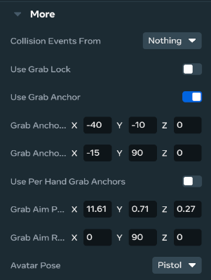
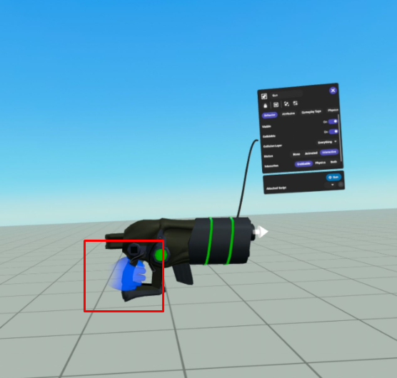
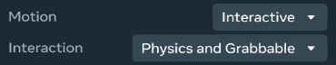

# [Grabbable Entities On Mobile And Web](#grabbable-entities-on-mobile-and-web)

A Grabbable entity is an entity that has **Motion** set to **Interactive**, and **Interaction** set to **Grabbable** or **Both**. Examples of grabbable entities are guns and handheld devices. They require a variety of small changes to function correctly within Meta Horizon Worlds on Web and Mobile. These changes include:

- **Set the avatar pose**: You can set the avatar pose and the animation used when holding a particular kind of grabbable. For example, a pistol is held and activated in a different way than a sword or a rifle.
- **Play avatar animations**: Since firing mechanics are driven purely by CodeBlocks, the avatar animations must also be played by CodeBlocks.
- **Set the aim direction**: For players on web and mobile, guns need to fire in a set direction, regardless of what the animation does. You can specify a fixed direction for each grabbable that overrides the firing direction.
- **Setting the action button icons**: When playing on mobile, you can declare what the action buttons represent when a grabbable is being held. For example a gun may have a fire action and a reload action. The primary button defaults to firing the same CodeBlock event as pulling the trigger on the Quest controller, so this works for most scenarios. The secondary and tertiary action buttons fire the same CodeBlock event as Button 1 and Button 2 respectively.
- **Crosshair selection**: Games commonly use crosshairs which are generated by casting a ray from the grabbable. This can cause issues when playing animations because they won’t truly represent where the gun is aiming. To remedy this, there is a custom way of overlaying a crosshair on the screen for web and mobile players.
- **Holster icon selection**: this icon will be used in the lightweight UI representing items attached to the user’s avatar, which users can interact with to switch between and equip items.

## [Set the avatar pose](#set-the-avatar-pose)

The avatar pose will specify the position of the avatar and the animation set that will be played while a grabbable is being held. You can choose an Avatar Pose according to how you want the user to hold and use the grabbable entity. The default pose holds the object in the player’s hand with default animations (e.g., running normally rather than aiming a weapon).

The avatar pose can be found in the properties of the grabbable entity:

1. Select the grabbable entity and navigate to **...Properties**.
2. Locate **More**, then select the pose you want to assign to the entity from the dropdown next to **Avatar Pose**.

## [Play avatar animations](#play-avatar-animations)

You can play avatar animations using the **Trigger grip animation for player** CodeBlock. The **Trigger grip animation for player** CodeBlock requires a reference to the player that should play the animation, and the name of the animation to play.

There are two animation names:

- **Fire**
- **Reload**

Different avatar poses will play different animations. For example, Sword plays a swinging animation when the Fire grip animation is triggered.

## [Grab Anchors](#grab-anchors)

If an item is held incorrectly on web and mobile, you can enable the **Use HWXS Grab Anchor** toggle in the grabbable entity properties. This allows you to set a grab anchor position and rotation so the avatar holds the item correctly.

This setting will only override the behaviour for web and mobile clients, and if disabled, the standard **VR Grab Anchor** selection will be used.



Alternatively, you can also set the grip anchor in VR, and then manipulate the grip hand visually.



## [Disable Physics While Grabbed](#disable-physics-while-grabbed)

To avoid hand collision issues on mobile devices, disable physics interactions for grabbable objects when held. This is especially useful when the **Motion** property is set to **Physics and Grabbable**.

### [How to Disable Physics](#how-to-disable-physics)

1. Select the grabbable entity and navigate to **...Properties**.
2. Set **Motion** property to **Interactive**.
3. In the **Interaction** dropdown, select **Physics and Grabbable**.
4. Enable the **Disable physics while grabbed** toggle. This will temporarily bypass physics interactions.



## [Programmatically Control Physics for Grabbable Entities](#programmatically-control-physics-for-grabbable-entities)

You can also programmatically control the interaction mode of grabbable entities using CodeBlocks. The following example demonstrates how to switch between different interaction modes when an entity is grabbed and released:

```typescript
import * as hz from 'horizon/core';

class PhysicsGrabbable extends hz.Component<typeof PhysicsGrabbable> {
  start() {
    // Set the initial interaction mode to Grabbable
    this.connectCodeBlockEvent(this.entity, hz.CodeBlockEvents.OnGrabStart, () => {
      this.entity.interactionMode.set(hz.EntityInteractionMode.Grabbable);
    });

    // When the entity is released, switch back to Physics and Grabbable
    this.connectCodeBlockEvent(this.entity, hz.CodeBlockEvents.OnGrabEnd, () => {
      this.entity.interactionMode.set(hz.EntityInteractionMode.Both);
    });
  }
}

hz.Component.register(PhysicsGrabbable);
```

This component listens for grab events and changes the entity’s interaction mode accordingly. When grabbed, it sets the mode to `Grabbable`, and when released, it sets it back to `Both` (which allows both physics and grabbable interactions).

## [Set the aim direction](#set-the-aim-direction)

You can use the GrabbableAim property to specify the direction a weapon points when it’s held. Without this, the firing direction of the weapon is driven by animation, which leads to unpredictable results. The aim direction allows you to specify a true aiming reference for projectile launchers that are linked to a grabbable entity, for web and mobile players.

The **GrabbableAim** property represents the position and orientation in which bullets travel, and you can click and drag it into a new position. This setting ensures the gun aims toward the reticle in the center of the screen, while maintaining any ProjectileLauncher offsets for web and mobile players.

The Grab Aim Position and Rotation relates only to Projectile Launchers that are owned by the player. Ensure you set the ownership of the projectile launcher to the player during grab for this feature to work as expected. Having the local player own the launcher will also provide the benefit of instant projectile launcher feedback.

## [Set the action button icons](#set-the-action-button-icons)

You can use the action button icons to determine which control icons are visible on mobile devices. You can select which icons are visible for grabbable entities by selecting the entity and then choosing the action icons for **Primary Action Icon**, **Secondary Action Icon**, and **Tertiary Action Icon**. Setting action icons for any of these is optional. By default, all action buttons will show for a grabbable entity, with a generic action icon for each button.

To select an action icon, select the **Primary Action Icon**, **Secondary Action Icon** or **Tertiary Action Icon** dropdown, and then choose the most appropriate icon for the intended action. Selecting None removes the control from the screen. You should select **None** if you don’t intend to use Primary, Secondary or Tertiary action buttons on the grabbable entity.

### [Hide action buttons by default](#hide-action-buttons-by-default)

You can hide all action buttons for every grabbable entity by default, so that grabbable entities only display the buttons where the action icons have been explicitly set. The available actions and the icons can then be individually enabled. This setting can be enabled in the Player Settings.

### [Manage button presses](#manage-button-presses)

Each action button is hooked up to a CodeBlock event that fires when the player holds the grabbable entity with the script attached, and presses the appropriate action button. You can use CodeBlocks to catch these events and then trigger functionality in the world.

### [Available action icons](#available-action-icons)

The pool of available icons grows continually. The following table lists examples of icons that you can set for controls on web and mobile.

## [Crosshair selection](#crosshair-selection)

Picking up a grabbable item in Meta Horizon Worlds for web and mobile displays a crosshair in the center of the screen. By default, this crosshair is a dot. You can change the crosshair type using the Crosshair Type property on grabbable entities.

Current crosshair options include:

- **None**
- **Dot**
- **Cross**
- **Spread**

