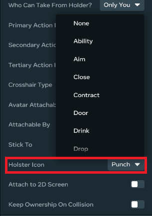
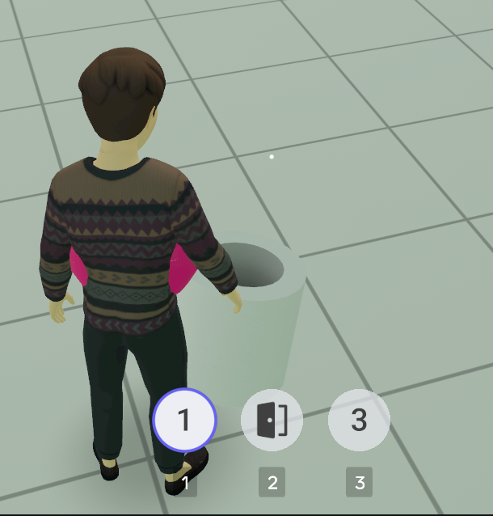

# Holster Icon Menu


The holster icon menu is a menu of UI icons representing items attached to a player’s avatar. Players can use these icons to switch between and equip items. These icons show items that are grabbable entities attached to the player.

**Note**: The holster button to open the holster icon menu will appear if a player has more than one grabbable entity attached.

## Attaching a grabbable entity to a player

For an item to appear in the holster icon menu when it is not equipped you must attach that grabbable entity to the player:

```
this.entity
  .as(hz.AttachableEntity)
  .attachToPlayer(player, AttachablePlayerAnchor.Torso);
```

You can combine attaching the entity with a primary input action API so the player can control the attachment process:

```
this.connectCodeBlockEvent(
  this.entity,
  CodeBlockEvents.OnIndexTriggerUp,
  (player: Player) => {
    this.entity
      .as(hz.AttachableEntity)
      .attachToPlayer(player, AttachablePlayerAnchor.Torso);
  },
);
```

You can configure how a grabbable entity will show up in the holster icon menu by setting the **Holster Icon** property in the entity properties panel:



* **Default value:** If you don’t specify a value, the holster icon will show the default slot number. 
* [Action icon value:](Action%20Buttons.md) The holster icon will show the selected action icon.
* **None:** The entity will not be included in the holster icon menu.

To ensure an entity won’t appear in the holster icon menu, you can either:

* Select **None** in the **Holster Icon** property on the grabbable entity.
* Set the **Who Can Grab?** property of the grabbable entity to an empty array of Script assignees to make it impossible to grab.

#### Available Action Icons

The pool of available icons grows continually. The following table lists examples of the icons that you can select for controls on web and mobile.

| Shoot | Reload | Jump | Unholster | Drop | Special | Grab |
| --- | --- | --- | --- | --- | --- | --- |
| Interact | Throw | Ability | Rocket | Airstrike | Swing | Swap |
| Inspect | Open Door | Shield | Aim | Dual Wield | Sprint | Crouch |
| Eat | Drink | Speak | Purchase | Place | Heal |  |