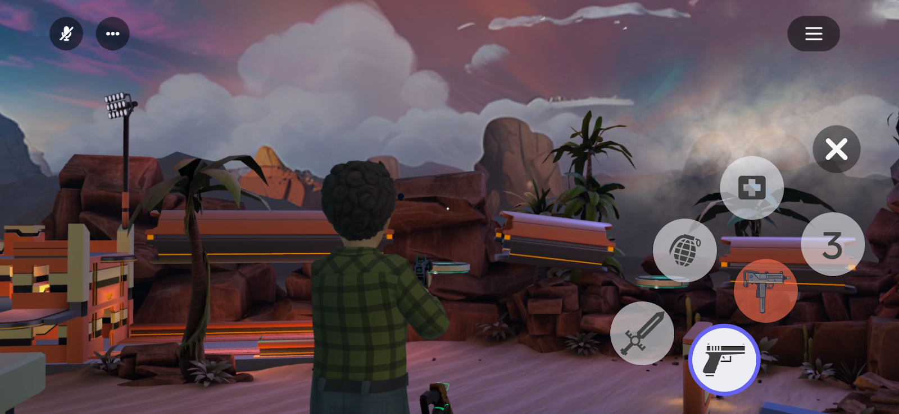
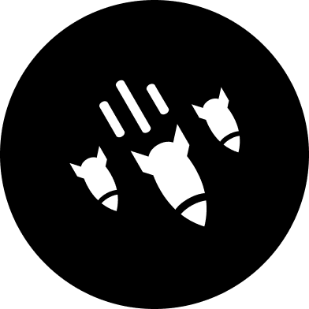
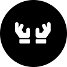

# [Holster Icon Menu](#holster-icon-menu)



The holster icon menu is a menu of UI icons representing items attached to a player’s avatar. Players can use these icons to switch between and equip items. These icons show items that are grabbable entities attached to the player.

**Note**: The holster button to open the holster icon menu will appear if a player has more than one grabbable entity attached.

## [Attaching a grabbable entity to a player](#attaching-a-grabbable-entity-to-a-player)

For an item to appear in the holster icon menu when it is not equipped you must attach that grabbable entity to the player:

```typescript
this.entity
  .as(hz.AttachableEntity)
  .attachToPlayer(player, AttachablePlayerAnchor.Torso);
```

You can combine attaching the entity with a primary input action API so the player can control the attachment process:

```typescript
this.connectCodeBlockEvent(
  this.entity,
  CodeBlockEvents.OnIndexTriggerUp,
  (player: Player) => {
    this.entity
      .as(hz.AttachableEntity)
      .attachToPlayer(player, AttachablePlayerAnchor.Torso);
  },
);
```

## [Configure how an entity appears in the holster icon menu](#configure-how-an-entity-appears-in-the-holster-icon-menu)

You can configure how a grabbable entity will show up in the holster icon menu by setting the **Holster Icon** property in the entity properties panel:


- **Default value:** If you don’t specify a value, the holster icon will show the default slot number. 
- [Action icon value:](Action%20Buttons.md) The holster icon will show the selected action icon.
- **None:** The entity will not be included in the holster icon menu.

To ensure an entity won’t appear in the holster icon menu, you can either:

- Select **None** in the **Holster Icon** property on the grabbable entity.
- Set the **Who Can Grab?** property of the grabbable entity to an empty array of Script assignees to make it impossible to grab.

#### [Available Action Icons](#available-action-icons)

The pool of available icons grows continually. The following table lists examples of the icons that you can select for controls on web and mobile.

|  Shoot    |  Reload    |  Jump    |  Unholster |  Drop       |  Special |  Grab   |
| ------------------------------------------------------------------------------------------------------- | -------------------------------------------------------------------------------------------------------- | ------------------------------------------------------------------------------------------------------ | -------------------------------------------------------------------------------------------------------- | --------------------------------------------------------------------------------------------------------- | ------------------------------------------------------------------------------------------------------ | ----------------------------------------------------------------------------------------------------- |
|  Interact |  Throw     |  Ability |  Rocket    |  Airstrike  |  Swing   |  Swap   |
|  Inspect  |  Open Door |  Shield  |  Aim       |  Dual Wield |  Sprint  |  Crouch |
|  Eat      |  Drink     |  Speak   |  Purchase  |  Place      |  Heal    |                                                                                                       |

