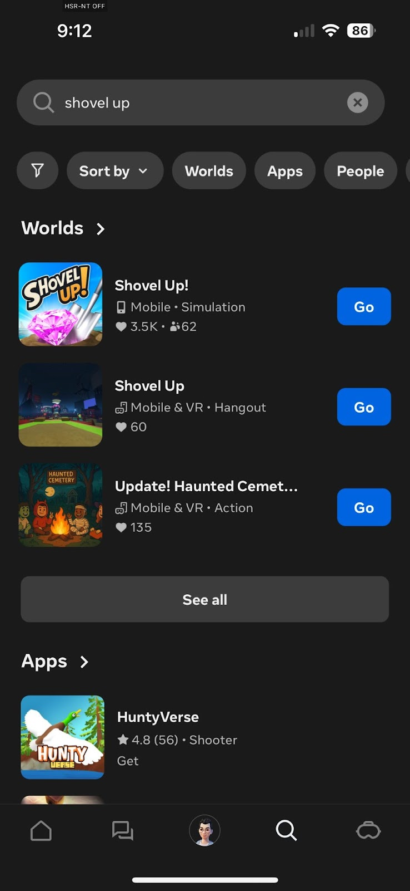
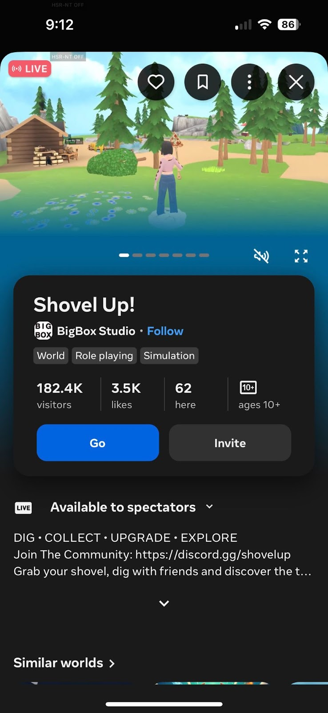
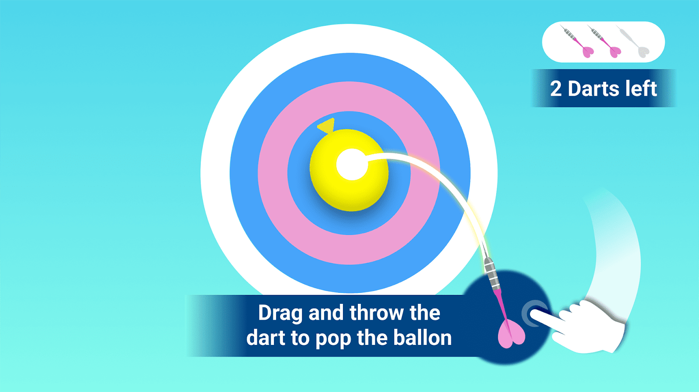
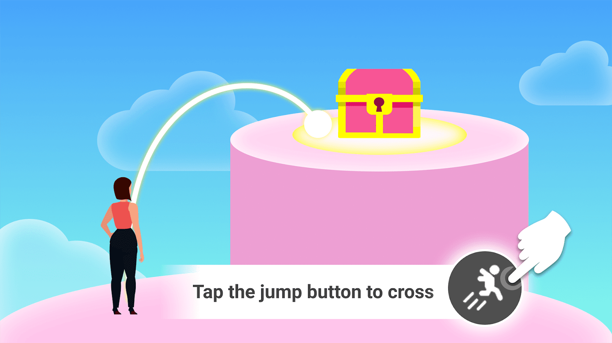
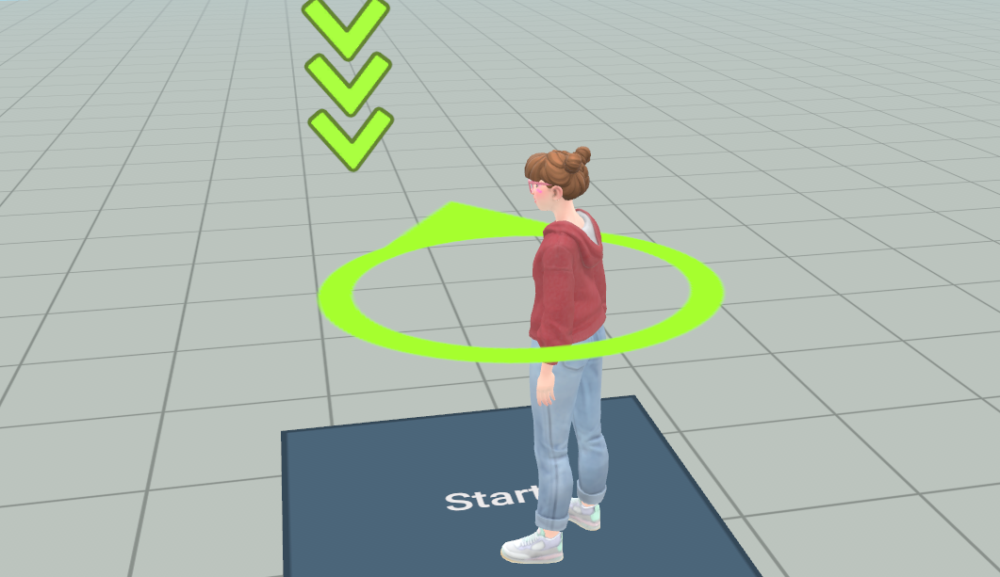

# [Designing a mobile game - New user expectations](#designing-a-mobile-game---new-user-expectations)

Welcome back to the Growth Insights Series!

This article kicks off a two-part series, *Designing a Mobile Game New User Experience 101*. In this first installment, we’ll explore the basics of designing a **New User Experience (NUX)** and set expectations for creating one that feels smooth, modern, and fun. Once you learn these fundamentals, you can proactively onboard your players and craft a NUX that’s tailored to your game, design, and player base.

But before we dive into basic NUX best practices, let’s zoom out and discuss the new user experience as a whole.

## [Understanding the New User Experience (NUX) for Worlds on mobile](#understanding-the-new-user-experience-nux-for-worlds-on-mobile)

Mobile games have some unique differences from VR when it comes to designing a NUX. In VR, a NUX may want to focus more on physical comfort, learning spatial awareness, embodied actions, and the feeling of immersion, as VR control schemes may be more novel to users. On mobile, a NUX may want to focus more on learning touchscreen inputs, short sessions, and interacting with 2D UI panels, with faster introductions to core loops, progression, and reward systems.

To retain users, your mobile game must make a strong first impression. With many competing titles, players can easily abandon your title if they have a poor initial experience. This is why a well-designed new user experience is so critical.

The NUX encompasses more than a tutorial. It’s how you introduce your game and onboard players into its systems, customization, and social features. **The goal is to provide players with a fun, exciting, and rewarding taste of your game while minimizing as much friction as possible.** Once in place, a strong NUX creates an on-ramp to attract new players and encourages them to explore everything your game has to offer.

# [NUX begins with discovery](#nux-begins-with-discovery)

A good NUX begins at the point of discovery. When a player is looking for an experience to explore in Worlds, they will either discover you through the first page of the Meta Horizon app or by searching by name. Therefore, you must be mindful of how your icon, key art, name, and descriptions display on mobile, as all of these elements communicate what players can expect from your experience. It’s also advisable to keep load times reasonable, as longer waits may drive them away. Refer to our [Intro to Worlds Discovery article](../../Save%2C%20optimize%2C%20and%20publish/Intro%20to%20Worlds%20discovery.md) for more best practices on presenting your game.

*Shovel Up! is an excellent example of a good game presentation on Meta Horizon. It includes strong key art, a recognizable icon, and strong descriptions of their updates to the game.*

# [The role of player agency](#the-role-of-player-agency)

When designing your NUX, there are four main ways to structure the experience:

1. **Minimalistic:** Offers little or no direct tutorial and allows players to dive straight into gameplay. The game clearly defines goals for players which they intuitively discover how to meet. This structure is common in sandbox games, social hangout games, and exploration-based games.
2. **Linear and guided**: This is the most common approach on mobile outside of Horizon Worlds. Players are guided through a carefully structured new user experience that will only change if the developers revisit it in updates. No matter how many times a player reinstalls the game, the NUX will be identical in the stages and challenges it presents to the player.
3. **Just in Time/Triggered** - A prompt triggers exactly as a player encounters some part of the tutorial as they are exploring. For example, if your health bar dips below 60%, for the first time you get a tutorial on using a health potion.
4. **Open to player agency**: This approach is rare on mobile. Players can direct their own tutorial experience by choosing what aspects of the game to explore. Typically, they start with a guided NUX before the game gradually removes the guardrails and allows them to dictate the flow.

*When tutorializing, prioritize non-intuitive mechanics. Players should be encouraged to experiment with basic actions like picking up items or firing weapons. Our recommendation is to provide clear goals and allow players to discover how to achieve them.*

# [A note about Minimalistic NUX tutorials](#a-note-about-minimalistic-nux-tutorials)

Minimalistic onboarding is a common style for Mobile Horizon Worlds NUX. The goal of minimalistic onboarding is to let players jump into the action as quickly as possible. In Worlds, even the loading screen can play a role in onboarding by offering quick instructions, such as how to navigate or mute the microphone.

Games that rely on minimalistic onboarding are often based on already popular game types and as such don’t need to hand hold the player as much. These games are often intuitive and easy for players to learn through friends or word of mouth.

There is a distinction between minimalist onboarding and no onboarding, however. Since very few of these games offer robust tutorials for newcomers, and often overlook best practice design in introducing players to aspects of the game, this can be a pain point that causes players to quit and churn early.

For additional tips on onboarding, see our article on [VR Onboarding](https://developers.meta.com/horizon/blog/growth-insights-series-building-competency-new-user-onboarding).

# [What to cover in tutorials](#what-to-cover-in-tutorials)

While we generally recommend a minimalist NUX as the genre standard for Worlds games, if it would suit your game to choose a linear and guided tutorial style, it may be tempting to present players with every detail about your game at once. Break down this information into smaller parts for your players. A linear and guided new user experience typically includes the following:

1. Controls
2. The core loop
3. Play session or match length expectations
4. Rewards
5. In-game economy
6. Progression

These essentials should be covered in your NUX. A good NUX should show players how things work, and ask them to master basic tasks, while subtly introducing economy and progression systems without overwhelming them. Keep in mind that the content of tutorials will vary widely from game to game and that each game’s NUX design should be unique and meet the needs of the game’s specific player base.

# [Genre expectations for Worlds](#genre-expectations-for-worlds)

Most Worlds could benefit from short, focused new user experiences found in minimalistic tutorial styles since gameplay often centers on a single, simple task. Some good examples of games with strong NUX experiences in Worlds include *Shovel Up!*, *Super Strike*, *Kawaii Merge Donuts*, and *Kaiju City Showdown*. There are some exceptions, however. More complex Worlds like *Citadel* may require a more detailed and linear new user experience.

In general, players expect a light tutorial. Many Worlds simply drop the player in to learn as they go, and players expect only a brief snapshot of the rules that’s often listed on UI prompts as they enter. Still, even a lightweight NUX should follow best practices. Make control information easy to find, give players clear goals they can achieve quickly, and design intuitive interactions. This helps players feel oriented and confident with the experience right away.

Depending on the target audience, it may not be necessary to teach them commonly found mechanics (movement, shooting a weapon, etc.). It may be more valuable to provide goals and focus on helping players truly understand new mechanics.

*Players in Horizon Worlds generally prefer clear goals and autonomy. However, if a player is inactive, a tip should appear after a few seconds.*

# [Genre expectations for non Horizon Worlds mobile games](#genre-expectations-for-non-horizon-worlds-mobile-games)

Ultimately, NUX expectations are more aligned with genre and audience than they are with platform. While the audience in Horizon Worlds generally prefer a more minimalist approach if you are making a game that more closely resembles a traditional mobile game offering you should consider if a guided NUX would be right for your intended audience.

Player expectations for mobile games in general usually revolve around short, multi-step linear and guided tutorials that ramp up to gameplay. These tutorials gradually fall away as players begin exploring on their own. Mobile tutorials typically take around 15 minutes, though players are not actively reading or clicking through boxes the entire time.

Instead, most mobile games introduce new mechanics or game modes during early levels of the new user experience. Providing a steady sense of progress — such as clearing stages, leveling up, or unlocking new units — helps the tutorial feel less like a lesson and more like early gameplay. Then, once your NUX opens to additional modes or the game’s economy, you can provide short, contextual tutorials that teach players as they go.

# [What’s next?](#whats-next)

The next article in this series will focus on ten best practices for your new user experience. By mastering these fundamentals, you can build a NUX that is deeply engaging for your players.

Consider checking out the [showInfoSlides API Tutorial Manager](../../Tutorials/Feature%20samples/New%20user%20experience%20tutorial/Module%202%20-%20Tutorial%20Manager.md) for Horizon Worlds. It is a popup system at launch where creators can put images and texts into a short slide show of instructions for their NUX.

Additionally, you can check out an entire Tutorial World we created as reference content on how to make in-world NUXes for more advanced creators. Go [here](../../Tutorials/Feature%20samples/New%20user%20experience%20tutorial/Module%201%20-%20Introduction.md) to see the tutorial world.

*Visit our Tutorial World [here](../../Tutorials/Feature%20samples/New%20user%20experience%20tutorial/Module%201%20-%20Introduction.md) to get a sense of how a tutorial system in Worlds works.*

