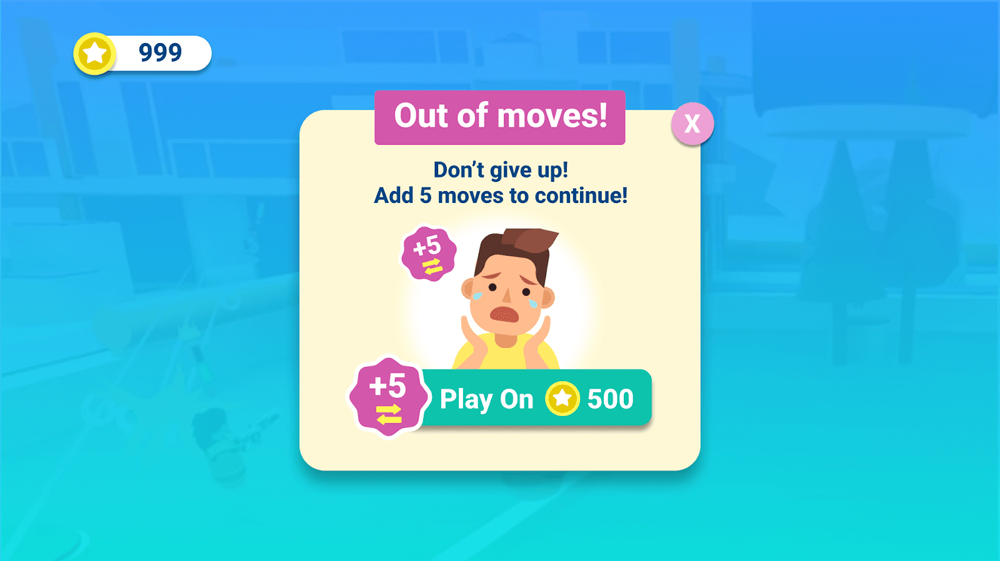
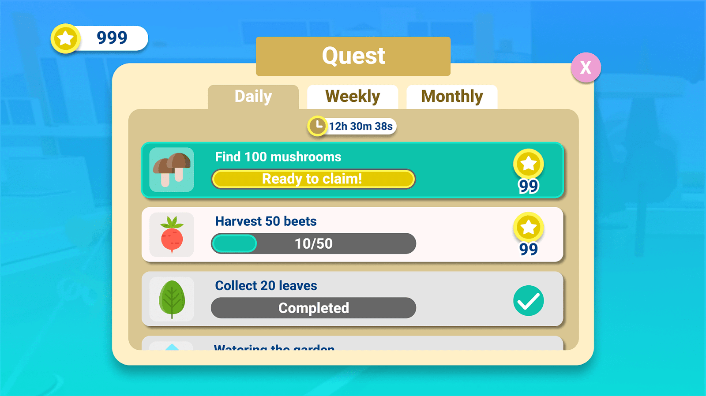
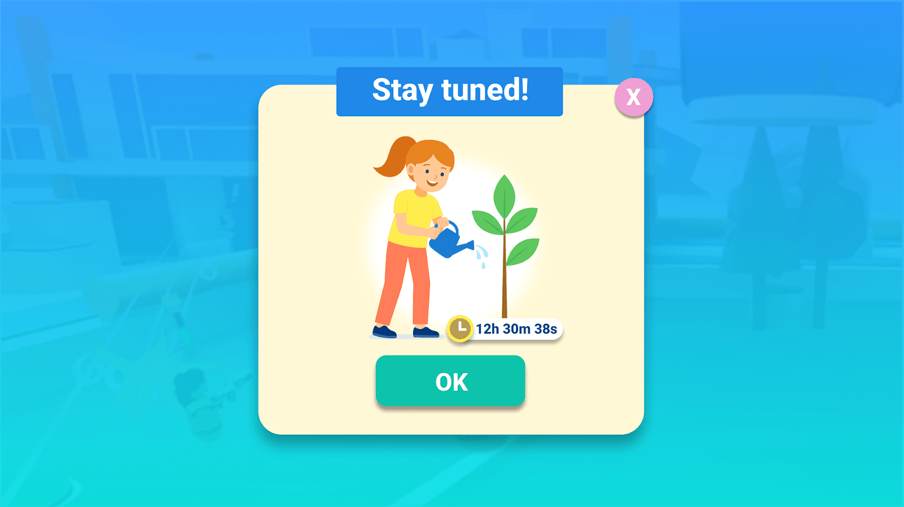
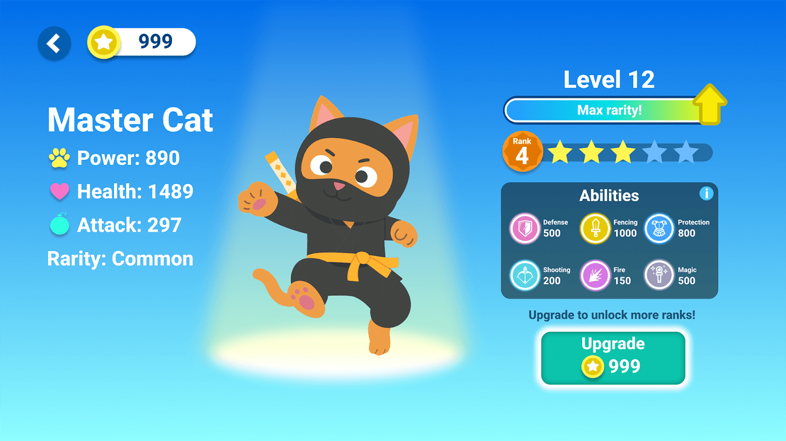
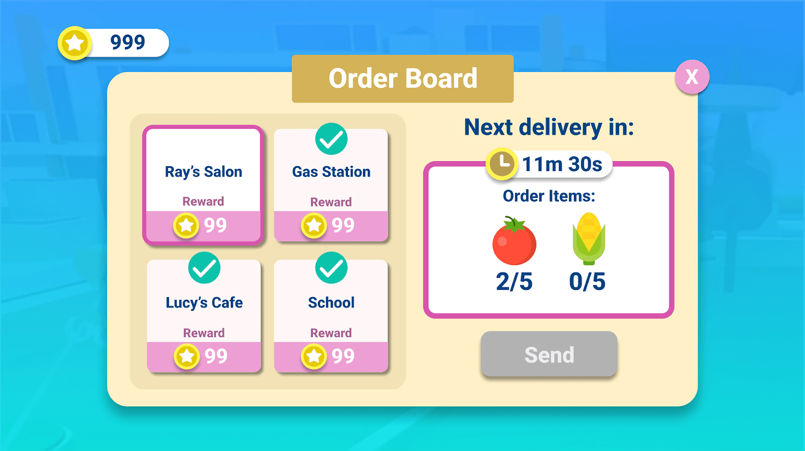
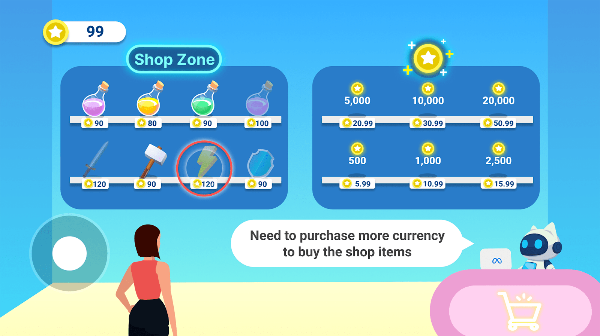
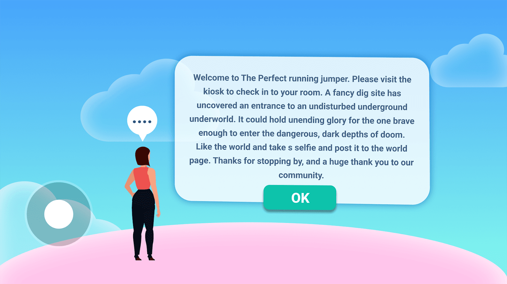

# [Designing a mobile game - New user experience 101 ten best practices](#designing-a-mobile-game---new-user-experience-101-ten-best-practices)

Welcome back to the Growth Insights Series!

This article continues our two-part series, *Designing a Mobile Game New User Experience 101*. In the first installment, we explored the basics of designing a New User Experience (NUX) and focused on general expectations. In this article, we’ll walk through ten best practices for designing your NUX to help you create an experience that’s tailored to your game, design, and player base. The ten best practices are:

1. Audit the first session of your game.
2. Funnel your players to the proper places.
3. Time and test your NUX length.
4. Tutorialize your controls for Worlds on mobile.
5. Encourage and build player mastery.
6. Frame the core loop and gameplay session for new players.
7. Contextualize gameplay with narrative onboarding.
8. Walk players through progression basics.
9. Highlight player goals in the NUX.
10. Introduce store and economy in the NUX.

# [Ten best practices for designing your NUX](#ten-best-practices-for-designing-your-nux)

## [1. Audit the first session of your game](#1-audit-the-first-session-of-your-game)

The first session is one of the most important parts of your player’s new user experience. Mobile players need to be convinced early that the game is fun, offers lasting appeal, and rewards their effort. If players find your game confusing or uninteresting, they’ll likely move on to something else.

Please feel free to [view the tutorial World](../../Tutorials/Feature%20samples/New%20user%20experience%20tutorial/Module%201%20-%20Introduction.md) for a strong example of a Worlds NUX experience that is guided by quests.

The first session should set the stage for your entire experience by highlighting both **how** and **why** to play. We’ll use a walkthrough of *Clash Royale’s* first session as an example. Though *Clash Royale* has a guided tutorial, the principles can be easily adapted to a hands off minimalistic approach.

| Your Game Should                                  | Clash Royale Example                                                                                                                                                                      | Minimalistic Adaptation                                                                                                                                                                               |
| ------------------------------------------------- | ----------------------------------------------------------------------------------------------------------------------------------------------------------------------------------------- | ----------------------------------------------------------------------------------------------------------------------------------------------------------------------------------------------------- |
| Clearly explain the rules and central mechanics.  | The player is guided through the basics of playing cards and deploying units, without diving too deep into detailed mechanics.                                                            | Show the player a clear goal upon loading in, e.g. complete a quest, reach the treasure, approach the table with other players.                                                                       |
| Explain the controls and expected gameplay style. | After defending against an enemy attack, players are prompted to play an exciting high-value card (a Giant).                                                                              | Use intuitive interactions, like grab, throw, move or jump.                                                                                                                                           |
| Let players see gameplay in action.               | Players follow these guided steps, leading to a decisive and satisfying early victory.                                                                                                    | Lean on co-presence and allow players to observe others in action, or record a short video of moment-to-moment gameplay that players can watch.                                                       |
| Show how long active gameplay takes.              | Clash Royale quickly gets players into the action. There’s minimal world-building or setup — players are learning by doing within seconds of loading into the game’s new user experience. | Drop players into a simplified version of the action, and make sure that the core loop is extremely quick to complete the first time e.g. dig up a treasure, sell it to the vendor, buy a new shovel. |
| Demonstrate the progression systems.              | The game walks players through the easy process of upgrading a card (a Knight) and immediately shows them the impact in the next battle.                                                  | After 1-2 repetitions of the core loop have the player upgrade or level up, then reinforce that the power was needed on the next loop.                                                                |
| Deliver excitement, reward, and fun.              | Players experience the central mechanics, understand the controls, and get a hint at progression by receiving a reward chest after winning the match.                                     | End every repetition of the core loop with an exciting reward - XP, gold, an exciting cosmetic, or access to more of the game will hook the player and pay off the early time spent.                  |

This example clearly illustrates how to build a compelling opening session that onboards the player while also getting them hooked. Players can experience the **central mechanics** by being walked through them, understand the controls, and get a hint at **progression** by receiving a **reward** chest with cards and resources after winning the match.

## [2. Funnel your players to the proper places](#2-funnel-your-players-to-the-proper-places)

Once players are settled after the first few minutes of gameplay, ask yourself: “*Where should players go next?*” Guide them toward the experiences you want them to explore next. Many games drop players in and let them decide. Instead, use guiding UI prompts to funnel players to the proper places in the game that give them a distinct goal for playing.

*To prevent player churn, avoid overwhelming players with excessive choices and a lack of clear direction. A completely open-ended sandbox experience can leave players feeling unsure of their objectives and next steps.*

## [3. Time and test your NUX length](#3-time-and-test-your-nux-length)

An overly long NUX can lead to player churn, so it’s important to understand how much time you’re asking from your players. While there are no absolute rules, here are some common timing ranges based on complexity:

| Game Type                                                | Example                                                                                                                                                                                                                                                    |
| -------------------------------------------------------- | ---------------------------------------------------------------------------------------------------------------------------------------------------------------------------------------------------------------------------------------------------------- |
| **Hypercausal-to-casual** ⏰ 3-5 minutes                  | A game like *Pokémon Friends* begins with some narrative onboarding, but moves players into puzzle-solving and the central crafting mechanic (rewards) within four minutes.                                                                                |
| **Casual-to-midCore** ⏰ 5-10 minutes                     | *Clash Royale’s* NUX is incredibly brisk, moving players through tutorialization and into the main game within four-and-a-half minutes. *Fire Emblem: Heroes*, meanwhile, opens all its gameplay modes in about seven minutes after explaining the basics. |
| **Midcore-to-core (and cross platform)** ⏰ 15-60 minutes | *Genshin Impact* and *Infinity Nikki* feature 10-15 minutes of NUX before players can start dictating the flow, whereas more linear experiences like *Zenless Zone Zero* can keep players on-rails for close to an hour.                                   |

Your NUX might go beyond these times, especially if you onboard players into additional game modes. Don’t be afraid to save some tutorials for later. A well-crafted NUX is built from an engaging first-time user experience (FTUE) that gently onboards players into gameplay modes and encourages vital engagement habits.

## [4. Tutorialize your controls for Worlds on mobile](#4-tutorialize-your-controls-for-worlds-on-mobile)

Simplicity is key for most Worlds experiences on mobile. Unless your World is highly complex, such as *Citadel*, aim for clear and minimal instruction.

**Some best practices for control tutorialization include:**

1. **Display** the gameplay rules in plain text.
2. \*\*Make \*\*the rules straightforward and easy to understand (For example, “Reach the other side without falling off.”)
3. **Rely** on players’ ability to read and intuit gameplay from other popular experiences on the platform they may be familiar with.

Worlds and other platform games offer developers the opportunity to create a variety of experiences. If you’re developing a less traditional World, follow mobile game best practices to ensure players quickly understand controls. Too much friction early on can cause players to quit before discovering what makes your World fun.

*When developing games that share similarities with existing platform titles, it’s unnecessary to re-explain fundamental concepts. Often, simply making the objective (e.g., reaching a treasure chest) and the obstacles (e.g., a gap to be jumped) visually clear can be sufficient for players to grasp the game’s rules intuitively.*

## [5. Encourage and build player mastery](#5-encourage-and-build-player-mastery)

Once players master the controls and basic gameplay, build further mastery through engineered challenges. The NUX should lead players through a series of challenges from basic to advanced. Whether the gameplay is built around combat, puzzles, platforming, or racing, the NUX should be easy for players to clear as they are gradually onboarded into tougher content.

While building a player’s confidence is valuable, there is also value in allowing the players to lose later in the NUX. Losses are a part of the game. By having players lose a level in the NUX, the game can use this as an opportunity to direct players to:

1. **Progression systems** (adding equipment or leveling characters up)
2. **Power-ups or consumables** (or even extra moves) to gently direct players towards monetization offerings

*Many puzzle games are designed with challenging levels at their core. Players might need multiple attempts to complete a level, or they can opt to purchase temporary power-ups to overcome obstacles.*

Losses, if properly incorporated into the NUX, should come *after* mastery and confidence-building challenges to avoid discouraging players. The NUX should give clear feedback about the loss and what they need to overcome it. Walk players through the steps to surpass their loss, then celebrate and reward them for overcoming the challenge. This turns a frustrating moment into an opportunity to build mastery and confidence.

## [6. Frame the core loop and gameplay sessions for new players](#6-frame-the-core-loop-and-gameplay-sessions-for-new-players)

In addition to teaching players how to play, your NUX should show them what a full gameplay session looks like. Make it clear how much time a typical session requires and what kind of progress players can expect to make.

*Task lists serve a dual purpose: they reward player engagement and act as a tutorial. They inform players about the expected daily or weekly system interactions and the anticipated time commitment required to keep pace.*

Neglecting this can cause confusion about the time commitment the game asks of them. Showing how the game fits into a player’s daily routine allows them to figure out how best to engage with it. By demonstrating this in the NUX, a player can make a more informed decision about whether the game is a good fit.

## [7. Contextualize gameplay with narrative onboarding](#7-contextualize-gameplay-with-narrative-onboarding)

From simple to complex, most games on mobile have a narrative component to give players context for their actions. The narrative complexity in your NUX will vary by game type. Player time is finite, and your NUX has other important aspects to cover.

**During the NUX, it’s best to establish the following:**

1. What the game world is
2. Who the key characters are
3. The player’s role in the world
4. The foundation for the gameplay ahead

*Implement waiting periods between story installments to manage player progression and encourage recurring engagement. Ensure alternative, lower-reward activities remain accessible during these wait times.*

## [8. Walk players through progression basics](#8-walk-players-through-progression-basics)

The new user experience should walk the player through the basics of progression: what benefits it offers, and most importantly, how to make progress. For example, in a combat-focused RPG (whether player vs. player or player vs. enemy), you might walk players through leveling up a character or upgrading a piece of gear early in the game.

*When integrating upgrade-based progression into your game, introduce it during the New User Experience (NUX). Even if players anticipate such systems, they require clear instruction on its mechanics and the specific advantages it offers within your game.*

For single-player, non-combat experiences (like puzzle or exploration games), players should see what happens when they move into a new part of the game world. Avoid the temptation to over-explain the value of progression; you don’t want to overload the player. The best thing you can do for the player is to show progression, not tell them about progression. The NUX should simply hint at progression, leaving deeper details for players to discover later.

## [9. Highlight player goals in the NUX](#9-highlight-player-goals-in-the-nux)

Another aspect to highlight is the goals and stretch goals the player can aim for. These goals must provide strong and compelling reasons to keep playing. Even in straightforward social games like *Spin the Bottle* or *Among Us*, players have an ever-growing collection of cosmetics to chase. These goals should be introduced but never completed during the NUX.

*To engage players and structure early gameplay, it’s beneficial to introduce goal systems that hint at future content. While these systems should be presented, players should be encouraged to return for subsequent sessions to fully complete all objectives.*

**A well-tuned NUX should provide the following:**

💡 An idea of what the goals are

🚀 How to make progress toward the goals

🔁 An understanding how the game’s core loop feeds into making progress

🏆 Rewards that players can earn along the way

A game’s NUX should also introduce new side goals as players progress.

## [10. Introduce the store and economy in your NUX](#10-introduce-the-store-and-economy-in-your-nux)

No matter how your game monetizes, the NUX should feature a look into your economy. Resources are accrued, characters are leveled up, and cosmetics are earned or purchased. All of this should be hinted at in the NUX. Players should be onboarded into how the economy works and what’s needed to complete basic tasks so they understand in-game transactions and resources.

The game should provide multiple on-ramps to the store via pop-ups or anchored menu elements on the home screen. These let players know what deals are available and the benefits of purchasing. As with progression, it’s important to avoid overwhelming players.

As players get closer to mid-game, new currencies may be required. These do not need to surface in the NUX. The player is still finding their feet and doesn’t need another item to track.

*Horizon Worlds games often feature unique 3D, or “embodied,” shops. Despite their visual appeal, it’s crucial to design your shop to facilitate easy price and value comparison between different offerings. Upon a player’s initial visit, ensure they possess sufficient currency to make at least one recommended purchase.*

# [NUX missteps to avoid](#nux-missteps-to-avoid)

## [Providing too little information](#providing-too-little-information)

The point of the NUX is to explain the game’s controls, core gameplay, and progression systems. One of the biggest mistakes a game can make is providing the player with too little information. If the NUX doesn’t show players *how* to play and *why* they should play, the game will struggle to onboard and retain them.

If your NUX simply drops players into the game and expects them to figure it out, they’ll likely churn once they hit friction. On mobile, where players can easily switch to another title, this risk is especially high.

## [Overburdening players with information](#overburdening-players-with-information)

Conversely, a NUX can overburden the player with too much information. This presents two problems. First, player attention is finite: an extremely long new user experience will feel slow or boring, hindering players from organically finding the fun .

Second, players cannot be expected to retain all the information presented in an overly-long NUX. Even genre veterans face a learning curve with a new game’s nuances. Prioritize teaching the fundamentals. Save advanced, mid-to-late game information for later tutorials.

*Players may feel overwhelmed and fail to retain information if they are simply given a wall of basic instructions and then left to play the game on their own. This approach is likely to be counterproductive.*

## [Focusing on non-essential information](#focusing-on-non-essential-information)

Some new user experiences spend too much time on details that aren’t critical early in the game. Deeper systems are best discovered by the players themselves gradually over time.

Many games also insert too many narrative beats into the NUX. While genre-dependent, it’s best to keep narrative elements brisk. Give players a reason for being in the world, frame the gameplay, and let them start playing. Deeper story elements can come later once they’ve engaged with the core gameplay.

## [Not providing players direction](#not-providing-players-direction)

Additionally, another common misstep is concluding the NUX without giving the player direction. Ideally, the tutorial should conclude with a recap of what was learned and a reward for their progress. It is extremely important to show the player what to engage with next.

## [Not testing your NUX](#not-testing-your-nux)

Finally, the last misstep is not testing your NUX. Using tracking and telemetry in the backend, track metrics and events throughout your NUX experience. Are players getting stuck in one area? Have the events triggered for the player to collect a vital item for the tutorial sequence? Consider creating two NUX experiences and go through A/B testing variants to see what resonates with players and reduces the amount of churn from your game.

# [What’s next?](#whats-next)

Now that you understand the best practices for designing an effective new user experience (NUX), you’re ready to build onboarding that feels memorable and engaging for your players.

Stay tuned for the next Growth Insights article, where we’ll continue exploring strategies that help you create more engaging and immersive experiences across platforms.

