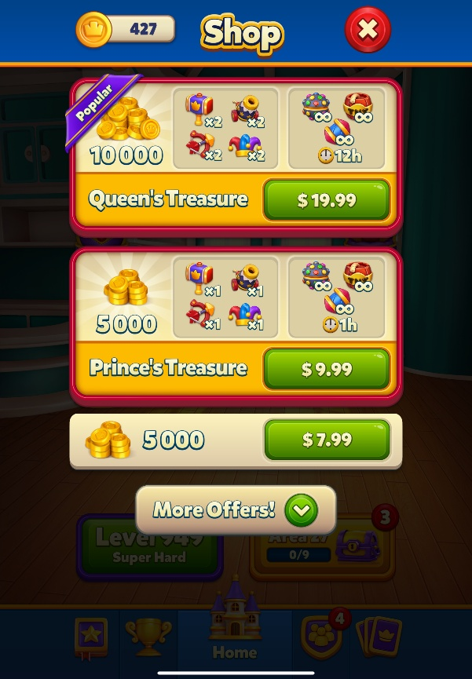
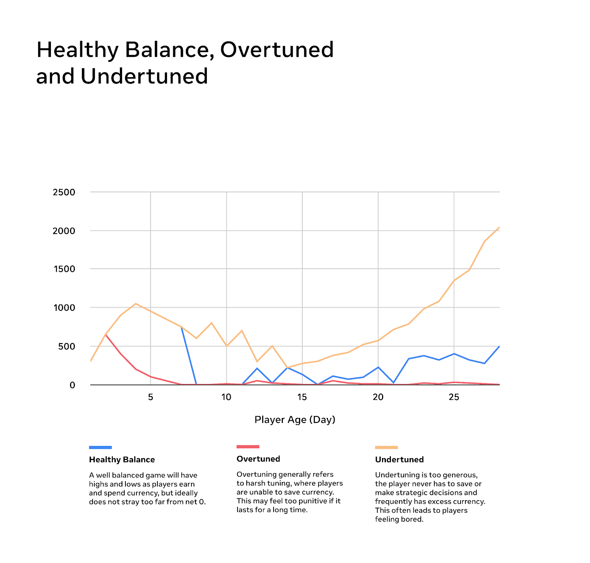
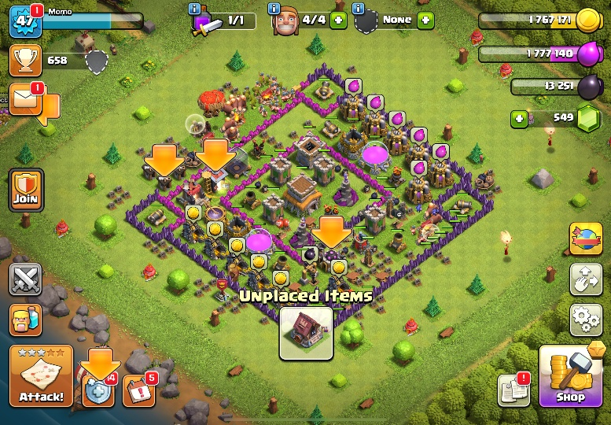
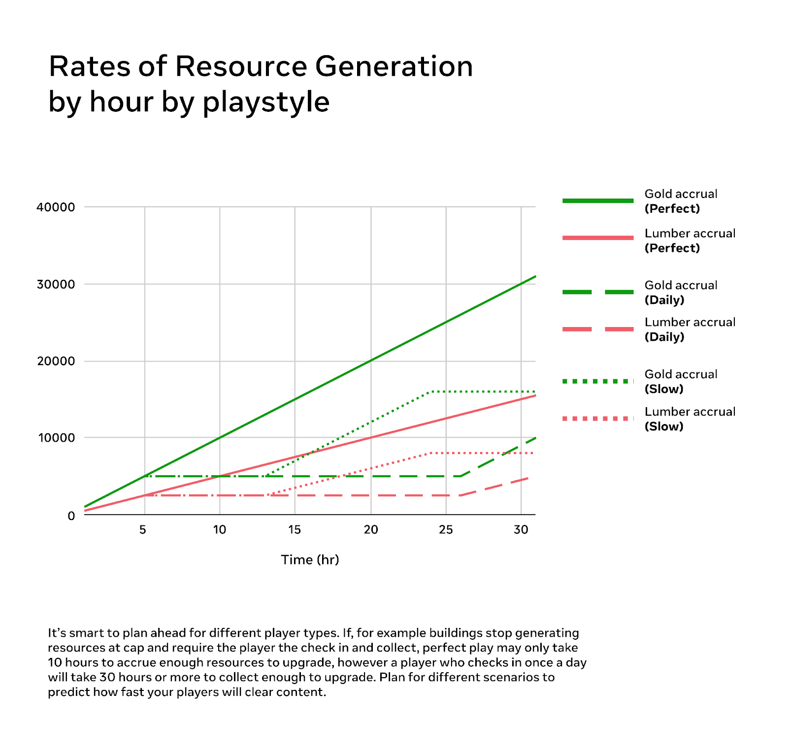
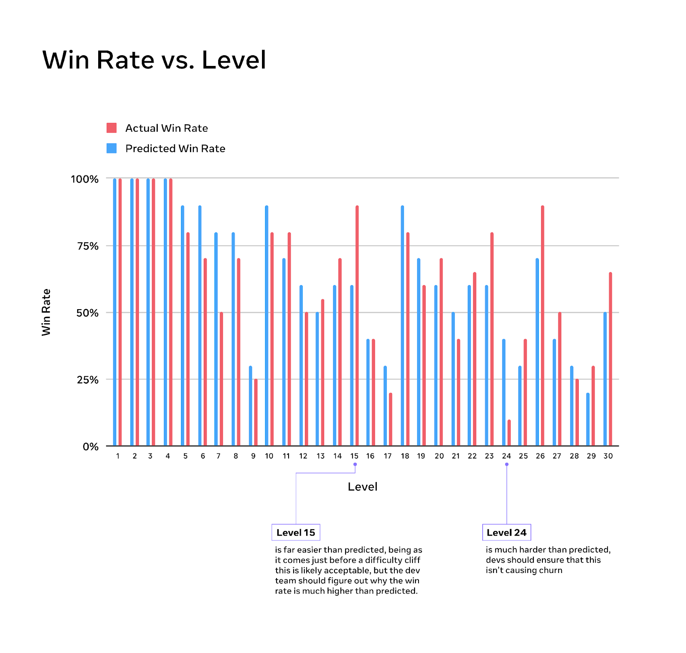
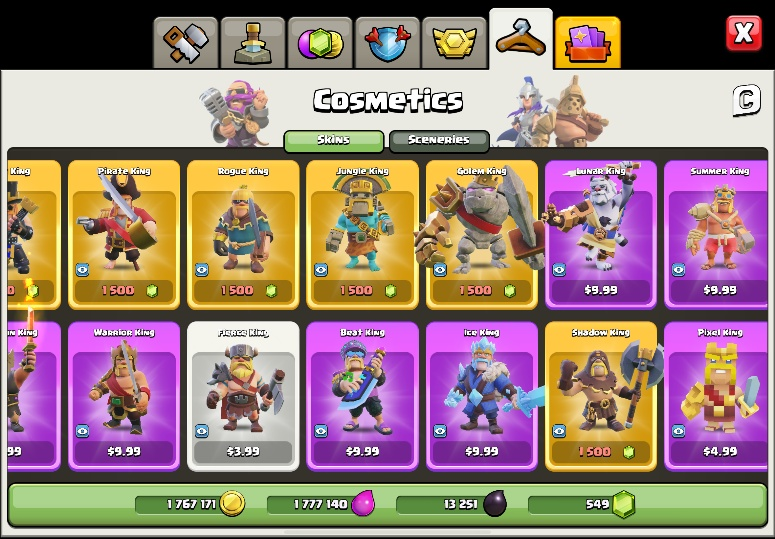
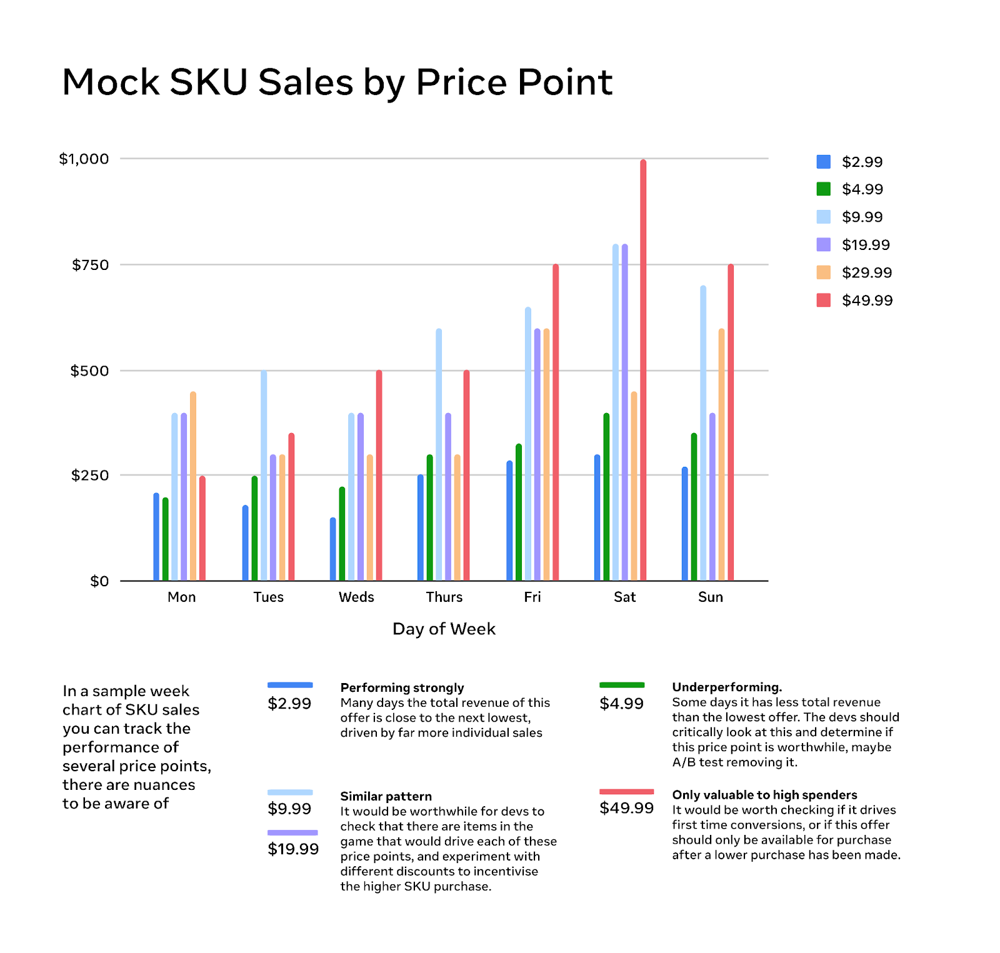
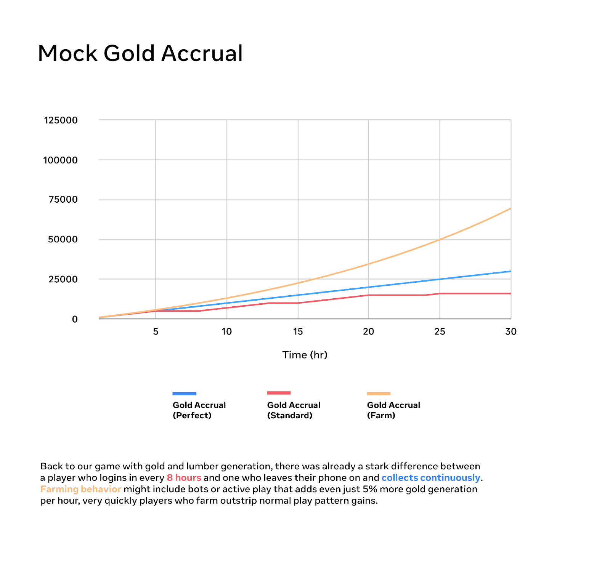

# Designing a mobile game economy - Balancing and Progression

Welcome back to the Growth Insights Series!

In the first installment of our four-part series, \*Designing a Mobile Game Economy 101 \*for Worlds creators, we explored the basics of in-game currencies. These currencies define how players earn, save, and spend, but without careful balance they can quickly lose their value or frustrate players.

In this article, *Balancing & Progression*, we’ll build on that foundation. We’ll look at how to design and maintain an economy that supports your game’s core loops, how to pace progression so players always have meaningful goals, and how to avoid pitfalls like inflation, farming, or content burnout. By the end, you’ll have practical tools for tuning your economy so it feels fair, rewarding, and sustainable over time.

# Economy: design and maintenance

When diving deeper into economy design, the most important thing to consider is what the player does in the game. The type of gameplay players regularly engage in determines how the economy functions.

Important questions to ask yourself include:

- What will my players be doing?
- What are their long- and short-term goals?
- What does a player’s typical early-, mid-, and late-game session look like?
- What do I want my players to spend on?
- What is our long term engagement hook in the game?



\*Royal Match knows players enjoy its matching puzzle gameplay. As a result, it offers several purchasable bundles with extra consumables to enhance the gameplay experience. \*

# Economy: purchase motivations

Another question to ask yourself when designing your economy is: how will I ask my players to spend? Or, put another way, how does gameplay lead the player into spending? We find that players purchase for one of three reasons:

- **Identity and belonging**: as a way to signal who they are and what they like in a highly situational way.
- **Status signaling:** to telegraph their status to other players.
- \*\*Utility: \*\*purchasing digital goods that provide functional benefits, such as extra storage, organizational tools for their inventory, time-saving boosts, or customizations that improve their overall gameplay experience.

# Economy: balancing

Economy balancing is an important practice for games that use their economy as the engine that powers their game loop. For more casual-friendly games that monetize primarily through one-off cosmetic purchases, there is less need for balancing.

In general, balancing an economy for a F2P mobile game requires aligning currency-ins and currency-outs to determine how quickly players encounter and move through progression blockers.



If a game isn’t careful and allows players to gain too much currency, players may progress through content too quickly. They will eventually run out of things to do and lose reasons to engage. On the other hand, too many currency-outs and too few currency-ins can create frustration and lead to churn due to a lack of meaningful progression.

If players begin clearing content too quickly, it’s better to introduce additional currency-outs rather than hard progression blockers. Introducing a new currency-out, which takes time and planning to implement correctly, can be a net positive for the game’s economy. New currency-outs (progression systems) reward players for engaging with them.

By contrast, strategically placing a progression blocker (skill checks, ability requirements, financial thresholds, or resource demands) to slow players down will often be viewed negatively as a form of artificial punishment.

# Progression: pacing

Another key aspect of economy design and balancing is pacing — the speed at which you want players to move through your game’s progression systems. A game should never guess at this speed. Instead, it should set clear goals for players to achieve and monitor whether they are progressing too quickly or struggling and churning.



\*The various interconnected progression systems of Clash of Clans are a masterclass in pacing and supporting core loops. Gameplay sessions are built around routine check-ins, allowing players to step away as resources accrue passively. \*

## **An example from a combat city builder**

### The Goal: Leveling Up the Town Hall from 2 to 3

In this example, the town hall structure would require players to build a blacksmith, an apothecary, and an infirmary before they can unlock the option to upgrade the town hall to level 3.

The game should track the currency-out requirements for each of these three structures (say, 10,000 gold and 5,000 lumber each) and pace them against the currency-ins players have access to at this early stage (hypothetically, 1,000 gold and 500 lumber per hour of passive resource accrual).

With these figures in mind, the game can ensure that — barring imbalance or exploitation — it would take roughly 10 hours of in-game time before players can build all three structures. This means over a day of in-game time and at least three player check-ins would be required to complete this sequence.

Upgrading the town hall after that would cost additional currency, naturally, so the game can account for approximately 2 days of player time with this one currency-out funnel in its economy.



Balancing the pacing of an economy is vital for free-to-play games. If players churn through content too quickly, they may churn from the game itself. Players must always have an unfolding road ahead, making steady, rewarding progress toward long-term goals without ever running out of content.

# Progression: cliffs and mesas

A common way to envision pacing in a game is through the use of cliffs and mesas. These two aspects of pacing help shape the overall flow of progression.

* **Cliffs** are steep hurdles that must be planned for and cleared.
* **Mesas** are flatter stretches where players can clear content and accumulate resources, often while planning their next major currency-out.

Games should integrate both cliffs and mesas into their economy design to create variety within the gameplay experience.

Cliffs are challenges for players to overcome. Some may be exciting, others frustrating, but all require careful effort and planning. Clearing a cliff often gives players a strong sense of accomplishment and progression, but can also leave them drained.



*In a PvE game with clear win/loss conditions, such as a puzzle game, it’s especially important to plan for cliffs and mesas. Cliffs are where difficulty ramps up suddenly. This can encourage players to invest currencies or resources to pass a level, but if cliffs feel unwinnable, they may cause churn.*

Mesas, conversely, are gentler periods where players can set secondary goals or recharge. While they may not provide much excitement, they help players recover between cliffs. Too many cliffs can make progress feel punishing, while too many mesas can lead to boredom and a surplus of unused resources. A healthy balance between the two keeps players motivated and engaged.

# Economy: tracking and responding

One of the most important aspects of economy design is responding to player habits. In the past, it was common to recommend a standard set of purchase prices for currencies in a storefront: an entry-level $0.99 offer, a “must have” $2.99 offer, and then $4.99, $9.99, $19.99, $26.99, $49.99, and $79.99 packs. This one-size-fits-all approach worked as a starting point but didn’t always fit every genre.

For example, in a match-three game, you may not see many $79.99 purchases, but you’ll often see frequent $4.99 purchases for continues or $9.99 purchases for unlimited lives. By contrast, a deeper roleplaying game with layered progression systems might successfully sell $19.99 packs as its baseline, with no offerings below that price point.



*Which Clash of Clans skins are most popular overall? Which resonate with first-time purchasers?
Without telemetry and analytics, questions like these are almost impossible to answer.*

As live operations and analytics matured, games began experimenting more with their pricing structures. It’s not recommended that every game sell only higher-value packs, but it’s equally risky to assume a default pricing ladder will work across the board.

One of the best steps you can take for your game’s long-term economic health is to implement telemetry to track player spending habits. Ideally, telemetry should be built in before launch. Real-time visibility into how players are moving through your economy is invaluable—it shows you what is appealing to players and helps you make informed adjustments. Without this data, you’re left guessing.

**Consider this scenario:** you release purchase offerings at the standard range ($0.99, $2.99, $4.99, $9.99, $19.99, $26.99, $39.99, $49.99, $79.99), and your game generates $250,000 in sales in a month. Wouldn’t you want to know which price points drove that revenue?

* If 250,000 players purchased the $0.99 pack and nothing else, you’d conclude that low-end offers resonate most. But this could suggest the price is too low, leaving revenue on the table. You might A/B test raising the floor to $2.99 to see if higher revenue balances out lower conversions.
* If 2,500 players bought the $49.99 pack and 1,563 bought the $79.99 pack, with little activity elsewhere, you’d question whether lower-end offers are needed at all.



Telemetry — and the insights it generates — is one of the most powerful tools you have for planning and adjusting your game’s economy.

# Preventing currency-in exploitation: farming

One issue that can arise from giving players a steady stream of currency-ins is that dedicated or savvy players will find ways to exploit the game to gain large stockpiles of currency, upsetting pacing calculations. This is known as farming.



For multiplayer games (competitive or otherwise), farming must be controlled, as it can give highly engaged players a sizable advantage over those who play less often. F2P mobile games generally use three primary methods to control farming:

- **Stamina systems:** Players can only engage with content for rewards until they run out of stamina. Once it’s depleted, they’re gated from earning further rewards. While effective at preventing farming, this system can discourage engagement if players want to keep playing.

  ```
   *Example: Clash Royale pioneered a solution (since removed) by awarding chests for matches. Players could only queue a limited number of chests to unlock with keys. Once their queue was full, they could still play matches, but no additional rewards dropped — effectively preventing farming.*
  ```
- \*\*Remove repeatable rewards: \*\*Currency rewards are removed from content after the first playthrough. This prevents players from farming easy content for large stockpiles. While effective, this can feel punishing if content itself is locked, so it’s best used selectively.
- **Require currency investment to play:** Some games require players to stake currency before entering a match or mode. The system is balanced so players win semi-frequently but also lose often enough to keep the economy stable.

  ```
   *Example: Golf Clash requires players to bet a certain amount of currency before competing. Matchmaking ensures harder opponents appear regularly, so players risk losses unless they monetize.*
  ```

# What’s next?

Now that you have a clearer picture of how to tweak balance and progression systems in your economy, you can better understand how to create a more engaging experience for your players.

Our next article in this series will focus on the basics of economy design — specifically stores and digital offerings. By mastering these fundamentals, you can ensure that your economy is robust, fair, and engaging for your players.