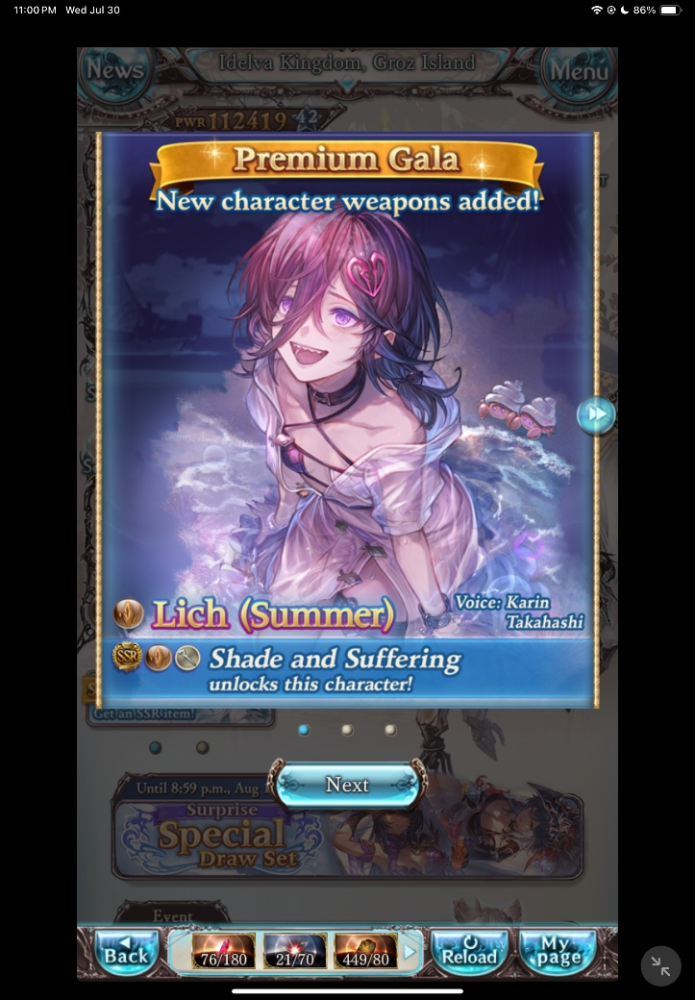
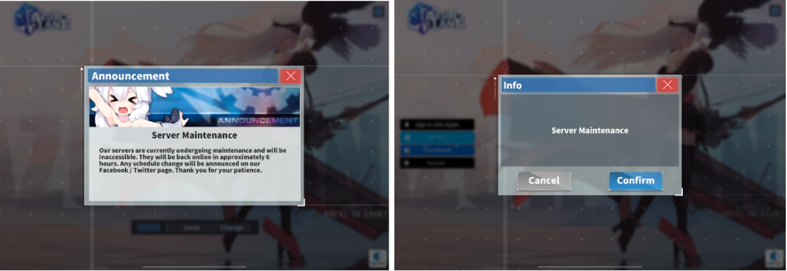

# [Designing a mobile game economy - Live Ops Tracking and Updating](#designing-a-mobile-game-economy---live-ops-tracking-and-updating)

Welcome back to the Growth Insights Series!

This is the final installment of our four-part series, *Designing a Mobile Game Economy 101* for Worlds creators.

In the third article, we explored how to design your store and digital offerings to maximize engagement and monetization. Now we’ll focus on the final piece of the puzzle: how to use **live operations (live ops)** to track, adjust, and continuously improve your economy in real time.

# [Economy: live ops overview](#economy-live-ops-overview)

At the center of your game’s update cadence is live operations (live ops). A live ops team is responsible for running the game as an ongoing service, rather than as a one-time release. Games like *Marvel Snap* or *Pokémon Go* thrive on live ops, while traditional titles like *God of War: Ragnarök* or \*Clair Obscur: Expedition 33 \*represent one-off releases.

Live ops empower you to:

- Send new content into the game
- Update frequently with minimal friction
- Tweak and adjust the economy in real time
- Add new digital content for purchase
- Introduce new gameplay modes
- And more

Live ops works best when powered by telemetry data. Telemetry tracks player behavior, spending habits, and overall engagement, giving you a detailed view of how players interact with your game. With proper analytics, you can see stats like level completion rates, item purchases, most- and least-used characters, and which skins or power-ups are most popular.

Using a **data-driven live ops** approach allows you to:

- Deliver the content players want most
- Adjust difficulty to reduce churn
- Surface digital goods that players are eager to purchase
- Keep the game fresh with ongoing, targeted updates

In short, live ops lets you evolve your game quickly and intelligently in response to player behavior more dynamically than a traditional game can.

*Granblue Fantasy demonstrates how live ops can deliver new content with minimal disruption. Here, a player logged in at noon (JST) immediately sees a pop-up notification for a new seasonal banner as soon as it goes live.*

# [Updating your game: frequency](#updating-your-game-frequency)

A good cadence for republishing updates is every **2–4 weeks**. This schedule allows you to refresh your storefront, add new content, and keep the game feeling active, while avoiding overloading players with too many updates.

Full version updates, which often introduce major seasonal content, new modes, or larger features, should be kept to **once per quarter.** This frequency matches player expectations for seasonal refreshes and avoids the risks of churn caused by frequent downtime, instability, or heavy downloads.

Use **telemetry and analytics** to refine your update cadence. If data shows most players take 3–4 weeks to clear new content, you may be able to slow releases from biweekly to every three weeks without hurting engagement. Conversely, if players finish content quickly, you may need to shorten the cycle.

*Some games, like Azur Lane, schedule predictable downtime for major updates — in their case, about eight hours every other Thursday. While this is an outlier, it highlights the importance of balancing frequency, size, and stability when planning your update strategy.*

# [Telemetry and analytics: what to track](#telemetry-and-analytics-what-to-track)

One of the most important questions to ask is: \*what do I need to measure to make my game better? \* Live ops shifts you from guessing to relying on **data-driven insights** that reveal how players interact with your game.

While these best practices emerge from top mobile games today, we continue to work on the analytics that are made available to Worlds creators. You can find the latest [here](../../Performance/Analytics/World%20Analytics.md) in our documentation so you can start measuring today and gather data-driven insights about your worlds.

Some core areas to track include:

| Area                                    | Description                                                                                                                                                                 |
| --------------------------------------- | --------------------------------------------------------------------------------------------------------------------------------------------------------------------------- |
| **Player progress**                     | Where players are in the game, what content they’ve cleared, and where they’re getting stuck.                                                                               |
| **Spending habits and pattern**         | Do players start with small purchases and grow into larger ones, or make one big purchase and stop?                                                                         |
| **Content performance**                 | Which goods (characters, skins, consumables, etc.) sell well, and which are ignored?                                                                                        |
| **Engagement with time-limited offers** | Which events, bundles, or flash sales drive purchases?                                                                                                                      |
| **Timing of purchases**                 | When do players spend most often? For example, if you notice a spike in premium bundle sales on Saturday nights, that’s a strong signal to experiment with targeted offers. |
| **Player speed**                        | How quickly players consume content and earn/spend currency, which helps with tuning your economy.                                                                          |
| **Event engagement**                    | Are players participating as expected? If they’re earning event currency but not spending it, maybe the rewards aren’t appealing enough.                                    |

### [Example player data](#example-player-data)

Telemetry events are usually structured into standard metadata (applied to every action) and custom metadata (specific to your game).

| Player Action                 | Example Event(s)      | Standard Metadata\*                                                               | Custom Metadata                                           |
| ----------------------------- | --------------------- | --------------------------------------------------------------------------------- | --------------------------------------------------------- |
| **Starts a new game session** | app\_start, heartbeat | user\_id, timestamp, country, install\_date, player\_level\_xp, x\_y\_coordinates | session\_id, avg\_fps, fps\_drops, packet\_loss, etc      |
| **Starts a match**            | match\_start\_mode\_x | user\_id, timestamp, country, install\_date, player\_level\_xp, x\_y\_coordinates | match\_id, map\_id, real\_players, bot\_players, etc.     |
| **Ends a match**              | match\_end\_mode\_x   | user\_id, timestamp, country, install\_date, player\_level\_xp, x\_y\_coordinates | match\_id, map\_id, kills, cause\_of\_death, etc.         |
| **Wins items**                | reward                | user\_id, timestamp, country, install\_date, player\_level\_xp, x\_y\_coordinates | match\_id, reward\_type, reward\_amount, etc.             |
| **Goes to the store**         | ui                    | user\_id, timestamp, country, install\_date, player\_level\_xp, x\_y\_coordinates | button\_id, button\_state, ui\_path, screen\_name, etc.   |
| **Makes a purchase**          | transaction           | user\_id, timestamp, country, install\_date, player\_level\_xp, x\_y\_coordinates | currency, amount, item\_id, item\_quantity, iap\_id, etc. |

Start broad, track as much as possible, and then pare down to the metrics that truly inform your economy design and update cadence.

# [What’s next?](#whats-next)

Now that you have a clearer picture of how \*\*live ops, tracking, and updates \*\*shape your game’s economy, you’re better equipped to refine how your live service runs and create a smoother, more engaging player experience.

This article wraps up our four-part series on *Designing a Mobile Game Economy 101*. Across the series, we’ve explored:

- The basics of in-game currencies
- How to balance and pace progression
- Best practices for stores and digital offerings
- And finally, how live ops and telemetry keep your economy healthy over time

With these fundamentals in hand, you’re ready to begin customizing and optimizing your own game economy, ensuring it stays robust, fair, and engaging for players throughout the game’s lifecycle. We look forward to seeing how you put these insights into practice, and how you continue to build economies that keep players engaged and excited to return!

