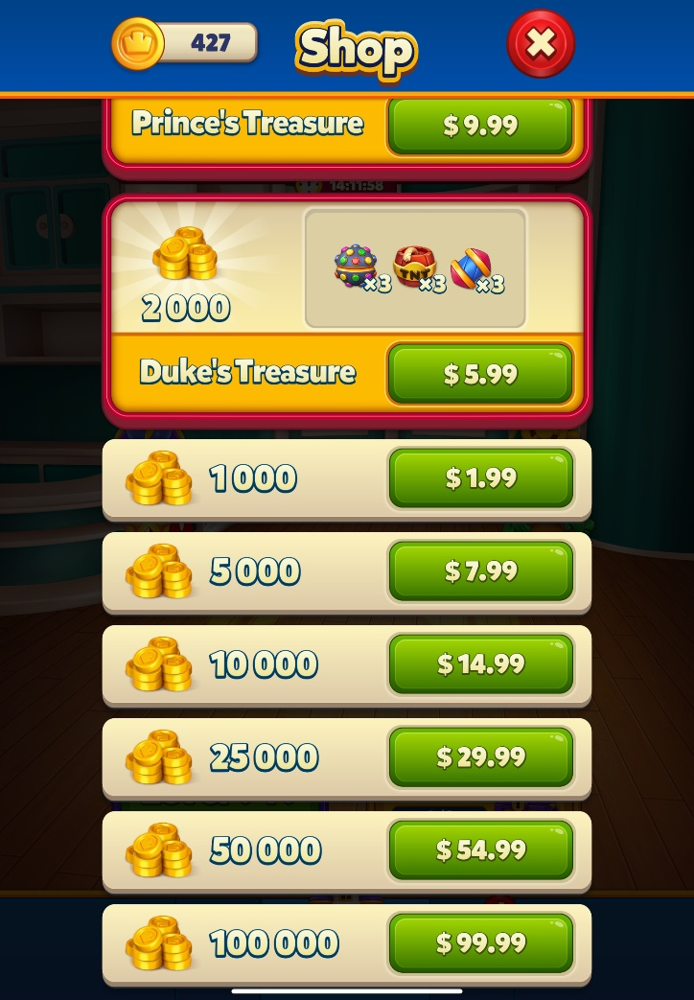
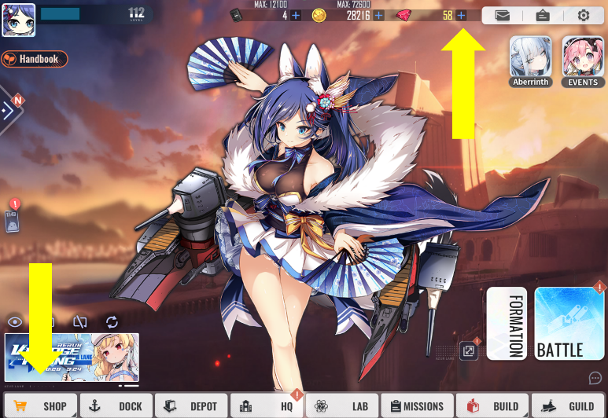
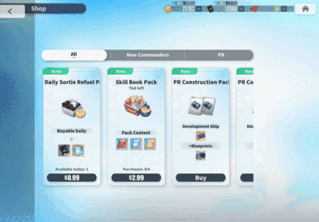
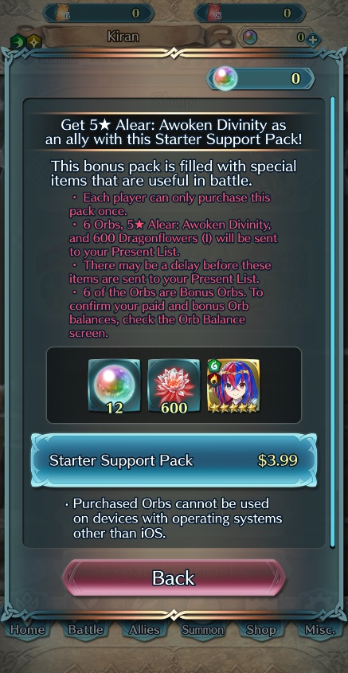

# [Designing a mobile game economy - Store and Digital Offerings](#designing-a-mobile-game-economy---store-and-digital-offerings)

Welcome back to the Growth Insights Series!

This is the third installment of our four-part series, *Designing a Mobile Game Economy 101* for Worlds creators. In the first article, we explored the basics of in-game currencies. In the second, we looked at balancing and progression — how to pace economies so players remain engaged over the long term.

In this article, *Store & Digital Offerings*, we’ll focus on how to design your in-game store and offerings — the central hub for monetization. You’ll learn best practices for store placement and design, how to balance purchasable vs. earnable goods, and how to design bundles, limited-time offers, and upselling strategies to maximize both engagement and revenue.

# [Store overview](#store-overview)

Your game’s store is the heart and soul of its economy. It’s where players can make purchases and compare different store offerings. It’s also where players should learn about discounts and promotions (these should also be featured on the home screen). The store is more than just a list of goods for purchase: it’s a place to engage players, deepen immersion, and showcase digital goods. This article will focus on best practices for both your game’s store as well as for digital offerings.

Many games have seen success using completely different designs and philosophies for their stores. There’s no one right solution to designing your digital storefront. Each store will be as unique as the game itself.

*Royal Match’s store keeps things simple, offering players exactly what they expect: bundles of consumable power-ups and gold that can be used to buy more upgrades.*

# [Best practices for the store](#best-practices-for-the-store)

There are a few basic tenets to keep in mind when designing your store:

1. **Your store must display the price of the item along with a description of it.** The price can be in dollars or in your game’s premium currency.
2. **Discounts can, and should, be advertised.** Be wary of discounting too often, as players may become desensitized to your deals.
3. **The store should be easy for players to access.** Any friction in the process can prevent purchases.
4. **Digital goods must offer clear value to players.** While value is subjective, players are investing money into your game, so purchases should feel fair and worthwhile.
5. **Offer VIP rewards to players based on purchase habits.** However, avoid showing players a running tally of what they’ve spent. This can dissuade them from continuing to purchase.

# [Store placement](#store-placement)

**For mobile games, it’s important to place your store in a convenient, high-visibility area of the screen.** Many games use strong areas of visual focus for shop placement. When the human eye scans information, it tends to follow a Z-shaped pattern. This makes the four corners — top-left, top-right, bottom-left, and bottom-right — strong anchors for drawing attention. Conversely, placements in the top-center, middle-left, middle-right, and middle-center are weaker and should generally be avoided.

**Labeling should also be clear and direct.** Ideally, the store should be called “Store” or “Shop,” regardless of how it’s themed. A recognizable icon — such as a shopping cart, shopping bag, or market stall — also helps guide players quickly. Additionally, consider having an icon as an indicator that something new has been introduced into the store as a way of bringing attention to the store.

**Your store icon should not be the only way to direct players to purchase offerings.** Many games place shortcuts next to a player’s displayed premium currency, which is also positioned in a high-visibility area. These shortcuts almost always appear as a simple plus sign (“+”). When tapped, the plus sign should take players directly to the relevant premium currency section of the store. Players using this shortcut are already motivated to buy more currency, so the process should be as seamless as possible.

Additionally, it’s important to give players a quick path to purchase when they don’t have enough premium currency. If they attempt a transaction and fall short, provide a button that takes them directly to buy the missing amount. Ideally, the game processes the currency purchase and then completes the original item purchase automatically without sending the player back through multiple menus.

*Azur Lane places its store in the bottom-left corner with a clear shopping cart icon in an area of strong visual focus. Players can also reach the store by tapping the plus sign next to their gems (premium currency) in the top-right corner of the screen.*

# [Store design: UI vs. immersive](#store-design-ui-vs-immersive)

One major consideration for your store’s design is how you want it to look to players. Should it be a simple, UI-focused menu that functions like a straightforward options menu, or do you want to immerse players in your game’s theming?

In general, the simpler the game’s economy, the less need there is for a fully themed storefront. For example, if your game only sells a few cosmetics, a minimal UI may be more than enough. Whatever you choose, it should still match the design of your game’s other menus and clearly showcase what digital goods are on offer, what their prices are, and how to purchase them.

If your game has a more complex economy and plans to monetize through multiple purchase offerings (such as premium currency, skins, bundles, quality-of-life enhancements, consumables), then an immersive storefront design could be a great option. Seasonal events also create opportunities to refresh your store visually with themed overlays and decorations. You could design a snowy frame with holiday lights for December or a spooky theme with Jack-o’-Lanterns for Halloween. Thematic design choices like these can create an immersive and memorable shopping experience for players.

**The bottom line:** your store’s pages and purchase offerings must still be easy to navigate and parse, no matter how simple or themed your store is. Organize your store items into group categories - premium currency packs, soft currency packs, consumables, durables, etc. for easy access and conversion.

*Azur Lane’s store is a strong example of immersive design. The mascot character, Akashi, appears as a Live2D model whose eyes follow the player’s finger across the screen, adding charm and drawing attention to store interactions.*

# [Digital goods: purchasing vs. earnables](#digital-goods-purchasing-vs-earnables)

Another important balancing act for the game’s storefront and economy is dividing digital goods between purchasable content and earnable content — in other words, items players must pay for versus items they can earn in-game. Both options are essential. Purchasable goods generate revenue, while earnable goods drive and sustain engagement. A healthy economy should include both, rather than prioritizing one at the expense of the other.

**Purchasable goods should:**

- Be high-quality and attention-grabbing. These goods can capitalize on trends, holidays, or major updates.
- Be enticing to purchase and clearly communicate their value, even when consumable.
- Enhance the gameplay experience in the short or long term.
- Offer unique visual or functional flair, such as animations, lighting effects for skins, or exclusive skills for characters.

**Earnable goods should:**

- Be meaningful and valuable, since players invest time to unlock them.
- Serve as rewards for free tracks on battle passes, seasonal events, or as tradeable items in earned-economy events.

Few games offer a wide range of permanently available earnable goods. This creates an opportunity to move legacy earnable items into the storefront, giving players an outlet to spend extra currency. Many games also pair purchasable and earnable goods as complementary offerings during events or seasonal refreshes. For example, a winter holiday event might feature a Santa Claus hat as an earnable reward alongside a purchasable Rudolph costume.

# [Attracting attention and upselling](#attracting-attention-and-upselling)

When designing your store, you’ll need to think about how to attract player attention. A common strategy in mobile games is a pop-up screen at first login each day to showcase news and events. This is an effective way to direct players to content you want them to engage with and highlight store offerings. If your game is running a limited-time seasonal event or features time-sensitive bundles, the daily pop-up is a natural place to surface them. Many games also use this screen to advertise the arrival of new purchasable content such as characters or skins.

Another strategy is to feature store content directly on the home screen. Icons and images can highlight new items in the economy, while small notification badges (such as a red circle) can draw players to the store to claim free daily rewards. Once inside, players are more likely to notice deals or consider making a purchase.

Upselling is also key. Many games communicate the value of bundles and currency packs by emphasizing the bonus included. For example, a $4.99 pack with 200 gems may sit next to a $9.99 pack with 500 gems. Clearly labeling this as “100 Gems Free!” or “Bonus! 100 Gems!” helps players recognize the better value. A “Recommended” section is another effective way to highlight these deals, and A/B testing can reveal what resonates best with your audience.

Finally, consider complementary offerings. If your game is running a Halloween event with a zombie-themed costume, you could offer a zombie-themed dance emote as an additional purchase, or bundle both together at a discount. The complementary offering not only adds value but also nudges players toward higher spend.

# [Bundling](#bundling)

Bundling is an effective way to increase the value of store purchases and encourage larger transactions. By packaging multiple items together, you can entice players to spend more than they might on individual purchases.

For major seasonal events like Christmas, Halloween, or summer holidays, larger bundles or themed sets are common. These bundles often combine currency and resources with extras such as consumables or small cosmetics, giving players added value. Many games limit bundles to specific events or holidays to create urgency and excitement.

# [Limited-time, daily, and first-time offerings](#limited-time-daily-and-first-time-offerings)

Another way to drive purchases is through limited-time and first-time offers.

**Limited-time offerings** appear when players reach certain milestones, such as hitting level 10 or clearing Chapter 1 of the campaign. These offers should be served as a pop-up on the main screen but never disrupt active gameplay. Always explain why the offer appeared (e.g., “You cleared level 10!”), and make sure the contents are relevant to that milestone. For example, if a player just uncapped a character, the offer might include equipment for them. These bundles should be strictly time-limited, with a visible countdown timer to create urgency. A 90-minute window is common, though the timeframe can be adjusted to fit your game.

A **daily free pack** can be claimed on a daily basis, requiring the player to visit the store. This is a standard practice in mobile and is a good way to encourage repeat visits to the store.

**First-time offers** — often called “Starter Packs” or “New Player Packs” — are another powerful tool. These discounted bundles are designed to accelerate early progression and make the first sessions feel rewarding. Their contents can vary widely, but they typically include:

- A boost of premium currency
- A healthy amount of soft currency
- Supplemental resources
- Something to give players a head start in your core monetization systems, such as gacha draws, a flagship character, or consumable power-ups

*Fire Emblem: Heroes offers a starter pack at $3.99 that includes premium currency (enough for a few gacha draws), a meta-viable character, and resources to strengthen that character’s stats.*

# [What’s next?](#whats-next)

Now that you have a clearer picture of how stores and digital offerings shape your game’s economy, you’re better equipped to refine your storefront and optimize both engagement and monetization. By balancing purchasable and earnable goods, surfacing offers at the right moments, and experimenting with bundles and limited-time promotions, you can create a store that feels fair, rewarding, and worth returning to.

In the final article of this series, we’ll turn to **live operations**: how to track, measure, and update your economy over time. With strong telemetry and ongoing iteration, you’ll ensure your economy stays balanced, profitable, and aligned with player expectations.

