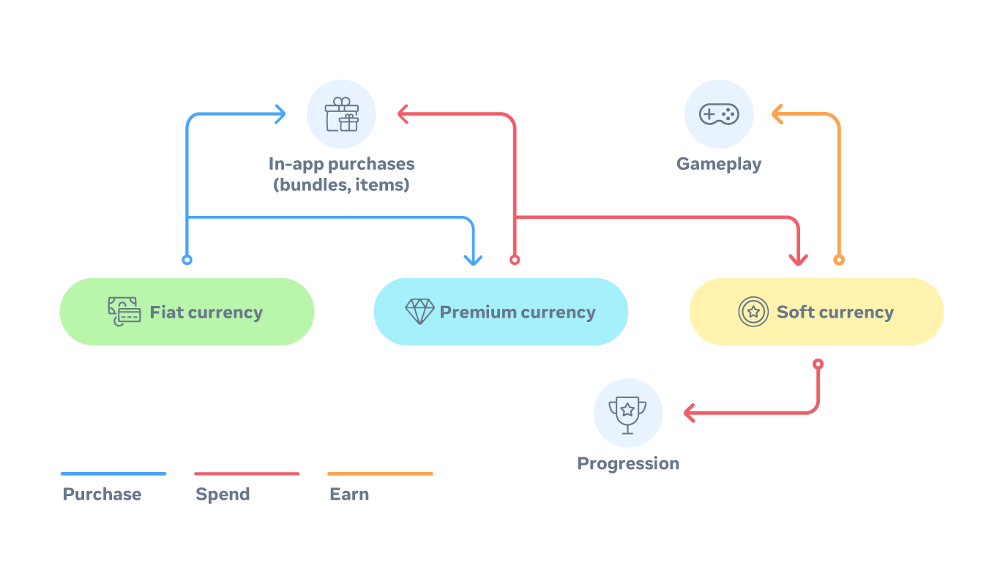
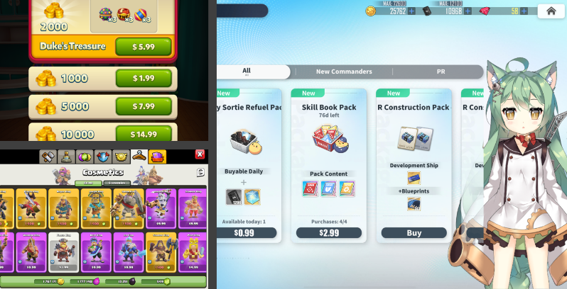
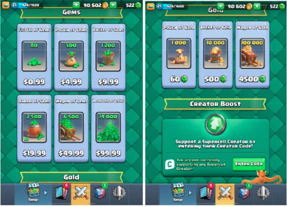
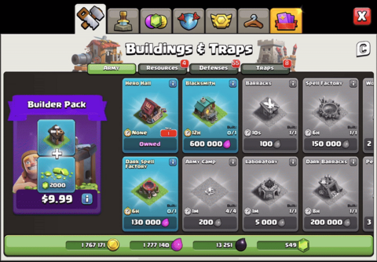
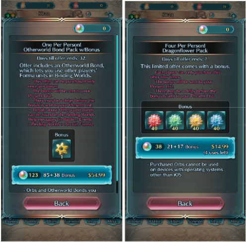
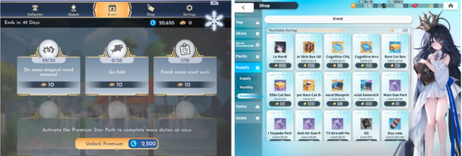
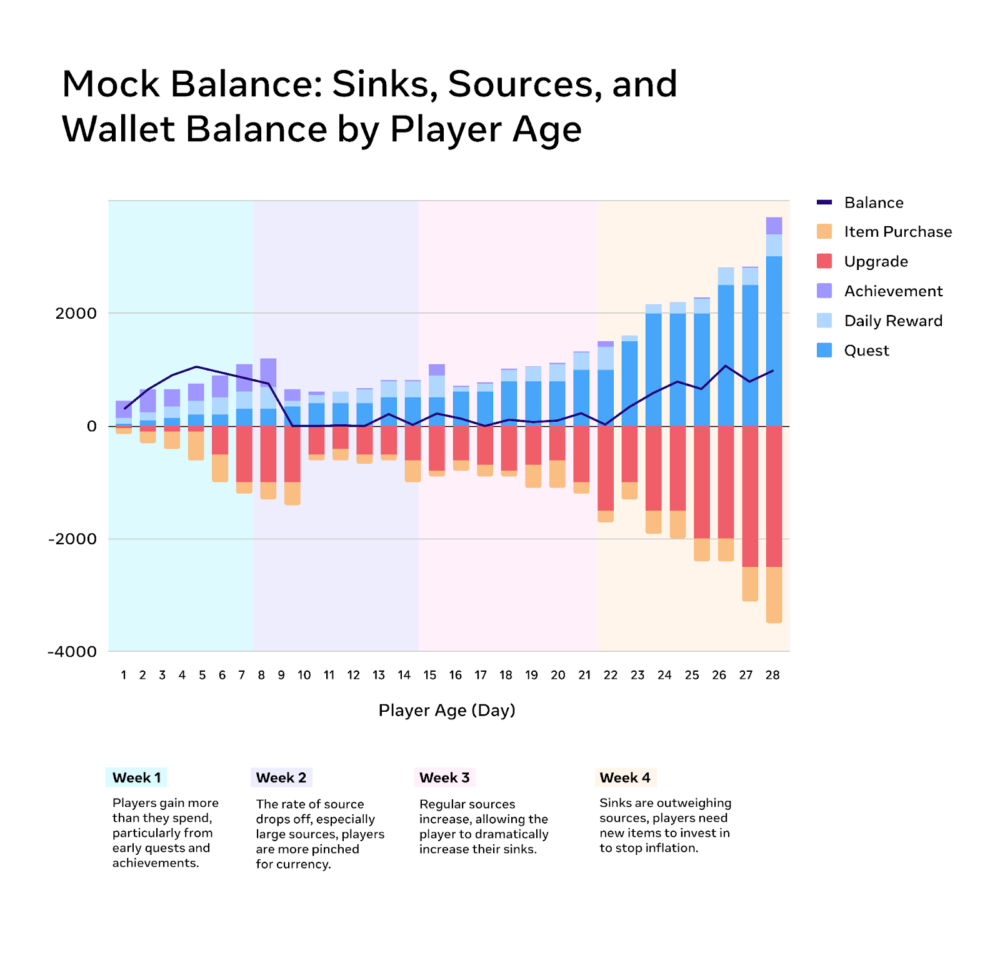

# [Designing a mobile game economy](#designing-a-mobile-game-economy)

Welcome back to the **Growth Insights Series!**

This article kicks off our four-part series, *Designing a Mobile Game Economy 101* for Worlds creators. In this first installment, we’ll explore the basics of designing a mobile game economy, focusing specifically on in-game currencies. Once you learn these fundamentals, you can take a proactive approach to player behavior using tracking data. This will enable you to craft an in-game economy that’s tailored to your game, design, and player base.

But before we dive into currencies, let’s zoom out and frame the economy you’re building.

# [An introduction to Horizon Worlds mobile economy bootcamp](#an-introduction-to-horizon-worlds-mobile-economy-bootcamp)

Designing a fair and profitable free-to-play economy can be very challenging, particularly because it involves many moving parts, and players will come with their own expectations about how it should work. The goal of a good economy is to unlock monetization, allowing the player to exchange money for time, convenience, skill, and status. A robust in-game economy enables players to make these tradeoffs.

The good news is that mobile games have been around long enough that the basics are well understood. With those basics, you can begin to respond to your players through **telemetry** — the tracking of vital habits such as engagement and spending. From there, you can test small changes and iterate until the economy feels fair, rewarding, and sustainable.

The best economies work like well-oiled machines. Some parts of the game should present opportunities to spend, while others should encourage earning through accruing resources or currencies. Balancing both sides — spending and earning — should feel cohesive and create harmony in your economy. But in any economy, you must first understand what you’re offering, what you’re willing to charge for it, and how you can deliver value to your players.

*Storefronts can take many forms, from simple list or menu UI (top left, Royal Match) to more immersive (right, Azur Lane), or traditional (Clash of Clans, bottom left).*

# [An introduction to in-game currencies](#an-introduction-to-in-game-currencies)

## [**Premium/Hard and Soft Currencies**](#premiumhard-and-soft-currencies)

In-game currency is the foundation of a game’s economy. Most titles rely on two main types: **premium (or hard) currency** and **soft currency**.

**Premium currency** is traditionally what players pay for, though some games let players earn small amounts through gameplay. Over time, premium currency becomes primarily available through in-app purchases (IAP) and monetization. It’s typically used for purchases tied directly to a game’s main revenue streams.

**Soft currency**, on the other hand, is earned organically through engagement with the game. This soft currency is used in systems where players are not expecting monetization. Players spend it in areas such as building or upgrading characters, acquiring basic cosmetics and accessories, or engaging in randomized reward mechanics. Occasionally, games let players exchange premium currency for bundles of soft currency, but it’s rare for soft currency to be sold outright.

Premium currency also acts as an intermediary between real-world money and in-game prices. For example, a cosmetic item might cost 1,000 gems instead of $12.99. Soft currency, by contrast, is usually reserved for supplemental purchases tied to progression.

# [Best practices: premium currencies](#best-practices-premium-currencies)

Several best practices can help ensure clarity and player trust when designing a premium currency:

1. Give the currency a distinct name and icon. Common choices include gems, diamonds, and rubies. It’s best if the name and icon are thematically relevant to the World’s narrative.
2. Consider proprietary names (like V-bucks, Gil, Bells, G-coins) for stronger branding.
3. Ensure premium and soft currencies are visually distinct from one another.
4. Avoid designs that resemble real-world money, which may create false expectations of 1:1 value.

*In Clash Royale, gems function as the premium currency and gold as the soft currency. Players can buy gems with cash but must exchange them in-game if they want gold.*

It’s also important to offset the cost of in-game items from the exact bundle sizes sold. For example, if a cosmetic skin costs 2,000 gems, players shouldn’t be able to purchase exactly 2,000 gems. Instead, offer bundle sizes such as 3,000 gems, for players to choose what other items they want or leave players with a surplus for future spending.

# [Sinks: premium currencies](#sinks-premium-currencies)

Sinks (also called “currency-outs”) are where players spend their hard-earned premium currency. A sink is a place where in-game virtual currency can be converted into a virtual good or consumable. They can generally be divided into two categories:

- **Primary sinks** are the main purchases players are most likely to make, such as cosmetic skins in a FPS shooter.
- **Secondary sinks** are less central to design but still improve the game through quality-of-life enhancements like inventory slots, resources, or lesser cosmetics.

Many games funnel players into secondary sinks by providing extra resources that push them to expand inventory, or by offering ways to speed up building and resource generation.

*The Clash of Clans store demonstrates the sheer number of premium currency sinks a game can offer.*

# [Soft currencies vs. third currencies](#soft-currencies-vs-third-currencies)

Soft currency should not be used to buy items tied directly to monetization. Instead, it supports progression through universally understood units such as gold, bucks, credits, or cash.

Some games also introduce a **third currency** (and sometimes even fourth or fifth) to tie into new systems, mechanics, or modes after launch. For example, many free-to-play (F2P) games will have Player vs. Player (PvP) currencies for those participating in PvP matches. These currencies are usually tied to character progression or development (artifact or equipment enhancement) and only appear within specific gameplay modes. Compartmentalizing currencies in this way helps avoid confusion for players who don’t engage with those modes or content.

It is recommended to keep currencies as simple as possible unless the game is complex and deep enough to warrant more than two currencies. Most games can manage well with 1-2 currencies. Each additional currency creates added complexity within the economy and so new currency additions need to be carefully evaluated for their benefits to the system.

*Fire Emblem: Heroes features additional currencies like Dragonflowers (used for progression) and Otherworld Bonds (used to recruit another player’s loaned unit).*

# [Sinks: soft currency](#sinks-soft-currency)

Soft currency sinks are common in free-to-play games and often drive the game’s core loop. They pace progression by requiring players to spend steadily on upgrades or progression systems. Balancing these sinks is important to control how quickly players move through content.

# [Event currencies](#event-currencies)

Event currencies are used during seasonal or holiday events. Each event introduces a temporary earned economy that is distinct from the game’s base economy. These economies give players clear choices: what to purchase and when, based on how much currency they can earn over the course of the event.

Event currencies are typically themed — during Halloween, for example, the currency might be candy. As players continue engaging with the event, they accumulate this limited-time currency and decide how best to spend it before the event ends.

To preserve balance, avoid letting players purchase event currency directly, since this reduces the incentive to participate in the event. If purchases are allowed, keep them to a one-time option or place strict limits on how much can be bought so the earned economy remains intact. Another approach is to sell event currency boosters instead of the currency itself, which still encourages players to engage while making optional investment meaningful.

*Earned event economies often introduce temporary themed currencies. Here, Disney Dreamlight Valley (left) uses crowns for its Royal Winter Star Path event, while Azur Lane (right) uses Benedictus Coins for its 7th Anniversary Event.*

# [Sources and accrual](#sources-and-accrual)

A source is a place where a fiat currency can be converted into a virtual, premium currency. Players should earn both premium and soft currency by engaging with core gameplay. The more they play, the more they earn and fuel further purchases.

We recommend rewarding players with premium currency early in their first gameplay sessions. These early rewards make key moments more memorable and help build a strong, sustained pattern of early-game investment. They also give players a healthy cache of premium currency to spend strategically or impulsively, which establishes habits around currency use.

Soft currency, by contrast, must be distributed more steadily to encourage engagement. It should follow a predictable pattern so players can plan progression. For example, if upgrading a town hall costs 20,000 gold and each farm quest awards 500 gold, players know they need to complete 40 quests to reach their goal. This clarity helps them plan sessions and remain motivated.

As this balance between steady accrual and meaningful sinks takes shape, it becomes clear that soft currency is a fundamental driver of the game’s economy engine: it must remain widely available, especially in systems and modes where engagement is most desired. Soft currency can be sourced from many places, such as content rewards, daily or weekly bonuses, and engagement loops. These steady inflows keep players motivated, reward their participation, and tie directly into the game’s core progression systems.

# [Sinks: battle passes](#sinks-battle-passes)

Battle passes have become a major sink in free-to-play games. Players usually purchase the pass with premium currency and, if they save carefully, can earn enough premium currency back through progression to buy the next one. The game will also introduce new sinks around the battle pass, such as cosmetics and other a la carte items, to encourage players to spend additional premium currency.

# [Wallets and measuring sources and sinks](#wallets-and-measuring-sources-and-sinks)

Using telemetry and tracking can be invaluable. Understanding how much currencies remain in a player’s wallet and measuring sources and sinks provides the data needed to adjust your economy and offerings. Useful metrics to track include:

- The average rate of a specific currency earned across features (such as quests, daily rewards, achievements, and purchases).
- The average rate of the same currency spent across features (such as stores, upgrades, and map purchases).
- The average currency balance by player level or by day.

By monitoring these trends, you gain concrete insights into what is working in your economy and where adjustments are needed.

# [What’s next?](#whats-next)

Now that you have a clearer understanding of how in-game currencies work and best practices for using them, you’re better equipped to analyze the engine driving your game’s economy.

The next article in this series will focus on economy design, balancing, and progression. By mastering these fundamentals, you can build an economy that is not only fair and robust, but also deeply engaging for your players.

