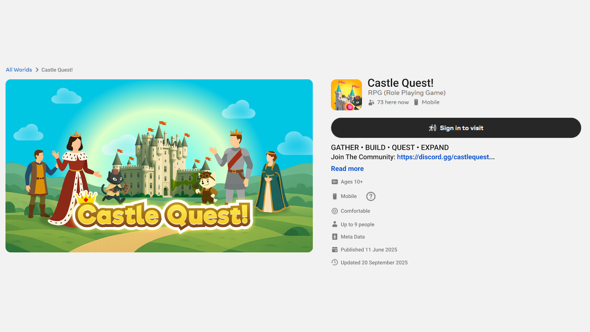
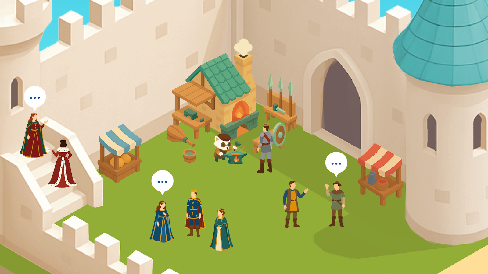
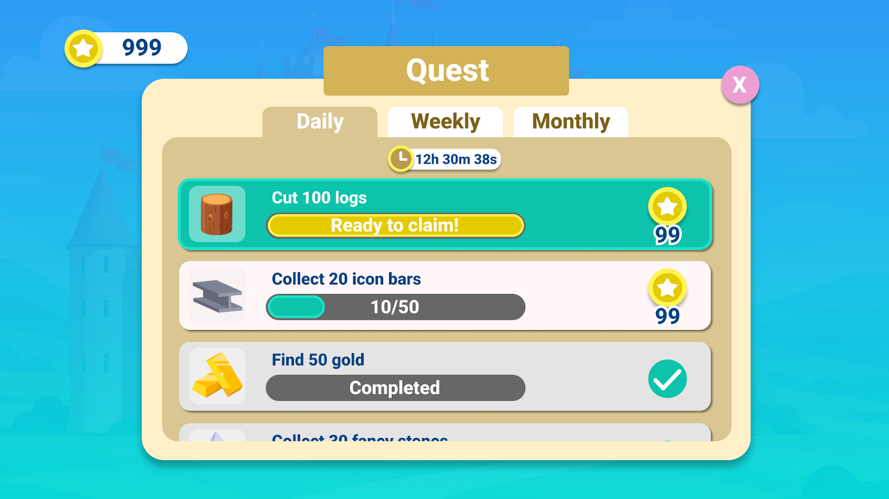

# [Designing for Live Services 101 - Acquisition & Engagement](#designing-for-live-services-101---acquisition--engagement)

Welcome back to the Growth Insights Series!

In Part One of this four-part series, *Designing for Live Services*, we explored how live-service games (also called Games as a Service, or GaaS) work and when they might be the right fit for your project. We also introduced Castle Quest!, a hypothetical role-playing game (RPG) built in Worlds that we’ll keep using as a running example.

In this second installment, we’ll focus on the unique strategies required to acquire players and keep them engaged.

# [Acquisition](#acquisition)

Live service games pose both a benefit and risk to user acquisition because they’re often free-to-play. The benefit is there is no barrier to entry, making it easy for curious players to download the game and try it out. The risk is that these games face steep competition from thousands of other free-to-play titles.

Live service games also require special care when it comes to user acquisition, especially for platform games (Worlds, Roblox, Fortnite) that compete side by side. Your first challenge is clearly communicating what kind of game you’ve built. Players will mainly see your game’s **title, icon, key art, and description**. These elements need to be appealing, hint at the game’s genre, look fun to players, and, most importantly, stand out in a crowded field of competitors.

*Spend extra time testing your key art and icon. For many players, these are the only pieces of content they’ll see before deciding to try your game.*

## [High MAU and low ARPMAU](#high-mau-and-low-arpmau)

There are two crucial elements to understand about live service games. First, they typically have a high monthly active user count (MAU) compared to traditional games because they are free-to-play and have a low barrier to entry. Second, they feature a lower average revenue per monthly active user (ARPMAU). Many of the players will pay nothing or only spend a small amount, which leads to lower average spend per player per month.

Because of this, you need a broad “top of funnel” for user acquisition. Your New User Experience (NUX) should be streamlined, tested, and improved over time so you can retain new players instead of losing them after their first session.

Free-to-play live-service games rely on this broad funnel to hit their revenue goals. Even a realistic revenue target requires close attention to attracting a significant number of players, only a small portion of whom will become payers. At the same time, it’s important not to overlook the value non-payers bring to your game through community, engagement, and (in multiplayer contexts) the activity and content they help create.

## [Marketing and trends](#marketing-and-trends)

Marketing a live-service game on platforms is a challenge to get right. There is value in identifying a popular trend and iterating on it for your game concept or marketing strategy. Your game can take inspiration from the art or design of a more popular game icon, or include a relevant buzzword in the title to attract players searching for a popular phrase. There is also value in creating an adjacent experience to an off-platform game and moving quickly to capture the appeal of breakout hits like Peak. Ultimately, however, this trend-based approach can be difficult to sustain for long-term success.

Additional ways to market your game include optimizing your product details page, as described **[here](https://developers.meta.com/horizon/blog/growth-insights-series-effective-expectation-setting-product-detail-page-engagement-retention)**. Another important step is to analyze early metrics and build on what’s working to find more success on the platform. If a creator has multiple worlds, using Doors in Worlds can help cross-promote players across experiences. Finally, it is critical to establish off-platform social channels and forums to encourage community engagement.

In a future installment of this series, we will dive deeper into off-platform marketing techniques and creative growth tactics to help you find your audience.

# [Engagement](#engagement)

A major strength of live-service games is their ability to engage players in short or long bursts (depending on the game’s design) for weeks, months, or even years. A crucial aspect of user engagement begins with the New User Experience (NUX) and general onboarding. We’ve covered these topics in detail in another article, which you can view [here](https://developers.meta.com/horizon-worlds/learn/documentation/create-for-web-and-mobile/designing-a-mobile-game-new-user-experience-101-ten-best-practices).

Additionally, a strong core loop helps keep players engaged and retained. To learn more about core loops, visit our dedicated article [here](../../Save%2C%20optimize%2C%20and%20publish/Adding%20Core%20Loops%20for%20Retention.md).

## [Long-term engagement](#long-term-engagement)

When building a new live-service game, you also need to consider what longer-term engagement with your title might look like. This is one of the biggest risks of a live service game: there is no guarantee that a new live-service game, no matter how well designed, will find an audience large enough to support it. Every modern gaming platform, from PC and console to VR and mobile, has seen live-service games with promising futures shut down due to lack of audience.

You must build for the future of your game in the early days of its design and economy planning. Some common questions to consider are:

- What will your game offer players a month after release to keep them interested?
- What about three months after release? Six months? A year?
- How will you handle holiday events?
- Are there any new gameplay modes waiting for players or will it just be more of the same?

These questions reflect the implicit expectations that your players will have around your game, which is largely shaped by other live-service games. Many of those games offer seasonal events, deep progression, and regularly advertise new content via cosmetics, gameplay modes, story events, collaborations, and more.

At a minimum, you should have ideas and development roadmaps in place for new cosmetics, a potential battle pass (if applicable), seasonal events or overlays, and at least one new gameplay mode or variation for players to enjoy. Once your plans are drafted and your game launches, it is extremely helpful to monitor and track player engagement with new content to see whether it is genuinely compelling. If it is, the plans you made are working and you can continue to follow them. If not, you can adjust your roadmap to better match player behavior and make it easier to keep players engaged for the long term.

*Seasonal, or [holiday events](https://developers.meta.com/horizon/blog/planning-seasonal-in-game-events/), can drive both engagement and monetization in your game.*

## [Community building](#community-building)

One of the biggest benefits of live-service games is the player community. As players interact with your game’s daily routines, they naturally become part of the game’s community. It’s up to you to welcome them and build on that community.

A good first step is to speak to your players directly. Many live-service games, especially on platforms like Worlds or Roblox, link to external forums like Discord or other social channels for players looking for more information and news. These spaces are great places to share updates, highlight upcoming events, and receive player feedback in real time.

You can run community content on Discord, rewarding players who join with small in-game rewards like cosmetics, vanity nameplates, badges, and more. If your game becomes extremely popular or develops a very engaged community, you can branch out into different types of contests and events. Art contests, where players can submit everything from fan art to cosplay, are a popular choice.

Reaching out to your players and making them feel welcome in the game’s community helps them feel part of something bigger. Whether you encourage them to make friends or simply visit the Discord to see fun posts from other players, that sense of belonging can go a long way.

*Whether in-game or on social channels, fostering a community around your game is a great way to boost retention.*

## [Events and holidays](#events-and-holidays)

One of the biggest strengths of live-service games is their ability to appeal to players through lively, limited-time events in a way that traditional games can’t. These events generally fall into two categories: recurring in-game events (such as clan wars, derbies, player-vs.-player seasons) and events tied to real-world seasons, holidays, or customs. Both types share common traits: they are limited-time, offer rewards, and add new content for players to experience.

Check out the following published articles on [planning](https://developers.meta.com/horizon/blog/planning-seasonal-in-game-events/) and [designing](https://developers.meta.com/horizon/blog/designing-engaging-holiday-events/) holiday events in live-service games for more information.

## [Original events](#original-events)

In addition to holiday content, many live-service games also run recurring original events on a weekly, monthly, or quarterly rotation. Original events usually break down into two types:

1. **System events**. Layer on top of existing gameplay, goals, and reward structures to focus play and supercharge engagement. These are mostly run to maintain engagement levels and prevent churn.
2. **Content events**. Require more front work and special earnable rewards. These are mostly used to drive higher engagement and monetization.

Both event types have a place in your live-service plan. Aim for a consistent cadence of system events supported by regular content events.

But in order for events to work as engagement tools, players need to know they’re coming. Clearly communicating these events allows players to plan their playtime: dropping a large multiplayer event like a guild war without warning, for example, can lead to lower participation. Advertising events (whether original or holiday) builds anticipation and encourages speculation and excitement.

Consistency is just as important. Supporting small system events at a regular cadence is better than planning a big event you can’t reliably deliver.

## [Daily, weekly, and monthly engagement](#daily-weekly-and-monthly-engagement)

Daily, weekly, and monthly quests are another effective way to drive engagement. These simple, routine tasks help move players through your game’s core loops, and offering small rewards for completing them can help reinforce play habits.

For many players, completing their “dailies” becomes a ritual that helps them make progress, stay current with the game, and earn resources, currency, or consumables. Any gameplay beyond dailies is a bonus and reflects deeper engagement. In most live-service games, dailies represent the minimum amount of gameplay a player should aim to complete.

*Give players achievable goals on set schedules. These systems give players guidance in the moment (“What should I be doing right now?”) and over time (“What long-term goals am I working toward?”).*

# [What’s next?](#whats-next)

The next article in this series will focus on monetization and the content pipeline in live-service games. By understanding these fundamentals, you can build a live-service game that delights players for years to come.

