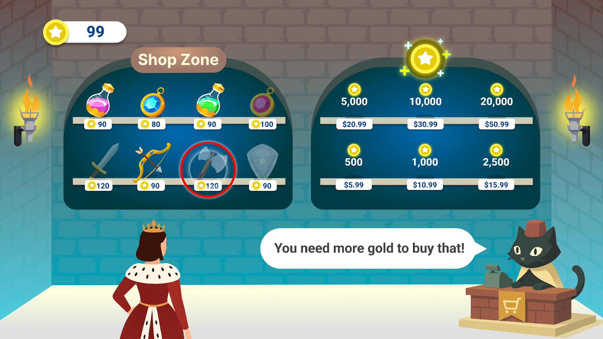
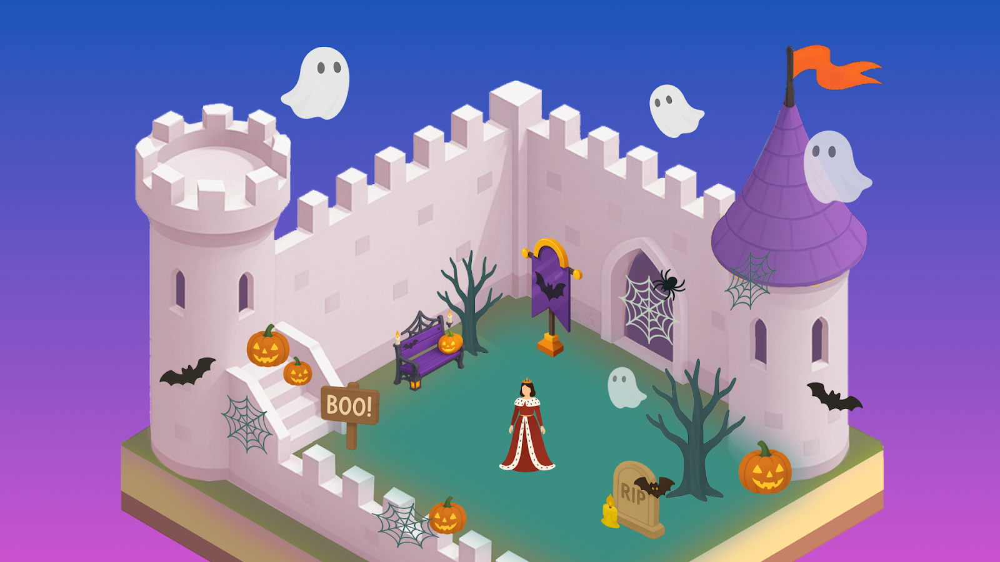
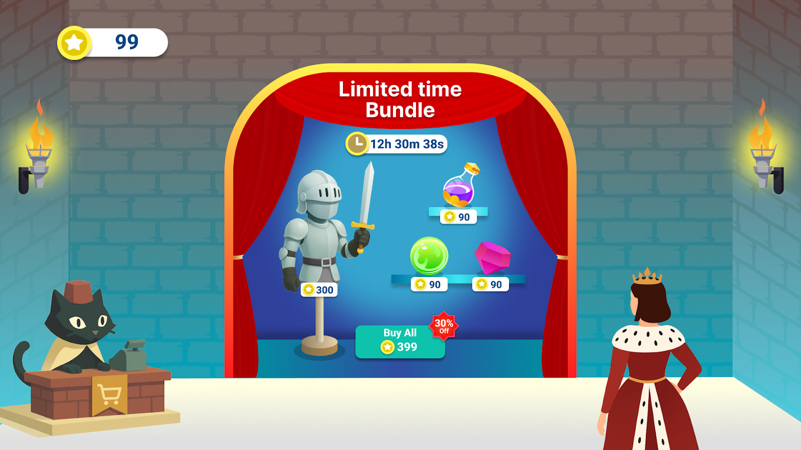
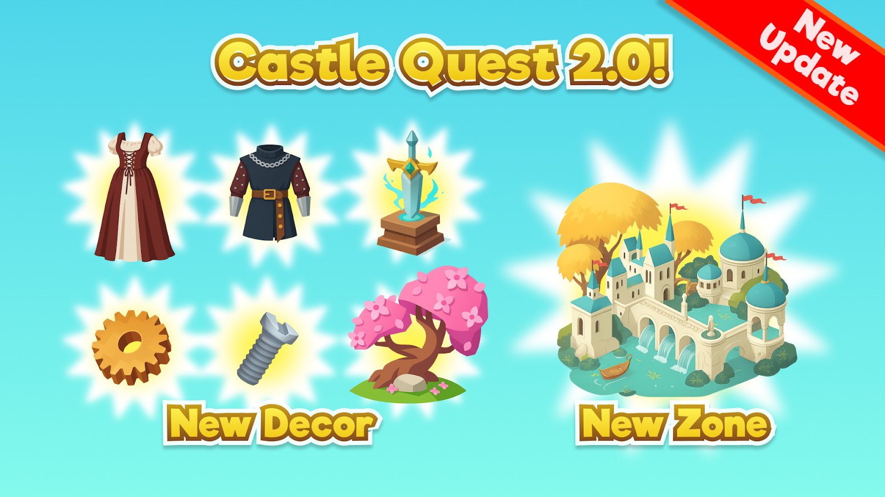

# [Designing for Live Services 101 - Monetization & Content](#designing-for-live-services-101---monetization--content)

Welcome back to the Growth Insights Series!

This article is part three of our four-part series, *Designing for Live Services 101*. In part one, we explored the basics of live services and when they’re a good fit for your game. In part two, we covered the strategies you need to acquire players and keep them engaged. In this installment, we’ll focus on how to monetize and plan your content pipeline for a live-service game.

# [Monetization](#monetization)

Monetization in a live-service game is about giving players clear, optional ways to trade money for value, rather than forcing them to pay to keep playing. In this section, we’ll break down the main types of purchase offerings you can use to support your game.

## [Purchase offerings](#purchase-offerings)

One of the major strengths of a live-service model is that it enables a wide range of purchase options, which increases opportunities for monetization. In a free-to-play game, purchases let players trade money for value, usually in the form of time saved, added convenience, more power, status, or protection against loss.

These purchases broadly fall into **five categories**:

1. **Durable goods.** In our Castle Quest! example, durable goods include cosmetics for the player avatar, new furnishings for the castle grounds, and generator buildings. Players keep these items permanently once they’re purchased.
2. **Consumable goods**. In Castle Quest!, consumables include resources, gem packs, XP boosts, and power-up boosters. Players lose these items when they use them.
3. **Quality-of-life upgrades.** These purchases improve fundamental aspects of gameplay, such as increased storage or extra production slots. They’re often bundled into battle or season passes.
4. **Currency.** In Castle Quest!, the premium currency is gems and the soft currency is gold. Players use these currencies to make other purchases (durables, consumables, and more).
5. **Battle / season passes**. In Castle Quest!, the season pass lets players complete a series of challenges to earn extra rewards throughout the month. Passes usually increase rewards from daily, weekly, and monthly quests and can include exclusive durable goods, consumables, and quality-of-life perks.



*It’s ultimately your decision which items you create to power monetization, but we’ve broken down the benefits of hybrid economies where possible.*

What is viable from the purchase offerings listed above, and likely to generate revenue will vary considerably from genre to genre. For example, a matching puzzle game will have fewer options for durable-goods purchases, as it often doesn’t feature customizable avatars, avatar living spaces, or emotes for players to buy. By contrast, most social games in Worlds are better positioned to offer durable goods (skins, furnishings, housing, and more).

Another aspect to consider is the storefront and its purchasing funnel. While it’s a strength of live-service games to support microtransactions and encourage players to spend on new content, a poorly designed storefront or purchase system can cause players to abandon their purchases. To avoid this, the storefront must be easy to access and navigate.

We recommend carefully considering what you offer your players. In general, a purchase offering should add clear value to your players’ experience and be an optional way for them to invest in the game. If players feel forced to spend, or feel that what they purchased wasn’t valuable, they may be reluctant to invest more money in your game.

## [Durable vs. consumable goods](#durable-vs-consumable-goods)

The basic level of any economy will be durable and consumable purchases - more advanced monetization offerings like seasonal passes rely on an already motivating durable/consumable economy.

### [Durable goods (Castle Quest!)](#durable-goods-castle-quest)

In Castle Quest!, durable goods include cosmetics for the player avatar, new furnishings for the castle grounds, and generator buildings. Durable goods are usually one-time purchases.

| Pros                                                                                                                                                                        | Cons                                                                                                                                                       |
| --------------------------------------------------------------------------------------------------------------------------------------------------------------------------- | ---------------------------------------------------------------------------------------------------------------------------------------------------------- |
| **Provide a sense of ownership.** Players keep whatever they purchase (such as a skin, emote, or furnishing) and can cycle a durable good in and out of rotation over time. | **Require upfront work**. Items must be created, tested, and pass quality assurance. Maintaining enough new items also requires a robust content pipeline. |
| **Are a great tool for marketing**. New skins, characters, furnishings, and companions can be used in ads, banners, and in-game messaging to drive purchase intent.         | Are generally **more expensive** for both developers and players.                                                                                          |



### [Consumable goods (Castle Quest!)](#consumable-goods-castle-quest)

In Castle Quest!, consumable goods include resources, gem packs, XP boosts, and boosters. Consumable goods can be purchased multiple times.

| Pros                                                                                                                                                 | Cons                                                                                                                                                                                                                      |
| ---------------------------------------------------------------------------------------------------------------------------------------------------- | ------------------------------------------------------------------------------------------------------------------------------------------------------------------------------------------------------------------------- |
| **Are less costly for both developers and players.** A single item is often purchased many times, unlike durable goods that are usually bought once. | **Can be seen as offering less value, since they’re used up.** A player who spends $5 on a skin always has the skin; a player who spends $5 on power-ups has nothing to show for them after use beyond any progress made. |
| **Provide a very clear value proposition** (“buying X gives you the ability to do Y”) that makes it easy for players to see their purpose.           | **Don’t lend themselves well to marketing.** They’re good inclusions for bundles, but they’re less effective at attracting players to your game than new cosmetics.                                                       |
| **Lend themselves well to fast-paced purchase decisions,** such as buying extra moves to complete a level a player just failed.                      | **Can be challenging to balance.** If the benefit is undertuned, they won’t sell well; if it’s overtuned, they can give the impression of being “pay-to-win.”                                                             |

## [Currency and bundles](#currency-and-bundles)

A popular approach in live-service games is to sell player-facing currency and bundles. Currency is a versatile purchase option where players buy premium, in-game currency with real-world money, then spend it on purchases during gameplay. Meta Credits is the featured currency inside Worlds.

Bundles are another strong purchase offering and a great use of currency. In a bundle, players receive several items together for a single price. Many games use currency to anchor bundles, then add an extra item such as a small pack of consumables or a durable good like a skin. Bundles can be discounted to drive purchases around key times of year. Check out the variety of articles we’ve published on bundling best practices in game economies to learn more.

## [Motivation to spend](#motivation-to-spend)

The last aspect to consider for purchase offerings is simple: what will motivate your players to buy items? The answer will vary depending on what you’re selling, but common motivators include:

1. **Competition**. If your game offers direct player-vs.-player gameplay, letting players purchase durable goods (such as units and weapons) can be a strong motivator.
2. **Showing off / peacocking**. In games where players unlock purchases after milestones or where multiplayer is a big focus, some durable goods can serve as status symbols, letting big spenders show off their purchasing power.
3. **FOMO (fear of missing out)**. Limited-time events and rotating store offerings can motivate players who don’t want to miss their chance at specific skins or cosmetics.
4. **Completionism.** Some players are driven to complete sets or collections. Games can tap into this by designing collections that encourage repeat purchases.
5. **Loss aversion.** When players are close to completing a level and fail, offering them the option to buy lives, moves, or boosters to secure the win can be another strong motivator.



# [Content pipeline](#content-pipeline)

A live-service game’s content pipeline is the foundation of its community engagement and monetization. The content pipeline is an internal map of what your team plans to add to the game, such as new purchase offerings, additions to progression systems, and new maps or modes for players to enjoy. While some of this plan should stay internal to preserve surprises, the major beats should be shared with the community so players know what to expect.

How you manage this depends on your team and the game you are building. If you have the resources to support a robust pipeline, you might release a monthly calendar of new content. If not, a quarterly or even yearly roadmap can still work. Live services and content pipelines require substantial upfront investment, even before launch. You need enough content for players at launch and for the months that follow.

```
💡
 
Note
:
 
You
 
do
 
not
 need to build the entire pipeline before launch
.
```

As a smaller or newer developer, no one expects you to ship with a full year of content already programmed, tested, and ready to go. You do need a clear map of what is coming, what resources it will take, and how you will move content from concept to players. This map forms the basis of your content pipeline and fuels many successful live-service games.

However, the more specific your roadmap is, the harder it will be to hit every promise. Monthly or quarterly goals are safer than promising specific content on a specific future date.

## [Initial planning](#initial-planning)

The investment your team needs to put into a content pipeline can vary considerably based on the kind of game you are making. Consider the following additions to your content pipeline to help ensure that players do not run out of content to enjoy or purchase offerings to consider.

1. **Additional gameplay**. Assume your most dedicated players will burn through all launch content within a few days. These potential superfans will consume new content as fast as you release it and will often evangelize your game to friends. A roadmap helps signal to them that more content is on the way.
2. **Additional purchase offerings**. What you offer in the first month sets expectations for everything that follows. If you plan to monetize primarily through cosmetics, launch with a broad range, then monitor player purchases to see what your community engages with most. Use this data to inform your pipeline and do not be afraid to adjust plans to match player interest.
3. **Events**. At a minimum, plan to support three holiday events: Halloween, Christmas or winter, and summer. Anything on top of that, such as Valentine’s Day or St. Patrick’s Day, is a bonus. Events let you offer limited-time purchase options and tap into seasonal excitement to drive spend and playtime.
4. **One new gameplay mode or variation**. Whatever experience you offer, players will eventually feel fatigue. Having a new mode or mini-game in your pipeline gives players something fresh to look forward to and can re-energize lapsed players.



## [Integration into gameplay](#integration-into-gameplay)

Once your content pipeline map is complete, the next critical step is directing players to that content in-game. In an on-platform game with casual engagement, this is often straightforward. Players load into a lobby and see core gameplay, or the entrance to gameplay areas, in front of them.

Use the lobby to highlight key content elements such as the storefront, tutorial messaging, and links to community resources like Discord and social channels.


We recommend promoting daily login rewards with a pop-up during initial login or a notification in a high-visibility area of the main menu.

If you want to emphasize a specific aspect of gameplay for monetization, such as cosmetics or power-ups, point players toward it in the first-time user experience.

# [What’s next?](#whats-next)

The next article in this series will focus on monitoring, tracking, and optimizing the content pipeline, store, and purchase offerings in live-service games. By understanding these fundamentals, you can build a live-service game that delights players for years to come.

