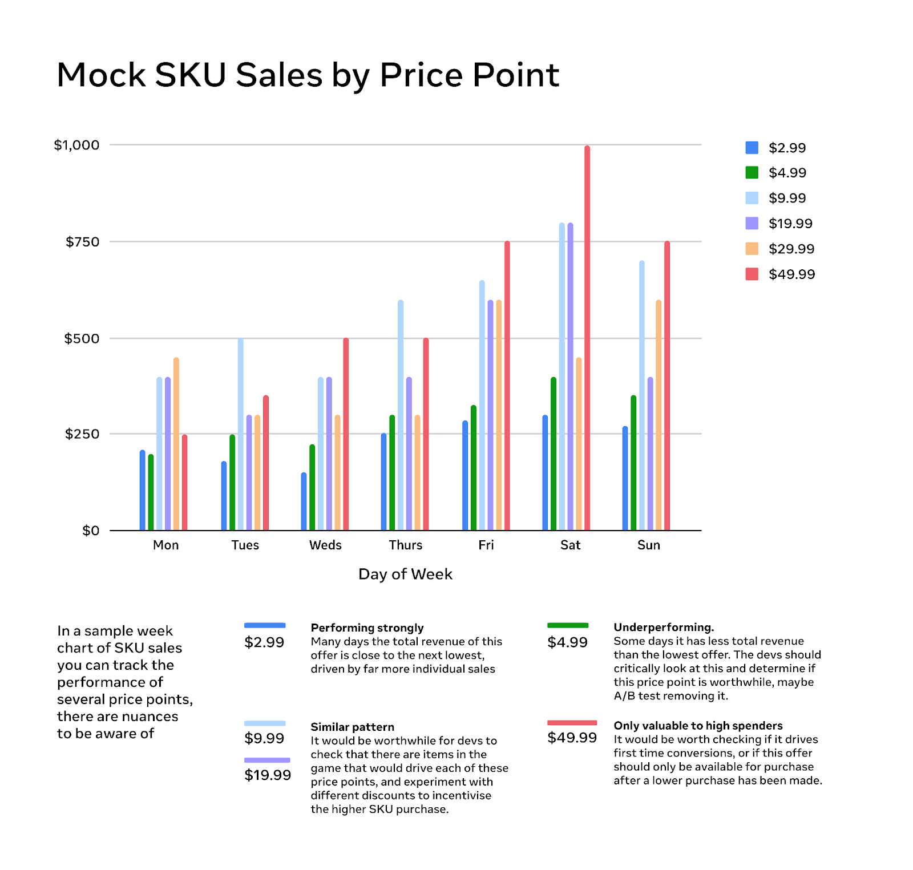
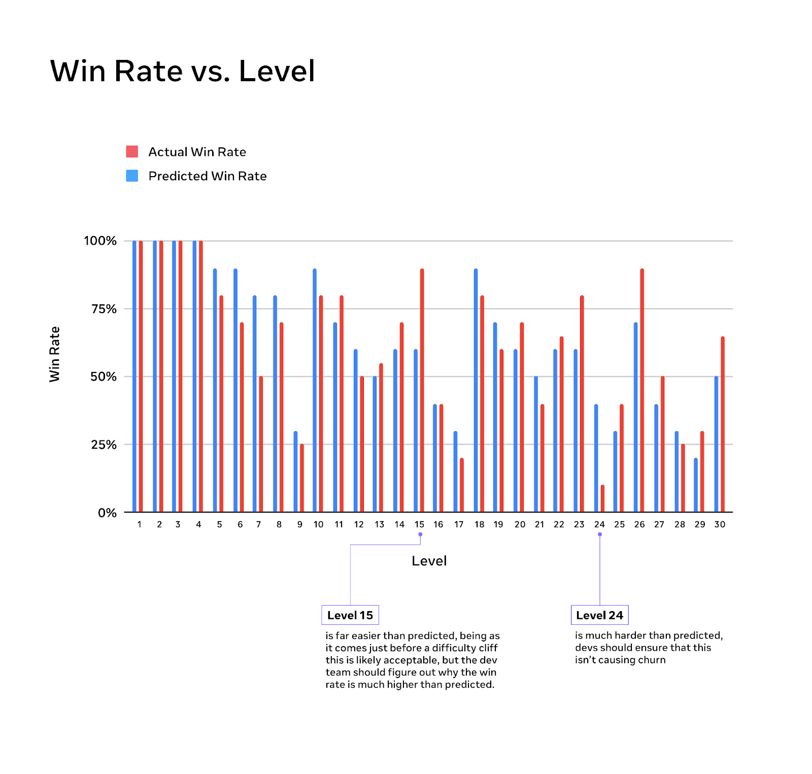
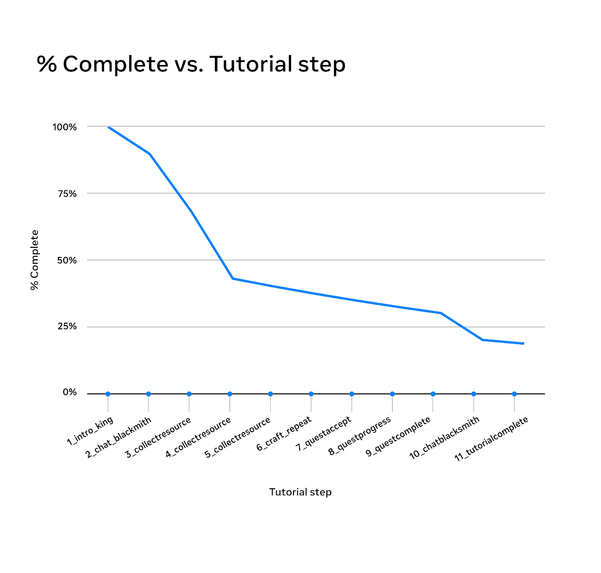
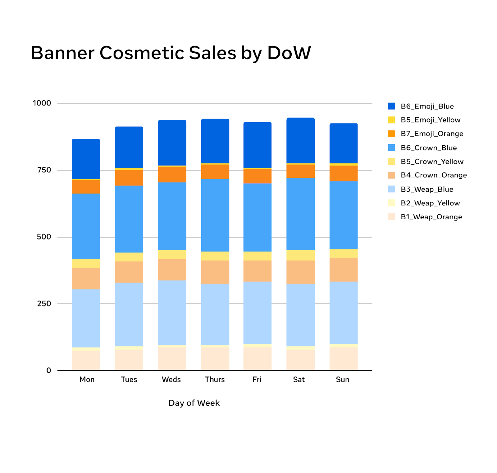
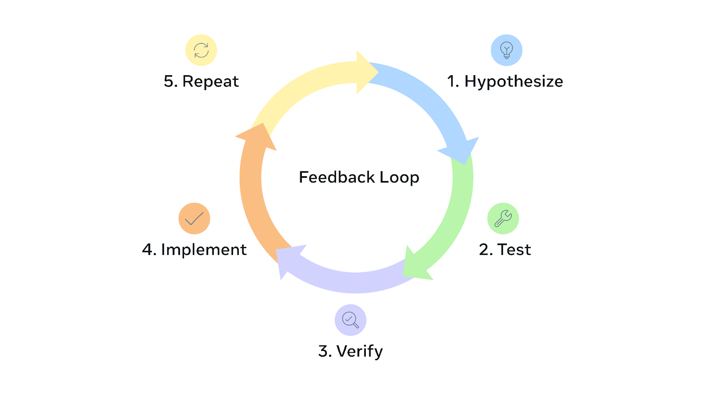
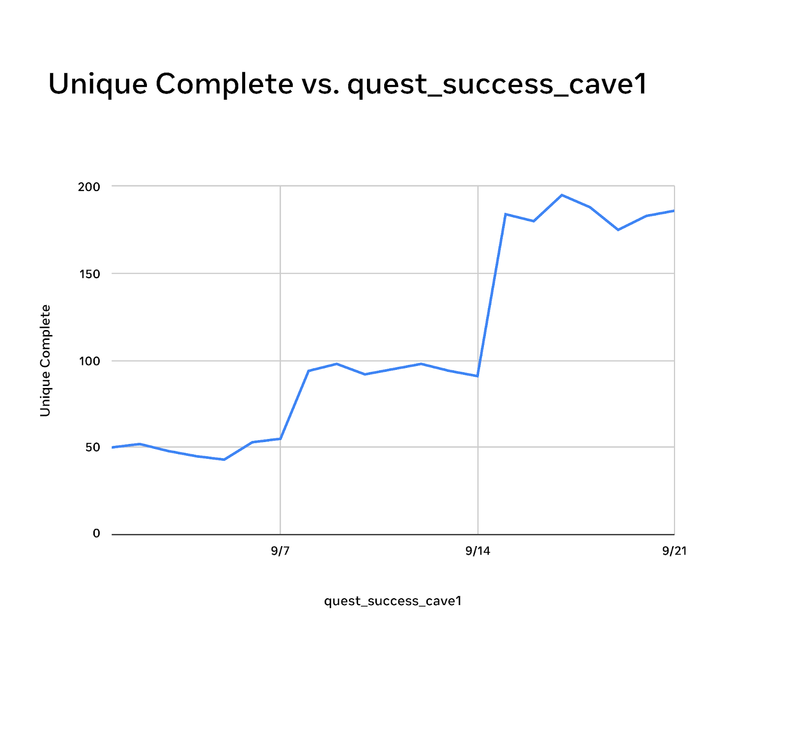

# Designing for Live Services 101 - Monitoring, tracking & optimizing

Welcome back to the Growth Insights Series!

This is the fourth and final part of our series, *Designing for Live Services 101*. In Part One, we explored the basics of live services and why they may be a good fit for your game. In Part Two, we covered strategies to acquire players and maintain engagement. In Part Three, we looked at how to monetize and plan your content pipeline. In this final installment, we will focus on how to monitor, track, and optimize your content pipeline and purchase offerings.

# Monitoring & tracking

Live-service games give you a key advantage over traditional games: you can see how players behave, where they spend their time, and what they choose to buy through in-game telemetry. With the live-service foundation we’ve built over the last three installments of this series, we will now focus on how to use that data to understand session engagement, player progress, and spend so you can improve your game over time.

## Session engagement

One of the best places to start is with your typical player session journey. We have a separate article dedicated to optimizing your New User Experience (NUX), the beginning of your player journey, that you can read [here](https://developers.meta.com/horizon-worlds/learn/documentation/create-for-web-and-mobile/designing-a-mobile-game-new-user-experience-101-ten-best-practices) for more detail. For this article, we will focus on questions like:

- **New player journey.** What do new players interact with? Are they going where you expect in the tutorial? Are they spending a lot of time in a mode you did not plan for? Is an “easy” challenge level causing frustration and churn? These are all critical signals.
- **Returning sessions.** Is your game a one-and-done experience, or are you seeing players come back on day 2, day 5, and day 30?
- **Session frequency.** How many times a day do players log in to your game? Is it only once, or multiple times? If your game offers daily quests and players clear them and still return several times per day, you likely have a strong gameplay hook.
- **Adoption and completion rate.** Are players actually completing dailies and new challenges? What percentage of players finish them on a given day? If a new boss is too much of a hassle to clear, tracking completion will help you spot the problem.
- **Spend and purchasing.** Are players buying things in your storefront? What are they buying most often? Which purchase offerings are they very interested in, and which do they ignore? Analytics can help you tune and refine these offerings.

*As we discussed in our mobile game economies article, a major strength of live-service games is the ability to measure and respond to item sales data. Closely tracking the performance of bundles and items helps you design in line with player preferences.*

## Player progress

One of the most important things to track in your game is play progress through events, levels, and matches. You do this by coding and tracking “events” (programmatic instances) in your game’s backend. Some of these events could be enemy\_defeated, level\_cleared, or quest\_completed.

By adding events to your core gameplay, you get a clearer picture of what players are doing in game. The more specific events you add, the more data you receive. However, start simple with major events so you do not overwhelm yourself with data you are not ready to use.

\*Tracking events such as win and loss rates or quest completion gives you a stronger understanding of how players interact with your game.

Using our Castle Quest! game as an example, if you’re creating a live service game around castle building, you might start by tracking events like *tutorial\_complete, building\_created or troops\_deployed*. These events help you see whether players complete the tutorial and how they progress through basic building and troop deployment.

From there, you can add events tied to quests, such as *quest\_start\_cave1, quest\_success\_cave1, daily\_task\_completed\_1*. These events show which quests players engage with. If the cave side quest is important and you want most players to experience it, but only 5% of players start it, you may need to draw more attention to the quest start conditions.

\*In the mock Castle Quest! tutorial data, about 70% of remaining players drop off at step 4 and another large group at step 10.

## Purchases and spend

Another critical area to track in a live-service game is player purchases and spend behavior. With proper analytics you can determine:

- What a player’s first purchase is in your game
- Whether a newly added cosmetic is selling well
- If players respond positively to pop-up sale notifications
- Which purchase offerings are failing to meet expectations

Without this data, you are guessing when you fine-tune your economy. With it, you can adjust your purchase offerings and storefront with confidence. This data also gives you a strong sense of direction for future content.

*In this mock Castle Quest! cosmetic sales chart, the developer tracks nine banner cosmetics in three colors and several symbols. Telemetry with human-readable item names shows that yellow banners sell far less than blue, and crown icons outperform other symbols. The team should create more blue, crown-style banners and retire emojis that players ignore.*

## Feedback loop

Taken together, these tracking tools let you build a feedback loop based on data. An ideal feedback loop follows these steps:

- Hypothesize
- Test
- Verify
- Implement
- Repeat

Let’s go back to Castle Quest! and the cave NPC mission that players are not engaging with. You put a lot of time into the mechanics and lore of the quest and want players to experience it, but only 5% of players start it.

- **Hypothesize**. The cave NPC or cave area is too hard to find, and players do not know how to start the quest.
- **Test.** You suspect the cave location is the issue, so you decide to have the NPC by the cave send players a letter in their mailbox, including a map to the cave, asking for help and promising a reward. Because this is a test, you only send it to players who cleared the tutorial quest on the first day.
- **Verify.** You add a new event, letter\_read, to the NPC’s letter. After a week, you see the letter\_read event at about 70% for the test group, and the completion rate for the cave quest jumps from 5% to 25%.
- **Implement.** You roll out the letter to all players, confident in its ability to direct them to the content you want them to experience.
- **Repeat.** You can have other quest-giver NPCs send letters if their quests are not being completed at the expected rate.

*From 9/1 to 9/7, about 5% of players completed the cave quest. Sending mail to a 20% test group from 9/8 to 9/14 raised completions to about 10%. After the mail was rolled out to the full player base on 9/15, completion stabilized around 20% overall, even though the gain per player was smaller.*

With this example in mind, you can apply an analytics-driven approach to everything from the effectiveness of in-game ads to the appeal of new purchase offerings. Using analytics well helps you decide what to change when you balance difficulty, improve engagement, and grow revenue.

# What’s next?

This concludes our series on live-service games! Now it’s your turn to put these fundamentals into practice and deploy a live-service game that keeps players engaged, excited, and eager to return. What will you build?