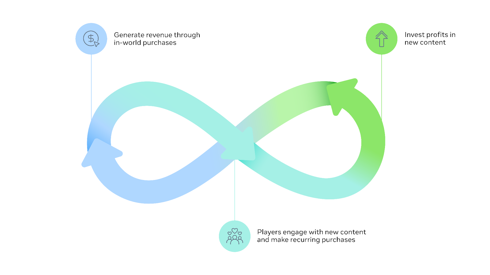
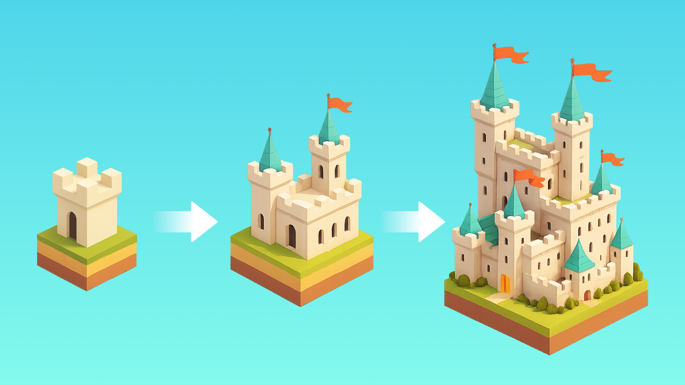
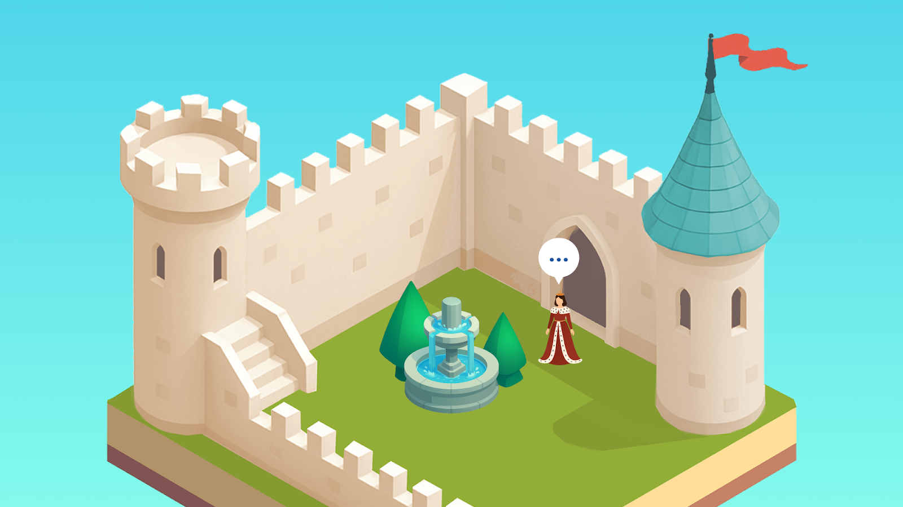

# [Designing for Live Services 101](#designing-for-live-services-101)

Welcome back to the Growth Insights series!

This article kicks off a four-part series, Designing for Live Services 101. In this first installment, we’ll explore the basics of live services and why this game management model may be a good choice for your game.

Before we dive into designing your live-service systems, let’s zoom out and define what a live service is and how it differs from a traditional “game as a product” model.

# [What you’ll learn in this series](#what-youll-learn-in-this-series)

You may be wondering: What exactly is a live-service game and how is it different from the traditional “game as a product” model? Are live services a good choice for your game? We’ll answer those questions throughout this series as we explore:

1. What a live-service game is
2. Core components of a live-service game
3. How you can design a new game with live services in mind
4. Benefits to user acquisition, engagement, and monetization
5. How to monitor and track player behavior

Live services aren’t necessarily a good fit for everyone. However, if you’re building a game on a platform such as Worlds, you’ll rely on live services to drive your business. Our goal is to give you a clear understanding of what live services are and how they can benefit your team.

# [Defining live service](#defining-live-service)

A live-service game, often called Games as a Service (GaaS), features continual updates in response to how players interact with the game. These games are designed to build a long-term relationship with players. A live-service game has two main goals: to give players a long-lasting, potentially infinite stream of content, and to give developers a more predictable, long-term stream of revenue.

*Live Service Games, or Games as a Service require continual support to thrive. Not only do updates give your players new content to engage with, but messaging your updates can win new players who will be more interested in a game that has active development.*

The biggest difference between a live-service game and a traditional “game as a product” is the focus on frequent content updates and ongoing monetization. Traditional games may ship free post-launch updates or paid expansions, but that content stream eventually stops. These games are usually designed with a clear end to both story and gameplay, which makes it harder to keep players engaged over time and often pushes them on to new experiences.

By contrast, live-service games continuously offer new content to keep players engaged, which in turn generates ongoing revenue for developers. A strong live-service game becomes a self-sustaining loop: the game earns enough to fund new development and still make a profit. That balance between player engagement, player spend, and developers shipping new content is what every live-service game aims to achieve.

A live-service game is built around several key components that are vital for both players and developers.

1. **Endless gameplay.** One of the biggest attractions of a live service is the ability for players to engage in an almost limitless amount of gameplay over time.
2. **Progression systems.** Players make incremental progress toward long-term goals, whether they’re chasing exclusive gear or leveling up a character. This steady progress can be motivating and deeply fulfilling for many players.

*Visible progression helps players feel their progress and show their skill to others. Progression supports acquisition (by signaling that there’s depth and goals) and retention (by giving players something clear to work toward).*

1. **New content**. Live-service games regularly introduce new content, such as limited-time modes, new levels, new playable characters, or new cosmetics to purchase.

*Don’t neglect [Holiday Events](https://developers.meta.com/horizon/blog/planning-seasonal-in-game-events/), or at the very least sales, to drive both engagement and monetization in your game.*

1. **Revenue generation.** This is a major reason to consider a live-service model. Instead of a single up-front purchase, a live-service game can create a stable revenue stream through small microtransactions or recurring purchases like battle or season passes, sometimes for months, years, or even decades after launch.

## [Costs and benefits of live service](#costs-and-benefits-of-live-service)

#### [✅ Benefits](#-benefits)

| Benefit                  | Description                                                                                                                                                                                                       |
| ------------------------ | ----------------------------------------------------------------------------------------------------------------------------------------------------------------------------------------------------------------- |
| **Community building**   | Live service games, especially multiplayer titles, can become vital social spaces where players form deep bonds and enjoy feeling a part of the game as it evolves.                                               |
| **Revenue**              | The game can leverage recurring payments such as microtransactions, seasonal passes, or subscriptions to create a stable, recurring stream of revenue and a higher potential revenue cap than a traditional game. |
| **Low barrier to entry** | Most live-service games are free-to-play (F2P), which removes the immediate cost barrier to entry. Letting players find the fun first, before they make optional purchases, has proven to be a compelling model.  |

#### [💰 Costs](#-costs)

| Cost                          | Description                                                                                                                                                                                                                                                                           |
| ----------------------------- | ------------------------------------------------------------------------------------------------------------------------------------------------------------------------------------------------------------------------------------------------------------------------------------- |
| **Upfront cost**              | Live-service games require significant planning and content work before launch. In addition to making sure the core gameplay is fun, you need a roadmap for what players will chase three, six, and twelve months after release.                                                      |
| **Ongoing support**           | A live-service game needs continuous attention. You’ll monitor player progress, spend, and engagement, understand player motivations, and adjust your gameplay and monetization plans based on what actually works.                                                                   |
| **Competition for attention** | On free-to-play platforms like Horizon Worlds or Roblox, you’re competing with thousands of other experiences for player time. Whether you’re shipping a twist on a familiar genre or something entirely new, you’ll need a clear strategy to stand out and keep players coming back. |

*Well-integrated social spaces are critical to many live-service games. They give players chances to build or deepen real social connections while enjoying the experience together.*

# [Hypothetical case study: Castle Quest!](#hypothetical-case-study-castle-quest)

To ground these concepts, we will use a hypothetical game called **Castle Quest!** as a running case study throughout this series to help illustrate our points about live services.

*Our example game, Castle Quest!, is a role-playing game (RPG) built on Worlds. Players gather resources, outfit troops, and send them on quests in order to upgrade their castle.*

Let’s say that:

### [Launch (July)](#launch-july)

You’ve just built Castle Quest! in Worlds. It’s free-to-play, and you launch 10 cosmetic banner decorations for castle grounds at 100 gems each.

### [Peak day](#peak-day)

The game spikes at about 2,000 players on a single day in July, and you saw a huge surge in revenue as players made purchases.

### [September: play drop](#september-play-drop)

By September, daily players fall to around 300 and revenue slows. It feels like fewer players automatically means less money.

### [September-December: revenue decline](#september-december-revenue-decline)

Player counts hold at roughly 300 per day, but revenue almost disappears. You look at the original 10 banner cosmetics, pick a favorite you’ve seen friends use, and build 10 new cosmetics based entirely on that design.

### [January: continued decline](#january-continued-decline)

Player counts fall even further. The new cosmetics generate some revenue, but far below your expectations.

*Like many Worlds, Castle Quest! primarily monetizes through durable cosmetic goods. The economy could be more robust with consumable utility items, but the team also needs clear data on cosmetic sales to understand what’s working and what isn’t.*

## [What went wrong? Here’s how live services can help](#what-went-wrong-heres-how-live-services-can-help)

#### [Launch (July)](#launch-july-1)

|                                |                                                                                                                                                                                                |
| ------------------------------ | ---------------------------------------------------------------------------------------------------------------------------------------------------------------------------------------------- |
| **Your action**                | You launch 10 castle banner cosmetics at 100 gems each, without tracking which items players buy.                                                                                              |
| **How live services can help** | Using in-game telemetry, you might notice that 7 of the 10 banner cosmetics sell well while 3 rarely sell. That data lets you expand the popular designs and rework or remove the weaker ones. |

#### [September: Player drop](#september-player-drop)

|                                |                                                                                                                                                                                                                                                                                                                     |
| ------------------------------ | ------------------------------------------------------------------------------------------------------------------------------------------------------------------------------------------------------------------------------------------------------------------------------------------------------------------- |
| **Your action**                | Daily players drop to around 300 and revenue slows. You assume fewer players automatically means less money, and you haven’t done any community building.                                                                                                                                                           |
| **How live services can help** | By tracking spend behavior, you might see that many of the 2,000 players who left never would have made a purchase, while the 300 remaining players already bought all 7 popular banners and would buy more. Community-building on Discord or another social channel can also help keep those core players engaged. |

#### [September - December: Revenue decline](#september---december-revenue-decline)

|                                |                                                                                                                                                                                                                                                                 |
| ------------------------------ | --------------------------------------------------------------------------------------------------------------------------------------------------------------------------------------------------------------------------------------------------------------- |
| **Your action**                | Player counts stay around 300 per day through December, but revenue nearly disappears. You don’t run any holiday events, but instead create 10 new cosmetics based on a single banner you’ve seen friends use without checking sales data.                      |
| **How live services can help** | You use sales data and community feedback to pinpoint your most popular items and expand your cosmetic offerings. Additionally, you leverage Halloween, Christmas, and other seasonal events to launch limited-time items that give players a reason to return. |

#### [January: Continued decline](#january-continued-decline-1)

|                                |                                                                                                                                                                                                                                                                      |
| ------------------------------ | -------------------------------------------------------------------------------------------------------------------------------------------------------------------------------------------------------------------------------------------------------------------- |
| **Your action**                | Player counts fall further. Your new banner cosmetics generate very little revenue, and it becomes clear the game didn’t have broad enough monetization or strong enough retention systems. You still don’t have daily/weekly quests or community-building in place. |
| **How live services can help** | A live-service plan would include a wider mix of monetization options and retention tools from the start, such as daily login bonuses and daily/weekly quests, to keep players engaged over time and reduce the risk of losing your spenders to other games.         |

*Though Castle Quest! is initially engaging, even decorating castle grounds loses its appeal once players leave. Retention is key to maintaining a healthy live-service game.*

# [What’s next?](#whats-next)

The next article in this series will focus on player acquisition and engagement in live-service games. By understanding these live-service fundamentals, you’ll be better equipped to build a live-service game that keeps players coming back for years to come.

