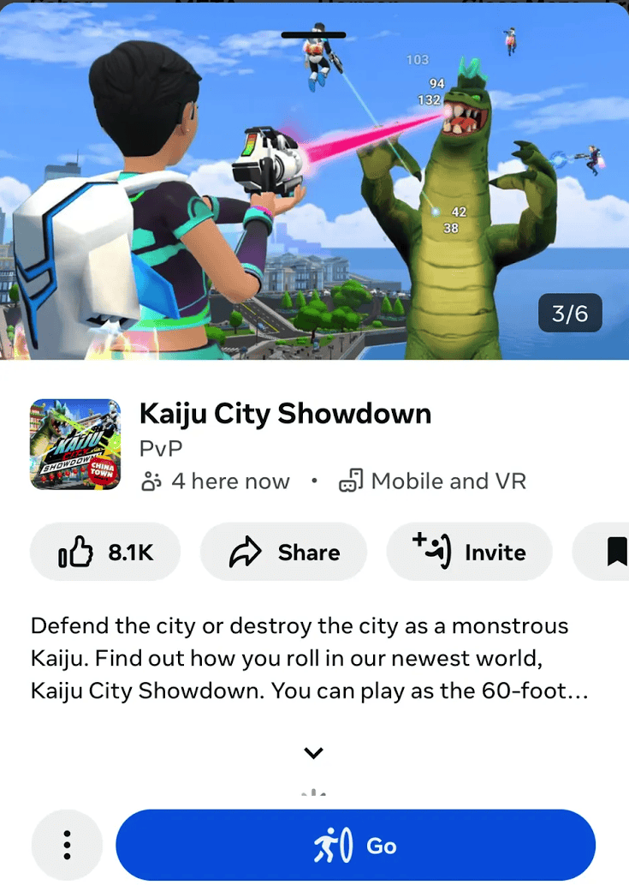

# Introduction to creating worlds for mobile

Making your worlds available on mobile and web enables users to access worlds from any device and as a result, can unlock broader reach for your published worlds on Meta Horizon Worlds.

The best way to ensure your worlds show up in discovery surfaces to reach wider audiences is to optimize worlds for mobile. Some key things to consider:

* Ensure your world’s core functionality works on mobile. You can implement device-specific functionality using Code Blocks with [per platform scripting](../VR%20tools/Scripting/Per%20Platform%20Scripting.md).
* Ensure all text in the world is legible on mobile. You can [configure the camera](TypeScript%20APIs%20for%20mobile/Camera.md), make [screen-based UI](../Desktop%20editor/Custom%20UI/Create%20a%20custom%20UI%20panel.md), or use VFX, sounds and level geometry to communicate essential information.
* Consider portrait orientation support: In order to enable portrait orientation for your world you need to [configure camera settings for different orientations](../Gizmos/Spawn%20point%20gizmo.md#mobile-camera-options) and use the [Portrait Camera API](../Scripting/API%20references%20and%20examples/Portrait%20Camera%20API.md) for orientation detection.
* Set up grabbable entities so a player’s avatar holds objects in a natural and usable way. Learn how to [create grabbable entities for web and mobile players in Meta Horizon Worlds](Grabbable%20entities/Grabbable%20Entities%20On%20Mobile%20And%20Web.md).

## Start creating worlds for mobile now

Creating worlds for mobile is the same as creating worlds for VR. You use the VR editor to build your world, adding Code Blocks and functionality as desired, and then publish the world. All published worlds in Meta Horizon Worlds are available to play in the Meta Horizon App on mobile and on [horizon.meta.com](https://horizon.meta.com/) in the browser by default.

## Testing you world on mobile and web

For more information on testing your world on mobile and web visit [Testing worlds on mobile and web](Testing%20worlds%20on%20mobile%20and%20web.md).

## Publishing your world on mobile and web

Any world you create is available on web and mobile by default. To inform mobile players of a world’s level of mobile compatibility, worlds are tagged as Unsupported, Playable or Optimized for mobile in the Meta Horizon App, and in the Horizon menu when playing on mobile.

To exclude your world from being available on mobile, or for more information on the world review and tagging process visit [Publishing worlds on mobile](Publishing%20worlds%20on%20mobile.md).