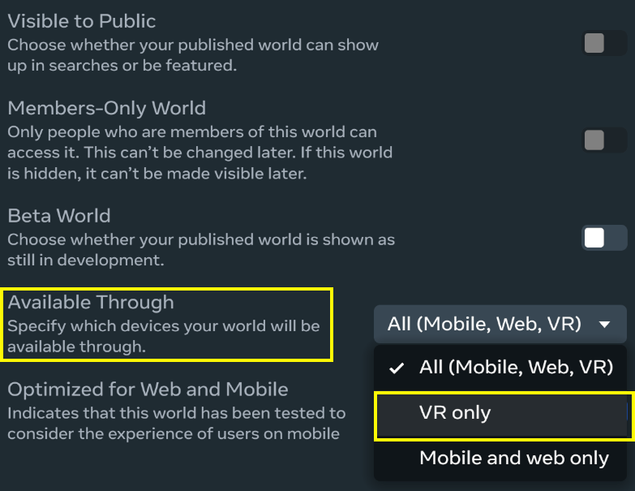
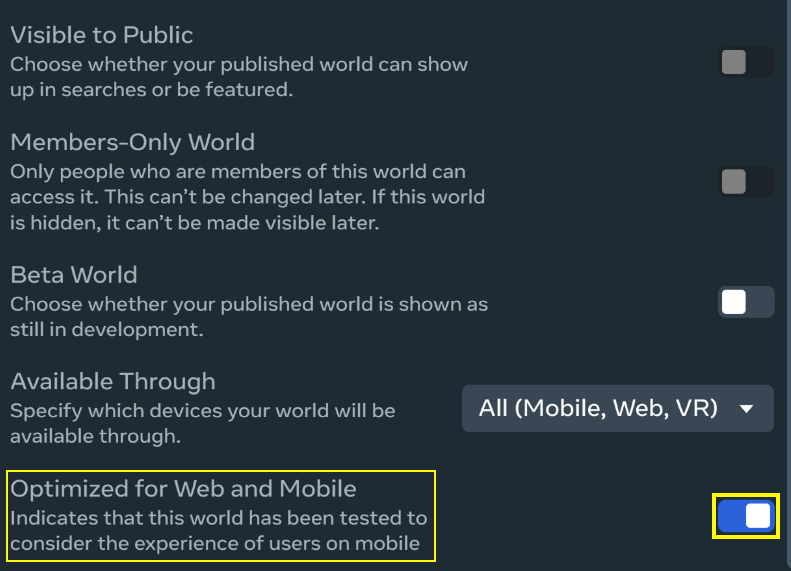
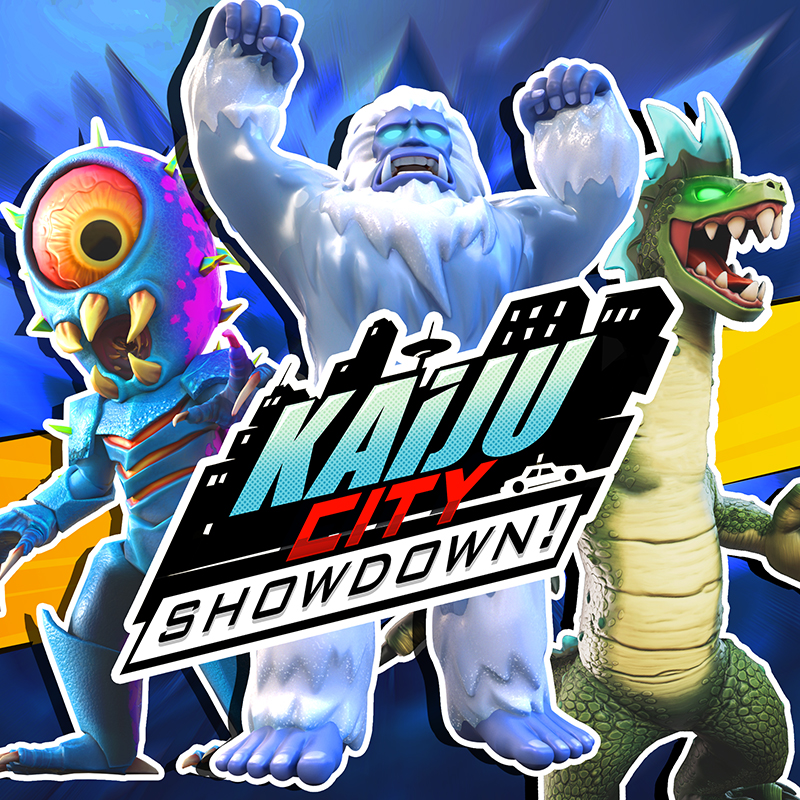
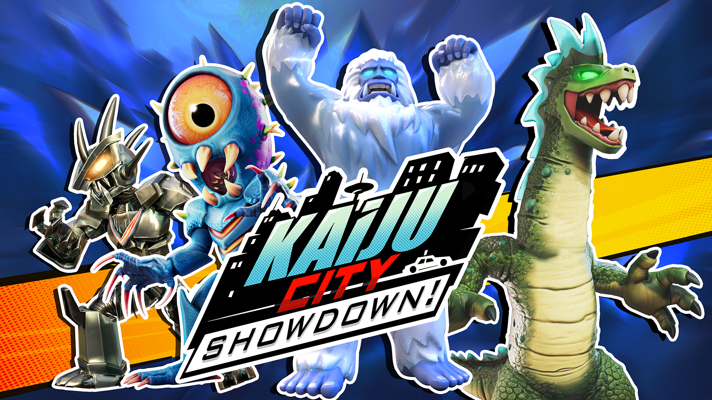
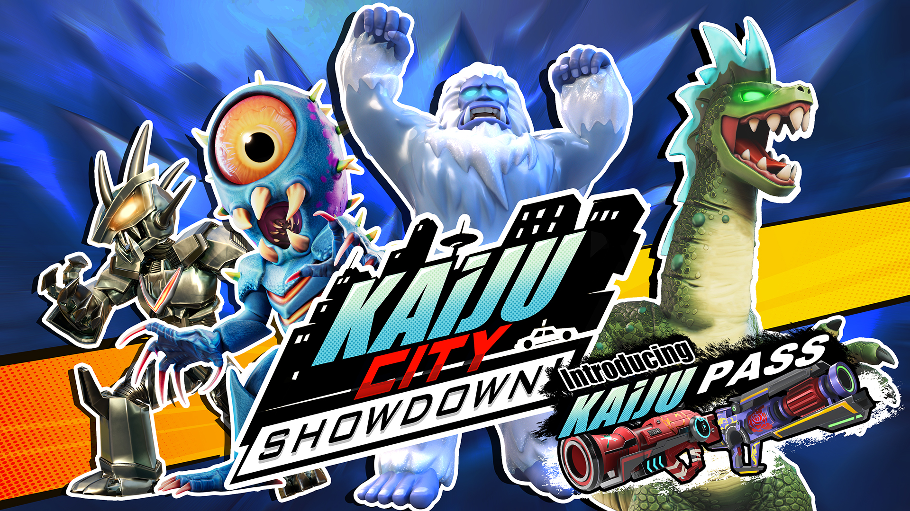
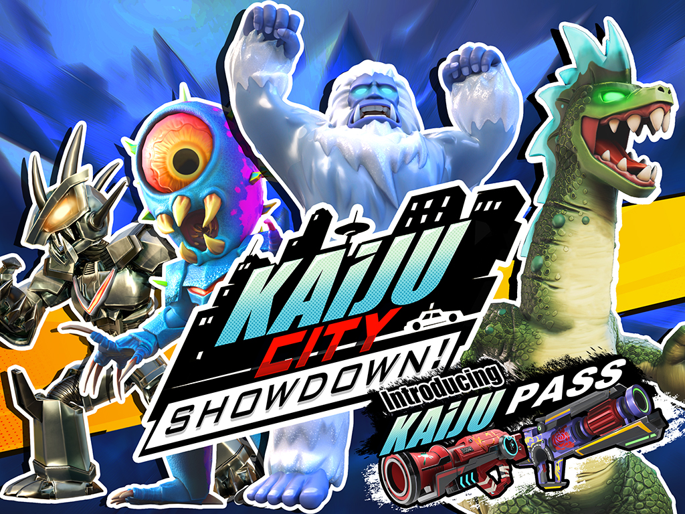
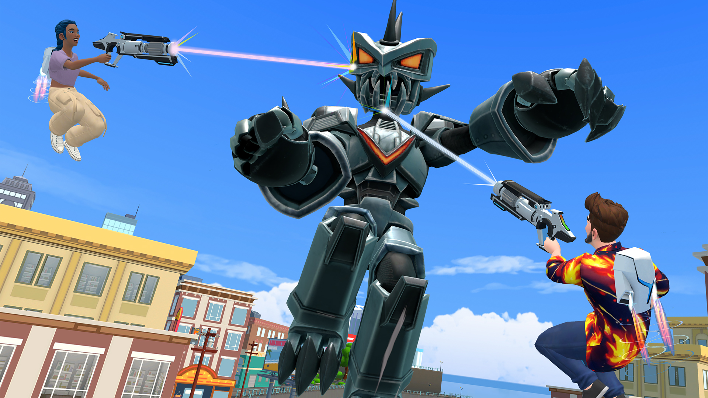

# [Publishing worlds on mobile](#publishing-worlds-on-mobile)

## [Publishing Worlds On Mobile](#publishing-worlds-on-mobile-1)

You can define whether your world is available on and supports web and mobile play by using the Publishing settings.

| Setting                          | Default State | Description                                                                                                                 |
| -------------------------------- | ------------- | --------------------------------------------------------------------------------------------------------------------------- |
| Available Through Web and Mobile | On            | Determines whether web and mobile players can visit your world. Turn this off to only allow VR players to visit your world. |
| Optimized for Web and Mobile     | Off           | Indicates that your world has been tested to consider the experience of users on mobile.                                    |

## [Making a world unavailable on web and mobile](#making-a-world-unavailable-on-web-and-mobile)

You can choose to make your world accessible to only Meta Quest players by following these steps:

1. When creating your world, open the three-dot menu and select **Publish World**.
2. From the menu, click the toggle next to **Available Through** and select **VR only**.

Changing this option affects your published version immediately. You can change this option at any time.

## [Optimizing a world for web and mobile](#optimizing-a-world-for-web-and-mobile)

If you have tested your world and are happy with how it plays on web and mobile you can choose to declare that your world is optimized for web and mobile users by follow these steps:

1. When creating your world, open the three-dot menu and select **Publish World**.
2. Navigate to the **Optimized for Web and Mobile** section and toggle it on.

Changing this option affects your published version immediately. You can change this option at any time.

## [Image Technical Specifications](#image-technical-specifications)

Images are used to promote your world. Be sure your images closely represent the experience of your world, and appeals to the relevant players. This can help to improve the number of players that visit your world.

**Note:** All images must be in .jpg format.

| Filename                                                                     | Usage                                                                                                                      | Minimum Resolution | Example Image                                                                               |
| ---------------------------------------------------------------------------- | -------------------------------------------------------------------------------------------------------------------------- | ------------------ | ------------------------------------------------------------------------------------------- |
| WORLD\_AppSquare.jpg                                                         | Used in the Meta Horizon app when listing multiple worlds                                                                  | 800x800            |  |
| WORLD\_App\_16\_9.jpg                                                        | Used in the Meta Horizon app when promoting a single world                                                                 | 1920x1080          |  |
| WORLD\_Web\_16\_9.jpg                                                        | Used on the website when showing a single world (e.g. on its world details page)                                           | 1920x1080          |  |
| WORLD\_Web\_4\_3.jpg                                                         | Used on the website when listing multiple worlds (e.g. when showing “Related worlds” on a particular world details page    | 560x420            |  |
| WORLD\_*App\_Gallery*\[X].jpg (6 images where X is 1-6 in the order desired) | Used to show in-game imagery in the world details page, helping players understand what they will experience in your world | 858x480            |  |

