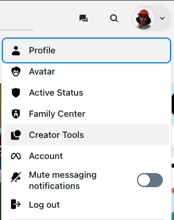
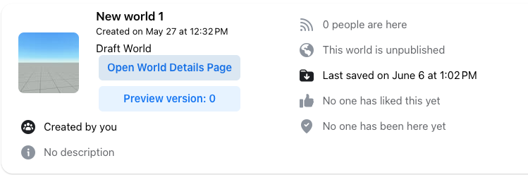
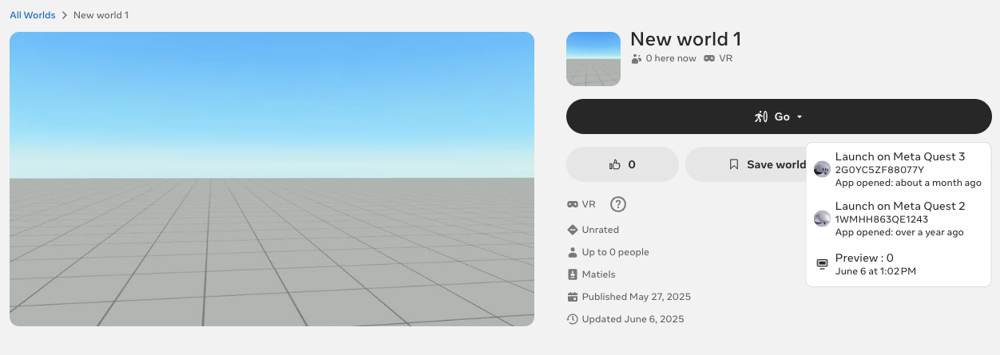
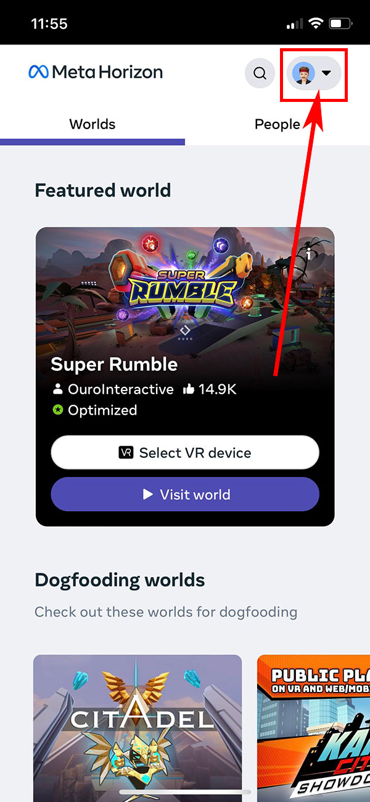
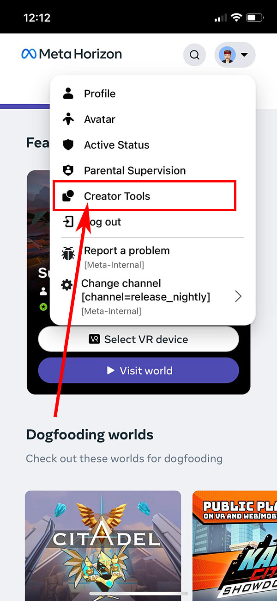
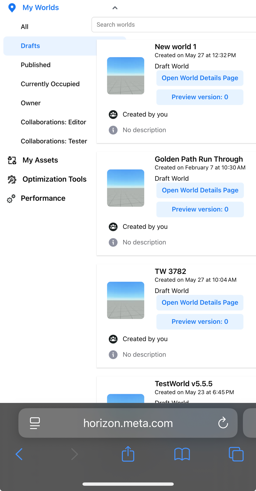
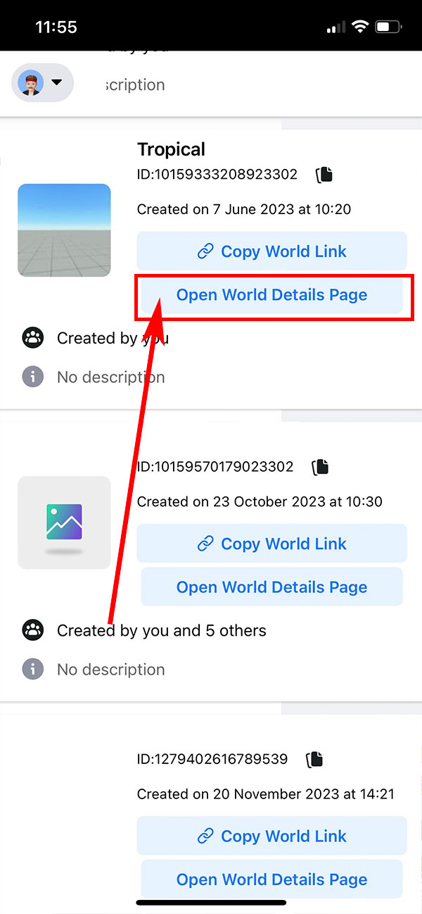
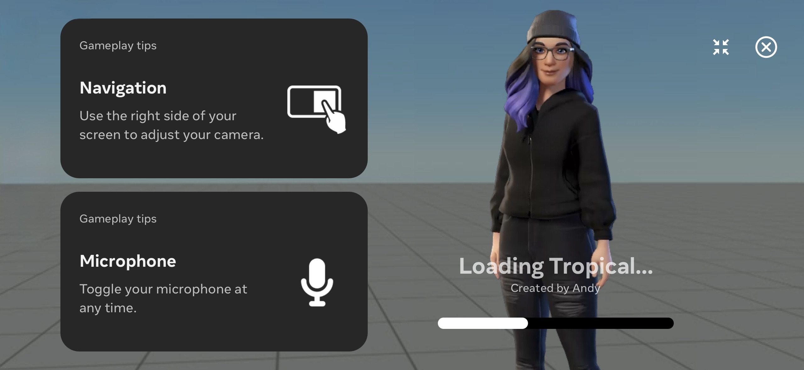

# Testing worlds on mobile and web

The best way to ensure your world offers a great experience on mobile, on web, or in headset is to test it on the appropriate devices throughout your development cycle.

> **Note**: For information on testing worlds on mobile and web while using the desktop editor, see [Preview Device](../Desktop%20editor/Get%20started%20with%20Desktop%20Editor/Preview%20mode.md#preview-device).

## Web

Web based testing allows you to quickly preview your world and test it using your mouse and keyboard as inputs.

To test your world on web:

- Navigate to the Meta Horizon webpage and select **Creator Tools** from the drop down menu on your avatar.
  
- Select **Open world details page** on the world that you want to preview.
  .
- Click **Preview** to preview the latest snapshot of your world. On your selected world’s detail page, click the **Go** button and select **Preview** from the drop down menu.
  
- After a brief load you’ll be able to preview your world via the web browser.

## Mobile

Mobile based testing allows you to quickly preview your world and test it using your mobile device as an input. You can preview unpublished or draft worlds as well as your published worlds.

To test your world on mobile:

- Navigate to horizon.meta.com in your mobile web browser (e.g. Safari on iOS, Chrome on Android) and log into your Meta Horizon Worlds account.
- Tap on your profile picture in the top right corner, and select **Creator Tools** from the dropdown menu.
  
- Select a category from the **My Worlds** dropdown menu. **All** is selected by default but you can select options like **Drafts** to view your unpublished worlds or **Published** to view your published worlds.
  
- Find the world you would like to test and select **Open world details Page** to open the world details page in the Meta Horizon app.
  
- Select **Open preview version** to travel to the world and test it on mobile.
  