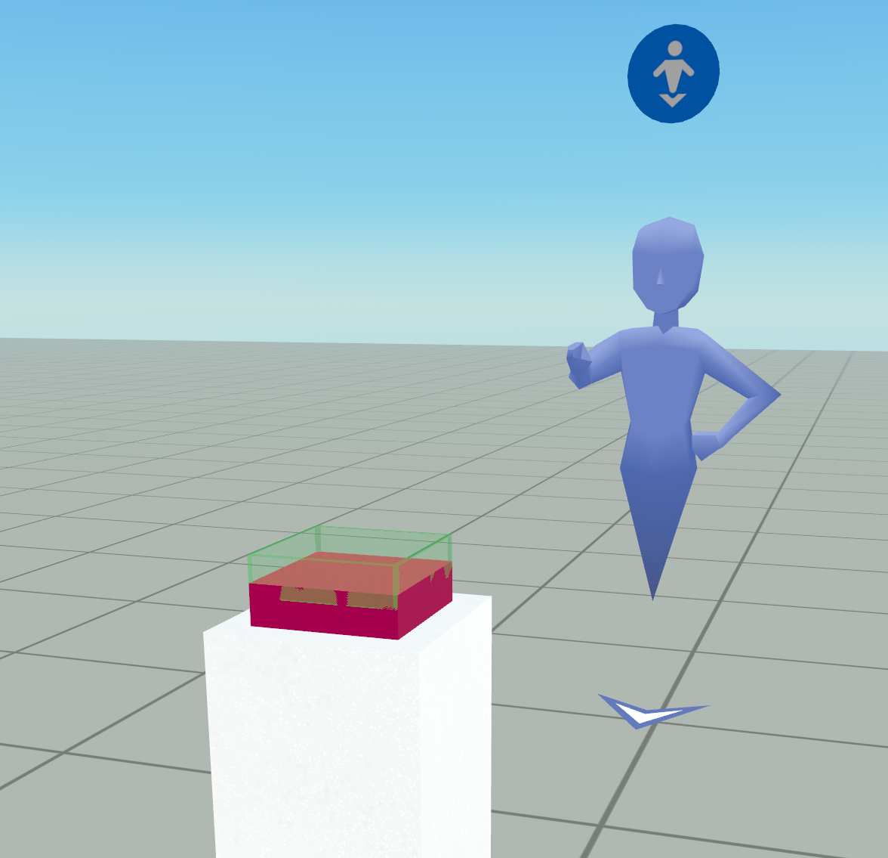
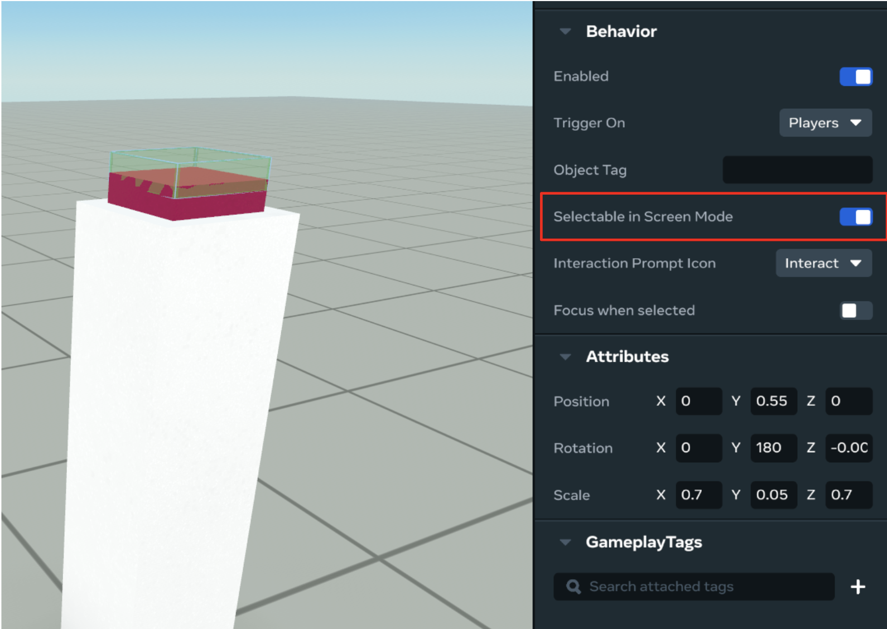
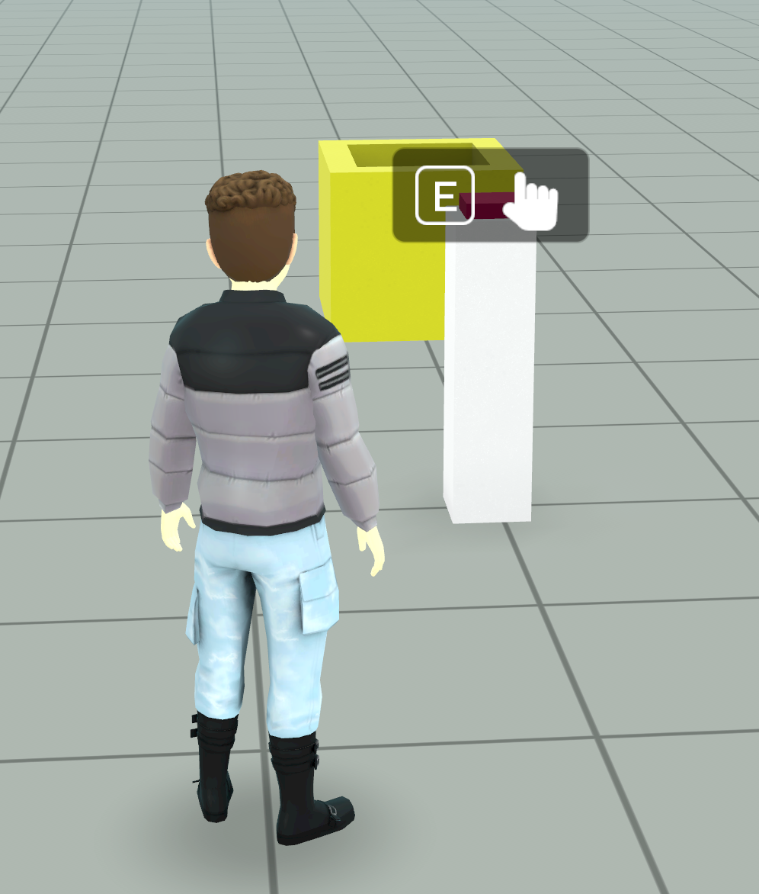
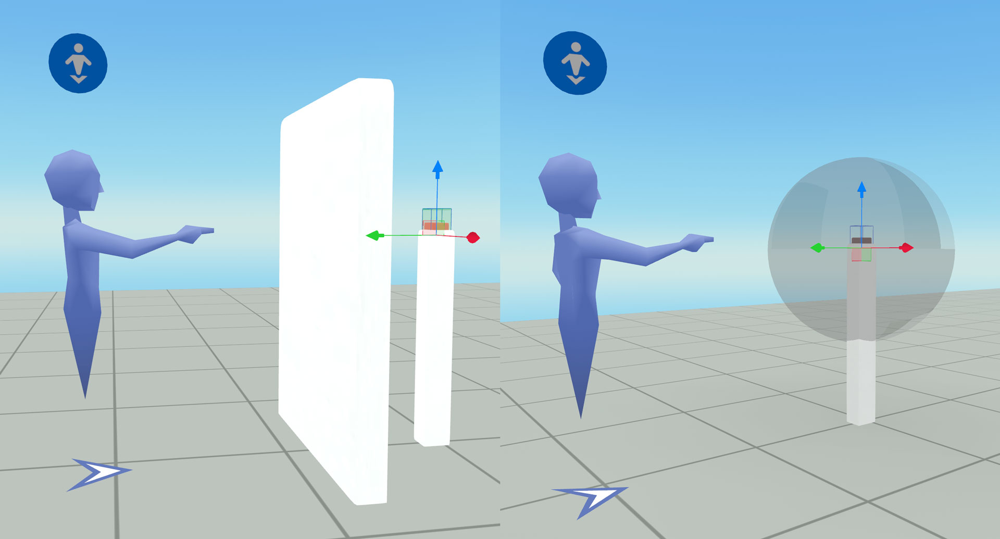
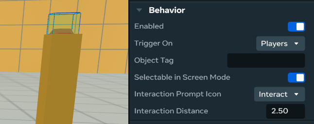

# [Push Button Interactions](#push-button-interactions)

To create pushable buttons in Meta Horizon Worlds, it’s a common practice to use a Trigger Zone just above the button. When the player puts their hand in the Trigger Zone, it causes the world to behave as if they pressed the button.

This scenario looks like this:

Since web and mobile players don’t directly control their hands, it’s difficult for them to put their avatar within the Trigger Zone (unless they jump on it). To overcome this limitation, you can enable the setting **Selectable in screen mode** on the Trigger Zone:

1. Open your creator menu and select **Gizmos**.
2. Select **Trigger Zone**.
3. Grab your Trigger Zone gizmo and move up on your right thumbstick to select **...Properties**.
4. Turn on the toggle next to **Selectable in Screen Mode**.

 This image is taken from the Desktop Editor, but the same functionality is available in the Properties panel for entities in VR build mode. The Desktop Editor is only available to creators with access to advanced tooling.

The result enables web and mobile players to look towards the Trigger Zone and press **E** on web, or tap the button on mobile, to fire the **OnPlayerEnteredTrigger** event for that Trigger Zone.

 This image is taken from the Desktop Editor, but the same functionality is available in the Properties panel for entities in VR build mode. The Desktop Editor is only available to creators with access to advanced tooling.

**Note:** If you place your **Trigger Zone** inside or behind a collidable object, the collider will prevent web and mobile users from interacting with it. When you set a trigger to **Selectable in Screen Mode**, make sure the trigger zone is bigger than the object, or turn the object’s collidability off.

## [Configurable Interaction Range](#configurable-interaction-range)

The interaction range for Trigger Zones can be configured to control how close a player must be to interact with the button. Adjusting this range allows you to fine-tune the user experience for different types of interactions and device inputs.

By increasing the interaction range, you make it easier for players—especially on web and mobile platforms—to trigger the button without needing precise positioning. Conversely, reducing the range can require more deliberate player movement, which may be desirable for certain gameplay mechanics.

The interaction range setting is available in the Properties panel of the Trigger Zone entity, allowing creators to customize the effective distance at which the OnPlayerEnteredTrigger event fires.

