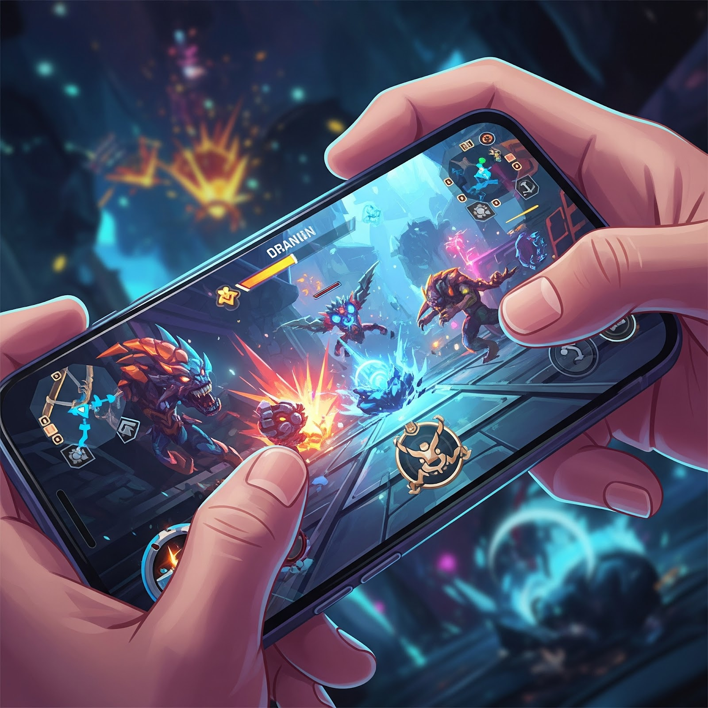
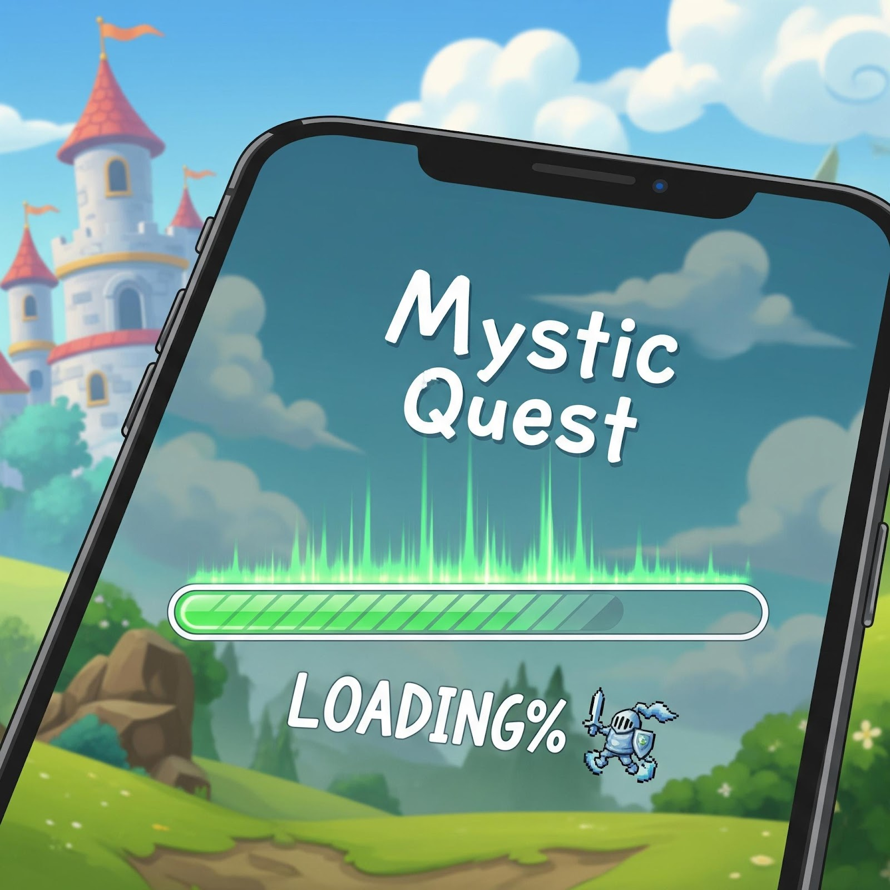

# [Top Problems and Opportunities for Horizon Worlds on Mobile](#top-problems-and-opportunities-for-horizon-worlds-on-mobile)

In the rapidly evolving landscape of mobile gaming, user experience is paramount to retaining and engaging players. As creators strive to create immersive and seamless environments, understanding and addressing mobile user pain points becomes crucial. This article highlights some of the top in-world content and usability opportunities for mobile experiences that creators can immediately take action on to retain and engage players.

# [Key Opportunities](#key-opportunities)

1. **Improve Onboarding Processes**
   1. Utilize visual cues and interactive tutorials to guide players, introducing information gradually to prevent overload.
   2. Opt for visual cues, non-playable character (NPC) guidance, and other interactive tutorials over text-heavy instruction boards to more effectively engage players.
   3. Offer clear signals to players when they perform actions correctly, reinforcing their learning and boosting confidence.
   4. Make it easy for players to feel the vibe and find the fun. While VR users may be willing to explore a bit to figure out what a world is about (and are likely to have sound on so that they can hear laughter in the distance) mobile players are likely to exit if they can’t quickly see value in a world. Make sure that players spawn in a location that showcases what your world has to offer.
2. **Optimize Progression Systems**
   1. Design comprehensive rewards that encourage player engagement by balancing longer-term goals (e.g., expansion, optimization), with frequent short-term wins (e.g., task completion) that are visible and celebrated.
   2. Use clear advancement markers to guide players through content and clearly communicate their progression.
   3. Mobile players are accustomed to Daily check-ins. Ensure there is progress that can be made every day and consider giving users daily rewards or themes to keep players engaged.
3. **Optimize Events for Mobile Engagement**
   1. Design event spaces with mobile users in mind, focusing on audio clarity and interactive elements to enhance engagement.
   2. De-emphasize video viewing as the primary activity as small mobile screens do not provide the most engaging or unique experience.
4. **Enhance Communication Methods**
   1. Facilitate in-game chat with robust text options and other nonverbal communication options like custom emotes, animations, and wearables to enhance player interaction.
   2. Harness simple mechanics that let players engage with others without the need to talk (e.g., trading, voting, going to a location to indicate a preference, collaborating by standing near each other)
   3. Implement social features to encourage community building such as leaderboards, co-op social games that don’t require controls, clear in-game event signage, and ways for players to signal if they’re open to playing with others.
5. **Leverage Popular Stories and Themes**
   1. Integrate recognizable stories. Opportunities to roleplay favorite characters or re-enact and riff on familiar stories can help players who are new to a space immediately understand how to engage.
   2. Balance creativity with brand authenticity to maintain player interest.
6. **Deepen Game Narratives**
   1. Add depth to your experience by adding story elements, additional opportunities for customization (e.g., spaces within the world, avatars, pets, other items) and character growth.
   2. Utilize character development to foster emotional connections.
   3. Develop rich storylines that resonate with players.
7. **Improve Input Usability**
   1. Ensure UI elements are intuitive and clearly communicate their functions.
   2. Leverage flat or 2D controls as a complement to 3D locomotion.
   3. Consider implementing customizable inputs and controls if it makes sense for the game
8. **Enhance Movement Feedback**
   1. Improve visual indicators for movement to enhance the feeling of responsiveness for players.
   2. Explore adding more haptic feedback when players jump so players feel like they have more “weight” and don’t “float” through space.
   3. Refine “aim assist” tools so players can move around spaces with more ease.
   4. Consider prioritizing other controls such as tuning camera position, tether, and sensitivity of other controls so players don’t accidentally set off the controls.
9. **Improve Text Readability**
   1. Use larger text and contrasting colors to improve readability and visibility on smaller screens.
   2. Keep in mind accessibility with dyslexia-friendly fonts and color-blind friendly combinations throughout your UIs
10. **Reduce Lag and Load Times**
    1. Reduce loading times (<5s) when possible by optimizing game assets to ensure faster loading.
    2. Enhance load screens with engaging content and tips to retain user interest
    3. Leverage smooth animations to make the wait feel intentional.

By focusing on these core opportunities, creators can significantly enhance the mobile gaming experience for Horizon players. Creating intuitive and accessible mobile gameplay will ensure a rewarding experience that appeals to a diverse audience. Through the strategies provided, creators are equipped to overcome common challenges and foster deeper player engagement.

