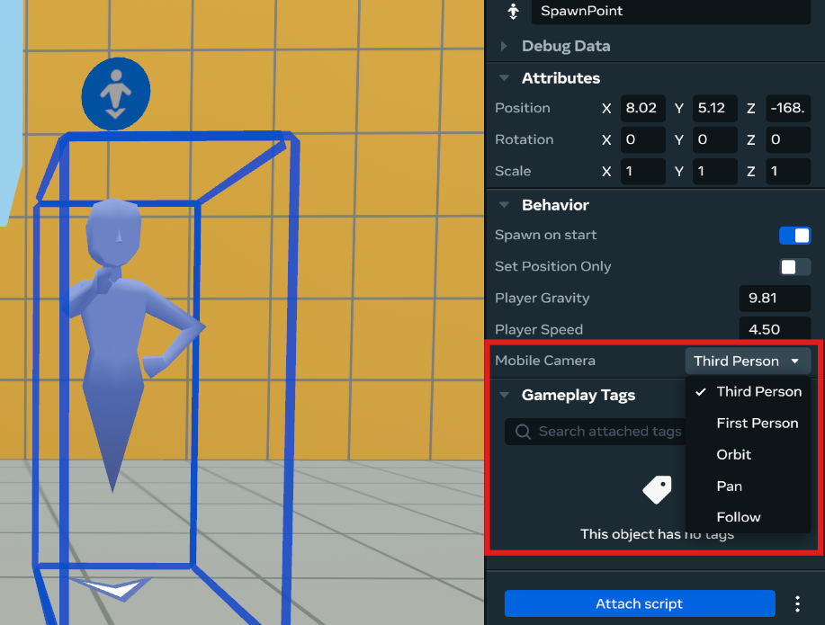
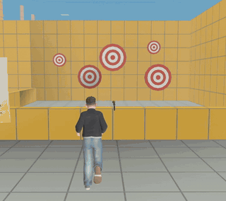
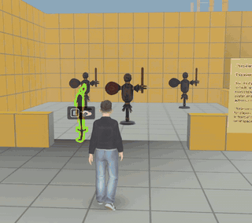
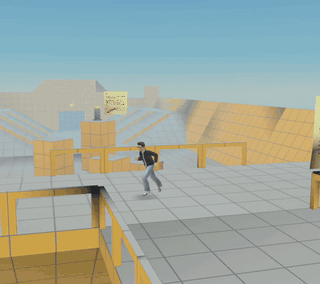
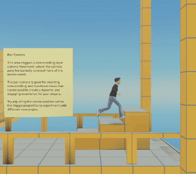
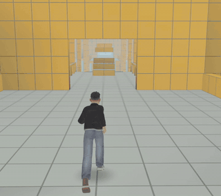
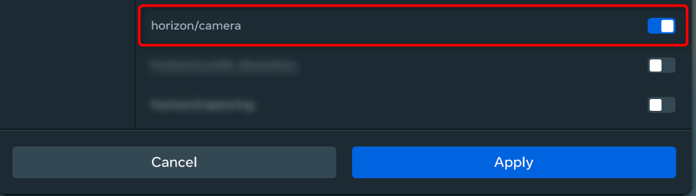
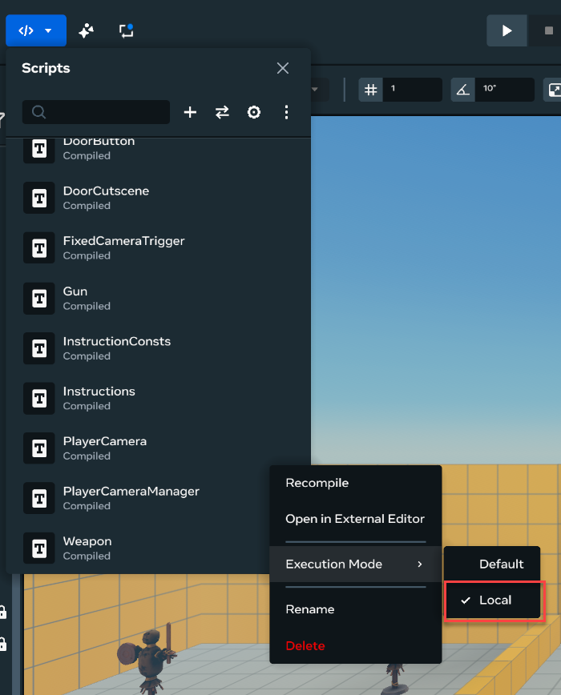

# [Camera](#camera)

This article covers how to set up and control camera perspectives for web and mobile players using both **spawn point configuration** and the **Camera API** via TypeScript.

## [Setting camera mode via spawn point](#setting-camera-mode-via-spawn-point)

The spawn point can be configured to control the player’s camera and modify its behavior when they enter your world.

To set the player’s camera, select the spawn point and use the **Mobile Camera** drop-down in the object properties window.



> [!Note]
>
> This image shows the Desktop Editor. The same functionality is available in the Properties panel for entities in VR build mode.

### [To change the camera perspective:](#to-change-the-camera-perspective)

1. Open your creator menu and select **Gizmos**.
2. Select **SpawnPoint**.
3. Grab your new SpawnPoint gizmo and move up on your right thumbstick to select **...Properties**.
4. Select the dropdown you want to use next to **Mobile Camera**.

### [Available camera modes](#available-camera-modes)

The Mobile Camera dropdown offers the following camera modes. You can also control each mode programmatically via the Camera API (see [Camera Control with the Camera API](Camera.md#camera-control-with-the-camera-api) section below).

| Camera Mode      | Description                                                                                                                                              | Spawn Point Customization Options                                                                                                                                                                                                                                                                                                                                                                                                                                                                                 | Example                                                                                                   |
| ---------------- | -------------------------------------------------------------------------------------------------------------------------------------------------------- | ----------------------------------------------------------------------------------------------------------------------------------------------------------------------------------------------------------------------------------------------------------------------------------------------------------------------------------------------------------------------------------------------------------------------------------------------------------------------------------------------------------------- | --------------------------------------------------------------------------------------------------------- |
| **None**         | Default setting with standard camera behavior.                                                                                                           | None                                                                                                                                                                                                                                                                                                                                                                                                                                                                                                              |                                                                                                           |
| **First Person** | The camera is from the player’s point-of-view.                                                                                                           | None                                                                                                                                                                                                                                                                                                                                                                                                                                                                                                              |   |
| **Third Person** | The camera follows the player from behind.                                                                                                               | None                                                                                                                                                                                                                                                                                                                                                                                                                                                                                                              |   |
| **Orbit**        | The camera dynamically follows the player, but is not fixed behind them.                                                                                 | **Camera distance:** The distance between the camera and the player.                                                                                                                                                                                                                                                                                                                                                                                                                                              |   |
| **Pan**          | The camera follows the player at a fixed position adjacent to the player, ensuring the camera angle and distance remain constant.                        | **Camera offset:** Set the camera’s position relative to the player using a vector with X, Y, and Z parameters.                                                                                                                                                                                                                                                                                                                                                                                                   |     |
| **Follow**       | The camera tracks player movements without being fixed behind them. During movement, the camera automatically rotates to align itself behind the player. | **Camera Auto Follow Delay:** The delay before auto-turning is enabled after the camera stops being manually rotated. **Enable Continuous Rotation:** When true, the camera continuously rotates to stay behind the player after movement, unless manually interrupted by player interaction. **Horizon Levelling:** Enables levelling the camera to the horizon. **Rotation Rate:** The rate at which the camera rotates back behind the player when they are moving. Lower numbers mean slower camera movement. |  |

## [Camera control with the Camera API](#camera-control-with-the-camera-api)

Use the Camera API to change camera modes and properties via TypeScript in real-time.

**Important notes:**

- All Camera API methods have no effect in VR, where first person is always enabled
- Any script that manipulates the player’s camera must be executed in Local mode
- All camera mode changes can include smooth transitions with customizable duration and easing

### [Prerequisites](#prerequisites)

Before using the Camera API, you need to:

1. **Enable the Camera API module:**
   - Open the **Scripts** dropdown
   - Click the **Settings** icon 
   - Enable **horizon/camera**
2. **Set Local execution mode:**
   - Set your script to execute in Local mode 

### [Camera transitions](#camera-transitions)

All camera mode changes support smooth transitions. You can specify transition properties to ease the movement between camera modes:

```typescript
import LocalCamera, {CameraTransitionOptions, Easing} from 'horizon/camera';

// Example transition options
const transitionOptions = {
  duration: 0.5,
  easing: Easing.EaseInOut,
};
```

### [Basic import statement](#basic-import-statement)

```typescript
import LocalCamera from 'horizon/camera';
```

## [Set the first person camera mode](#set-the-first-person-camera-mode)

```typescript
LocalCamera.setCameraModeFirstPerson();

// With transition
LocalCamera.setCameraModeFirstPerson({
  duration: 0.5,
  easing: Easing.EaseInOut,
});
```

## [Set the third person camera mode](#set-the-third-person-camera-mode)

```typescript
LocalCamera.setCameraModeThirdPerson();

// With transition
LocalCamera.setCameraModeThirdPerson({
  duration: 0.5,
  easing: Easing.EaseInOut,
});
```

## [Set the fixed camera mode](#set-the-fixed-camera-mode)

Set the camera to a fixed world position and rotation. Calling this API without parameters fixes the camera at its current position and orientation.

```typescript
LocalCamera.setCameraModeFixed();

// With specific position and rotation
LocalCamera.setCameraModeFixed({
  position: new hz.Vec3(0, 1, -5),
  rotation: hz.Quaternion.fromEuler(new hz.Vec3(0, 0, 0)),
  duration: 0.5,
  easing: Easing.EaseInOut,
});
```

## [Set the attached camera mode](#set-the-attached-camera-mode)

Attach the camera to a target entity to automatically follow its position and rotation. When the target entity is destroyed, camera tracking stops and the camera remains at its last position.

```typescript
LocalCamera.setCameraModeAttach(targetEntity);

// With offset and speeds
LocalCamera.setCameraModeAttach(targetEntity, {
  positionOffset: new hz.Vec3(0, 0, -5),
  translationSpeed: 1,
  rotationSpeed: 1,
  duration: 0.5,
  easing: Easing.EaseInOut,
});
```

## [Set the pan camera mode](#set-the-pan-camera-mode)

Set the camera to pan adjacent to the avatar at a fixed vector from the avatar.

```typescript
LocalCamera.setCameraModePan({
  positionOffset: new hz.Vec3(25, 0, 0),
  translationSpeed: 1,
});
```

## [Set the follow camera mode](#set-the-follow-camera-mode)

Follow camera mode is similar to orbit camera mode - the camera direction is not tied to the avatar’s facing direction. However, follow camera can automatically rotate back behind the avatar as the player moves.

```typescript
LocalCamera.setCameraModeFollow();

// With configuration options (showing default values)
LocalCamera.setCameraModeFollow({
  activationDelay: 2.0, // The delay before auto-turning is enabled after the camera has been manually turned.
  cameraTurnSpeed: 1.0, // Modifier for the speed at which the camera turns to return behind the player avatar.
  continuousRotation: false, // Enable the camera to continually rotate behind the player once rotation starts, uninterrupted, rather than only rotating while the player moves.
  distance: 5.0, // The distance from the target to the camera. If not set, the camera remains at its current distance.
  horizonLevelling: false, // Enables levelling the camera to the horizon.
  rotationSpeed: 0.0, // Controls how quickly the camera moves with the player's avatar. Lower numbers mean slower camera movement. If not set, the camera snaps to the position offset from the target.
  translationSpeed: 0.0, // Controls how quickly the camera moves with the player's avatar. Lower numbers mean slower camera movement. If not set, the camera snaps to the target position.
  verticalOffset: 0.0, // Vertical offset up from the target position. The camera continues to look at the player's avatar.
});
```

## [Set the camera field of view](#set-the-camera-field-of-view)

```typescript
LocalCamera.overrideCameraFOV(72.5);

// With transition
LocalCamera.overrideCameraFOV(72.5, {duration: 0.5, easing: Easing.EaseInOut});
```

## [Adjust the camera roll](#adjust-the-camera-roll)

Adjust the tilt of the camera on the Z-axis, also known as the camera roll.

```typescript
LocalCamera.setCameraRollWithOptions(30);

// With transition
LocalCamera.setCameraRollWithOptions(30, {
  duration: 0.5,
  easing: Easing.EaseInOut,
});
```

## [Get the camera look at position](#get-the-camera-look-at-position)

The Camera API gets the world position that the player is currently looking at, ignoring the local player’s avatar.

```typescript
import LocalCamera from 'horizon/camera';

let cameraLookAtPos = LocalCamera.lookAtPosition.get();
```

## [Enable and disable camera collisions](#enable-and-disable-camera-collisions)

You can use the Local Camera API to enable and disable camera collision. Camera collision gives the camera a physical presence in the world, which means it won’t clip into world geometry, and it won’t see through walls. Instead, the camera is moved closer to the avatar.

Small spaces can cause the camera to move very close to the avatar, making navigation difficult. If your world includes many small spaces, consider:

- Disabling camera collision
- Switching to [first-person camera mode](Camera.md#how-to-set-the-first-person-camera-mode)
- Enabling [perspective switching](Camera.md#how-to-enable-and-disable-perspective-switching)

```typescript
import LocalCamera from 'horizon/camera';

LocalCamera.collisionEnabled.set(true);
```

## [Enable and disable perspective switching](#enable-and-disable-perspective-switching)

The Camera API controls whether the player can toggle between first and third person modes using **PageUp** and **PageDown**. This does not affect your ability to force first and third person mode via the APIs. This has no effect in VR, where first person is always enabled.

```typescript
import LocalCamera from 'horizon/camera';

LocalCamera.perspectiveSwitchingEnabled.set(false);
```

## [Modify the camera’s behavior at runtime](#modify-the-cameras-behavior-at-runtime)

You can change the options that define camera configuration during gameplay. The available options to configure are:

| Camera Mode   | Options                                                                                                                    |
| ------------- | -------------------------------------------------------------------------------------------------------------------------- |
| Fixed Camera  | position rotation                                                                                                          |
| Attach Camera | positionOffset rotationOffset translationSpeed rotationSpeed target                                                        |
| Pan Camera    | positionOffset translationSpeed                                                                                            |
| Orbit Camera  | distance verticalOffset translationSpeed rotationSpeed                                                                     |
| Follow Camera | activationDelay cameraTurnSpeed continuousRotation distance horizonLevelling rotationSpeed translationSpeed verticalOffset |

To configure camera behavior at runtime, the Camera API gets the camera’s current mode as an object, then modifies the parameters of that object. You must specify which camera mode you expect to get in the function call:

```typescript
LocalCamera.getCameraModeObjectAs(AttachCameraMode)?.rotationSpeed.set(10);
```

If the specified camera mode differs from the current camera mode, this function returns null.

```typescript
LocalCamera.setCameraModeFollow();
const cameraMode = LocalCamera.getCameraModeObjectAs(AttachCameraMode); // returns null
```

## [Portrait orientation support](#portrait-orientation-support)

For advanced orientation-based camera control and detection, you can use the experimental **Portrait Camera API**. This allows you to:

- Detect when players are viewing your world in portrait vs landscape orientation.
- Create different camera behaviors for each orientation.

For comprehensive documentation and examples, see [Portrait Camera API](../../Scripting/API%20references%20and%20examples/Portrait%20Camera%20API.md).

You can also configure orientation-specific camera parameters directly in the [spawn point gizmo’s Mobile Camera Options](../../Gizmos/Spawn%20point%20gizmo.md#mobile-camera-options) without scripting.

## [Related documentation](#related-documentation)

- [Portrait Camera API](../../Scripting/API%20references%20and%20examples/Portrait%20Camera%20API.md) - Experimental API for orientation detection and control
- [Spawn Point Gizmo - Mobile Camera Options](../../Gizmos/Spawn%20point%20gizmo.md#mobile-camera-options) - Configure camera settings for different orientations
- [Preview Mode - Setting the Preview Device](../../Desktop%20editor/Get%20started%20with%20Desktop%20Editor/Preview%20mode.md#setting-the-preview-device) - Test camera behavior in different orientations

