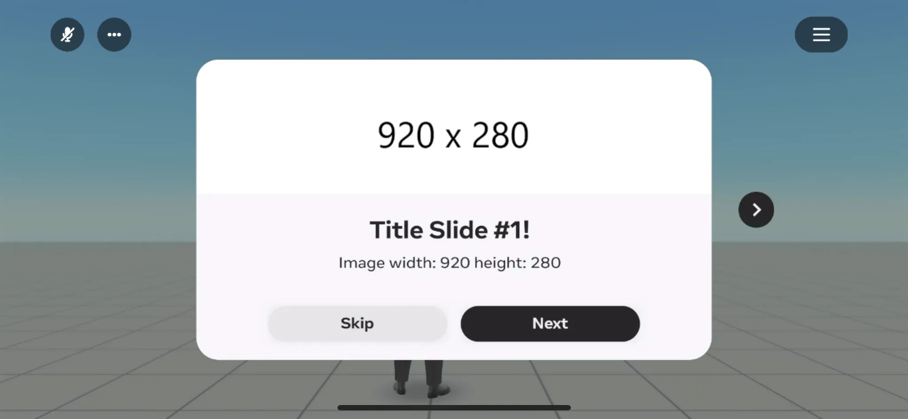
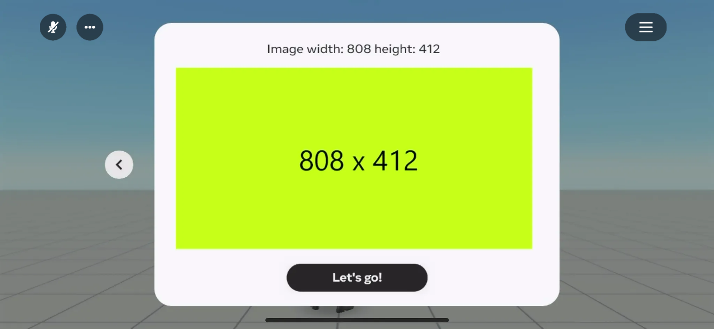
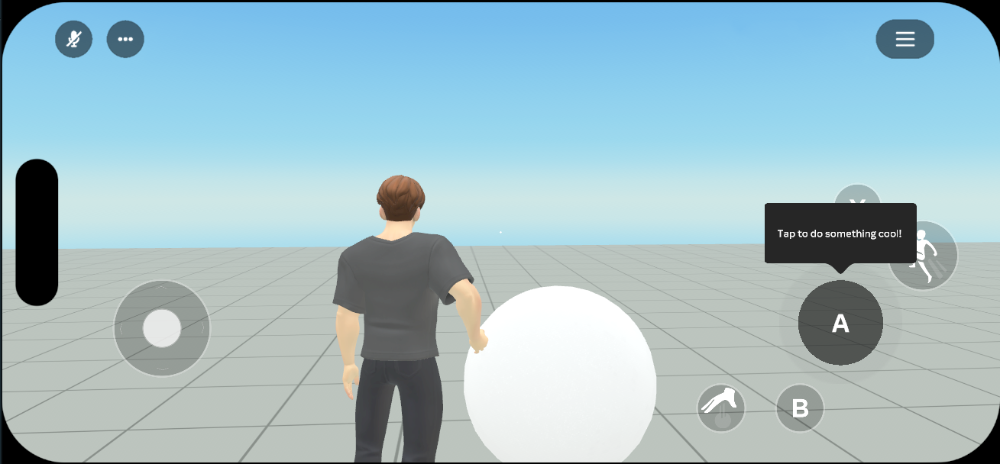
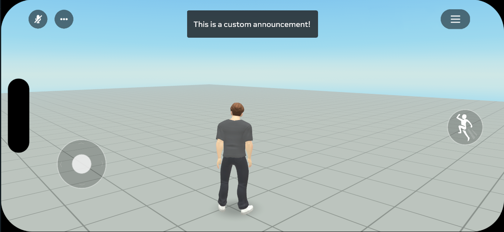

# [Custom tutorial scripting](#custom-tutorial-scripting)

## [Overview](#overview)

The Custom Tutorial Scripting API allows developers to create custom tutorials for their worlds, providing a seamless and engaging onboarding experience for new visitors to your world. It offers a set of APIs that can be used to create and manage tutorials, including the ability to show info slides, trigger contol button prompts or tooltips and show a generic “toast” notification.

## [Tutorial APIs](#tutorial-apis)

- [showInfoSlides](Custom%20tutorial%20scripting.md#showinfoslides-api)
- [showInputActionMessage](Custom%20tutorial%20scripting.md#showinputactionmessage-api)
- [showToastMessage](Custom%20tutorial%20scripting.md#showtoastmessage-api)

## [showInfoSlides API](#showinfoslides-api)

The ‘ShowInfo’ API allows developers to convey information to users via a series of connected modal windows, greatly enhancing the onboarding experience in your world. It can be used to display welcome messages, provide critical updates, or deliver important instructions, ensuring users are well-informed about key aspects or new features in your world.

Each info slide can have a localizable title, message, and image. The image is a texture asset with either (width: 808 height: 412) size or (width: 920 height: 280) size in case it’s a header image. To add an image and get the image URI please follow [instructions](../Grabbable%20entities/Custom%20Action%20Button%20Icons.md#uploading-a-custom-texture). The image will be scaled to fit the panel size. The title and message are localizable strings that can be translated into different languages.

### [Example](#example)

The following example shows how to use the showInfoSlides API.

For more details on the showInfoSlides API, check out our API documentation [here](https://horizon.meta.com/resources/scripting-api/core.player.showinfoslides.md/?api_version=2.0.0).



```typescript
player.showInfoSlides([
  {
    title: 'Title Slide #1!',
    message: 'Image width: 920 height: 280',
    imageUri: 'YOUR_TEXTURE_ASSET_ID',
    style: {
      attachImageToHeader: true,
    },
  },
  {
    title: '',
    message: 'Image width: 808 height: 412',
    imageUri: 'YOUR_TEXTURE_ASSET_ID',
  },
]);
```

## [showInputActionMessage API](#showinputactionmessage-api)

The `showInputActionMessage` API enables developers to trigger an attention-grabbing animation and display a message above an on-screen button for a specified [player input action](https://horizon.meta.com/resources/scripting-api/core.playerinputaction.md/?api_version=2.0.0). This is particularly useful for button tooltips in timed action prompts and tutorials.

More details about the API can be found [here](https://horizon.meta.com/resources/scripting-api/core.player.showinputactionmessage.md/?api_version=2.0.0)

### [Example](#example-1)



```typescript
player.showInputActionMessage(
  PlayerInputAction.Jump,
  'Tap to do something cool!',
  5000, // duration in ms
);
```

## [showToastMessage API](#showtoastmessage-api)

The `showToastMessage` API allows you to show a generic toast message notification at the top of the screen. The toast message can be used to display a message to the player, such as an alert, notification, or helpful onboarding message. The toast message is displayed for a set duration and then it disappears.

More details about the API can be found [here](https://horizon.meta.com/resources/scripting-api/core.player.showtoastmessage.md/?api_version=2.0.0)

### [Example](#example-2)



```typescript
player.showToastMessage(
  'This is a custom announcement!',
  5000, // duration in ms
);
```

