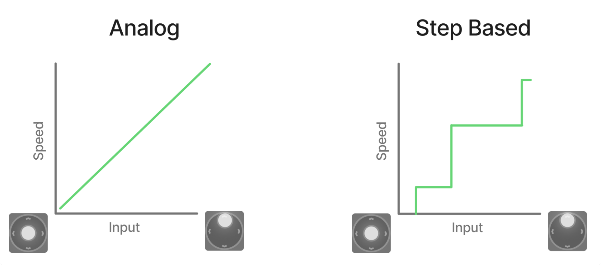
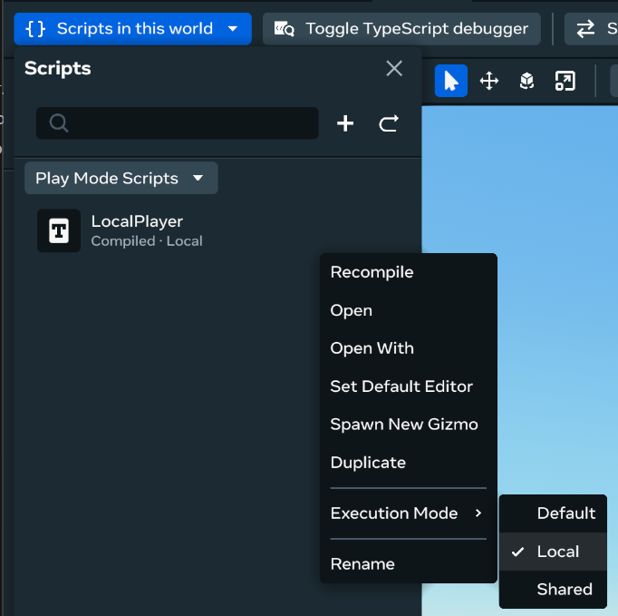
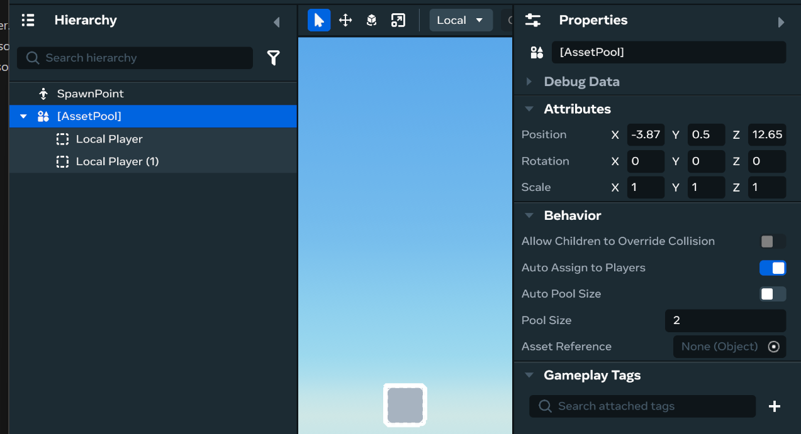

# [Mobile Input Styles](#mobile-input-styles)

Joystick step-input replaces traditional analog controls with discrete speed bands. This movement control system provides predictable, intentional, and responsive control for mobile players in Horizon Worlds.



## [Why Step-Input is Important for Mobile Worlds](#why-step-input-is-important-for-mobile-worlds)

Mobile experiences in Horizon Worlds face latency challenges that make traditional analog controls feel unresponsive. Step-input addresses these issues:

**Latency Mitigation:**

- Streaming and network latency make traditional analog movement difficult to control at your target speed.
- Step-input provides near-immediate feedback that feels snappy and predictable, even with variable network conditions.

## [Step-by-Step Implementation Guide](#step-by-step-implementation-guide)

Add step-input controls to your Horizon World:

### [Step 1: Create a Local Player script](#step-1-create-a-local-player-script)

1. Open the **Scripts** tab.
2. Press **+** to create a new script named **Local Player**.
3. Click the 3 dots to open the menu.
4. Hover over **Execution Mode >**.
5. Select **Local**.



### [Step 2: Setup an Asset Pool](#step-2-setup-an-asset-pool)

1. Navigate to the **Build** tab.
2. Select **Other** to open the **Other tools** menu.
3. Search for **Asset Pool**.
4. Drag **Asset Pool** into your scene.
5. In the **Asset Pool** properties, disable **Auto Pool Size**.
6. Create an **Empty Object** named **Local Player**.
7. Assign the **Local Player** script to this object.
8. Move **Local Player** as a child of **Asset Pool**.
9. Duplicate **Local Player** for the maximum number of players in your scene.



> [!Note]
>
> The Asset Pool assigns Local Player objects to players as they join.

### [Step 3: Update the Local Player script](#step-3-update-the-local-player-script)

1. Edit the **Local Player** script.
2. Replace with the following code:

```typescript
import * as hz from 'horizon/core';

class LocalPlayer extends hz.Component<typeof LocalPlayer> {
  static propsDefinition = {};

  // Called on world start and when entity ownership changes
  start() {
    // Make sure we are running on a local player
    if (this.entity.owner.get().id == this.world.getServerPlayer().id) {
      // This is the server player, so we don't need to do anything
      return;
    }

    var player = new Player(this.entity.owner.get().id);
    // Set the mobile input style to comfortable
    player?.setMobileInputStyleComfortable();
  }
}
hz.Component.register(LocalPlayer);
```

Your world now sets all mobile players to use the Comfortable sprint style of Mobile Input.

## [Configuration and Customization Options](#configuration-and-customization-options)

Customize Mobile Input Styles using these API calls:

| Method                            | Description                                                                                                         |
| --------------------------------- | ------------------------------------------------------------------------------------------------------------------- |
| `setMobileInputStyleDefault`      | Returns the player to the default analog style.                                                                     |
| `setMobileInputStyleComfortable`  | Sets the step-input style with default thresholds. Thresholds can be overridden to allow fine tuning for the world. |
| `setMobileInputStyleAlwaysSprint` | Makes the player sprint with very small input values.                                                               |

## [Best Practices](#best-practices)

### [Customization](#customization)

- The default thresholds do not generally need to be changed.
- If you change thresholds, keep a dead-zone of at least 0.05 for threshold1.
- Use the `AlwaysSprint` style for fast paced action games (like Super Strike).

### [Optimize for Your Game Type and Play Space](#optimize-for-your-game-type-and-play-space)

- Horizon’s default `locomotionSpeed` value is best for medium to large play spaces (e.g., Horizon Central).
- Use a lower locomotion speed if your game mostly navigates smaller spaces (e.g., Pizza Kitchen; Fire & Rescue).
  - For smaller worlds, consider disabling sprint by setting `Player.SprintMultiplier` to 1.
- If you want to use only one speed (like Super Strike), make all moveSpeeds equal.

### [Platform Considerations](#platform-considerations)

- Step-input **only benefits mobile** players streaming your world.
- **VR players** retain standard movement controls.
- Use the **Preview** tab to set a mobile device type and preview changes with an on-screen virtual joystick.

