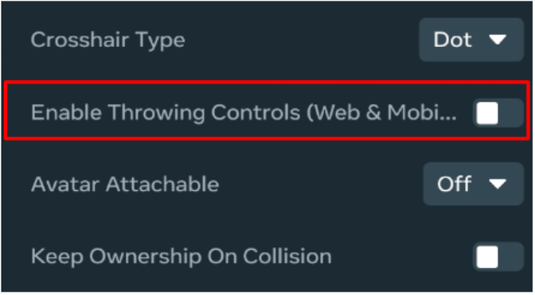

# [Throwing](#throwing)

A grabbable object that is being held by a player can be thrown with the standard controls for throwing grabbable objects on web and mobile (enabled by default). It is possible to override these standard controls in order to trigger throwing of a held object and to customize the throwing arc.

To disable the standard throwing controls you can set Enable Throwing Controls (Web & Mobile) to off:



The [Player.throwHeldItem method](../../Reference/core/Classes/Player.md#throwhelditem) is used to throw an object. When calling this method, the [ThrowOptions type](../../Reference/core/Type%20Aliases/ThrowOptions.md) defines the properties for customizing how an object is thrown. The default values are defined by the [DefaultThrowOptions variable](../../Reference/core/Variables/DefaultThrowOptions.md).

Here’s an example that makes the player throw an object when they press the primary button on web and mobile.

```typescript
this.connectCodeBlockEvent(this.entity, hz.CodeBlockEvents.OnIndexTriggerDown, (player: hz.Player)=> {

  // Ignore on VR devices

  if (player.deviceType.get() == hz.PlayerDeviceType.VR) {

    return;

  }


  // Setup the throw options

  let opt = {

    speed: 25,

    pitch: 30

  }


  // Calling Throw Held Item

  player.throwHeldItem(opt);


}
```

