# [Designing a performant world](#designing-a-performant-world)

This document provides a guide for world creators to design a world that allows for the best possible performance. This document should be read by artists and designers before creating the look and layout of the world.

## [Meshes](#meshes)

### [Art style has tradeoffs](#art-style-has-tradeoffs)

A modern art style will use much less vertices than a streamline moderne from 1933. This is not to say you can’t choose a curvy art style, however, if you choose one you may have to compromise in other areas, such as gameplay or avatar count.

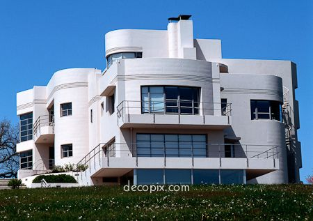

*Example of building style with an extreme amount of curves.*\
*This kind of building will have a high vertex count.*

### [Use Trimesh instead of SubD](#use-trimesh-instead-of-subd)

Trimesh is the best solution for overall world performance as it provides more control over the geometry of your objects and the ability to use Cached GI to bake any static lighting. Determining the type of meshes used is a decision you should make early when creating the world. Trying to swap Trimesh into a SubD world would be a large undertaking.

### [Do not mix Mesh types](#do-not-mix-mesh-types)

Avoid mixing Trimesh and SubD because doing this will add an unwanted CPU performance penalty. This is because SubD forces an unwanted dynamic lighting calculation every frame.

### [Merge meshes to reduce draw call count](#merge-meshes-to-reduce-draw-call-count)

For best performance, you will want to merge world meshes to reduce draw calls. Read the [GPU Best Practices](Performance%20best%20practices/GPU%20best%20practices.md) section before deciding which world meshes to merge. Please see the [Horizon World Creator: GPU Performance Best Practices](Performance%20best%20practices/GPU%20best%20practices.md) document for more information on merging meshes.

## [Technical art choices](#technical-art-choices)

### [Masked materials](#masked-materials)

We recommend modeling details rather than creating them using an alpha cutout texture and masked material for any larger objects that cause a lot of pixels to be drawn on screen.

See the example below. The green tree leaves take up a lot of pixels and should be modeled. The red flowers are too small to have a large effect and may be easier to create using masked materials.

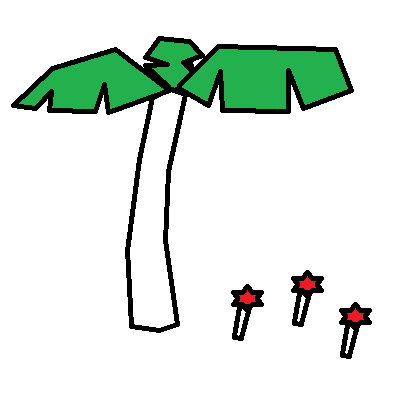

Decades ago, there was an art workflow for creating plants where the mesh is simple but a texture with an alpha mask combined with an alpha cutout shader is used to create the detailed shape of the leaves. At that time we were much more limited in bandwidth to process polygons. Screen resolutions are now higher than those times in the past, meaning there are many more pixels passing through the pixel shader.

Using this old workflow may actually hinder performance. This is because with an alpha cutout shader, it is impossible to know if a pixel will need to be drawn until the pixel shader is run. This breaks early depth test rejection and adds a performance penalty for every pixel drawn.

In the example below, the leaf was modeled using simple geometry and uses an alpha cutout texture and shader to create the detailed shape of the leaf. The areas in red still have to run the per pixel shader.

Every pixel on the rendered polygon has to run the shader first and determine if a pixel is to be discarded before the depth check can be run. This means all of the math of the shader will happen even for pixels that are covered by other objects.

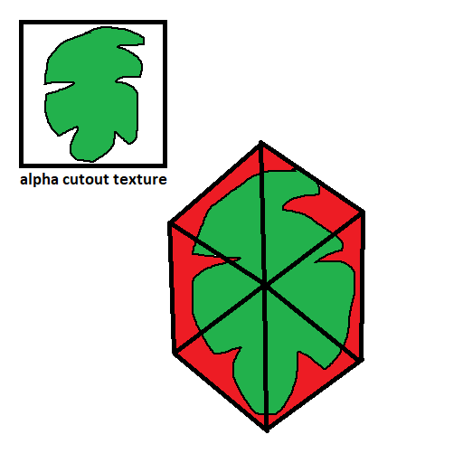

To avoid this performance penalty, it can make sense to model the details using actual geometry and an opaque shader for best performance and only on objects that take up a large amount of pixels on screen. We recommend keeping the mesh detail as low as possible when modeling and this can be enforced through an art style decision.

In the example below, the leaf details were modeled as part of the mesh. The texture and shader are opaque. If any portion of this leaf is covered by opaque objects, the pixels can be rejected early without processing the shader. There are no wasted pixels processed around the fringes.

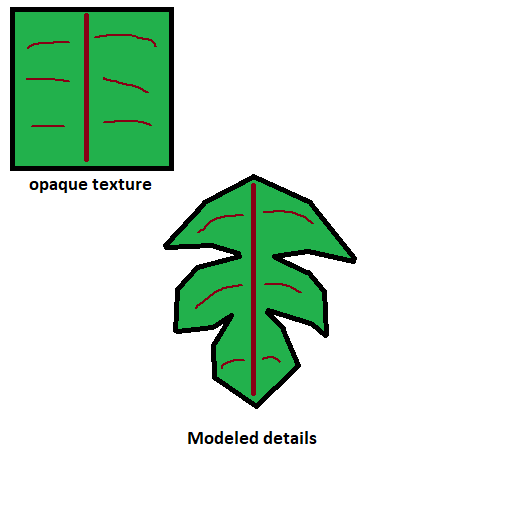

## [World rendering limitations](#world-rendering-limitations)

Meta Horizon Worlds does not currently support occlusion culling to avoid drawing objects hidden behind other larger objects. This makes world layout, mesh merging, and visibility control the main tools available to us for keeping the number of vertices sent through the graphics pipeline as low as possible.

## [Designing world layouts for performance](#designing-world-layouts-for-performance)

It is easy for a world to have its performance hindered by non-performant layouts. Designing from a “blue sky” perspective can be fun, but it may be detrimental to rendering times. This section will show you how to design your world layout for best performance.

### [Avoid making large amounts of a world visible from one position](#avoid-making-large-amounts-of-a-world-visible-from-one-position)

In this scenario the player can stand in one spot and the entire world is in view. This is something we absolutely want to avoid if possible. In this arrangement, every single object will pass through the render pipeline. Because everything is visible, view frustum culling simply does not happen.

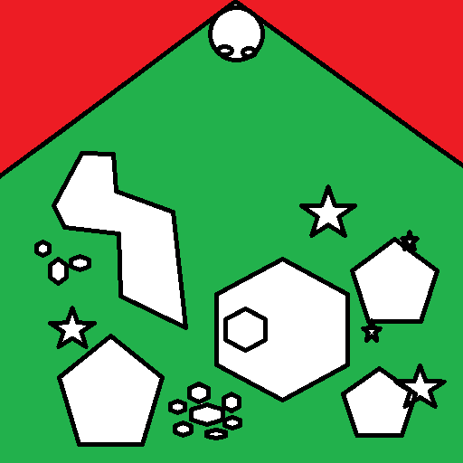

*Every object in the world is visible, using significant resources.*

### [Add twists and turns](#add-twists-and-turns)

By adding twists and turns to your world, you can limit the amount of objects visible at once. This is because objects outside the view frustum will be culled out.

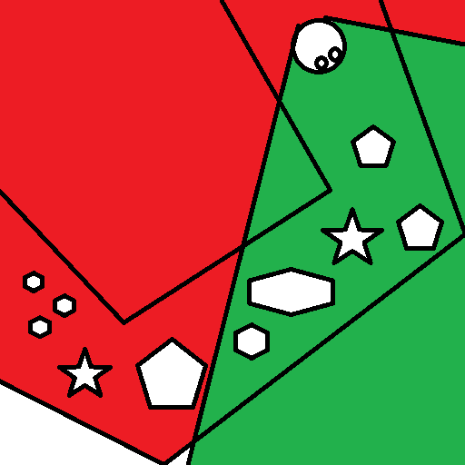

*With all objects unmerged, only some objects are visible while others*\
*are frustum culled.*

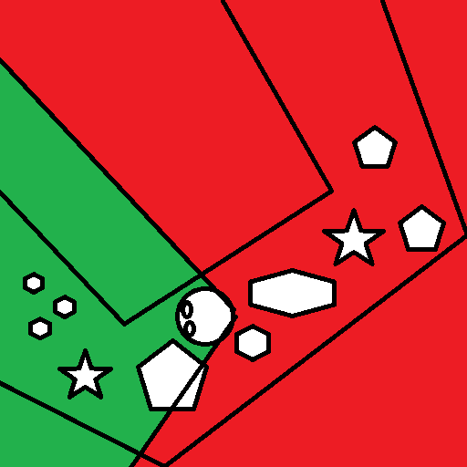

*As you progress through the world, previously hidden objects appear*\
*within the frustum and previously drawn objects are frustum culled.*

### [Merging meshes](#merging-meshes)

Each object when rendered will generate its own draw call which can be expensive. Merging meshes allows for a single draw call to render multiple objects and is a very common practice in Meta Horizon Worlds to increase performance.

It is important to merge meshes in such a way to take advantage of frustum culling which ensures that only objects the player is currently seeing are rendered. Please see the [Horizon World Creator: GPU Performance Best Practices](Performance%20best%20practices/GPU%20best%20practices.md) document for more information on merging meshes.

### [Avoid creating overly large merged meshes](#avoid-creating-overly-large-merged-meshes)

If you merge all objects in the world, then it will break view frustum culling. See the following image where all the objects have been merged into one mesh. All objects highlighted in green will render, despite the view frustum not touching many of them.

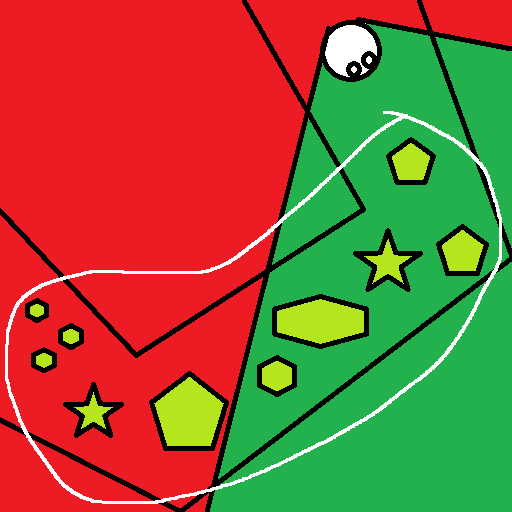

*All mesh objects are grouped into one mesh causing frustum culling*\
*to do nothing.*

### [Create smaller localized clusters](#create-smaller-localized-clusters)

See this next example where the objects have been merged into smaller localized clusters. The ones in Group A are drawn but the ones in Group B are not. By making use of typical views and the geometry of your world you can create groupings to maximize the impact of merging meshes on frustum culling.

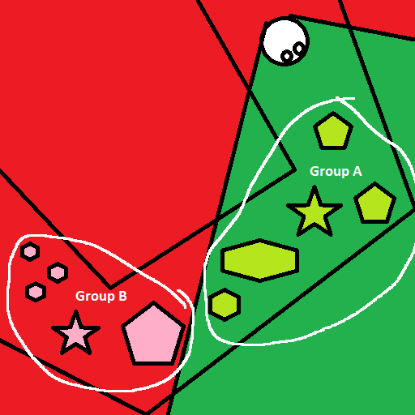

*Group B is frustum culled but Group A is not.*

### [Use verticality for more space with better frustum culling](#use-verticality-for-more-space-with-better-frustum-culling)

By placing rooms on top of each other, you can add more space to a world while benefiting from improved view frustum culling. In the diagram below, green objects are in view while all the red objects in the room below or not. All the red objects are culled out and performance is improved.

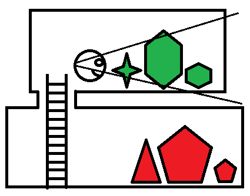

However, if the player looks down at an angle, all of the objects will still be drawn as they are all within the camera frustum. That is why you want to [set visibility](Designing%20a%20performant%20world.md#use-set-visibility-to-hide-objects) to hide objects in rooms that you cannot see.

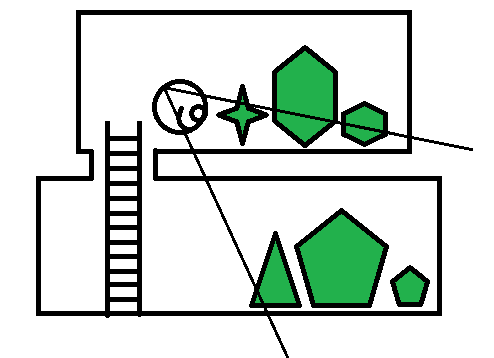

### [Axis aligned bounding boxes](#axis-aligned-bounding-boxes)

In reality, each group will be surrounded by a tight axis aligned bounding box (AABB). An AABB is a box with its shape lined up perfectly with the world X,Y and Z axes. The AABBs may overlap based on how you merge your mesh objects.

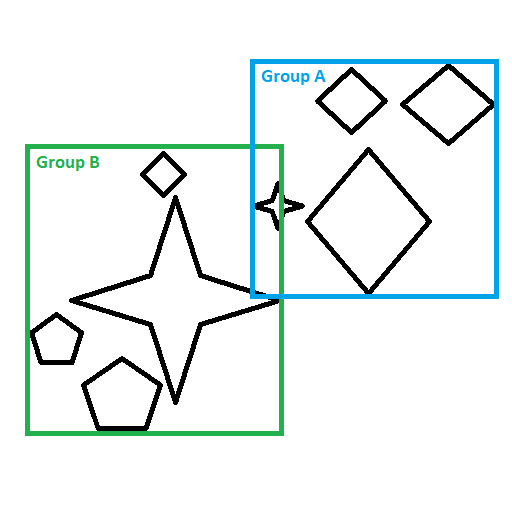

*Two AABBs overlap due to mesh object grouping.*

If any AABB intersects with the view frustum, they will be drawn and go through the entire graphics pipeline. In the following example, all objects are drawn even though it looks like Group B should not be drawn. This is because the AABB for Group B intersects with the camera frustum.

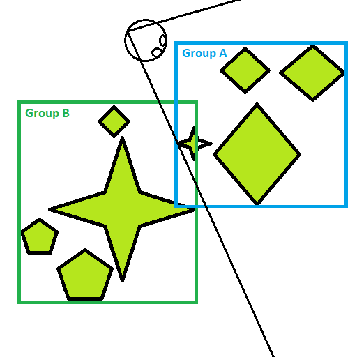

*Looks like only Group A visible, but Group B is*\
*rendered because AABB is within the frustum.*

## [Use set visibility to hide objects](#use-set-visibility-to-hide-objects)

Long hallways are a design layout we have seen in some worlds. However, when at one side of a hallway and facing the other side, all objects are in the frustum. This is another version of the entire world visible all at once. However, there is something you can do to reduce the number of objects rendered. Use the [Entity API](https://horizon.meta.com/resources/scripting-api/core.entity.visible.md/?api_version=2.0.0) to set visibility on or off.

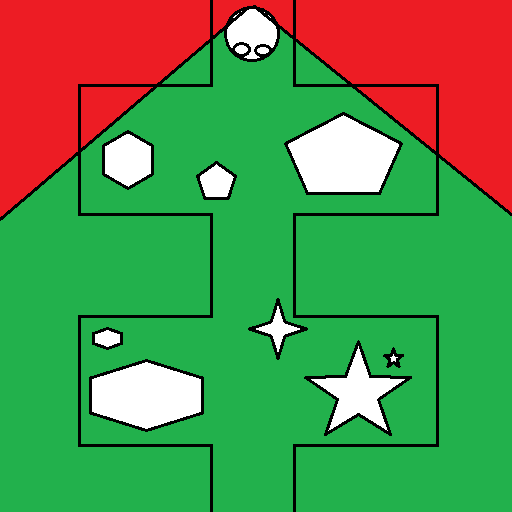

*Separate rooms but all objects are inside the frustum.*

Meta Horizon Worlds has the ability to set visibility on objects. You can design your world in a way that you can’t see the objects in the room you previously came from. As mentioned before, this can be done with [twists and turns](Designing%20a%20performant%20world.md#designing-world-layouts-for-performance) , but another method is to add doors that close behind you.

Using a trigger, you can determine the moment you can no longer see the previous room and set visibility off for those objects. That way, even if the user turns around, these objects will not go through the render pipeline. Similarly, you can avoid having objects visible that you can’t see yet because they are blocked. You can block the line of sight [vertically](Designing%20a%20performant%20world.md#technical-art-choices) by using elevators or shafts that go either up or down.

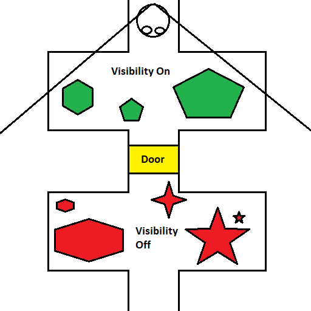

*Door blocks visibility to second room*

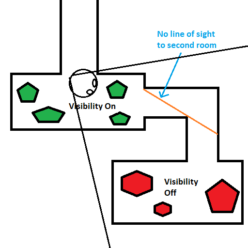

*90 degree turn blocks line of sight to second room*

## [Streaming content in worlds](#streaming-content-in-worlds)

Due to memory constraints, it is sometimes necessary to stream in parts of a world. Sometimes the world is large and spans a vast area, or sometimes the same part of the world is re-used for vastly different mini-games. There are some things to keep in mind when streaming your world to keep players feeling immersed.

### [Hiding CPU spikes](#hiding-cpu-spikes)

Nothing reminds you that you are playing a VR game quite like experiencing a large CPU spike causing a drop in frame rate. Spikes can often occur when loading new parts of a world due to things like loading assets into memory, compiling shaders, or scripts initializing. As a world creator you can incorporate tactics into your design to hide the spikes.

### [Create Transitions](#create-transitions)

The overall easiest way to hide the spikes is to create a moment where the player can’t see anything moving. The easiest way to do that is to fade to white or black, start the loading, then un-fade when the loading or at least the CPU spikes have likely stopped. Remember, if the player can look around and see any movement, they will see the spikes.

### [Reducing CPU spikes](#reducing-cpu-spikes)

If you can’t hide the CPU spikes, they can be reduced  by controlling the amount of assets loading at once, trickling them in bit by bit.

#### [Waiting room](#waiting-room)

The easiest way to do this is utilizing a waiting room with a progress display, that way there is not much limit to how slowly you can trickle. Ideally there is something interesting to do in the room while waiting. You can use the [SpawnController API](https://horizon.meta.com/resources/scripting-api/core.spawncontrollerbase.md/?api_version=2.0.0) to check “currentState” and see if the assets have completely loaded or not, but it does not provide a percentage complete.

If you want to show a countdown timer, it is necessary to fake it by using a stopwatch to see how long it takes to actually load the content. Keep in mind loading on Quest 3 may be faster than Quest 2, so you would want to time using Quest 2.

#### [Twisting hallways](#twisting-hallways)

You can create a long hallway and load assets as you traverse it, ideally using some method to prevent backtracking such as adding a door. Make sure the hallway is long enough to load everything by the time the player reaches the end and consider making use of twists and turns to prolong the amount of time needed to traverse.

## [Creating a world budget](#creating-a-world-budget)

Before beginning building a world it is important to determine key aspects which will impact the overall performance. As an example, multiplayer worlds will have greater limitations in terms of complexity as resources need to be conserved to account for the additional avatars.

Understanding what makes your world unique and the critical gameplay components will allow you to prioritize these aspects when it comes to making performance tradeoffs.

### [Build a gameplay only MVP first](#build-a-gameplay-only-mvp-first)

The gameplay of your world will impact the resources available for your world.  For instance, first person shooters often use a reticle that consumes considerable CPU time. This in turn will cut into your budget for rendering the environment and particle systems.

It is recommended to build your world as a gameplay only MVP first, avoiding detailed art and environmental effects in order to understand your base performance. Then you can see how much room you have left to layer in detailed graphics, particle effects, and other details.

### [Capacity Settings](#capacity-settings)

Meta Horizon Worlds has a built in way to view the complexity of your world. Check this to see where your current world may be using too many resources. See the [Capacity Settings](https://www.oculus.com/horizon-worlds/learn/tutorial/capacity-settings/) documentation on the Oculus website for info on how to see the capacity settings. See the [Creator capacity limits in Meta Horizon Worlds](../Save%2C%20optimize%2C%20and%20publish/Creator%20capacity%20limits.md) for how to interpret the various information presented on that screen.

### [Consider avatar count](#consider-avatar-count)

A world that supports 1 avatar and a world that supports 15 avatars have vastly different limitations. The world with 15 avatars may use up to 6 ms more per frame than the world with 1 avatar. This will eat into your world’s time budget (CPU and GPU). This means the more avatars your world supports the less detailed graphically your world will need to be to remain performant.

The [Performance Limits for a World](Performance%20limits%20for%20a%20World.md)

document will help you decide the parameters of your world budget. Even though the document says a more static world may be able to have 1 million polygons, it does not take into account the avatar count, world layout, or which meshes you merge which can impact this number dramatically.

## [Spawning prefabs causes asset duplication](#spawning-prefabs-causes-asset-duplication)

Some worlds spawn prefabs. For example, using gun prefabs to allow for many different skins for each gun. Spawning prefabs in Meta Horizon Worlds causes a new copy of each texture, material, and mesh to go into RAM for each object spawned.

This means if you have 16 players and they all use the same weapon with the same skin, there will be 16 copies of the same meshes, textures, and shaders they use in memory. This can add up, potentially causing your world to use too much RAM overall. This is not to say don’t do it, but more of a warning of what will happen if you do.

## [Use the simplest materials possible](#use-the-simplest-materials-possible)

Choosing the simplest materials will yield the best performance. The [Materials Guidance and Reference for Custom Models](../Custom%20models%20\(FBX\)/Creating%20custom%20models%20for%20Horizon%20Worlds/Materials%20Guidance%20and%20Reference%20for%20Custom%20Models.md) document has a list of materials to choose from. Generally, a material that samples less textures is more performant. Materials using vertex colors only or textures only will perform better than materials with advanced metalness calculations. The differences between materials becomes the most obvious on objects that either take up a large portion of the screen visually or have an extreme amount of vertices.

## [Follow best practices](#follow-best-practices)

As you can see, there are many things that will use up the limited CPU and GPU time available to your world. Because of this, it is important to squeeze every ounce of performance from every feature of your world. To that end, you will want to read the [Horizon World Creator Performance Best Practices](../Custom%20models%20\(FBX\)/Creating%20custom%20models%20for%20Horizon%20Worlds/Best%20practices%20for%20custom%20models.md) document which shows how to avoid all of those common performance issues we have found across many worlds that we have reviewed.

