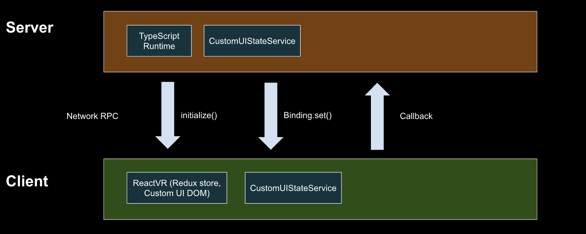
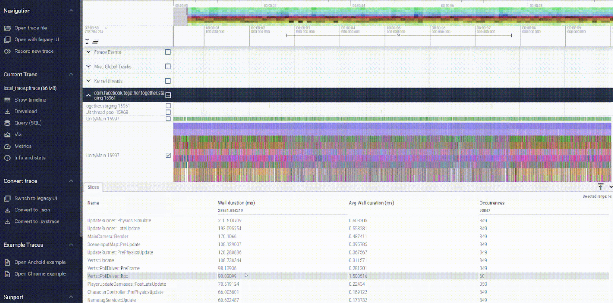
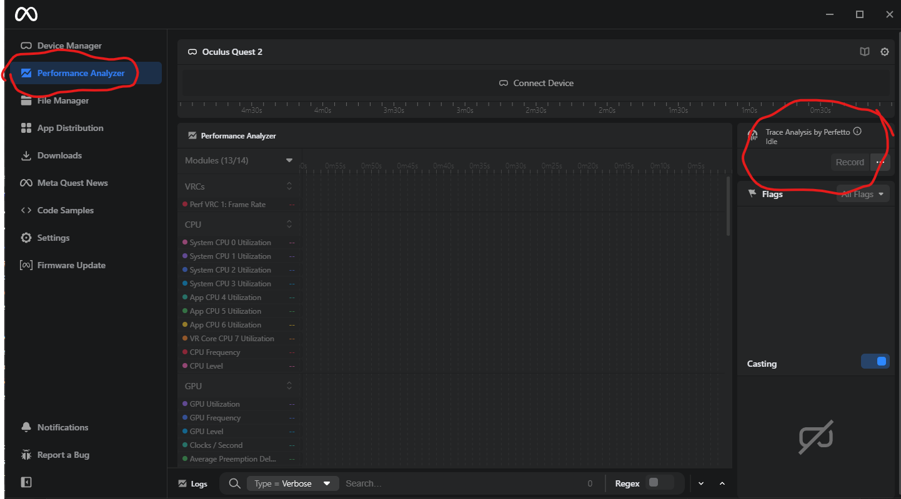
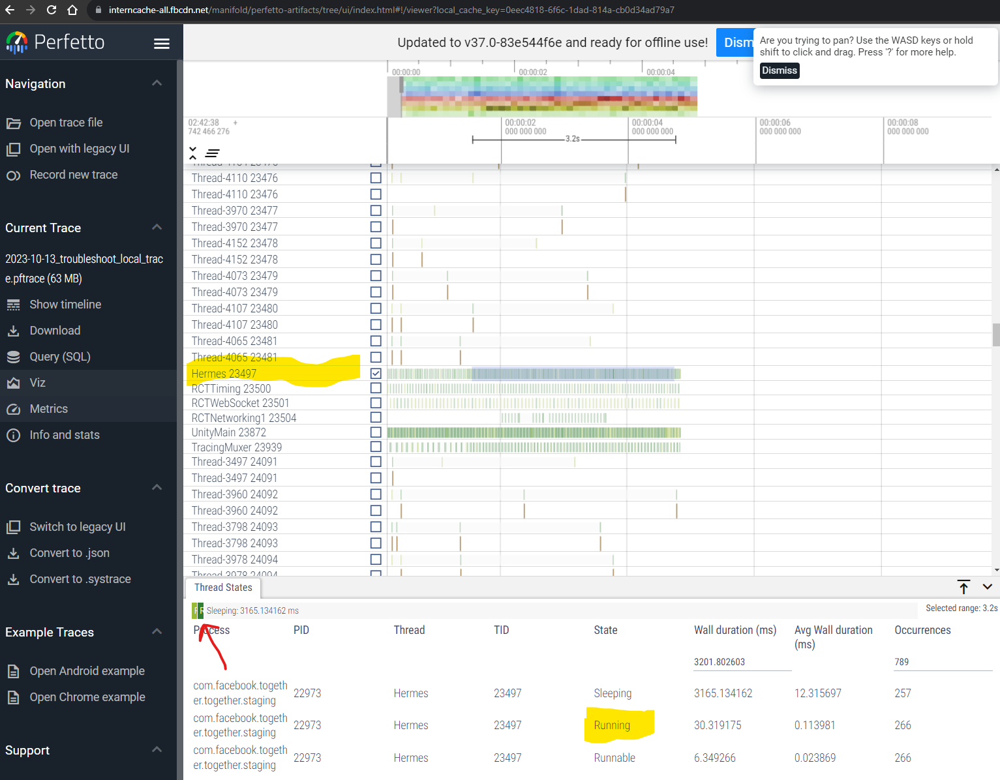

# Custom UI optimization

Custom UI allows for maximum developer flexibility but misuse of the feature can significantly degrade performance. Since UIs are built using a TypeScript API, several observations follow from the TypeScript Optimization section, above. For what follows, the reader is assumed to have a good understanding of the Custom UI TypeScript API. See [Custom UI](../../Desktop%20editor/Custom%20UI/Video%20presentation%20of%20creating%20performant%20custom%20UIs%20in%20Meta%20Horizon%20Worlds.md) docs.

* We suggest keeping main thread CPU cost under 0.5ms per frame on the local client, and 1.5ms per frame on the server (See Profiling UI section below).
* Reduce binding set calls.
* Binding set calls and callbacks are networked RPC events between the local client and server, so the total time of each async operation is bound by the network latency of the viewer.

## Architecture

Here is a diagram to give more context to the performance guidance below.

## Profiling UI

It will be helpful to review the [Deep profiling](CPU%20and%20TypeScript%20optimization%20and%20best%20practices.md#typescript-optimization) section of the [CPU and TypeScript Optimization Best Practices doc](CPU%20and%20TypeScript%20optimization%20and%20best%20practices.md). There is a bridge call and a network RPC event associated with every UI binding set and callback. These actions make up for all main thread synchronous costs associated with UI. Target a CPU total cost for all UI in the world of less than 0.5ms per frame on the local client, and 1.5ms per frame on the server.

From a Deep trace pulled into Perfetto, watch the synchronous cost of these markers:

* For binding sets, look at these traces:
  + Client:
    - Verts::PollDriver::PreFrame
    - Verts::PollDriver::Rpc
    - CustomUI::UpdateBinding
  + Server:
    - ScriptingRuntime::Bridge::SetUIBindings
    - CustomUI::UpdateBinding::Send
* For callbacks, look at these traces:
  + Client:
    - Verts::Update
  + Server:
    - ScriptingRuntime::HandleEvent::customuicallbackinternal
* Other useful traces:
  + CustomUI::UpdateImage::Send (server)
  + CustomUI::UpdateImage (client)
  + CustomUI::InitializeState::Send (server)
  + CustomUI::InitializeState (client)

One useful method to make sense of this in aggregate is to drag a 5 second block across the main thread and look at the total wall time for that marker, divided by 360. For Verts::PollDriver::Rpc in the screengrab below, that is 0.25 ms (90.03099 wall duration in seconds divided by 360 frames).

## Binding set and callback frequency limits

The following table shows the limit we have found for binding sets and callbacks. Exceeding this will likely exceed the 1 ms per frame cost limit outlined above.

| Custom UI operation | Server | Local client (one user) |
| --- | --- | --- |
| Binding set | <= 20 per frame (for all users) | <= 10 per frame |
| Callback | <= 1 per 2 frames (for all users) | <= 1 per 2 frames |

## Network latency limitations

The communication loop between a UI panel rendered on a client, and the associated TypeScript engine on the server, is limited by the network latency of the viewer. Common situations in which this should be factored in:

* Style changes based on raycast/mouse interaction events like OnHover
* Animations driven from TypeScript by a sequence of binding set updates over a period

Even working within the binding and callback limits above, viewers may notice UI delays associated with the network call round-trip.

## Memory usage

Textures by far outweigh any other memory cost associated with a UI entity. This includes a mandatory ~40 MB ReactVR panel render texture, as well as a copy of any texture asset referenced by a UI image component (once per UI entity that contains a reference to that asset, no matter how many times).

Setting the visibility of a UI entity to **false** frees all textures to garbage collection. As such, everything in the [Spawning objects](CPU%20and%20TypeScript%20optimization%20and%20best%20practices.md#spawning-objects) section of the [CPU and TypeScript Optimization Best Practices doc](CPU%20and%20TypeScript%20optimization%20and%20best%20practices.md) applies here, and toggling visibility can be a costly operation (especially on the server). Where possible, set the visibility of the UI entity to **true** at initialization, and leave it that way.

## ReactVR

In testing, we have found bridge calls and RPC costs to be the bottleneck setting the limit for binding/callback frequency, and not ReactVR. That isn’t to say a sufficiently complex virtual DOM could present limits on the ReactVR side, too. If you suspect issues with this due to the UI being laggy or slow to refresh, we recommend using the [Meta Quest Developer Hub](https://developer.oculus.com/meta-quest-developer-hub/?intern_source=devblog&intern_content=meta-quest-developer-hub-mqdh-30) (MQDH) desktop software to study deeper.

Here, a Perfetto trace can be pulled in the Performance section, similar to the in-app trace that was described before. The difference is that this trace shows activity in the Hermes thread, which holds work done by the ReactVR runtime engine.

In the screenshot above, running time (the green square) of the Hermes thread, across a 5 second segment, is around 1%. Try to keep this less than 50%, to leave room for other Horizon system UI.

## Gotchas and anti-patterns

Some constructs may seem benign, but are not a good fit for Custom UI (at this time), so we call out to them below.

- Do not define bindings without a concrete purpose. This may happen by writing a custom abstract API layer wrapping the base UI components (View, Image, Pressable, etc.), and defining bindings for every prop as a convenience to consumers. On the local client, a binding set operation passes the entire key-value store to ReactVR. So the bigger this gets, the greater the CPU cost to perform a single binding set.
- Animations, by way of periodic binding updates, should be implemented with care or not at all. This is due to the twofold nature of (a) bridge call frequency limits, and (b) network latency and droughts/bursts associated with that.