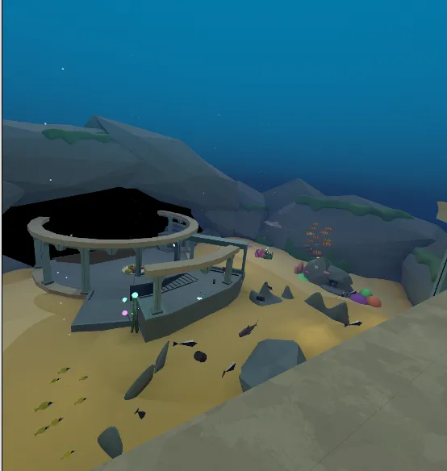

# Network best practices

All moving (dynamic) objects in the world have their positions synchronized between clients, where updates are sent to every player in the world. If you have many animated objects, especially if they react to physics in the scene (collidable), the network data transfer could take a significant amount of time.

*Animated and interactive fish driven by server updates*

## Potential solution

To improve the time it takes to transfer data, consider keeping animated objects to a minimum, reducing the total overhead needed to sync between multiple users in your world.