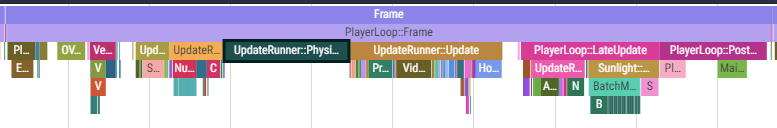
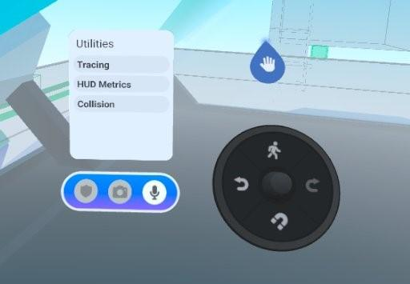
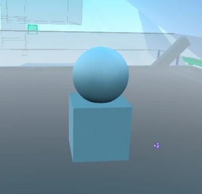
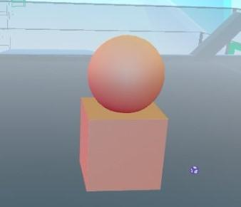
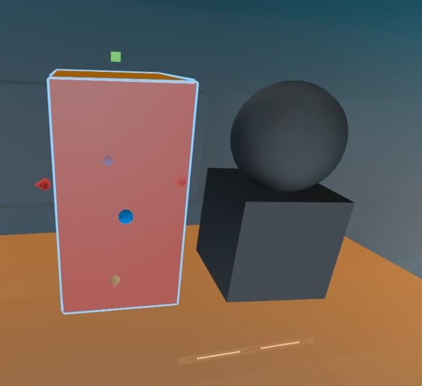
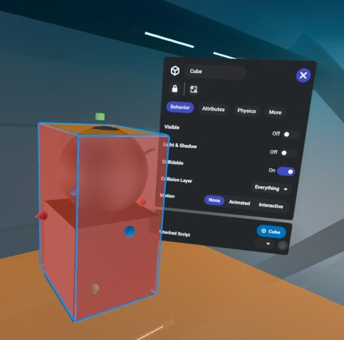
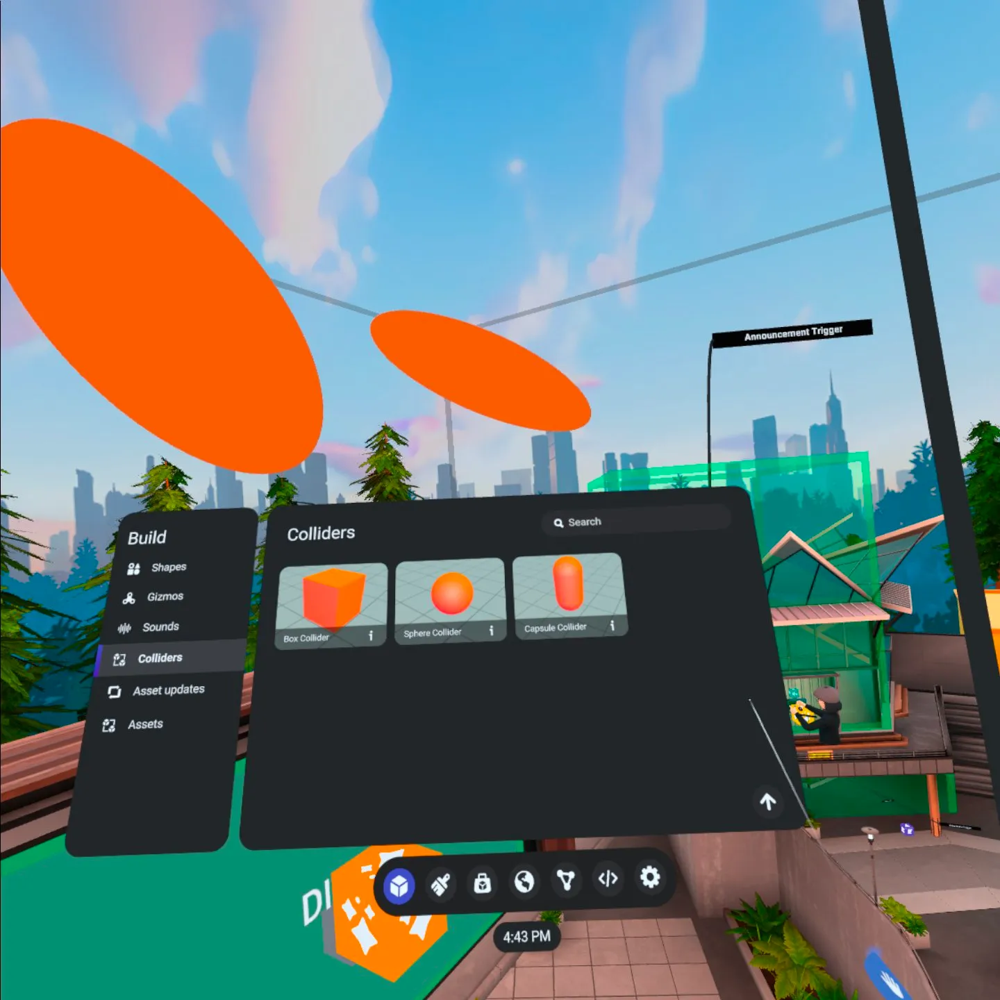
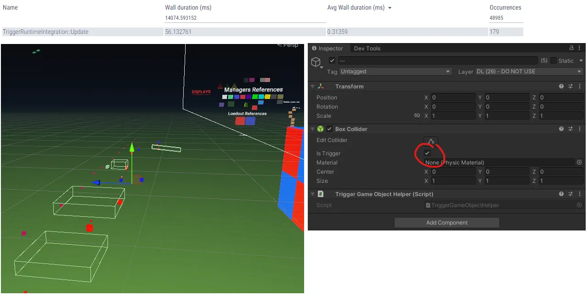

# [Physics best practices](#physics-best-practices)

## [Collidable objects](#collidable-objects)

Collidable objects in the world require physics processing to determine if something is interacting with them. Optimize physics processing by disabling colliders on any objects that aren’t interacted with or are outside the game play areas. In manual traces, large numbers of colliders will be reflected in Physics.Simulate times. If you have access to developer builds of Meta Horizon Worlds, the number of colliders in the world will be broken out in the Physics::Overlaps # trace. As a rule of thumb, the number of overlaps should be kept below 400.

*UpdateRunner::PrePhysicsUpdate and UpdateRunner::Physics.Simulate in high collider world*

To view colliders in the world, toggle **Collision** in the **Utilities** menu. This highlights all collidable objects in the world with an orange tint.

*Collision in the Utilities menu*

*Collision off*

*Collision on*

With highly detailed objects in play, disable the detailed colliders, then wrap the detailed object in a primitive collider such as a cube (best), sphere, or capsule collider. This only requires one physics test for collision and usually results in no loss of functionality or visual fidelity.

*Complex object made of non-collidables with simple collidable cube*

*Enclosed in a non-visible collidable object*

For best performance, you should attempt to leverage primitive colliders (as shown below). The only exception is for things that you collide with very often/all-the-time may be better as a single, large mesh. Testing can help determine which gives better performance.

This is especially true for worlds that are using [Custom Model Import](../../Custom%20models%20\(FBX\)/Getting%20started%20with%203D%20model%20import.md), as using non-mesh colliders and non-primitive colliders will incur an additional, high, and spiking cost associated with rendering.

*World Editor showing raw primitive colliders*

## [Grabbables](#grabbables)

In order for grabbables to have good performance, it is important to minimize the number of collidable components on the grabbable object. For a rule of thumb, the maximum number of collidable components any grabbable should have is 2.

## [Triggers](#triggers)

The number of triggers in the world has a runtime cost associated with it. This is seen by an increase in *Physics.Simulate* and the *TriggerRuntimeIntegration::Update* markers. Active triggers still have a runtime cost in the world even if they are inaccessible to the player.

Even objects outside the player area that have a trigger will still contribute to frame time.

For best performance, disable triggers far away from the player, in areas like buildings (until the player enters the building), and areas inaccessible to the player.

## [Collidable property](#collidable-property)

Entities when using the Scripting API have a [collidable property](https://developers.meta.com/horizon-worlds/resources/scripting-api/core.entity.collidable.md/?api_version=2.0.0) that can be enabled or disabled. In worlds where the physics cost is high, and players are collectively moved to another area such as PvP worlds, consider setting the collidable property to false to turn off the colliders in areas the players aren’t present. Since this is a bridge call, as mentioned in the [CPU and TypeScript optimization and best practices](CPU%20and%20TypeScript%20optimization%20and%20best%20practices.md#typescript-optimization), ensure these are spread across several frames to reduce any spikes during gameplay.

