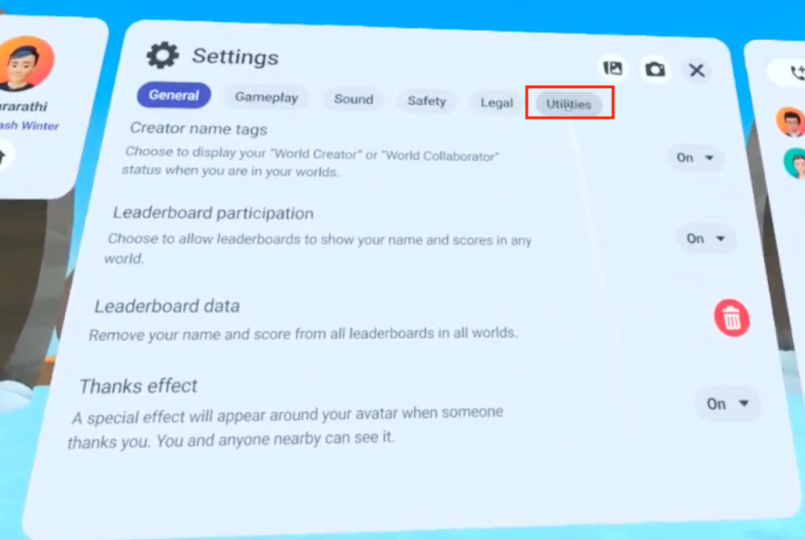
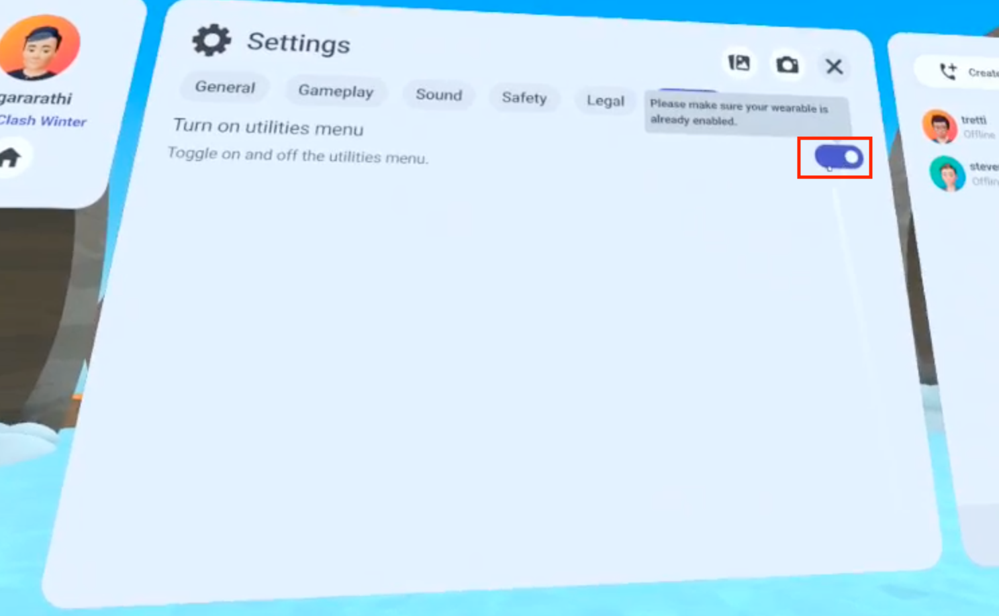

# [Enable the Utilities menu](#enable-the-utilities-menu)

Real-time performance metrics provide you with information about how your world performs, such as the frame rate in frames per second, as you interact with it. Use this information to find performance issues before your users find them. See the [Metrics information](../Analytics/World%20Analytics.md#supported-metrics) for more information about these metrics.

Before you can enable Real-time metrics in your world, you must first enable the Utilities menu.

## [Enable the Utilities Menu](#enable-the-utilities-menu-1)

1. Visit a world
2. Select the Menu button on your left controller
3. Select **Settings**
4. Select the **Utilities** tab 
5. Toggle the menu to on 

For instructions on Enabling and Modifying your Real-Time Metrics Menu, [follow this guide](Enabling%20and%20modifying%20the%20real-time%20metrics%20panel%20in%20VR.md).

