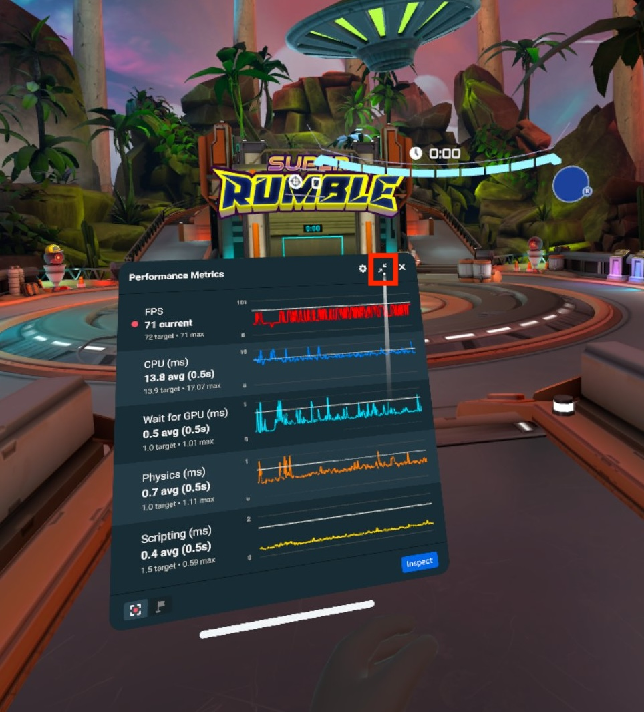
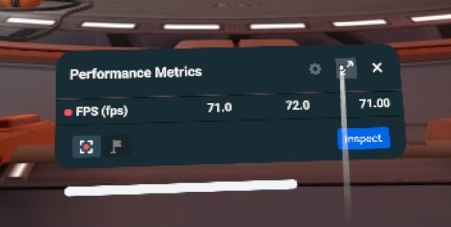
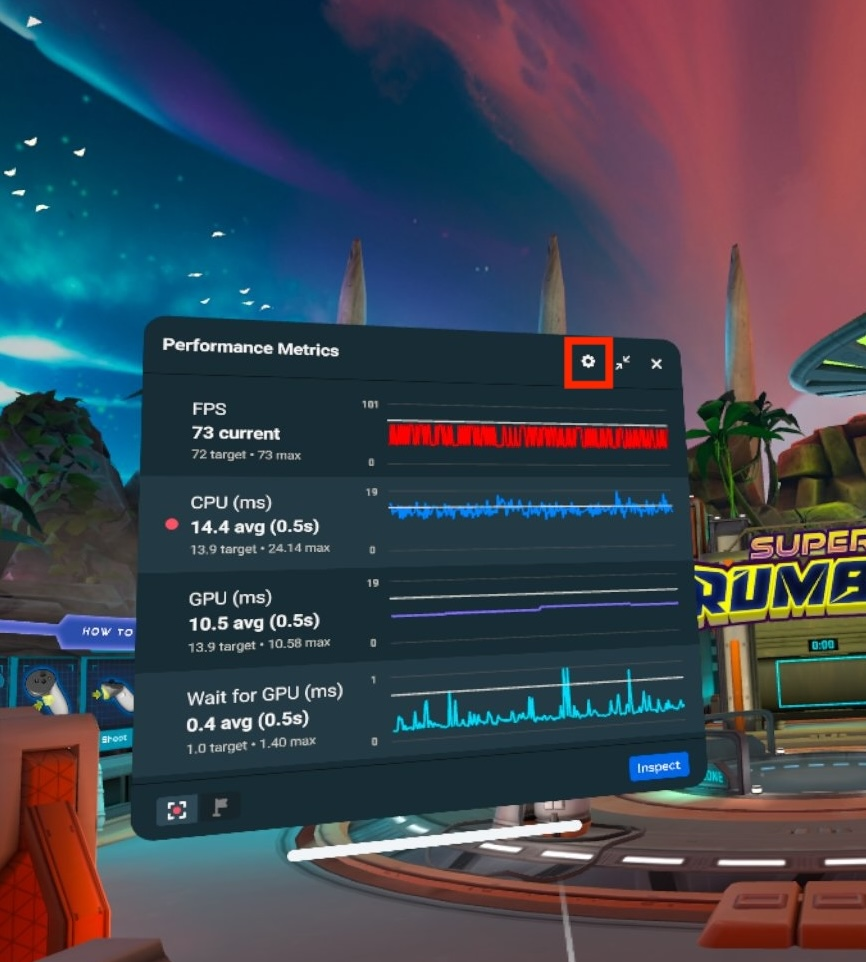
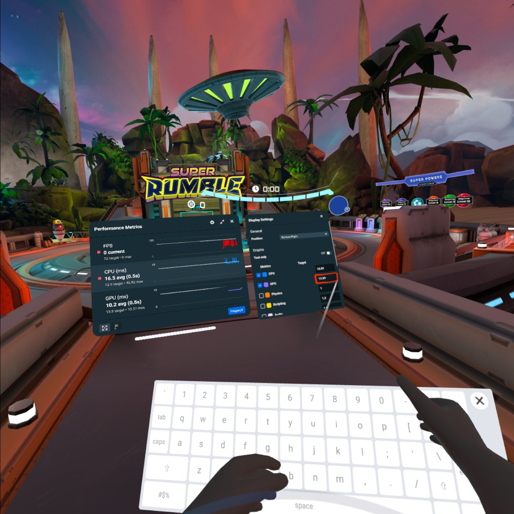
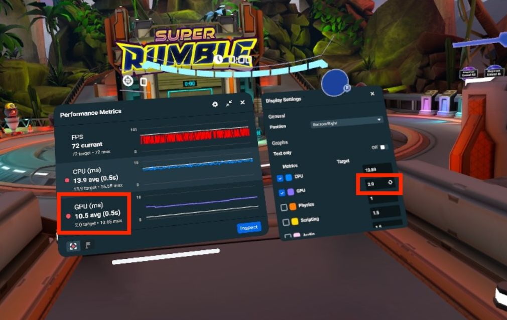

# Enabling and modifying the real-time metrics panel in VR

This topic covers how to access real-time metrics and download performance traces in virtual reality. For information on how to access real-time metrics and download performance traces in web and mobile, see [Using performance tools from web and mobile](Using%20performance%20tools%20from%20web%20and%20mobile.md).

**Note:** The [Utilities menu must be enabled](Enable%20the%20Utilities%20menu.md) before continuing.

The **Real-time metrics** panel provides real time performance data for metrics like FPS, CPU, GPU, scripting, and physics. The panel moves as the player moves as it is attached to the player’s space. To see a list of the metrics you can use, see [Real-time Metric Descriptions](Enabling%20and%20modifying%20the%20real-time%20metrics%20panel%20in%20VR.md#real-time-metric-descriptions).

## Using the Real-time metrics panel

The Real-time metrics panel is accessed from the **Utilities** menu, which can be enabled in **Settings**.

To enable and view the Real-time metrics panel:

- Visit a world in any mode.
- Turn either of your wrists towards you to activate the wearable.
- Open the PUI and open **Settings**.
- Click on the **Utilities** tab and enable the utilities menu.

  
- Once the wearable is open, tap the **Real-time metrics** button under **Utilities** to open the Real-time metrics panel.

  

## Real-time metrics settings

In the display settings, you can change the location and opacity of the Real-time metrics panel, as well as which metrics to display.

#### Moving the panel using settings

To change the position of the Real-time metrics panel, open the display settings by pressing the **gear icon** on the top right of the panel.

Select a position from the **Position** drop-down in Display Settings. You may choose from **Top Left**, **Top Right**, **Bottom Left**, and **Bottom Right**. This snaps the Real-time performance metrics panel to one of those locations in your view.

### Moving the panel by dragging

You can grab the white bar below the Real-time performance metrics panel by using either trigger on your Quest controller. While holding down the trigger, you can move the panel by dragging it.

### Minimizing

You can minimize the Real-time metrics panel by pressing the **Minimize** button to the right of the settings button.

Once minimized, you can restore the panel by clicking the button again.

## Real-time metrics graphs

### Selecting metrics to display

Press the **Settings button** on the Real-time metrics panel to open the display settings.

Under Graphs, there are checkboxes for the metrics that are available.

Point at the display settings panel and use either joystick to scroll up and down to see even more metrics. Full descriptions of each available metric are in [Real-time Metric Descriptions](Enabling%20and%20modifying%20the%20real-time%20metrics%20panel%20in%20VR.md#real-time-metric-descriptions).

To add a metric to the Real-time settings panel, open the display settings, hover your controller pointer over a metric with an empty check box, and pull the trigger. The metric is added to the panel with a unique color identifier.

If you attempt to select too many metrics, you receive a notification informing you that you have reached the maximum number of metrics that can be viewed at once. In order to add more metrics, you must first deselect one or more currently displayed metrics using the same process you used to select them.

### Changing metric targets

You can set metric targets to signal you when they exceed the desired target. When this happens, the metric is highlighted red in the Real-time performance metrics panel.

To set a metric target, enter the target value into that metric’s **Target** field in the display settings.

In this example, the GPU target is lowered to 2.0 milliseconds, which causes it to become highlighted red in the Real-time metrics panel for as long as the average GPU is over the new target.

## Real-time Metric Descriptions

When [Frame Budget Boost](../../Save,%20optimize,%20and%20publish/Learn%20about%20Frame%20Budget%20Boost.md) is enabled, Application Space Warp (ASW) will adaptively turn on to boost performance as long as the world meets a minimum of 45 FPS without hitching (missing multiple frames). When ASW is active, the target will double for several metrics, including CPU and GPU. When not active, the target will return to its original value.

| **Metric** | **Description** |
| --- | --- |
| FPS | FPS stands for frames per second. This metrics measures how many frames the device is able to process per second. Ideally the goal is to display 72 frames per second. |
| Frame Time | The time it takes to process a single frame, in milliseconds. |
| CPU | The CPU metric measures how long the CPU took to process the last frame in milliseconds. The higher the CPU number, the longer a frame took to process. If the CPU takes too long to process a frame, it could affect your FPS. When Application Space Warp is on, the target value for CPU is doubled, so you have more usable CPU budget before FPS is affected. |
| GPU | GPU measures how long the scene took to render. Some common things that can negatively impact the GPU performance include complex geometry, expensive materials, complex particles, or many high resolution textures. When Application Space Warp is on, the target value for GPU is doubled. |
| Physics | Measures the time spent on processing physics related actions. For example if you have 100 spheres dynamically rolling about while colliding with each other, your physics process time per frame might be high. Having too many triggers in a scene can also add to the overall physics cost. |
| Scripting | Measures the time spent processing scripts written by the creator. |
| Audio | Measures how long the CPU took to process audio events and objects. |
| Avatar | Measures the time spent processing avatar related code. |
| Draw calls | All of the render objects in the scene are gathered by the CPU and then sorted. If you have 200 objects in a scene that does not mean you will have 200 draw calls. Objects that share settings (like using the same geometry and material) will be batched together as a single draw call. |
| Vertices | Records the total number of vertices rendered for a frame. A scene with models that have high number verts in them could negatively impact the GPU render time. |
| WaitForGPU | This is the time it takes to synchronize the CPU and GPU each time a new frame is started. This metric can be negatively impacted if the GPU was given more work than it could process in a single frame. |
| Memory | Measures amount of memory currently in use, in MB. This must not exceed the OS-defined limit of 6.25 GiB, so it would be useful to set a lower Target number in order to trigger an alert when you approach the limit. You can keep this metric in check by exercising [Memory Best Practices](../Performance%20best%20practices/Memory%20best%20practices.md). |
| App Space Warp | [Frame Budget Boost](../../Save,%20optimize,%20and%20publish/Learn%20about%20Frame%20Budget%20Boost.md) must be enabled for ASW to adaptively turn on. A value of 0 means ASW is off, a value of 1 means AWS is on. When ASW is on, the number of milliseconds of work your world can do per-frame is nearly doubled. |
| Phase Sync | The additional wait time (in milliseconds) added in between frames to ensure your world runs smoothly. Phase sync time is a buffer that shrinks or expands to accommodate CPU load. As CPU time gets longer and closer to the target time to hit 72 FPS (13.8 milliseconds by default, higher if Application Space Warp is on), phase sync time gets shorter. A consistent and long phase sync time means your world is performing well and is able to generate frames faster than the device’s FPS. A phase sync time of 0 ms may indicate your world is running below 72 FPS. |

### Network metrics

These metrics track network performance.

| **Metric** | **Description** |
| --- | --- |
| Verts Rpc Sent | Number of remote procedure calls sent over the network. |
| Verts Rpc Received | Number of remote procedure calls received over the network. |
| Verts Creates | Number of network-synchronized components to track. |
| Verts Updates L. | Number of local network-synchronized components updated. |
| Verts Updates R. | Number of remote network-synchronized components updated. |
| Verts SS RTT | Estimated round-trip time to sync network state, in milliseconds. |
| Net Latency | Network latency in milliseconds. |
| Net Bytes Out | Number of kilobytes sent over the network. |
| Net Bytes In | Number of kilobytes received over the network. |

### Custom UI

These metrics relate to the performance of the [custom UI](../../Desktop%20editor/Custom%20UI/Performance%20Metrics%20for%20Custom%20UI.md).

| **Metric** | **Description** |
| --- | --- |
| UI Binding Update Rate | Number of UI updates per frame. |
| UI Binding Total Count | Number of UI bindings. |
| UI Binding Total Size | Memory used by UI bindings, in kilobytes. |
| UI Total Count | Number of visible UI objects. |