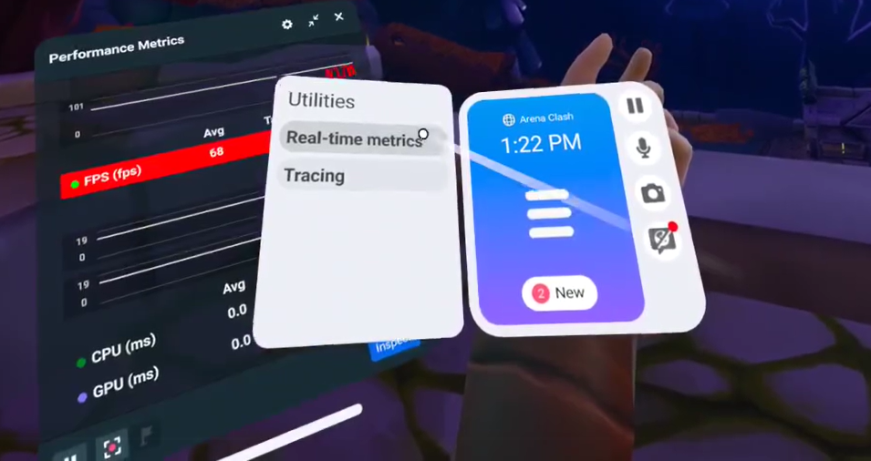
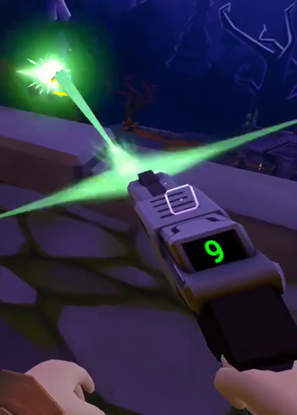
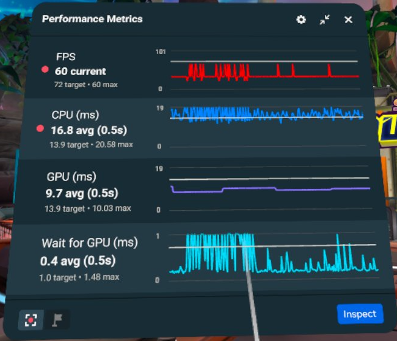
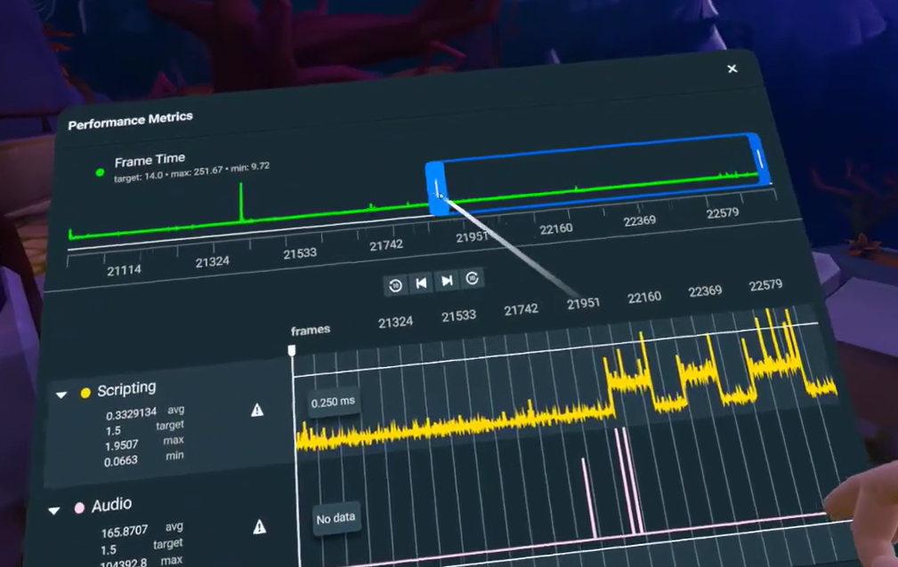
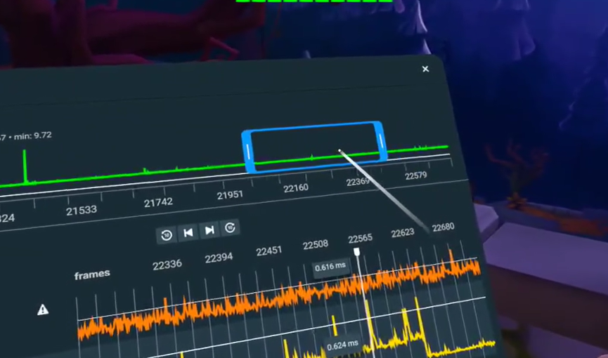
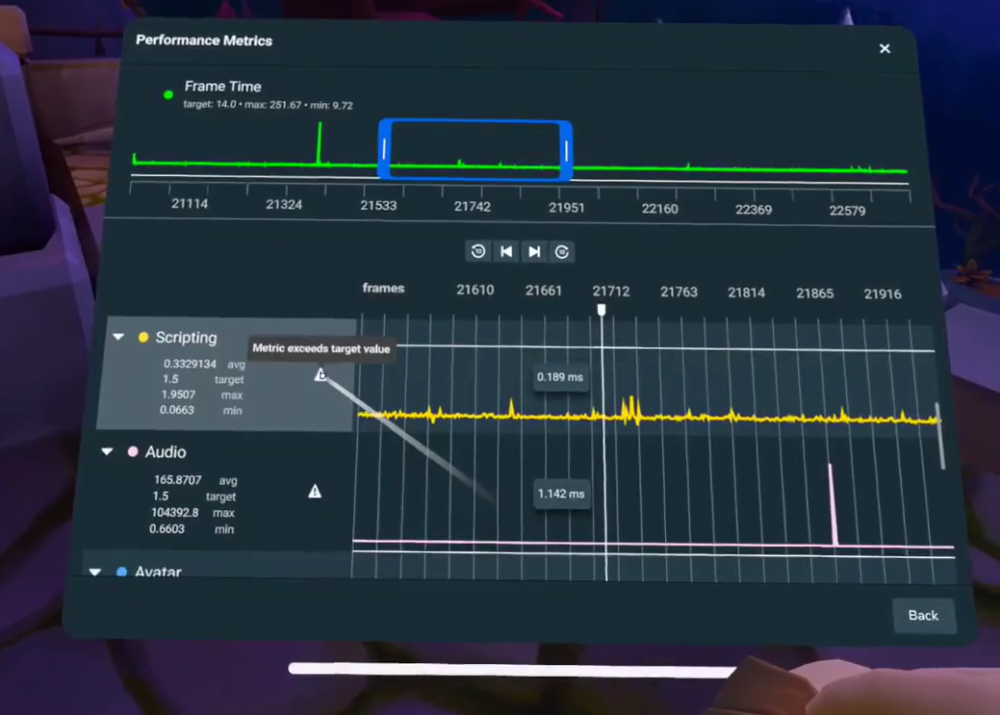
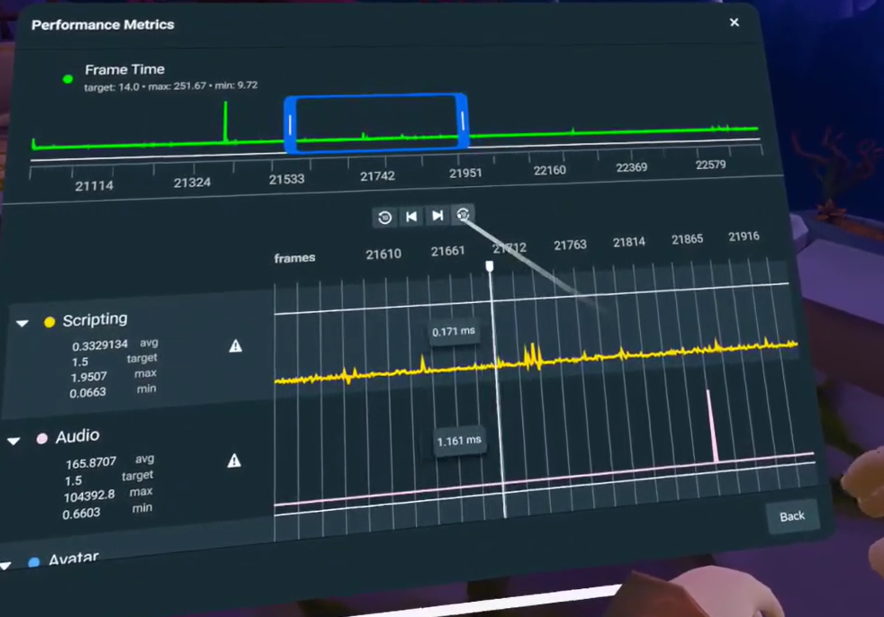

# [Performance Scrubbing](#performance-scrubbing)

Horizon’s scrubbing feature enables you to analyze performance events in your world. This testing procedure will help you identify events that are causing slowdowns and will provide important clues on what to do. Scrubbing can help you solve performance problems by making it possible to selectively step through and analyze graphical data displayed in the Performance Metrics panel. This data includes metrics for frame time (FPS), GPU time, scripting, physics workload, other users building in Horizon, and more. These graphs are compiled from the last several thousand frames, about 30 seconds while playing at target FPS. Scrubbing adds the ability to inspect the graphs and test the data in the following ways:

- Select a range of frames from the total recorded.
- Move and resize the selected range.
- For all metrics, select an individual frame to see the value at that frame.
- Determine which metrics are above their target value, including when that happened.
- Expand metrics to see metadata, such as the average, minimum, maximum, and target values.

This scrubbing procedure can be done from within Virtual Reality (VR). You don’t have to take off your VR headset, and you don’t have to use passthrough. This will allow you to analyze and test performance and regressions easier and more efficiently.

## [Use case](#use-case)

You’re testing a new weapon in your world, so you have the real time metrics panel open. When you fire the weapon, you notice that your frame time graph spikes, revealing a slow down in your world’s performance. To find out why this may have happened, you click “inspect” and open the scrubbing panel. You look for the spike in frame time, adjusting the scrubber to highlight the frame where it occurred. You scroll through other metrics, noticing that there is a spike in the scripting metric. Scrubbing has given you a clue that you should check the scripts for the new weapon and work on their performance to fix the spike.

## [How to perform a scrubbing test](#how-to-perform-a-scrubbing-test)

Follow this procedure to perform a scrubbing test to analyze the data provided in the **Real-time Performance Metrics** panel:

1. Open the **Personal UI** (PUI).

2. Click **Settings**.

3. Select the **Utilities** menu if it’s not already on. 

4. Travel to a world that you can use as a test, such as Super Rumble or Arena Clash.

5. After it loads, look at your avatar’s wrist. Turn your wrist to make the wearable appear. This  wearable is a hands-free tablet-like device that displays the **Utilities** menu.

6. On the **Utilities** menu, select **Real-time metrics**. The **Real-time Performance Metrics** panel will then open. 

7. Perform an action to start compiling metrics that you can analyze. For example, you could pick up a weapon and shoot it, use your Super Power, or shoot a drone. As a result, you might see spikes in some of the real-time graphs or other details indicating activity.\
   

8. After you’ve put some data into the **Performance Metrics** panel, select the **Inspect** button, and scroll down to see the available metrics. Notice that spikes from the real-time graph  also appear here. 

9. Now you can use scrubbing to evaluate the data to identify where the performance problems are coming from. Here’s how to use scrubbing to test performance issues:

   1. Adjust the viewing range by clicking and dragging the sides of the blue range selector in the **Frame Time** header graph. This will change the data displayed in the graph. 
   2. Move the range selection without changing its size by hovering over the middle of the blue range selector and grabbing and dragging it. This will change how the data is displayed in the graph. 
   3. Reduce the vertical height of the graphs to allow for more graphs in one view by clicking on the metric metadata next to the graphs. 
   4. View the value of all metrics at that frame by clicking a frame in the graphs in the metrics list.
   5. To move forward and backward by a set number of frames, use the **Forward** and **Backward** buttons above the graphs. 
   6. Move a graph around your view by grabbing the white bar beneath the panel.

10. When you’ve finished analyzing the data, you can return to the **Performance Metrics** panel again by clicking the **Back** button, or you can close the performance tools entirely by clicking **X**.

