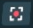
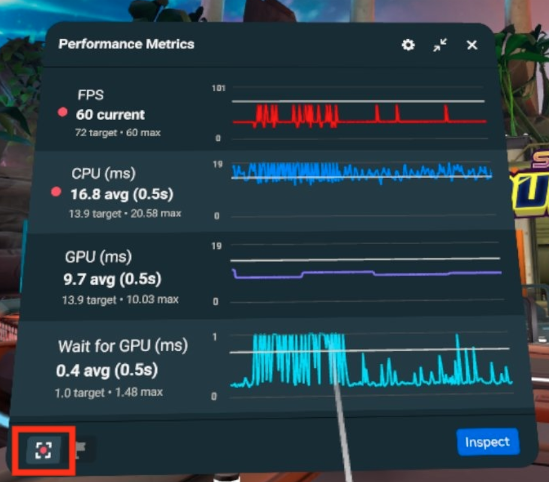
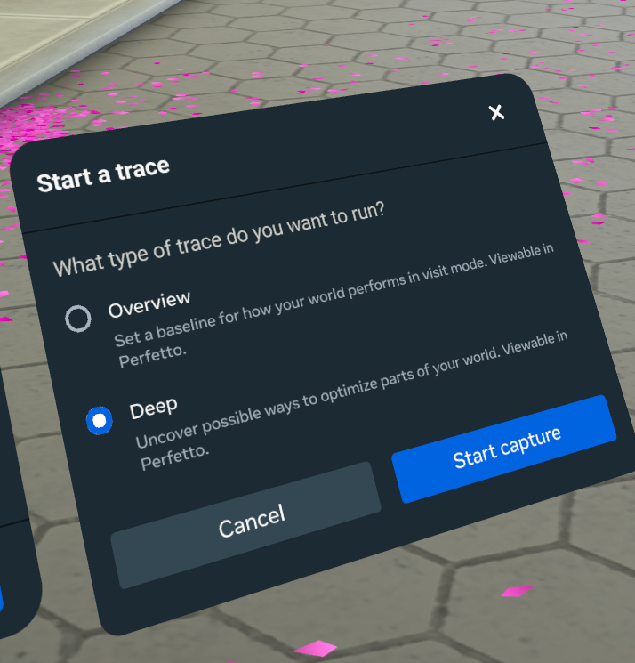
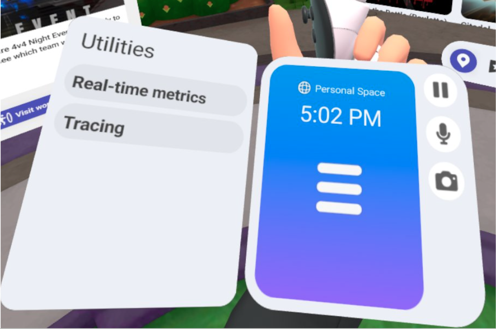
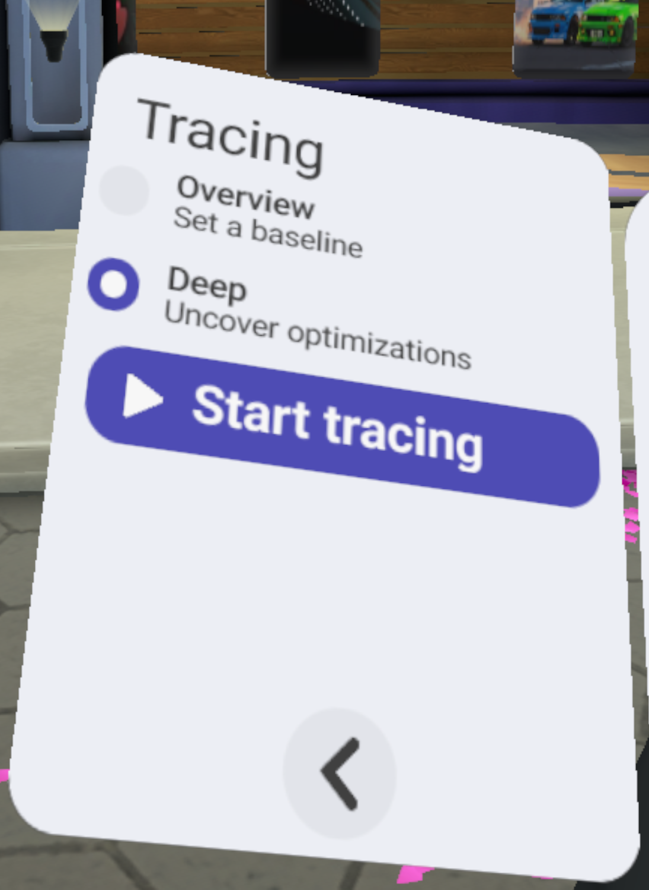
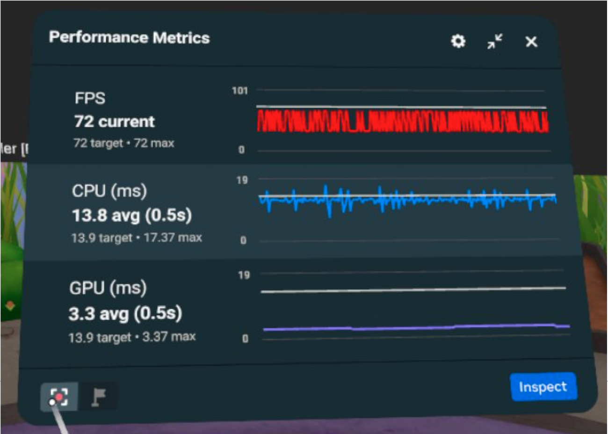
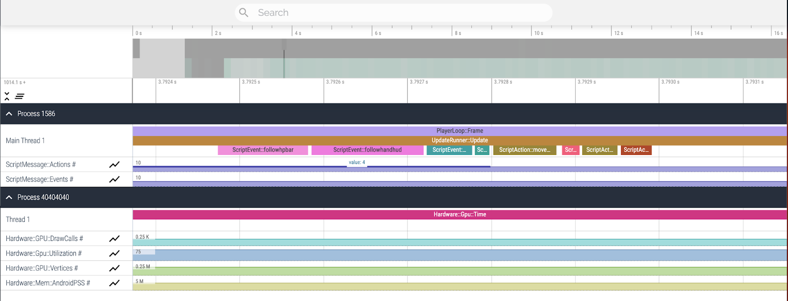
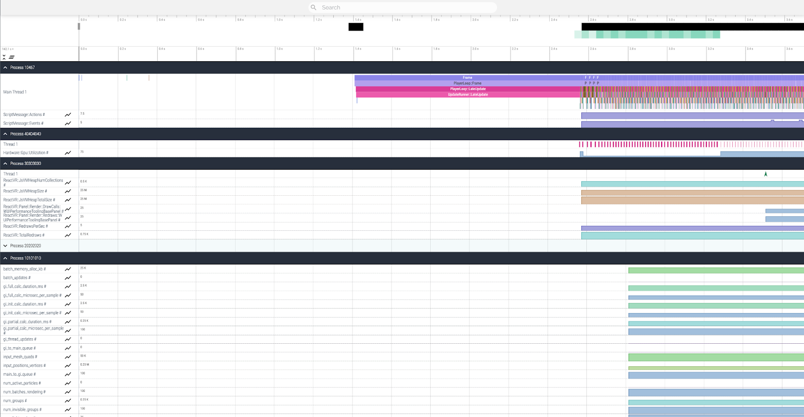
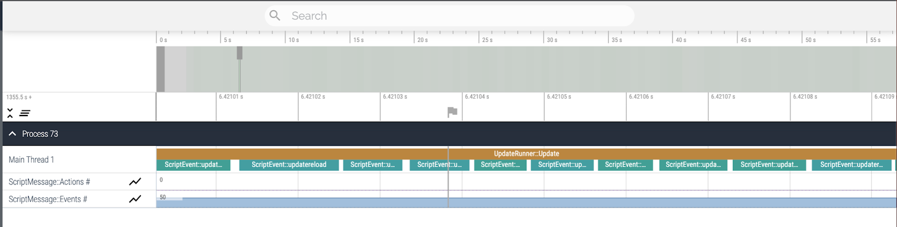
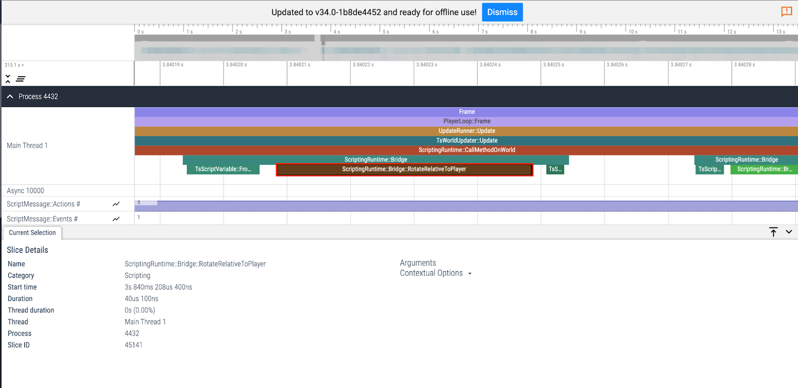

# [Tracing](#tracing)

**Note:** You must [enable the Utilities menu](Enable%20the%20Utilities%20menu.md) before continuing.

Tracing allows you to capture performance data from your world for viewing in Perfetto. Access trace settings and controls by selecting the trace icon  from the wrist wearable or the real-time metrics panel (shown below highlighted in red).

Selecting the tracing icon opens the **Start a trace** modal where you can select the type of trace you want to capture and start the trace.

## [Trace types](#trace-types)

There are 2 types of traces you can run at this time: **Overview** and **Deep**. Both will save a file that can be viewed in Perfetto.

### [Overview](#overview)

An overview trace can help you set a baseline for how your world is performing in visit mode. It captures high-level data like FPS, CPU, GPU as well as a high-level capture of metrics like physics, rendering and lighting to identify possible sources of performance impact and provide a direction for deeper investigation.

### [Deep](#deep)

Deep traces are the most commonly run because they can give more specific, actionable information when it comes to performance optimizations. A deep trace provides scripting information and metrics like draw calls. It’s best used for identifying specific performance improvements like optimizing physics, colliders, and tri/poly count of certain meshes as well as reducing draw calls in a particular area.

### [How trace types relate to old config options](#how-trace-types-relate-to-old-config-options)

The overview and deep trace types correspond to the previous trace configuration options listed in the table below.

| Trace type | Old config options                    |
| ---------- | ------------------------------------- |
| Overview   | - Application - Debug - Client/Server |
| Deep       | - Application - Deep - Client/Server  |

## [Start a new trace using the wrist wearable](#start-a-new-trace-using-the-wrist-wearable)

To start a new trace from the wrist wearable:

1. Look at your left wrist to bring up the wrist wearable.
2. Select **Tracing.**
3. Use the radio buttons to select the **Overview** or **Deep** tracing scope.
4. Select **Start tracing** to start the trace.

## [Start a new trace from the Real Time Metrics Panel](#start-a-new-trace-from-the-real-time-metrics-panel)

To start a new trace from the Performance Metrics panel:

1. On the Performance Metrics panel, select the **tracing** icon. 
2. On the **Start a trace** panel, use the radio buttons to select your trace type (**Overview** or **Deep**).
3. Select **Start capture**.

\*\*

## [Download the trace file](#download-the-trace-file)

1. Open your browser and navigate to the [Developer Dashboard](https://developers.meta.com/horizon/manage/worlds/).
2. Select your world.
3. From the left-side, navigation select **Performance** > **Traces**.
4. The most recent trace is always at the top of the page.
5. Select the trace file to download.

## [Tracing Scope](#tracing-scope)

The scope of the trace is used to filter various levels of data points.

- **World:** This option enables capturing only high level performance data relevant to world performance. World data is a subset of application traces such as Hardware/GPU time and Main Thread information. 
- **Application:** This option enables capturing more granular performance data from the entire application. Application traces will provide an in-depth trace, such as ​​Main Thread, Hardware/GPU, Audio, Rendering Metrics, and UI/React VR. 

## [Tracing Options](#tracing-options)

Trace options allow you to set the traces you want to see, client, server or both. The default is set to “client.”

- **Client:** This option enables capturing only client-side world performance. Client traces provide detailed performance metrics for ​​the main thread, hardware/GPU, audio, rendering metrics, and UI/React VR. 
- **Server:** This option enables capturing only server-side world performance, which includes network calls and script updates. 
- **Client and Server:** This option enables capturing world performance for both client-side and server-side.

## [Deep Script Profiling Analysis](#deep-script-profiling-analysis)

This feature enables creative studios to better understand performance bottlenecks by providing detailed information about API calls and event handling in TypeScript.

To enable deep tracing, select “Deep” in the list of trace levels.

