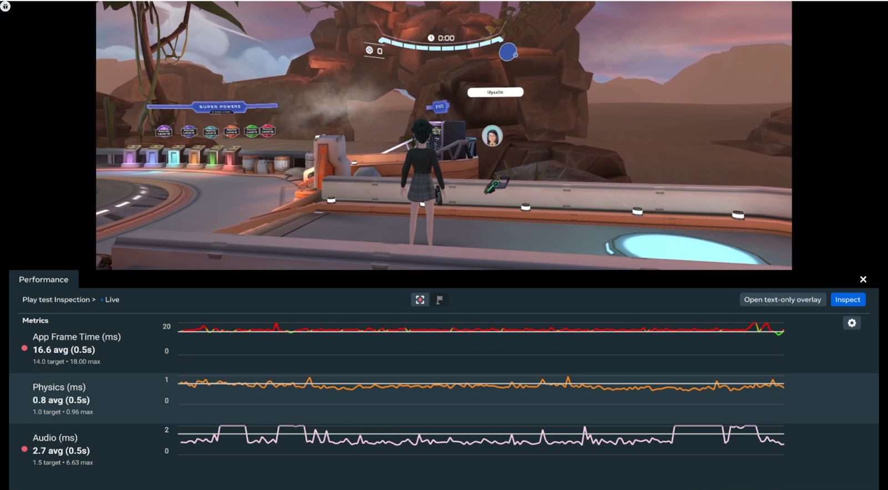
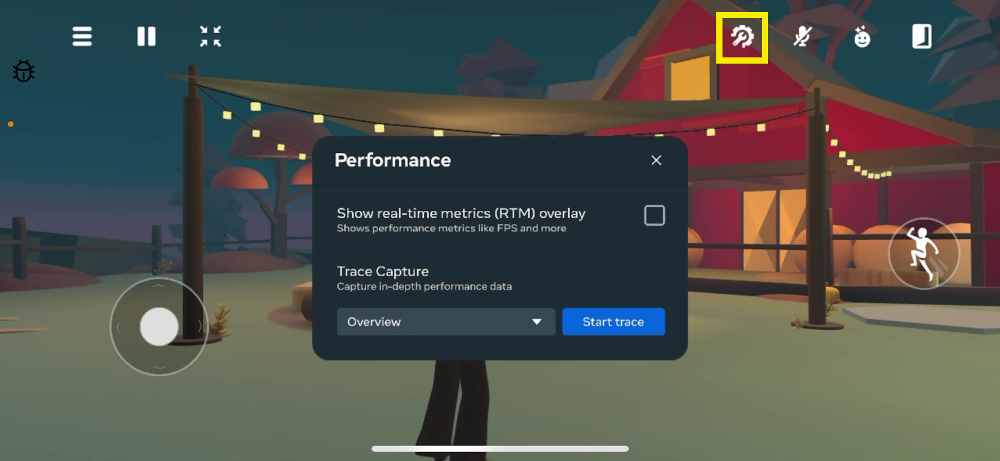
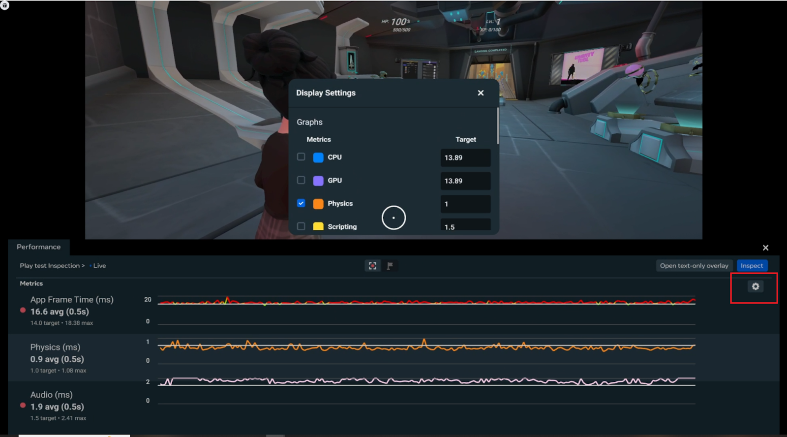
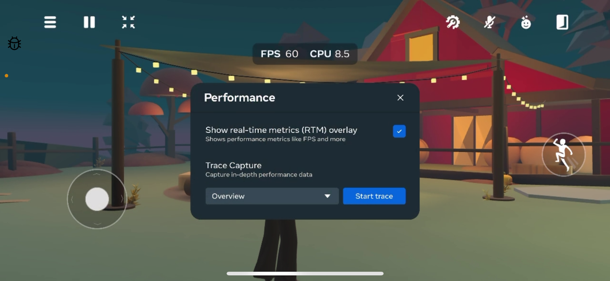
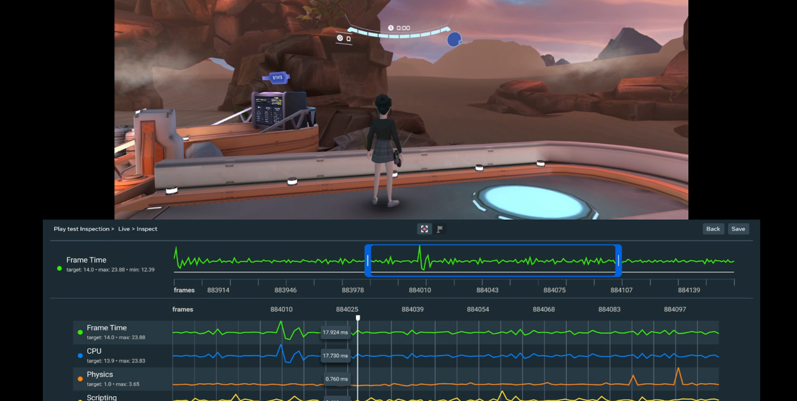
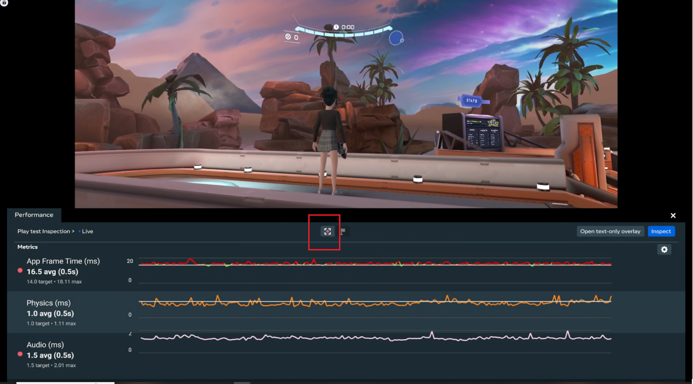
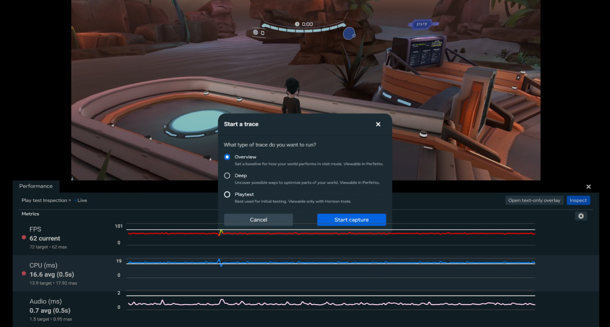
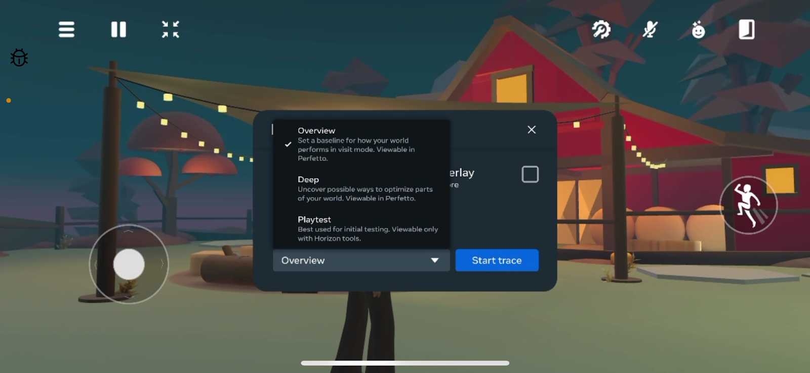
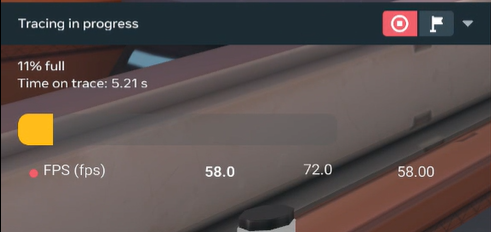
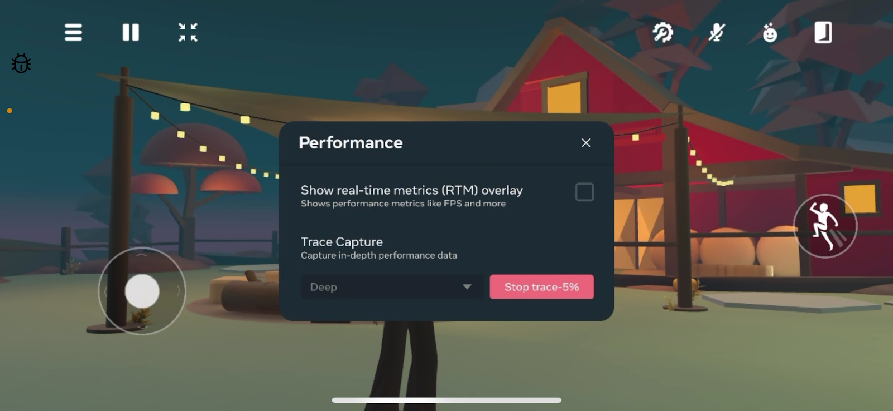

# Using performance tools from web and mobile

Important

 Join the [Meta Horizon Creator Program](https://developers.meta.com/horizon-worlds/programs)! As a member, you gain:

* Access to monetization opportunities including monthly bonuses, in-world purchases and competition cash prizes.
* Helpful resources including educational content, technical support and a collaborative creator community.

Important

 To report bugs, go to the main menu and select **Report a problem**. To give us feedback, select **Help us improve** from the main menu.

Real-time performance metrics and server-side tracing can help creators find and address performance issues in their worlds. In this article, you will learn how to access the performance tools via browser while visiting your world, alleviating the need to put on a VR headset to get performance data about your world.

Let’s begin with opening the Performance panel.

## Opening the Performance panel

In the web browser, the Performance panel displays a real-time view of all currently selected metrics. While visiting a world, press **P** to open the Performance panel. The panel appears at the bottom of the screen, and the world viewport shrinks to accommodate it. Pressing **P** again closes the Performance panel and expands the viewport back to full size.

In mobile, you open the Performance dialog but pressing the **Settings** button (gear and wrench) in the top right corner of the screen.

## Displaying real-time metrics

You can select which real-time metrics to display in the Performance panel by clicking the **Gear** icon to open the Display Settings. From there,simply check the box next to each metric you’d like to see in the Performance panel. Unselected metrics will not be shown.

You can also set a **Target** number for each metric. When a metric exceeds the defined target, a red dot appears next to that metric as an alert.

In mobile, once the Performance dialog is open, click the check box for **Show real-time metrics (RTM) overlay** to see the FPS and CPU metrics.

### Scrubbing (web only)

With Scrubbing, you can review data that has recently appeared on the Performance panel (approximately 30 seconds of data) in detail. Click the **Inspect** button to open the Scrubbing view.

Click and drag the blue box at the top of the panel to the data you would like to review. This box represents a range, measured in frames. You can resize the box by clicking and dragging the handles on the sides of the box.

Below the Frame Time scrubber, a “zoomed-in,” detailed view is shown for each metric, spanning the frames covered by the blue box. By changing the range, you can choose whether to focus on a short span of time, or a broader view over a longer period.

Click the **Back** button to return to the Performance panel.

## Tracing

With Tracing, you can capture performance data from your world to [view in Perfetto](Analyzing%20trace%20data%20with%20Perfetto.md). You can choose between three trace types:

* **Overview** - An overview trace can help set a baseline for how your world is performing in visit mode. It captures high-level data like FPS, CPU, and GPU. Additionally, overview provides a high-level capture of metrics like physics, rendering, and lighting to identify possible sources of performance impact and provide a direction for deeper investigation.
* **Deep** - A deep trace provides scripting information and metrics like draw calls. It’s best used for identifying specific performance improvements like optimizing physics, colliders, and tri/poly count of certain meshes as well as reducing draw calls in a particular area. Deep traces are the most commonly run because they can give more specific, actionable information when it comes to performance optimizations.
* **Playtest** - Playtest capture allows for up to 2 hours of gameplay to be recorded across multiple worlds without needing to be plugged in or running any special software. This type of trace can be taken on any build, anytime, anywhere. Playtest capture generates a report similar to the ones we use internally to track the performance of our hottest worlds and the performance of Horizon itself. Unlike other types of traces, which are viewable in Perfetto, the results of this trace are viewable on the [Horizon website](https://horizon.meta.com/creator/performance/reports). In general, playtest traces are best used for initial testing.

### Starting a trace

In the web browser, click the **Trace** button (red dot with white corner brackets) to open the Start a Trace window.

Then click **Start capture** to begin a trace. While the trace is running, the Performance panel closes and a “Tracing in progress” panel appears in the lower left corner of the screen, showing the trace’s current status. You can add flags to a trace by clicking the **Flag** button on the panel while the trace is running.

In mobile, click the drop-down menu next to the **Start trace** button to select the type of trace you want to run. Click the **Start trace** button to begin a trace.

### Stopping a trace

In the web browser, to end a trace early, click the **Stop** button at the top of the panel.

In mobile, to end a trace early, open the Performance dialog and click the **Stop trace** button.

When a trace is completed in mobile or web, the results are uploaded to the [Developer Dashboard](https://developers.meta.com/horizon/manage/) in the Performance section.

## What’s next?

To learn more about Meta Horizon Worlds, try the following:

- [Create your first world](../../Tutorials/Getting%20started/Create%20your%20first%20world%20tutorial,%20part%201.md) using our step-by-step tutorial.
- If you have issues when running the desktop editor, see [Desktop Editor Troubleshooting](../../Desktop%20editor/Help%20and%20reference/Desktop%20editor%20troubleshooting.md)
- Learn about the desktop editor with the [Introduction to the Desktop Editor](../../Desktop%20editor/Get%20started%20with%20Desktop%20Editor/Introduction%20to%20the%20desktop%20editor.md).
- Learn about the other tools available by reading our [Tools Overview](../../Get%20started/Tools%20overview.md).
- Join the [Meta Horizon Creator Program](https://developers.meta.com/horizon-worlds/programs/) to learn about our program benefits.