# [World Content Traces](#world-content-traces)

World content traces are a special type of [trace](Tracing.md) that allows you to get frame-by-frame details on your world’s performance and understand how the assets in your world might contribute to it. World content traces include data on:

- 3D models
- Textures
- Audio assets
- Colliders
- Lights

Unlike other types of trace data, you’ll use the Desktop Editor to view and analyze world content traces.

## [Prerequisites](#prerequisites)

- [Enable the Utilities Menu](Enable%20the%20Utilities%20menu.md)

## [Start a world content trace](#start-a-world-content-trace)

1. Look at your left wrist to bring up the wrist wearable.
2. Select **Tracing**, then select **World Content**.
3. Select **Start tracing** to start the trace. 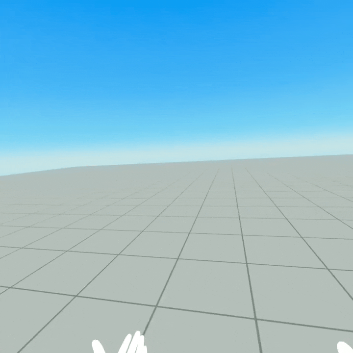
4. Select **Stop trace** to stop the trace. After stopping the trace, a toast notification will appear to let you know that a data file has been uploaded. 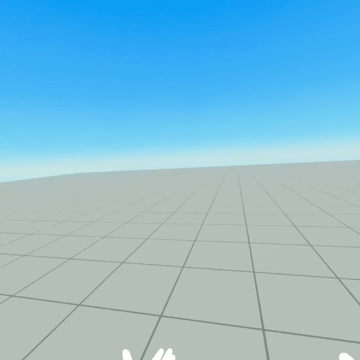

## [View world content trace data](#view-world-content-trace-data)

## [Analyze world content trace data](#analyze-world-content-trace-data)

### [How to read a trace](#how-to-read-a-trace)

1. Use the **Frame Time** graph at the top to navigate between frames. You can drag the blue handles to adjust how many frames are covered in the metric graphs below. 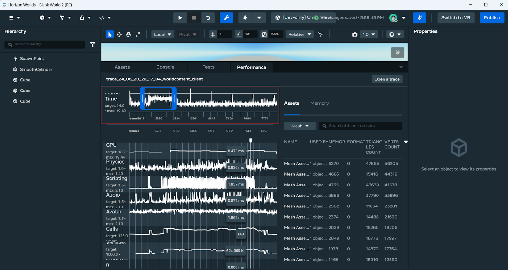
2. Read the performance metrics on the left of the trace to find frames with spikes or that don’t hit the performance targets. These are frames where the world might be encountering performance bottlenecks. 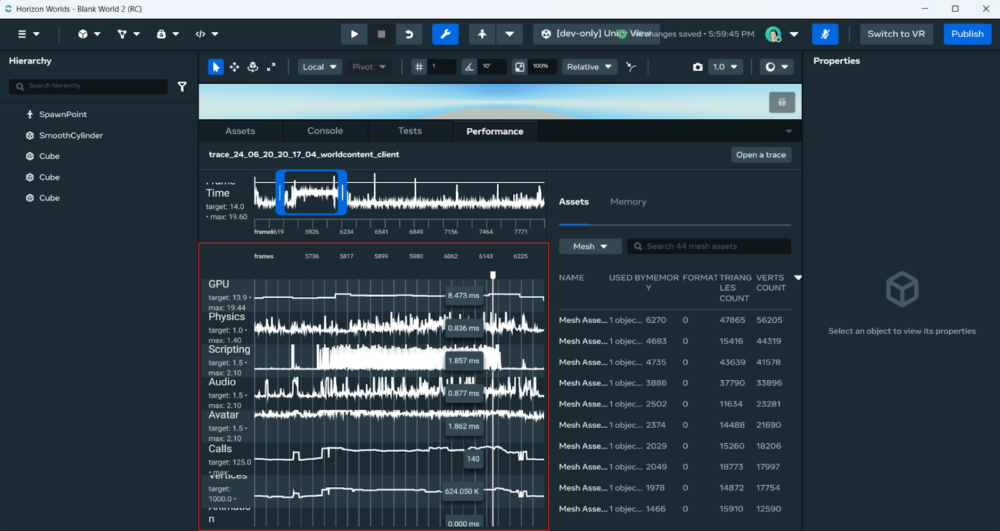
3. Select a specific frame by clicking on it on the performance graph. 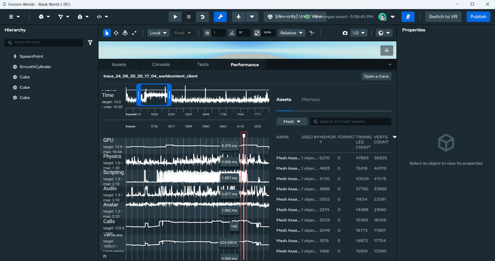
4. Once you’ve selected a frame, the panel on the right will display a table of the objects or assets present in that frame. 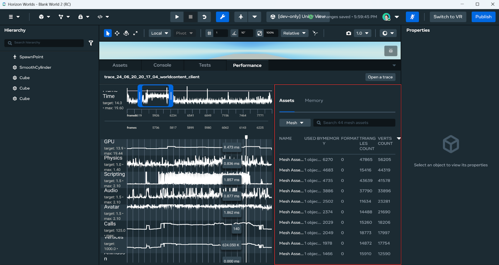
5. Use the dropdown to navigate between asset categories. 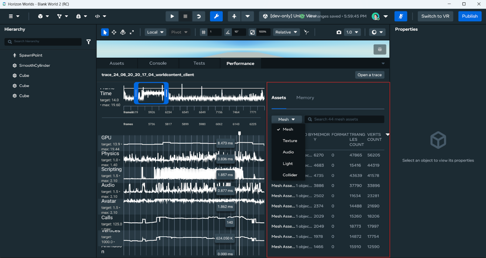
6. Select the **Memory** tab to view how assets impact memory usage. 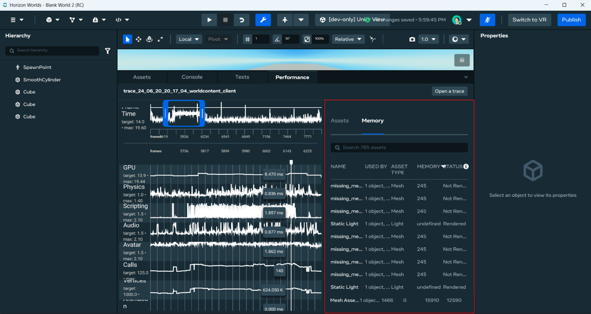
7. Using the information in each table, you can identify assets to optimize or remove to increase performance.

#### [Example 1: Memory](#example-1-memory)

Let’s say you see a spike in memory for a particular frame.

1. Using the **Performance** panel, navigate to the target frame and select the **Memory** tab on the right. In the **Memory** tab, you will see a list of assets that contributed to the frame’s memory usage, sorted by their size.
2. Use this table to identify which textures, audio, or 3D models to optimize to reduce the memory load on your target device(s).

#### [Example 2: Rendering](#example-2-rendering)

Let’s say you see a spike in the draw calls and verts metrics for a particular frame.

1. Using the **Performance** panel, navigate to the target frame. The panel on the right will display a list of 3D models that present in the selected frame, sorted by number of vertices. You can also use the dropdown to view other asset categories like textures and lights that may have contributed to the frame’s high draw call values.
2. Use these tables to identify which assets to optimize to reduce the rendering load on your target device(s).

### [Other tips](#other-tips)

- Some assets have long names that don’t fit in the table’s cell. Hovering over an asset shows the full asset name. 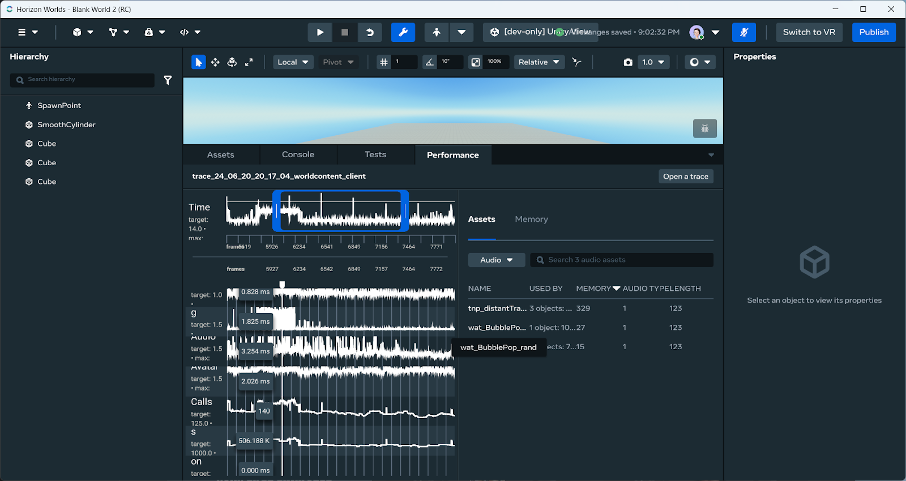
- The table allows you to see which objects use a particular asset. Hovering over a cell in the “Used by” column shows which objects use that asset. 
- You can select the header of a column to sort the table by that column. For example, selecting the **Triangles** column sorts the table by the number of triangles. 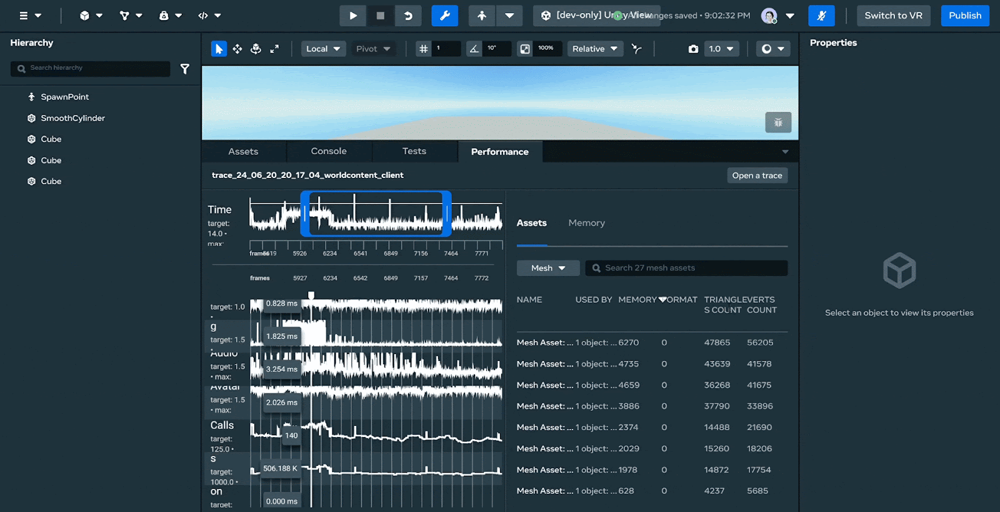
- Use the search feature to find assets or filter through certain characteristics by name. For example, typing “box” shows rows that contain cells with the string “box”. 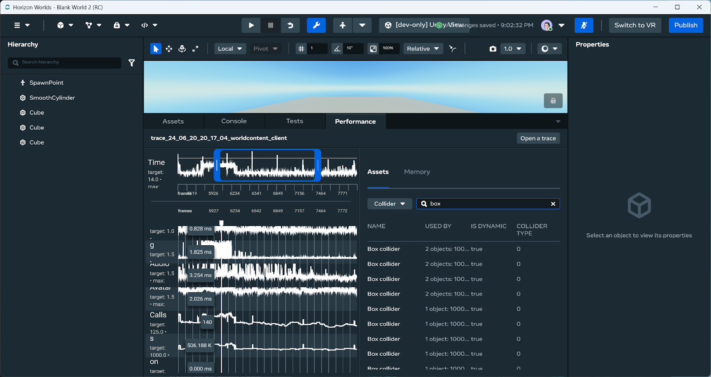

