## [Release Notes](#release-notes)

Wondering what's new with Meta Horizon worlds? Take a look at our release notes to learn about the latest new features and enhancements we've made to your Meta Horizon worlds experience.

---

# [Meta Horizon v250 Release Notes](#meta-horizon-v250-release-notes)

The v250 release provides better visibility for creators by making World Broadcast available to everyone. Read all about it below!

Read on for more details on Meta Horizon v250:

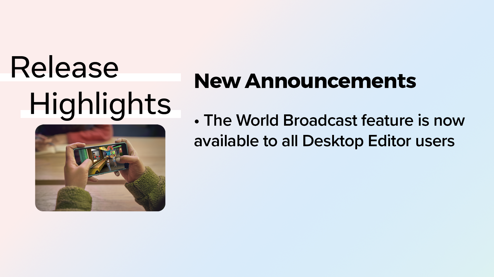

## [New Features](#new-features)

- **World Broadcast** is now available for everyone. This feature creates streams from live cameras that you place in your world to best show off the action and excitement. The World Broadcast feed is then shown on surfaces such as the Meta Horizon App feed and other Meta platforms such as Facebook and Instagram. For details on how to get started check out the [documentation and samples](Scripting/API%20references%20and%20examples/World%20broadcast/World%20Broadcast.md).

---

# [Meta Horizon v249 Release Notes](#meta-horizon-v249-release-notes)

The v249 release provides greater control over mobile input styles and fixes a few bugs for Noesis. Read all about it below!

Read on for more details on Meta Horizon v249:

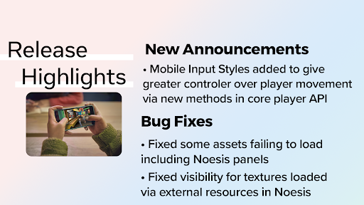

## [New Features](#new-features-1)

- **Mobile Input Styles** provide greater control over how you want your player movement speeds to work on mobile, by providing adjustable threshold steps that control speed increases from walk through to sprint. See the new methods (setMobileInputStyleDefault(), setMobileInputStyleComfortable(), setMobileInputStyleAlwaysSprint()) in the [core player API](Reference/core/Classes/Player.md), and the tutorial for more [details](Mobile%20and%20web/TypeScript%20APIs%20for%20mobile/Mobile%20Input%20Styles.md).

## [Bug Fixes](#bug-fixes)

- Some assets would occasionally fail to load (including Noesis panels).
- Only owners could see Textures loaded via external resources in Noesis.

---

# [Meta Horizon v244 Release Notes](#meta-horizon-v244-release-notes)

The v244 release contains the ability to generate 3D heatmap data for worlds and updates the the creative guidelines for world preview images in the Navigator UI ahead of its release, giving creators even more insight into their worlds. Read all about it below!

Read on for more details on Meta Horizon v244:

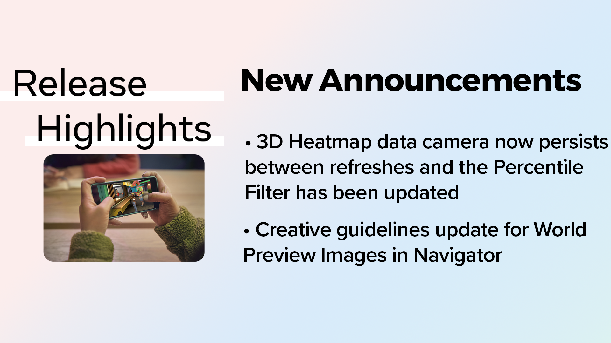

## [Quality Of Life Improvements](#quality-of-life-improvements)

- **[Developer Dashboard](https://horizon.meta.com/creator/worlds_all/) 3D Heatmaps**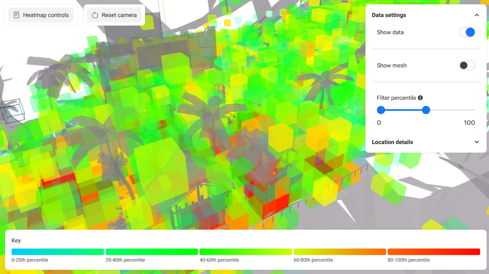
- - The camera will now persist between refreshes, allowing creators to compare metrics with the same camera angles viewing their data.
  - When filtering data using the Data Settings: Percentile Filter, the heatmap will now recolor the data-cubes based on what is visible. This allows better viewing of high value areas of a world.
  **Creative Guidelines for World Preview Images in Navigator**
  - During the developer keynote at Connect, you may have seen our redesigned UI called Navigator – a personalized hub that makes navigating the metaverse intuitive and seamless.
  - This updated navigation will be coming soon, so to prepare, we’ve updated our [creative guidelines to include world preview images](Save%2C%20optimize%2C%20and%20publish/Worlds%20Asset%20Design%20Guidelines.md), which will help attract users and communicate what makes your world unique within Navigator.
  - While adding preview images is optional at this time, we highly recommend adding them soon and at least reviewing these new guidelines to ensure you have high-quality images.

---

# [Meta Horizon v243 Release Notes](#meta-horizon-v243-release-notes)

The v243 release contains the ability to generate voices for AI NPCs, as well as quality of life improvements for Noesis and a bunch of bug fixes, making building worlds easier and smoother than ever before. Read all about it below!

Read on for more details on Meta Horizon v243:

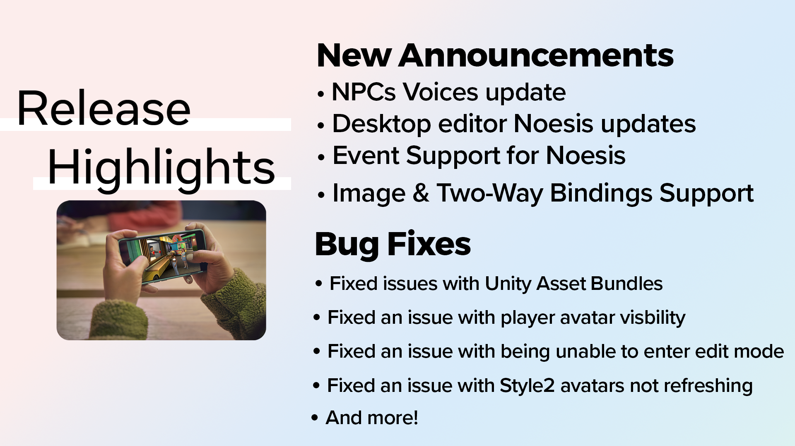

## [New Features](#new-features-2)

- **NPC Voices update:** When creating an AI NPC in the desktop editor you can now generate a voice for using AI. For more information, check the documentation [here](Desktop%20editor/NPCs/NPC%20Conversation/AI%20Speech%20NPCs.md#voice-and-speech).

## [Quality Of Life Improvements](#quality-of-life-improvements-1)

- Noesis Updates.
  - Noesis Gizmo API now exposes two most requested methods:
    - `setLocalEntityVisibility(visible: boolean):` Show/hide UI locally for the client
    - `changePage(xamlFile: NoesisAssetResource, dataContext?: IUiViewModelObject):` Dynamically switch XAML pages and optionally set a new data context

* **Command Parameter Support:** Developers can now utilize the CommandParameter attribute on XAML UI elements to pass a custom parameter directly to the corresponding TypeScript command handler
* **MouseMove Event Support:** UI elements can now respond to mouse movement using the `MouseMove` event
* **Image Resource Bindings:** Bind image assets to UI Elements in XAML with `{Binding Path=image}` from TypeScript
* **Two-Way Data Binding:** Use `Mode=TwoWay` in XAML for live sync between UI and TypeScript logic
* Support has been added for `GlobalResources.xaml`, which is heavily used by Noesis Studio. This feature enables seamless code sharing across various XAML pages
* **Animation Complete Trigger:** Add triggers for Storyboard completion using the `Storyboard Completed Trigger` and `InvokeCommandAction`

## [Bug Fixes](#bug-fixes-1)

- Fixed the issue with Unity Asset Bundles failing to load textures.
- Fixed an issue where the remote player's avatar is invisible while their player positions and colliders are correct.
- Fixed an issue with the Style2 avatar not refreshing after making changes from the web editor.
- Fixed an issue with being unable to enter the edit mode of a world, resulting in getting kicked out with an error message during loading.
- Fixed an issue with the avatar staying in the sitting pose when trying to move or stand up from a seat on XS platforms.
- Fixed an issue with the matchmaking player limit where only 9 out of 10 players could join worlds, preventing full participation.
- Fixed an issue where Rocky (the AI pet enthusiast NPC from the Pets Park pre-release) had a disembodied voice which could only be heard in certain locations, not attached to his mesh.
- Added the Custom UI Bindings Garbage Collection feature, reducing memory leaks caused by lack of garbage collection for CustomUI bindings.

---

# [Meta Horizon v241 Release Notes](#meta-horizon-v241-release-notes)

The new toolbar is now live as part of the v241 release, making building worlds easier and more intuitive for all creators. We look forward to hearing your feedback! This update also features functionality to record your world (MHCP only), customizable names and visibility for leaderboards and tiering for digital items (MHCP only), and updates to NoesisUI in the desktop editor. Read all about it below!

Read on for more details on Meta Horizon v241:

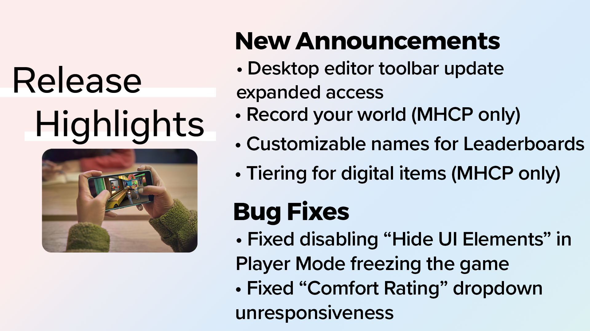

## [New Features](#new-features-3)

- **Record your world (MHCP only):** We have begun to rollout access to a new tool in the desktop editor that lets you capture and export footage from different points of views, including player POV or by placing a camera anywhere you want in your world. You can even control what is included in your recording, like global audio, name tags, your avatar and audio, and even UI elements. At this time, the feature is only available to a subset of MHCP users, but we plan to continue expanding access to more world builders over time. To learn more, read the documentation [here](Save%2C%20optimize%2C%20and%20publish/Record%20world%20videos.md).
- **Customizable External Names and Visibility for Leaderboards:** Creators can now set a descriptive external name for each leaderboard and choose whether it is visible outside their world. When enabled, leaderboards and their names may appear in Facebook, Instagram and the Horizon mobile app, making it easier for users to understand what each leaderboard represents. The specific surfaces where leaderboards are shown will be determined by Meta. This update gives creators more control and improves clarity for users.
- **Tiering for Digital Items (MHCP Only):** Creator made avatar clothing will now be tiered as Common, Premium, Elite, and Legendary to help show the value of items to users. To learn more read the documentation [here](Avatars/Digital%20Item%20Tiering.md).
- **NoesisUI**: Creators can now specify a parameter for Command callback.

## [Bug Fixes](#bug-fixes-2)

- Fixed disabling the "Hide UI elements" setting in Player Mode freezing the game.
- Fixed the 'Comfort Rating' dropdown being unresponsive when publishing a world.
- Fixed an issue with asset pool gizmo.
- Fixed an issue with asset spawning.
- Fixed an issue with Unity Asset Bundles failing to load textures.

---

# [Meta Horizon v240 Release Notes](#meta-horizon-v240-release-notes)

The Horizon desktop editor toolbar has been updated! The updated toolbar improves the categorization of features including build options, systems options, preview options, scripts, and GenAI functions. Additionally, the NPC feature has been updated with an expanded catalogue of voices to add to your created NPC characters.

Read on for more details on Meta Horizon v240:

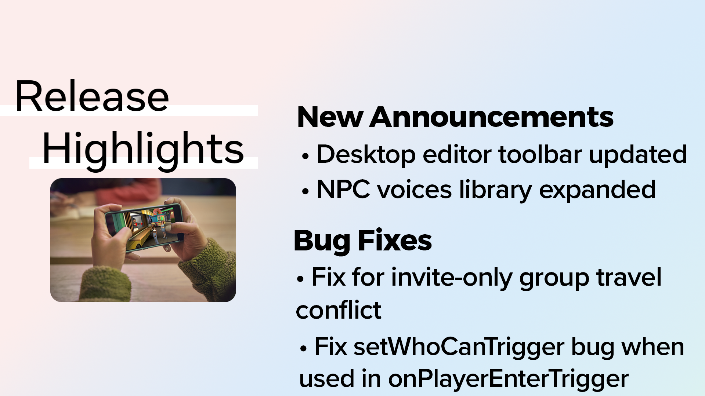

## [New Features](#new-features-4)

- Horizon desktop editor toolbar updated with updated categorization for build options and features in the desktop editor. Check the updated [Creator Tools](Desktop%20editor/Get%20started%20with%20Desktop%20Editor/User%20interface/Creator%20Tools.md) page for more information.
- We’ve updated the NPC voice process with an expanded catalogue of voices. You can now assign enhanced voices from a curated set of voices during the NPC creation process. Learn more [here](Desktop%20editor/NPCs/NPC%20Conversation/AI%20Speech%20NPCs.md#voice-and-speech).

## [Bug Fixes](#bug-fixes-3)

- Fixed invite-only group travel conflict when multiple invite-only travel are created at the same time.
- Fixed setWhoCanTrigger bug when used inside onPlayerEnterTrigger.
- Fixed several Custom UI issues including server-side rendering problems, failures to load to due to "event" from async, and an Intermittent Ownership Transfer failure causing missing Custom UI or Logic.
- Fixed a bug causing the player entity to be missing during PlayerJoin/PlayerLeave.

---

# [Meta Horizon v239 Release Notes](#meta-horizon-v239-release-notes)

**"Mobile Innovation" Competition (MHCP Only)**: We're excited to announce our grand finale competition for 2025, Mobile Innovation! This competition finale for 2025 challenges creators to design and build experiences that redefine what's possible on mobile devices within Horizon Worlds. Whether it's optimizing for touch, designing out-of-the-box mobile-first interactions, or leveraging the unique capabilities of smartphones, this theme is all about pushing the boundaries of mobile creativity and capabilities on Meta Horizon. Visit the [competition site](https://mhcp-mobile-innovation.devpost.com/) to learn more about the competition, how we'll judge, and what it will take for you to be eligible to win.

Additionally, in v239 we're adding NoesisUI to the Horizon desktop editor! NoesisUI empowers users to build more robust and performant 2D UIs for their world.

Read on for more details on Meta Horizon v239:

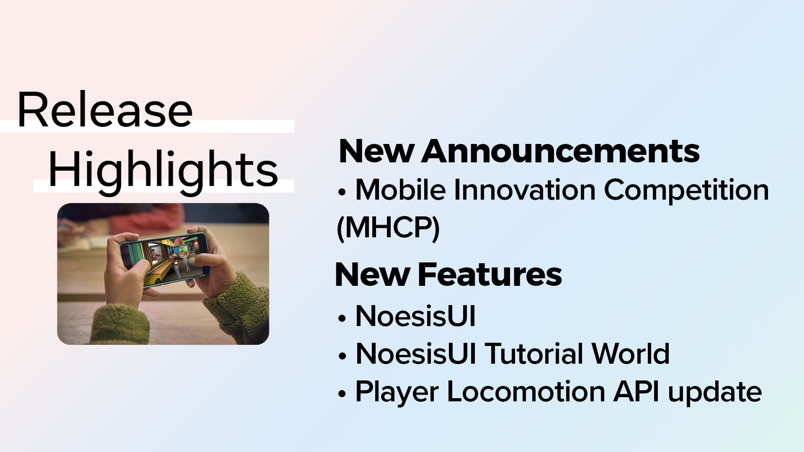

## [New Features](#new-features-5)

- **NoesisUI for Desktop Editor:** NoesisUI is a new 2D UI solution we have added to Horizon editor so creators can build more compelling, creative and performant 2D UI panels. When using Noesis with the desktop editor, users can build their UI panels in Noesis Studio and import them into the desktop editor. Check the documentation here for information on [creating your Noesis panels](Desktop%20editor/NoesisUI/Create%20a%20Noesis%20UI%20Panel.md), [configuring your NoesisUI panel](Desktop%20editor/NoesisUI/Customizing%20Noesis%20UI%20Behavior.md), [setting up animations for your panels](Desktop%20editor/NoesisUI/Noesis%20UI%20Animations.md), [performance considerations](Desktop%20editor/NoesisUI/Noesis%20UI%20Performance%20Considerations.md), and [fonts](Desktop%20editor/NoesisUI/Noesis%20UI%20Fonts%20Usage.md).
- **NoesisUI Tutorial World:** A new [tutorial world](https://developers.meta.com/horizon-worlds/learn/documentation/tutorial-worlds/noesis-ui-tutorial-world/module-1-setup) is also available that demonstrates the NoesisUI integration in the desktop editor and provides examples for implementing NoesisUI into your world. Check out the NoesisUI tutorial world here.
- **Player Locomotion API:** The player class in TypeScript now includes locomotion functions previously exclusive to NpcPlayer, enabling local player movement, pathfinding, jumping, and rotation. Great for 'tap to move' gameplay styles, see the API docs and tutorial for details.

## [Bug Fixes](#bug-fixes-4)

- Fixed a GPU crash that could occur when switching templates.
- Follow Camera: Vertical Offset can now be set up from the spawn point.
- The SharingAPI will now correctly pass the shareID variable instead of null.

---

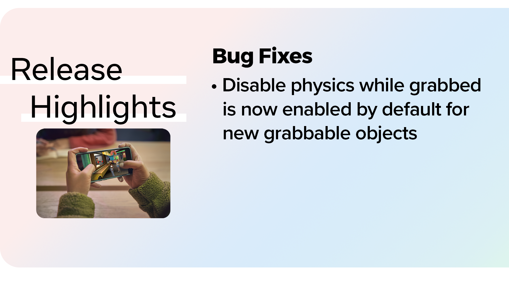

# [Meta Horizon v238 Release Notes](#meta-horizon-v238-release-notes)

Read on for more details on Meta Horizon v238:

## [Bug Fixes](#bug-fixes-5)

- "Disable physics while grabbed" option is now enabled by default for new grabbable objects.

---

# [Meta Horizon v237 Release Notes](#meta-horizon-v237-release-notes)

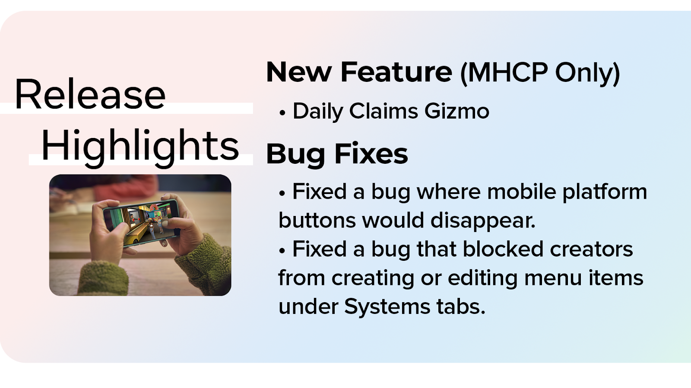

Read on for more details on Meta Horizon v237

## [New Features](#new-features-6)

- **Daily Claims Gizmo (MHCP Only):** Creators can now boost player engagement by adding the Daily Claims Gizmo to their worlds. This feature allows you to reward players with in-world items that can be claimed once per day, encouraging consistent visits and interaction. Players simply log in after 1:00 AM UTC and interact with the gizmo to claim their daily reward. Progress is preserved if a day is missed, so players can continue where they left off. The gizmo supports customizable reward sequences, UI themes, and auto-repeat cycles. Learn more about setting up and using the Daily Rewards Gizmo [here.](https://developers.meta.com/horizon-worlds/learn/documentation/code-blocks-and-gizmos/daily-claims-gizmo)

## [Bug Fixes](#bug-fixes-6)

- Fixed truncation issue with **"Other items in this world"** text on mobile avatar item product description pages.
- Fixed a bug where users could experience a "Problem with connecting to the world" error when joining a new world.
- Fixed a bug where certain system drop down menus did not function correctly, blocking creators on creating or editing menu items under **Systems** such as **Commerce, Navigations** and more.
- Fixed a bug where users may crash when loading into worlds via the mobile app.
- Fixed a bug where mobile platform buttons may disappear when exiting and re-entering worlds.

---

# [Meta Horizon v236 Release Notes](#meta-horizon-v236-release-notes)

Read on for more details on Meta Horizon v236

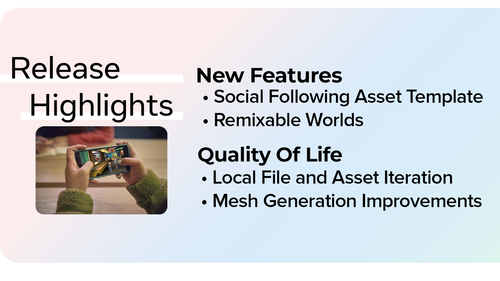

## [New Features](#new-features-7)

- **Social Following API/Asset Template:** Creators can now showcase a curated list of Instagram and Horizon profiles in their world using the Social Following Asset Template, or the new `showProfilesToFollow` API. When users click the Social Following Asset or the `showProfilesToFollow` API is called, a dedicated page opens where users can browse and choose which Instagram or Horizon profiles to follow—making it easier for users to connect and stay up to date with their favourite creators. Learn more [here](Gizmos/Social%20Following%20for%20Instagram%20and%20Horizon.md).
- **Remixable Worlds:** Remixable Worlds is a feature, now available to all, that allows creators to make their world(s) cloneable by other creators to build on top of. Available worlds for creators to remix can be found on the Creation Home page of the Horizon editor in the *Worlds to Remix* section. Creators can make their worlds remixable in the Publish window within the editor. Learn more about this feature [here](Save%2C%20optimize%2C%20and%20publish/Horizon%20Remix%20Worlds.md).

## [Quality Of Life Improvements](#quality-of-life-improvements-2)

- **"Disable physics while grabbed"** option is enabled by default for new grabbable objects.
- Added filtering to the creation of NPCs to avoid any terms of service violations during NPC character creation rather than after.
- Creators can now iterate on their local files and refresh their assets by using the right-click menu without needing to go through all the import modal and file selection processes.
- Creators will now have one choice for Mesh Generation. This new update enhances the current Mesh Generation model. Learn more [here.](Desktop%20editor/Generative%20AI%20tools/Generative%20AI%20Mesh%20Generation%20Tool.md)

## [Bug Fixes](#bug-fixes-7)

- Fixed a bug where the **"Combine Selection"** option when combining assets in the hierarchy would not show or work as intended.
- Fixed a bug where NPC nametags could be shuffled and assigned to the incorrect NPCs.
- Fixed a bug where NPCs would all follow the same locomotion path, regardless of creator intent.

---

# [Meta Horizon v235 Release Notes](#meta-horizon-v235-release-notes)

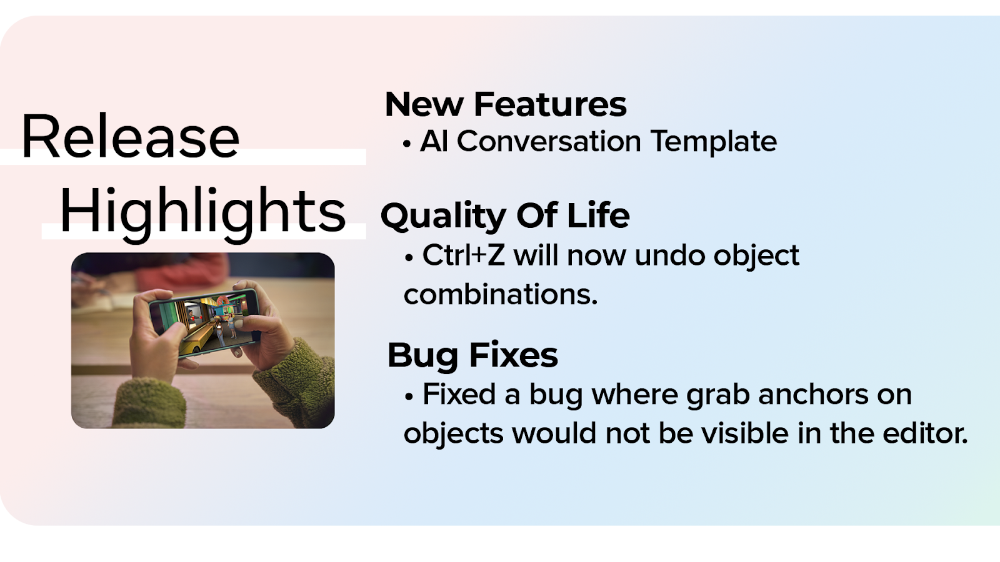

## [New Features](#new-features-8)

- **New Template World:** We are launching a new template world to help creators speed up their development. Find this when opening the editor in the creation home under the Template header.
  - **AI Conversation Template:** This template provides step-by-step instructions for setting up NPCs, customizing their personalities, and configuring how they respond to player actions and game events. Learn more about this template [here](https://developers.meta.com/horizon-worlds/learn/documentation/tutorial-worlds/ai-conversation-tutorial/module-1-introduction).

## [Quality Of Life Improvements](#quality-of-life-improvements-3)

- After selecting an object in the hierarchy and combining that selection with another entity, Ctrl+Z will now undo that combination if desired.
- 3D model implementation is now aligned with asset template implementations to fix lighting inconsistencies between models when spawning.
- Added NPC avatar turn animations for smaller turn radius' to reduce NPC "feet sliding".
- The player variable three-dot menu button is now hidden if there are no actions to show.

## [Bug Fixes](#bug-fixes-8)

- Fixed a bug where saved asset templates in the asset library would show gizmos in thumbnails incorrectly.
- Fixed a bug where applying a texture to an imported animated model caused a duplicate model to load.
- Fixed a bug when manually uncombining a combined asset, its position would become offset and change.
- Fixed a bug when combining texturized shapes or assets that would cause those assets to lose their original assigned texture.
- Fixed a bug where the mouse cursor would disappear after exiting preview mode in the editor.
- Fixed an issue where selecting local mode CustomUI in preview mode resulted in the UI disappearing.
- Fixed a bug where grab anchors on objects would not be visible in the editor.
- Fixed a bug with avatar bounding box height that was causing incorrect and unintended collisions.
- Fixed a bug where the World Shop and Daily Reward gizmos would not display properly.

---

# [Meta Horizon v234 Release Notes](#meta-horizon-v234-release-notes)

**Reminder:** The "Mobile Genre Showdown: Reloaded" competition is live and focused on designing and building new, innovative worlds with GenAI tools for Meta Horizon that work seamlessly on mobile, centered around specific genre games such as Simulation, Roleplay and Avatar Sim. The submission period is open until October 30th, 2025. This is your chance to shine with the top 4 genre winners each taking home a whopping $200,000 each. Plus, 31 more talented creators will share $1,700,000 across multiple exciting categories Visit the [competition site](https://mhcp-mobile-genre-2.devpost.com/) to learn more about the competition, how we'll judge, and what it will take for you to be eligible and win.

Read on for more details on Meta Horizon v234:

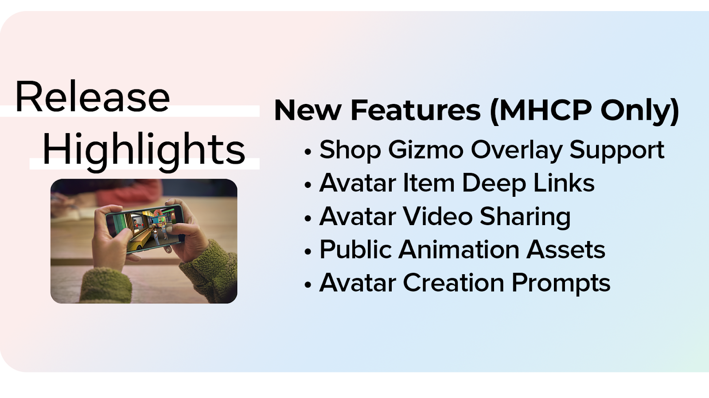

## [New Features](#new-features-9)

- **Shop Gizmo Screen Overlay Support (MHCP Only):** The world shop gizmo got an upgrade, it can now be displayed as a screen overlay, instead of the already existing spatial panel, via the new property "Display Mode". When set to "Overlay", but still in edit mode, the only notable change is the appearance of the close button on the panel. Start the simulation and you will see it disappear. To display it, or later hide it, use the new `setShopOverlayVisible` function. Learn more about the shop gizmo [here](Gizmos/Shop%20gizmo.md).
- **Avatar Item Deep Links (MHCP Only):** Creators can now amplify the visibility of their created avatar items available outside their worlds by sharing direct links to individual listings and storefronts. After listing an item for acquisition outside your worlds, you can generate a shareable URL from the creator portal's item inventory page. These links can be pasted across platforms like Facebook, Instagram, and more, driving engagement and making it easier for users to discover and acquire your creations. Storefront links let users view all your listed items in one place. Learn more about this new feature [here](MHCP%20program/Monetization/Link%20to%20listed%20items.md).
- **Avatar Video Sharing (MHCP Only):** Creators can now share avatar-centric videos directly from Horizon to platforms like Facebook and Instagram, boosting the visibility and engagement of their digital goods. With the new Avatar Video Sharing feature, you can customize your avatar's look, add emotes and backdrops, and showcase avatar goods before sharing. When viewers see your avatar video on IG Stories, they can tap to explore and purchase the digital goods your avatar is wearing, driving discoverability and sales. This integrated experience creates a flywheel effect encouraging more engagement and purchases across the Horizon ecosystem. To get started, ensure you have the Horizon and IG apps installed, access to Video Composer, and your accounts linked. Learn more about this new feature [here](MHCP%20program/Monetization/Avatar%20Posts.md).
- **Public Animation Assets (MHCP Only):** We have released Public Animation Assets, available now for scripting on both Player and Non-Player Characters. This makes available an initial set of animations currently used on player characters including six core emotes, weapon animations and more. Creators can start experimenting with animation scripting without needing to learn how to make new animations themselves. Please check out the new assets in the Public Asset Library to see the full list which can now be found with a new animations asset filter! Learn more [here](https://developers.meta.com/horizon-worlds/learn/documentation/full-bodied-avatars/creating-avatar-animations).
- **Avatar Creation Prompts (MHCP Only):** Avatars can now be created by AI prompts! This feature was highlighted at Connect and is an expansion of our generative AI tooling suite to help you create new types of fully-rigged avatars from simple prompts. You can learn more about how to create avatars and NPCs on Horizon [here](https://developers.meta.com/horizon-worlds/learn/documentation/desktop-editor/npcs/npc-gizmo/prompt-to-avatar-npcs).

## [Quality Of Life Improvements](#quality-of-life-improvements-4)

- We've improved panel management, making it easier to work with your projects. You can now show or hide the hierarchy and property panels as needed.
- The editor will also remember your last settings when you reopen it, including whether the hierarchy, property, and bottom navigation panels are expanded or collapsed, which tab you had selected, and whether the Gen AI modal was open or closed.

---

# [Meta Horizon v233 Release Notes](#meta-horizon-v233-release-notes)

**"Mobile Genre Showdown: Reloaded" Competition (MHCP Only):** We're excited to announce our fourth Meta Horizon Creator Competition in 2025, our biggest competition yet, with a chance to win a share of $2.5 million for all MHCP creators!

The "Mobile Genre Showdown: Reloaded" competition is focused on designing and building new, innovative worlds with GenAI tools for Meta Horizon that work seamlessly on mobile, centered around specific genre games such as Simulation, Roleplay and Avatar Sim. Creators are also encouraged in this competition to leverage the new GenAI features. The submission period is open from now until October 30th, 2025. This is your chance to shine with the top 4 genre winners each taking home a whopping $200,000 each. Plus, 31 more talented creators will share $1,700,000 across multiple exciting categories.

Visit the [competition site](https://mhcp-mobile-genre-2.devpost.com/) to learn more about the competition, how we'll judge, and what it will take for you to be eligible and win.

Read on for more details on Meta Horizon v233

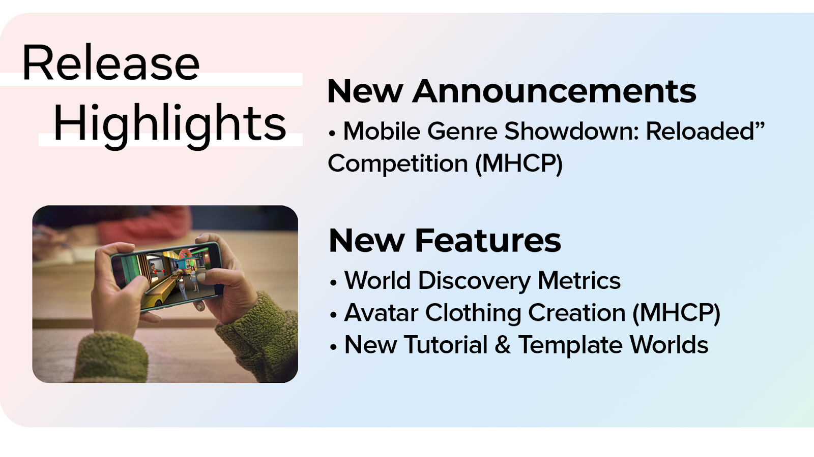

## [New Features](#new-features-10)

- **Transforming World Discovery:** We are continuously working on creating an intuitive, trusted, and effective discovery system, making it easy for users to find great experiences and for creators to grow with confidence. Rolling out now over time, we are excited to announce the following:
  - The World Detail Page (WDP) is being redesigned for a cleaner, smarter look, elevating creator recognition and making it easier for users to quickly see why a world is worth joining and jumping in right away.
  - We're introducing a new World Visits metric, so you can now easily see how popular a world truly is by viewing the real number of people who have joined each world. Find this in the Creator Portal.
  - A new world's rating system that lets you see feedback about your world, helping you optimize for the best user experiences.
- **Avatar Clothing Creation (MHCP Only):** We're excited to announce the expansion of clothing creation tools to all MHCP creators in Horizon Worlds! Creating and selling avatar clothing offers a new way for creators to enhance their worlds, monetize their creativity, and reach new audiences.\
  For avatar clothing creation and best practices, items must be rated 10+, adhere to content guidelines, create original content and leverage AI responsibly. Learn more about this feature [here](https://developers.meta.com/horizon-worlds/learn/documentation/full-bodied-avatars/avatar-clothing-creation-and-selling).
- **New Tutorial and Template Worlds:** We are launching two new tutorial worlds and one new template world to help creators speed up their development. Find these when opening the editor in the creation home under the Tutorial and Template headers.
  - **Sim Tycoon | Template:** This tutorial contains all the game logic and systems needed for compelling player progression within a Sim Tycoon like game. It is designed to be easily reskinned and rethemed to anything the player can imagine. Learn more [here](https://developers.meta.com/horizon-worlds/learn/documentation/tutorial-worlds/sim-tycoon-tutorial/module-0-setup).
  - **Custom UI | Tutorial:** UI is very hard! With this sample world we provide several useful UI elements for Creators to copy and use in their game. Learn more [here](https://developers.meta.com/horizon-worlds/learn/documentation/tutorial-worlds/custom-ui-tutorial-world/zone-0-setup).
  - **New User Experience | Tutorial:** This sample world contains many useful components to help new users learn the game in a more step-by-step way: arrows to lure them to points of interest, hint texts, and the ability to lock progression on certain actions. Learn more [here](https://developers.meta.com/horizon-worlds/learn/documentation/tutorial-worlds/new-user-experience-tutorial/module-1-setup).

## [Quality of Life Improvements](#quality-of-life-improvements-5)

- Improved tooltips on the NPC character creation screen for the Edit Avatar and Edit Character buttons for explaining when functionality gets disabled and why.
- Triggering animations on avatars with TypeScript can now be supplied an onEndBehavior to define whether to end, loop or pause when the animation is complete, replacing the Loop flag and adding the new option to pause on the final frame of an animation until canceled.
- Player avatars will now be hidden when editing with others in the desktop editor and not in preview mode.

## [Bug Fixes](#bug-fixes-9)

- Fixed a bug where a user's avatar would move forward unintentionally causing the user to look through their avatar's body.
- Fixed a bug where an avatar loaded into a world would fail resulting in a placeholder avatar.
- Fixed a bug where switching mobile avatars while in-world could cause swapped avatar issues.
- Fixed a bug where spawning a portal could break CustomUI for other users.

---

# [Meta Horizon v231 Release Notes](#meta-horizon-v231-release-notes)

Reminder: Submit your project for the Meta Horizon Creator Competition by September 10, 2025 (11:45 P.M. Pacific Time), for a chance to win part of over $1.5 million in cash prizes across Remixable Worlds, Tutorial, and Interactive Asset challenges. Don't miss this opportunity. Learn more [here](https://mhcp-open-source-competition.devpost.com/).

Read on for more details on Meta Horizon v231:

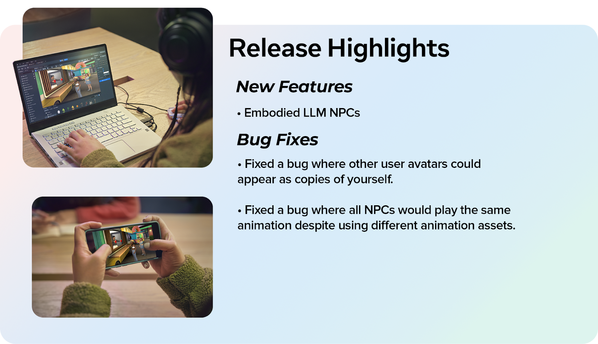

## [New Features](#new-features-11)

- **Embodied LLM NPCs:** Today, we're excited to share that LLM-powered NPCs that support dynamic conversations are rolling out to the Worlds Desktop Editor starting Wednesday, September 10th. This new update will enable you to:
  - Make customizable NPCs that can engage in lifelike conversation by responding to player voice input.
  - Leverage our character building tools to specify scripted responses in combination with LLM responses.
  - Select voices from a voice library that can speak scripted and non-scripted dialogue.
  - Use your embodied NPCs in both VR and mobile worlds.
- As part of this update, we're also expanding the Character Builder panel with new features that you can use to define various characteristics for your NPCs, including your character's name, story, personality, dialogue, and test their responses. Later this year we'll also be adding functionality that enables your characters to feel even more authentic by leveraging AI to trigger in-world actions, dynamically converse with real players and more. Learn more [here](Desktop%20editor/NPCs/NPCs%20Overview.md).

## [Bug Fixes](#bug-fixes-10)

- Fixed a bug where other user avatars could appear as copies of yourself.
- Fixed a bug where Horizon interact buttons would display incorrectly over Custom UI.
- Fixed a bug where some avatars when using a first person view, would obstruct the player view while grabbing objects that use two handed grab presets.
- Fixed a bug where NPC character builder instructions and guardrails had no example text.
- Fixed a bug where all NPCs would play the same animation despite using different animation assets.

---

# [Meta Horizon v230 Release Notes](#meta-horizon-v230-release-notes)

This week, Worlds desktop editor is now in General Availability. Thank you for your feedback helping us improve the desktop editor during Early Access!

Read on for more details on Meta Horizon v230

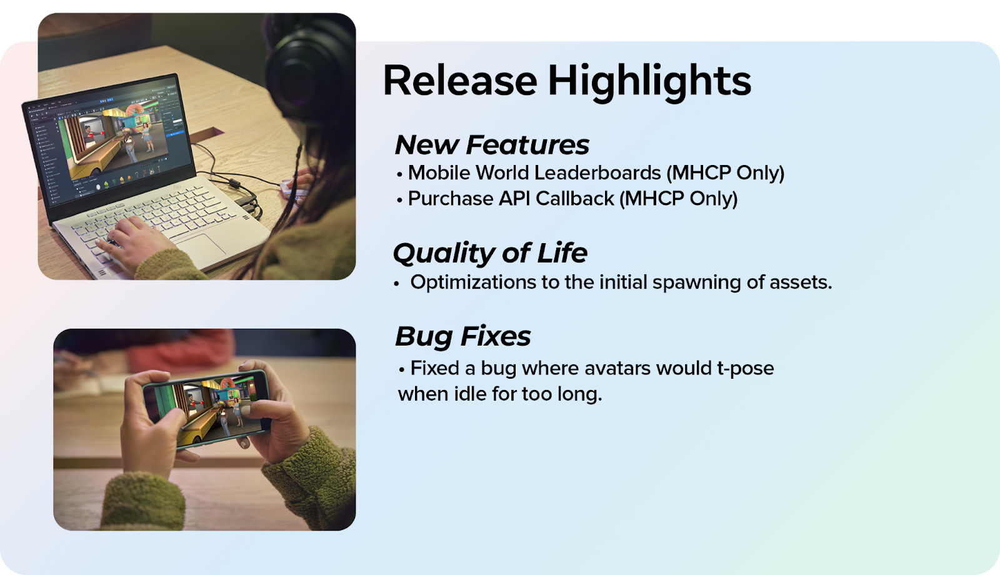

## [New Features](#new-features-12)

- **Mobile World Leaderboards (MHCP Only):** Creators are now able to share new and existing world leaderboards directly within the Meta Horizon app on their product description page. Learn more about this feature [here](Desktop%20editor/Quests%2C%20leaderboards%2C%20and%20variable%20groups/Showing%20leaderboards%20in%20the%20Meta%20Horizon%20app.md).
- **Purchase API Callback (MHCP Only):** A new NetworkEvent is launching: OnPlayerPurchasedItemEvent. Connect to it, and you will be notified when a player makes a successful purchase from any shop in the session. With this, creators can add new gameplay elements such as showing a popup to equip the brand new sword a player just bought, progressing a quest or validating a tutorial for examples. Learn more about in-world purchases [here](MHCP%20program/Monetization/In-world%20purchase%20guide.md#purchase-event-listener).

## [Quality of Life Improvements](#quality-of-life-improvements-6)

- Optimizations to the initial spawning of assets.

## [Bug Fixes](#bug-fixes-11)

- Fixed a bug where some interaction buttons/prompts were incorrectly scaled.
- Fixed a bug where avatars would t-pose when idle for too long.

---

# [Meta Horizon v229 Release Notes](#meta-horizon-v229-release-notes)

This week in v229, we have numerous quality of life and bug fixes requested by the community.

Read on for more details on Meta Horizon v229

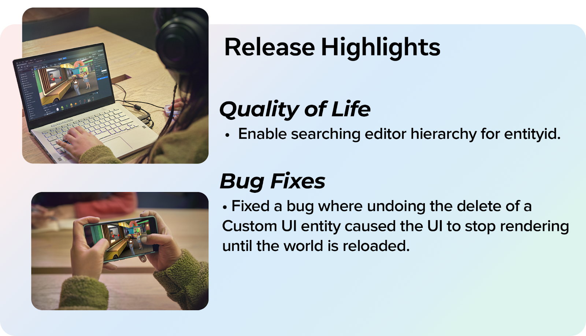

## [Quality of Life Improvements](#quality-of-life-improvements-7)

- Enable searching editor hierarchy for entityid.

## [Bug Fixes](#bug-fixes-12)

- Fixed a bug where the speech bubble toggle wasn't always honored for NPCs that spawn at world start.
- Fixed a bug where undoing the delete of a Custom UI entity caused the UI to stop rendering until the world is reloaded.
- Fixed a bug where editing the template definition of an Asset Pool Asset Template respawns the referenced asset.
- Fixed a bug where combining large amounts of objects fails to finish the job and creates an unprocessed asset.

---

# [Meta Horizon v228 Release Notes](#meta-horizon-v228-release-notes)

The Open Source Champions competition is live! This competition offers an incredible opportunity to compete for a share of $1M in prizes, plus an additional $500K for newly introduced mini-challenges.

The **Open Source Champions** competition challenges creators to design and build a high-quality, inspiring and easy-to-extend remixable world to accelerate the creation process for other creators in the Horizon Worlds community. Remixable Worlds (MHCP Only) is a new feature that allows creators to make their world(s) clonable by other creators to build on top of.

In addition to the main focus on building remixable worlds, creators can enter two optional mini-challenges:

- **Interactive asset mini-challenge:** Create dynamic, remixable interactive public assets to support other creators.
- **High-quality tutorial mini-challenge:** Create engaging, high-quality tutorials to expand the MHCP documentation.

**Prizes**

- Best remixable worlds
  - 1st place: $100,000
  - 2nd place: $60,000
  - 3rd place: $50,000
  - Plus additional 32 prizes
- Mini-challenge winners (interactive asset and tutorial)
  - $500,000 shared among winners

Don't miss out on this opportunity! The submission window is open to **September 10, 2025 at 11:45 PM PDT**.

Visit the competition site [here](https://mhcp-open-source-competition.devpost.com/) to learn more about how to participate, what the judges are looking for, and how you can become an Open Source Champion.

Read on for more details on Meta Horizon v228

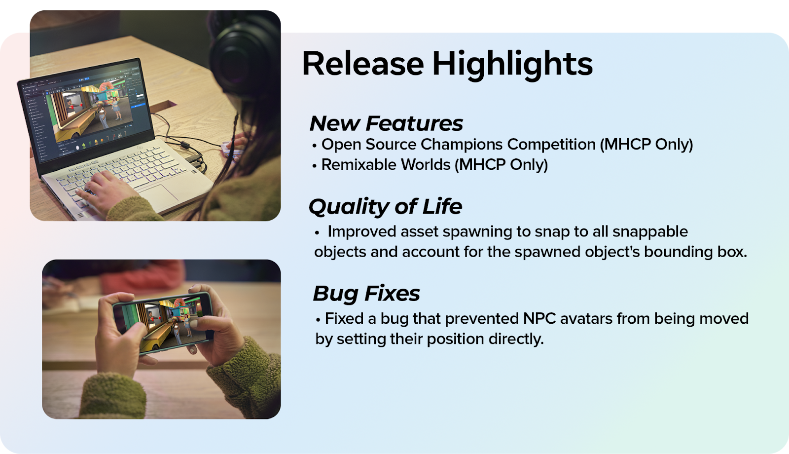

## [New Features](#new-features-13)

- **Remixable Worlds (MHCP Only):** Remix Worlds is a feature that allows creators to make their world(s) cloneable by other creators to build on top of. Available worlds for creators to remix can be found on the Creation Home page of the Horizon editor in the Worlds to Remix section. Creators can make their worlds as remixable in the Publish window within the editor. Learn more about this feature [here](Save%2C%20optimize%2C%20and%20publish/Horizon%20Remix%20Worlds.md).
- **Environment Generation Tool (MHCP Only):** The GenAI Environment Generation tool allows you to quickly generate an environment for your world. This tool helps accelerate the process of world and environment building by adding generated meshes of varying sizes and complexities. Currently, this tool supports generating island themed environments, with more themes to come in the future. Learn more about this feature [here](Desktop%20editor/Generative%20AI%20tools/Generative%20AI%20Environment%20Generation%20Tool.md).

## [Quality of Life Improvements](#quality-of-life-improvements-8)

- Improved asset spawning to snap to all snappable objects and account for the spawned object's bounding box.
- Improved color tint behavior by making color changes immediately visible to creators.
- Updated AssetPools to spawn versioned assets instead of always spawning latest asset versions to avoid multiple versions of the same asset existing in the scene.

## [Bug Fixes](#bug-fixes-13)

- Fixed bugs related to exporting world geometry and downloading assets file in desktop editor.
- Fixed a bug that prevented NPC avatars from being moved by setting their position directly.

---

# [Meta Horizon v227 Release Notes](#meta-horizon-v227-release-notes)

This week in v227, we are launching audio previews in the asset library for all creators, which helps find the perfect sound to add to your world. Additionally, more supported audio formats are available including MP3 and FLAC (among others). An exciting community request is now available also as we added two new APIs to make scripting easier with **this.world.findEntity()** and **this.world.findEntities()** which enables creators to reference any entity in code by name.

**Note:** In v226 notes we mentioned an upcoming creator competition. We will have more information on this soon.

Read on for more details on Meta Horizon v227:

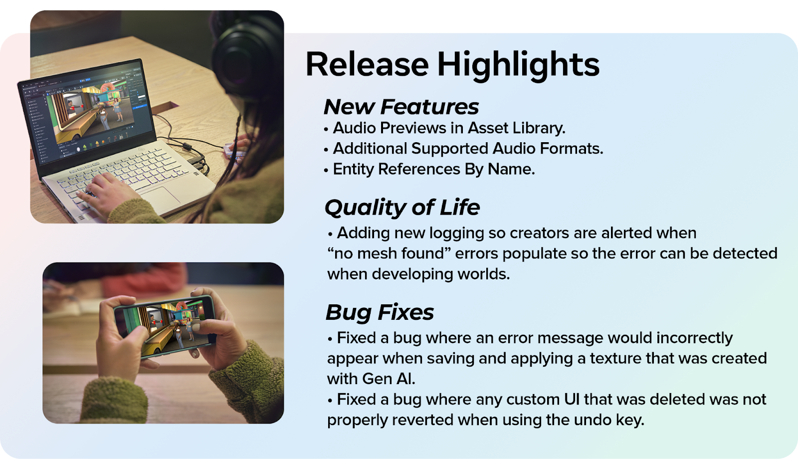

## [New Features](#new-features-14)

- **Audio Previews in Asset Library:** Audio previews in the asset library are now available to all creators. This feature makes finding the perfect sound to add to your world more efficient. To use this feature, click the play button icon on the thumbnail within the asset library for any sound asset.
- **Additional Supported Audio Formats:** We've added support for MP3 (.mp3) and FLAC (.flac) audio file formats, in addition to OGG Opus (.opus) and WAV (.wav). Plus, we've added support for a wider range of sample rates, including 16 kHz, 22.05 kHz, 24 kHz, 44.1 kHz, and 48 kHz. This means you can now upload a wider variety of audio files to your worlds, making it easier to find the perfect sound.
- **Entity References By Name:** Added two new APIs to make scripting easier. **this.world.findEntity()** and **this.world.findEntities()** enables creators to reference any entity in code by name. This is basic functionality creators expect and find in tools like Roblox, Unity and Unreal. Pass in an optional root entity to only search a specific subtree, or a match operation, like starts with, ends with, or even a regex to more specifically query entities. Learn more about this feature [here](Reference/core/Classes/World.md#methods).

## [Quality of Life Improvements](#quality-of-life-improvements-9)

- Adding new logging so creators are alerted when "no mesh found" errors populate so the error can be detected when developing worlds.
- "F5" has been improved/updated as a hotkey. By pressing F5, creators will enter play mode, and pressing it again exits play mode, replacing the previous Shift+F5 exit shortcut for a simpler toggle experience.

## [Bug Fixes](#bug-fixes-14)

- Fixed a bug where "Clear on Enter Preview" did not clear the console when entering preview mode.
- Fixed a bug where the bug report hotkey could unintentionally trigger while using the in-game console while in preview mode.
- Fixed a bug where an error message would incorrectly appear when saving and applying a texture that was created with Gen AI.
- Fixed a bug where a black skydome could appear when generating a sky in the Gen AI tab.
- Fixed a bug where any custom UI that was deleted was not properly reverted when using the undo key.

---

# [Meta Horizon v226 Release Notes](#meta-horizon-v226-release-notes)

**Heads up creators** - Another exciting competition is coming, mark your calendars! Our next creator competition will be announced between August 7-11! Get ready for even more prizes, a new exciting competition focus area, mini-quests to win additional prizes, and more opportunities to showcase your creativity.

Read on for more details on Meta Horizon v226:

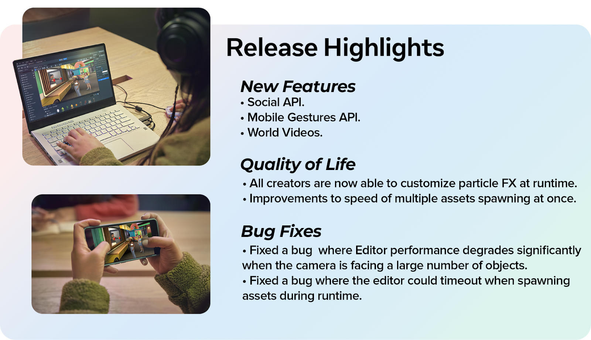

## [New Features](#new-features-15)

- **Social API:** Creators now have the ability to add frictionless social features into their world via TypeScript. A [public demo world](https://horizon.meta.com/world/775581602295298/) has additionally been made for creators to experience the Social API firsthand. Learn more about this new feature [here](Reference/social/Classes/Social.md) and check out some of its abilities below.
  - Show player avatar icons in game
  - Reward players for following each other
  - Reward following new players in the server
  - Reward inviting friends to their server
- **Mobile Gestures API:** We have added a new API module to better help detect and allow creators to improve games that use tap, swipe, pan, and pinch gestures. Learn more about this feature [here](Reference/mobile_gestures/Classes/Gestures.md).
- **World Trailers:** Along with thumbnails, creators are now able to upload trailers to their product description page with future plans to test additional discovery surfaces. Trailers can be uploaded in 16:9 and 9:16 format and give players critical insights and surfacing into your world before jumping in. It is imperative to design for these sizes to put your best foot forward, as landscape videos (16:9) do not look appealing when cropped to another size like 9:16 (and vice versa). Poor cropping can significantly impair clicks and visits.
- **Creator Assistant:**&#x54;he Worlds Desktop Editor is adding Creator Assistant to its already impressive, integrated, and comprehensive GenAI toolkit. Creator Assistant is your creation partner to not only accelerate the creation process, but make it easier also. Learn more about this feature [here](Desktop%20editor/Generative%20AI%20tools/Generative%20AI%20Assistant%20Tool.md).
- **Style Reference:** Style Reference allows creators to have more consistency and a faster path to desirable output by allowing them to generate, save, and re-use a desired style such that their outputs across modalities can be more consistent with easier prompting. Learn more about this feature [here](Desktop%20editor/Generative%20AI%20tools/Generative%20AI%20Style%20Reference.md).

## [Quality of Life Improvements](#quality-of-life-improvements-10)

- Added export support for multiple materials per object, material texture export, multi-UV channels, and specific mesh name.
- Improvements to speed of multiple assets spawning at once.
- All creators are now able to customize particle FX at runtime.

## [Bug Fixes](#bug-fixes-15)

- Fixed a bug where Editor performance degrades significantly when the camera is facing a large number of objects.
- Fixed a bug where the editor could timeout when spawning assets during runtime.
- Fixed a bug where navigating between worlds in the editor could cause NPCs from different worlds to share logs in the NPC Debugger; now, navigating always clears those logs.
- Fixed a bug where creators encountered difficulty transitioning between editor mode and preview mode when operating the door gizmo. Creators will now experience a seamless switch without getting stuck upon exiting preview mode.
- Fixed a bug where it was possible to edit the NPC gizmo's character name and the underlying AI conversation's character name to not match each other, which caused confusion. Now, the NPC gizmo's character name is not editable when an AI is attached, so it will always match the AI name.
- Fixed a bug causing a null reference on spawning Hybrid NPCs client side.

---

# [Meta Horizon v224 Release Notes](#meta-horizon-v224-release-notes)

In an upcoming release, we will be upgrading the Meta Horizon Desktop Editor to Unity 6. This upgrade ensures you have the most up-to-date and secure experience as a creator. We expect minimal impact to your workflow during this update. To help the update go smoothly, please coordinate with your entire team to update together. We recommend that once your workday is done, everyone shuts down their Desktop Editor. Avoid keeping the Editor open for multiple days in a row, as this can delay the update process.

Additionally this summer, we're testing new Meta Horizon Feed in VR and Meta Horizon mobile app interface designs to improve user engagement and discovery. The new designs will utilize all landscape, portrait and square world preview images. We strongly recommend that you review your existing preview images and ensure you have high-quality images across all three dimensions as soon as possible to ensure that your worlds are eligible to be featured in the upcoming new designs of Worlds discovery surfaces, and [get the best chance of being discovered.](Save%2C%20optimize%2C%20and%20publish/Intro%20to%20Worlds%20discovery.md)

To help you create the best preview images to showcase your worlds, we have published new [documentation](Save%2C%20optimize%2C%20and%20publish/Worlds%20Asset%20Design%20Guidelines.md) with image guidelines, including templates, examples and best practices. To learn more about the new Horizon Feed and mobile interface designs, please visit the blog [here](https://developers.meta.com/horizon/blog/meta-horizon-design-tests-coming-soon/).

Read on for more details on Meta Horizon v224:

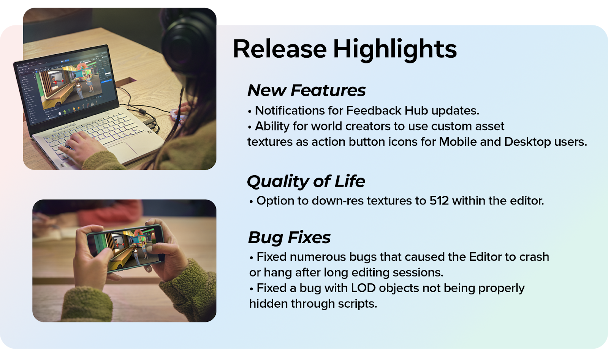

## [New Features](#new-features-16)

- **Notifications For Feedback Hub:** Rolling out over time, we will now email creators whenever we update their feedback status, such as requesting more information or when we ship a fix. Each notification links to the Feedback Center, where they can add context or review details.
- Added the ability for world creators to use custom asset textures as action button icons for Mobile and Desktop users. Learn more about this feature [here](Mobile%20and%20web/TypeScript%20APIs%20for%20mobile/Custom%20Input%20API.md).

## [Quality of Life Improvements](#quality-of-life-improvements-11)

- Creators now have the option to down res textures to 512 within the editor to help with performance and capacity limits for worlds.
- GenAI creator tools are now rolling out in the European Union (EU). Creators in the EU will now have access to all of the GenAI tools that are part of the Horizon Desktop Editor. Be sure to try these tools out!

## [Bug Fixes](#bug-fixes-16)

- Fixed a bug where creators after a long session quit the Editor, the Quest Link app will continue to say "Now Playing" and prevent the User from re-opening the Editor.
- Fixed a bug where the Editor would crash after creating a new world and waiting on the home screen for too long.
- Fixed a bug where opening a call from the social panel in Horizon Worlds opened the incorrect chat.
- Fixed a bug with LOD objects not being properly hidden through scripts.
- Fixed a bug where portals may not have automatically closed when selecting the "Go" button.

## [Documentation Improvements](#documentation-improvements)

- Updates to World Preview Image Design Guidelines around image publishing standards for Horizon Worlds.

---

# [Meta Horizon v223 Release Notes](#meta-horizon-v223-release-notes)

This week in v223, we are launching improved creator control for shops and inventory which will help provide a more customized experience for users visiting worlds where creators choose to make their own shop and inventory systems. Additionally, audio previews in assets library (MHCP Only) were launched allowing the capability to listen to audio clips for any sound asset directly from assets library. Read on for more details on Meta Horizon v223:

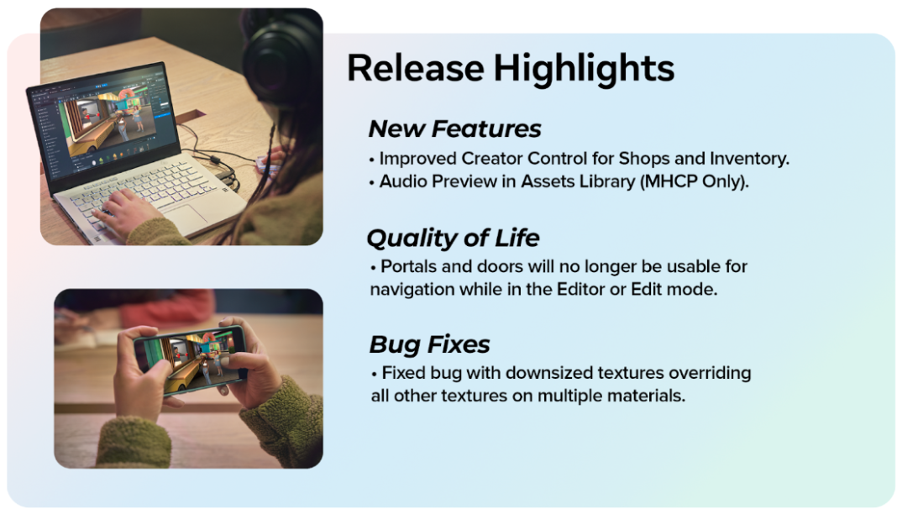

## [New Features](#new-features-17)

- **Improved Creator Control for Shops and Inventory:** We've added a new feature that gives creators more control over the visibility of shops and inventory items within their virtual worlds. Now, creators can disable the default in-world shop and the 'In-world items' tab in the inventory for their worlds. This provides a more customized experience for users visiting those worlds when creators choose to make their own shop and inventory systems. Learn more about this feature [here](MHCP%20program/Monetization/In-world%20purchase%20guide.md).
- **Audio Preview in Assets Library (MHCP Only):** Introducing the capability to listen to audio clips for any sound asset directly from assets library. This feature makes finding the perfect sound to add to your world more efficient. To use this feature, click the play button icon on the thumbnail within the asset library for any sound asset.

## [Quality of Life Improvements](#quality-of-life-improvements-12)

- Portals and doors will no longer be usable for navigation while in the Editor or Edit mode.

## [Bug Fixes](#bug-fixes-17)

- Fixed bug with downsized textures overriding all other textures on multiple materials.

---

This week in v222 we are launching new Horizon mobile camera options that will allow creators and players alike to record and share their content easier than ever. Additionally, creators have new AI tools to work with including adding non-embodied, non-conversational AI NPCs to their worlds. We are also excited to be rolling out enabling data persistence at a world level.

Read on for more details on Meta Horizon v222:

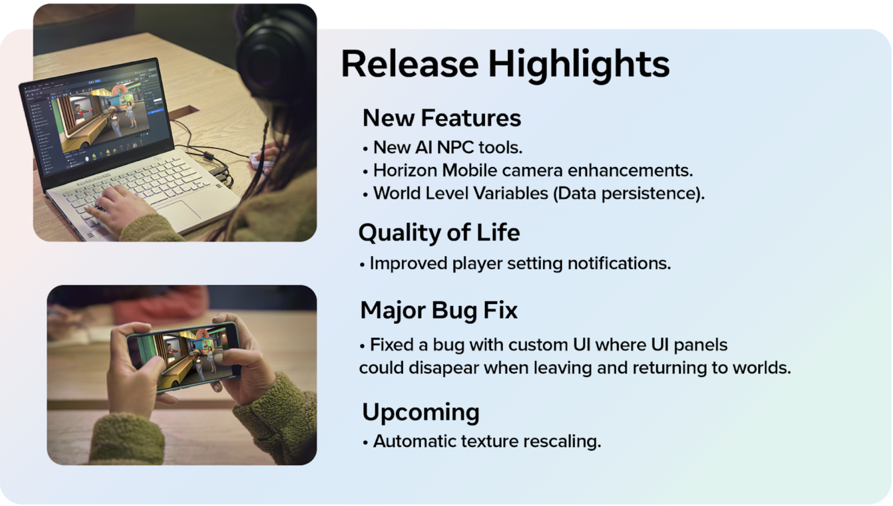

## [New Features](#new-features-18)

- **New AI NPC Tools:** Creators can now add non-embodied, non-conversational AI NPCs to their worlds (think a sports game type announcer that can comment on your world, or a phone booth with a mysterious voice on the line, or a crystal ball with a fortune just for you). Learn more about [this feature here](https://developers.meta.com/horizon-worlds/learn/documentation/desktop-editor/npcs/ai-speech-npcs/ai-speech-npcs-overview).
- **Horizon Mobile Camera v2:** Introducing new camera options to capture your Horizon experiences on mobile devices to share with others. This feature is perfect for recording your horizon gameplay directly in app, see a thumbnail preview of it, and having the ability to directly share to the location of your choice. Find this feature on mobile devices at the top right (camera button).
- **World Level Variables:** Rolling out on July 7th, this capability is designed to enhance the experience for creators and users alike by enabling data persistence at a world level. This new feature is perfect for creators looking to engage their community with activities that require data persistence, such as community counters or complex world states.

## [Quality of Life Improvements](#quality-of-life-improvements-13)

- Improved player setting notifications. Creators are now informed that some player settings will not be copied while importing or duplicating Horizon Worlds through a new dialog popup.

## [Bug Fixes](#bug-fixes-18)

- Fixed a Persistent Variables Debug Button bug to properly clear the data when selected.
- Fixed a bug with custom UI where users who entered a world after another user travelled away would not see any custom UI panels.

## [Upcoming Release Roadmap](#upcoming-release-roadmap)

We've heard your feedback and we're working on shipping the following improvements in the next few releases:

- Automatic texture rescaling.
- Fixing bugs where old textures override all other textures.
- Improvements to known memory leaks.

---

This week in v221, we are launching custom NUX (new user experience) TypeScript API enhancements which will help creators further improve the onboarding experiences for mobile players. Additionally, a server shutdown button has been added, helping avoid stale or glitchy worlds that can occur, improving the reliability and efficiency of world creation. Lastly we have multiple quality of life additions and bug fixes requested by the community.

Read on for more details on Meta Horizon v221:

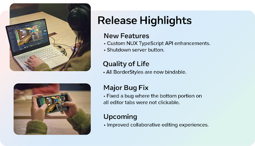

## [New Features](#new-features-19)

- **Custom NUX TypeScript API Enhancements**: With these added enhancements, creators can further improve the onboarding experiences for mobile players. These enhancements allow for displaying messages above specified on-screen buttons, accompanied by attention-grabbing animations. This feature is especially useful for button tooltips in timed action prompts and tutorials, such as when a special ability is available. Read more about [this feature here](Mobile%20and%20web/TypeScript%20APIs%20for%20mobile/Custom%20tutorial%20scripting.md).

- **Shutdown Server Button**: The "Shutdown server" option allows creators to shutdown the server client in a world. This is particularly useful for world creators who need to quickly refresh the world state during world creation. By shutting down the server client, a new server instance is created upon rejoining, ensuring a fresh and consistent world. This feature helps avoid stale or glitchy worlds that can occur, improving the reliability and efficiency of world creation. Find this in the upper left menu within the desktop editor, under **Return to Creation Home**.

  *Note: This feature only shuts down the actively running server client for the current world during edit mode. It does not affect the server client for published worlds.*

## [Quality of Life Improvements](#quality-of-life-improvements-14)

- Improved the Export Geometry feature, adding export support for multiple materials per object, material texture export, multi-UV channels, and specific mesh names.
- Non-owners of worlds are now prevented from renaming the world.
- All BorderStyles are now bindable (improved from only borderWidth and borderColor previously).
- For asset templates, draft version notes are now saved and will propagate the latest version notes when publishing the asset template.
- Disabled the option to publish a world while editing an asset template.
- [GenAI tools](Desktop%20editor/Generative%20AI%20tools/Generative%20AI%20Overview.md) offered with the Horizon Desktop Editor will now be available in India, Singapore, Vietnam, Brazil, Argentina, and Mexico starting today!

## [Bug Fixes](#bug-fixes-19)

- Fixed a bug during collaborative editing wherein a user selecting an entity on their client will cause all other users' clients to auto-scroll to their currently-selected entities.
- Fixes to the clickable area on the Navigation Tabs so the entire tab is clickable.
- Fixed a bug where the tooltip does not appear on the delete button under the **Scripts** section.
- Fixed a bug where the bottom portion on tabs was not clickable in the desktop editor.
- Fixed a bug where NPC animations would play on all world NPCs rather than specified assets.
- Fixed a bug where scaling the avatar on HWXS would cause some UI Panels to be incorrectly scaled.

## [Documentation Improvements](#documentation-improvements-1)

- Added the [snap destination gizmo](Gizmos/Snap%20destination%20gizmo.md) topic to highlight key concepts, access and usage info, and additional resources.
- Renamed the “Custom Model Import” section to “Custom Models (FBX)” for clarity.

## [Upcoming Release Roadmap](#upcoming-release-roadmap-1)

We've heard your feedback and we're working on shipping the following improvements in the next few releases:

- Improved collaborative editing experiences including reduced dual claimed objects in the hierarchy issues.
- Memory leak fixes.

---

**"Elevate Your Mobile World" Competition**: We are excited to announce the launch of our second Meta Horizon Creator Competition in 2025! This competition offers a chance to win up to $1 million in prizes. The top 2 winners will each earn $100,000, while $800,000 will be shared among 33 other winners in multiple exciting categories.

The "Elevate Your Mobile World" competition is focused on **updating existing worlds** to showcase exceptional progression and sharing systems. Our goal is to support creators in building high-quality worlds that foster expression, play, progress, and social interaction.

**Prizes**

- Most Satisfying Progression System:
  - 1st place: $100,000
  - 2nd place: $60,000
  - 3rd place: $50,000
- Most Shareable Moments:
  - 1st place: $100,000
  - 2nd place: $60,000
  - 3rd place: $50,000
- 29 other winners: $20,000 each

Don't miss out on this incredible opportunity! The submission period is open from June 20, 2025, to July 21, 2025.

Visit the [competition site](https://mhcp-mobile-update-competition.devpost.com/) to learn more about the competition, how we’ll judge, and what it will take for you to be eligible and win.

Read on for more details on Meta Horizon v220:

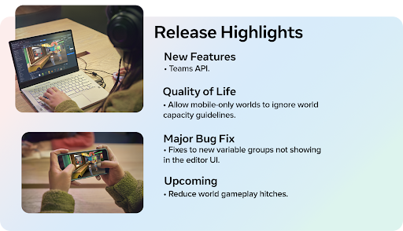

## [New Features](#new-features-20)

- **Teams API**: Allows creators to implement team based gameplay mechanics into their worlds. This gives creators scripting access to a code block event sent to all other players in the world when a player changes team. The API also includes a full set of functionalities including creating or removing teams, changing a player's team (server only), or changing your own team. Learn more [here](Scripting/API%20references%20and%20examples/Teams%20API%20Reference.md).

## [Quality of Life Improvements](#quality-of-life-improvements-15)

- Added a renderer section within the properties panel of an object, enabling creators to customize the rendering ordering.
- Added a max length for asset description to avoid crashes in the editor.
- Added cut and paste shortcuts to the keyboard bindings modal.
- Improvements to the UI for the thumbnail selection process during world publishing.
- Improvements to the general UI for the Public Asset Library report modals.
- Updates/creation of asset templates is now disabled during simulation as it was causing several issues. Asset templates can only be updated or created if simulation is off.
- Allow PNG files for Public Assets thumbnails (MHCP only).

## [Bug Fixes](#bug-fixes-20)

- Fixed a bug where the local user (world owner) could be invited additionally as a collaborator to the same world, putting the editor in a bad state.
- Fixed a bug where world information was not being pulled live after publishing, leaving collaborators editing in broken states until refreshing the editor.
- Fixed a bug where when a variable group was selected, and then a user went to create a new variable, the name typed would disappear and not populate in the variables tab.
- Fixed a bug related to the outline size for grabbable objects. It resizes proportionally to the camera's FOV now.
- Fixed a bug where CameraModeFixed/Attach would not stay fixed when repositioning the player.
- Fixed a bug where the World thumbnail camera would not capture text.

## [Documentation Improvements](#documentation-improvements-2)

- Added information on how to use [collectLocalInput](Mobile%20and%20web/TypeScript%20APIs%20for%20mobile/Custom%20Input%20API.md#connectlocalinput) to get position data from the left joystick.
- Added the [ParticleFx gizmo topic](Gizmos/ParticleFx%20gizmo.md) to highlight key concepts, access and usage info, and additional resources.
- Added a new [introduction](https://developers.meta.com/horizon-worlds/learn/documentation/get-started/create-your-first-world-intro) to the Create your first world tutorial.
- Improved [Using the Object Tools](Desktop%20editor/Objects/Using%20the%20Object%20Tools.md) (Desktop Editor) with new content and more images.
- Improved the [Preview Mode](Desktop%20editor/Get%20started%20with%20Desktop%20Editor/Preview%20mode.md) (Desktop Editor) documentation.

## [Upcoming Release Roadmap](#upcoming-release-roadmap-2)

We've heard your feedback and we're working on shipping the following improvements in the next few releases:

- Reduce world gameplay hitches.
- Make all BorderStyles bindable.
- Improvements to collaborative editing.

---

This week in v219, we are launching four new metrics to help creators better understand the discovery and engagement movements of their worlds. Additionally, we have numerous quality of life changes, including improvements to our Gen AI creator tools. Lastly we have multiple community reported bug fixes including fixes to scaling issues for child objects and world settings not updating on publish.

Read on for more details on Meta Horizon v219:

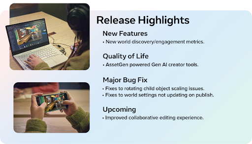

## [New Features](#new-features-21)

- **New Metrics: Understanding Discovery and Engagement.** We are launching four new metrics to help creators better understand the discovery and engagement movements of their worlds. Use [this link](https://horizon.meta.com/creator/worlds_all/) to view your worlds and use the **Insight** button to find these metrics.
  - **Clickthrough rate:** The % of users who start a world session after viewing an impression of the world.
  - **Average time per visit (1d, 7d, 30d):** The average amount of time (minutes) visitors spend in the world over the past 1, 7 or 30 days.
  - **Returning visitors (1d, 7d, 30d):** The % of users who return to the world over the past 1, 7 or 30 days.
  - **Timespent per monthly active user:** The average amount of time (minutes) spent in the world by monthly active users.

Additionally, we are modifying our **Sustained Visit rate** metric to show different thresholds based on the platform. SVR is defined as % of visits with more than 5 minutes in VR and 2 minutes on mobile. We are also modifying the **Crash rate** metric to include crashes on mobile.

For more info about how users discover worlds, as well as resources and insights you can use to improve user acquisition and engagement with your worlds, see updated documentation on discovery here: [https://developers.meta.com/horizon-worlds/learn/documentation/save-optimize-and-publish/intro-to-worlds-discovery](Save%2C%20optimize%2C%20and%20publish/Intro%20to%20Worlds%20discovery.md).

## [Quality of Life Improvements](#quality-of-life-improvements-16)

- Ghost objects are now completely hidden when toggling gizmos off.
- Removed media wall posting for mobile which caused crashes. This is not a supported feature on mobile.
- Our [AssetGen model](Desktop%20editor/Generative%20AI%20tools/Generative%20AI%20Mesh%20Generation%20Tool.md) (rolling out this week) now powers our GenAI creator tools such as Mesh Generation and Texture Generation. AssetGen is a state of the art AI model that introduces an accelerated workflow which further enhances Mesh and Texture Generation and enables creators to build amazing artifacts even faster than before.

## [Bug Fixes](#bug-fixes-21)

- Fixed a bug where rotating a child of a non-uniformly-scaled parent will cause the child's local scale to change.
- Fixed a bug where nested children in asset pools were not being assigned ownership correctly.
- Fixed a bug where \`this.world.getPlayers()\` could return players that were invalid.
- Fixed a bug where the search on the Horizon Creator page would only search in loaded worlds.
- Fixed a bug with incorrect scaling of vertical aspect ratio images with the door gizmo.
- Fixed a bug where content ratings were not shared correctly, making changes in ratings not reflected upon reopening the publish panel.
- Fixed a bug where ammo counters on weapons would occasionally fail to appear.
- Fixed a bug where a user was shown worlds in the creation home for which they were only a playtest collaborator.
- Fixed a bug where the exit preview mode button did not work correctly when the user was in build mode.

## [Documentation Improvements](#documentation-improvements-3)

- Added topics for the [dynamic light](Gizmos/Dynamic%20light%20gizmo.md), [static light](Gizmos/Static%20light%20gizmo.md), and [TrailerFx](Gizmos/TrailFx%20gizmo.md) gizmos to highlight key concepts, access and usage info, and additional resources.

## [Upcoming Release Roadmap](#upcoming-release-roadmap-3)

We've heard your feedback and we're working on shipping the following improvements in the next few releases:

- Improved keyboard shortcuts in editor.
- Improved collaborative editing experience.
- Improved mobile world capacity guideline information.

---

This week in v218, we are introducing three new asset templates to make it easier for our creators to build their in-game economies. Additionally, creators are now allowed to upload multiple thumbnail images at once, in a variety of sizes, increasing store visibility options. Lastly, we have quality of life improvements and bug fixes within the editor.

Read on for more details on Meta Horizon v218:

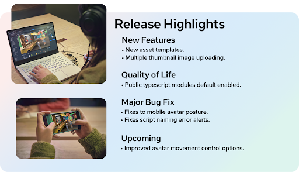

## [New Features](#new-features-22)

- **New Asset Templates**: To make it easy for our creators to build their in-game economies we're releasing three new asset templates for improving a world's monetization and retention. With asset templates, you have the option to use them with their default configuration or fully customize their scripts and entities. Find these templates in the public asset library.
  - [Shop Asset Template](Gizmos/Shop%20Asset%20Template.md): List and sell your items for Meta Credits or for any in-world currency.
  - [Inventory Asset Template](Gizmos/Inventory%20Asset%20Template.md): Display your items, show the player how many of them they own and allow them to use them.
  - [Daily Rewards Asset Template](Gizmos/Daily%20Rewards%20Asset%20Template.md): Grant rewards to players for every day they log in to your world.
- **Custom Thumbnails - Upload Multiple Images**: Creators are now allowed to upload multiple thumbnail images at once, three in total. Creators can now have a landscape image in 16:9 aspect ratio, square image 1:1 aspect ratio and portrait image in 9:16 aspect ratio for their world, all in editor. **Known issue**: Door gizmo images have current known bugs and will be fixed in v219.
- **New Unity Asset Bundles: NPCs**: We are releasing 8 more Unity Asset Bundles to the public asset library. This enables creators to script movement that allows characters to move through your world and trigger built-in animations to interact with players. First time with NPCs? Check out the [Getting Started with NPCs guide](https://developers.meta.com/horizon-worlds/learn/documentation/desktop-editor/npcs/getting-started-with-npc-assets/) to help you along the way. The new public NPC additions:
  - Ice Cream Character
  - Zombie Female
  - Skeleton Mage
  - Henchman
  - Samurai
  - Pineapple
  - Mascot
  - Toaster

## [Quality of Life Improvements](#quality-of-life-improvements-17)

- The last used file path is now stored and re-opened when uploading thumbnails.
- **Update**: Starting June 9th, public typescript modules are now enabled by default in new worlds for all creators. This simplifies the new creator onboarding experience by not requiring them to enable modules just to use core behaviors like camera management and Custom UI. The following 6 modules will be enabled by default: horizon/analytics, horizon/camera, horizon/navmesh, horizon/performance, horizon/ui, and horizon/unity\_asset\_bundles.

## [Bug Fixes](#bug-fixes-22)

- Fixed a bug where scripts incorrectly named with special characters would not flag an issue with an error notification. The error notification will now always show if a script is named with special characters or other characters not allowed.
- Fixed a bug globally affecting avatar posture positions on mobile.

## [Documentation Improvements](#documentation-improvements-4)

- **New Videos**: We have published two new video tutorials: [Custom Meshes with Gen AI](https://developers.meta.com/horizon-worlds/learn/videos/custom-meshes-with-genai) and [Better Sound Design with Gen AI Audio](https://developers.meta.com/horizon-worlds/learn/videos/better-sound-design-with-genai-studio).
- Added the [quest gizmo](Gizmos/Quests%20gizmo.md) topic to highlight key concepts, access and usage info, and additional resources.

## [Upcoming Release Roadmap](#upcoming-release-roadmap-4)

We've heard your feedback and we're working on shipping the following improvements in the next few releases:

- Add the ability to combine multiple meshes into a single mesh asset.
- Ability to hide all ghost objects when toggling Gizmos off.
- Automatic texture rescaling.

---

This week in v217, we are introducing the Custom NUX TypeScript API, that allows developers to convey information to users via a series of connected modal windows, greatly enhancing the onboarding experience in the world. Additionally, we improved creator efficiency during world creation with quality of life items such as public typescript modules enabled by default, and faster hierarchy responsiveness. Lastly we have multiple community reported bug fixes, including fixes to published thumbnails not updating and asset libraries not being scrollable.

Read on for more details on Meta Horizon v217:

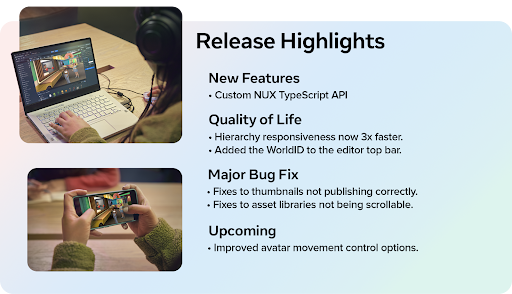

## [New Features](#new-features-23)

- **Custom NUX TypeScript API**: We're releasing a new Custom NUX TypeScript API that allows developers to convey information to users via a series of connected modal windows, greatly enhancing the onboarding experience in the world. For example it can be used to display welcome messages, provide critical updates, or deliver important instructions, ensuring users are well-informed about key aspects or new features in your world. Read the documentation [here](Mobile%20and%20web/TypeScript%20APIs%20for%20mobile/Custom%20tutorial%20scripting.md).

## [Quality of Life Improvements](#quality-of-life-improvements-18)

- When opening, saving or uploading a model within the editor, the loader now will recall the last used file path, rather than the default file pathing. This will increase creator flows and efficiency.
- Selecting an object in the hierarchy is now 3x faster.
- Simplified script deletion by adding a delete icon within the Scripts dropdown in the editor.
- Scripts are now prevented from being created or renamed that start with a period.
- Added the WorldID to the Desktop Editor top bar.
- Creators and users with a player setting of either “Tap anywhere” or “Tap anywhere + Hide button” will no longer trigger a jump when tapping on screen while not holding an item.

## [Bug Fixes](#bug-fixes-23)

- Fixed a bug where [OnPlayerEnterAvatarPoseGizmo](Reference/core/Variables/CodeBlockEvents.md) and OnPlayerExitAvatarPoseGizmo were triggered on all entities in the scene instead of just the [AvatarPoseGizmo](https://developers.meta.com/horizon-worlds/reference/2.0.0/2p_avatarposegizmo) entity where the event originated.
- Fixed a bug where scaled avatars would not sit properly on the [AvatarPoseGizmo](https://developers.meta.com/horizon-worlds/reference/2.0.0/2p_avatarposegizmo).
- Fixed a bug where users were unable to scroll through the **Public Asset Library** and **My Assets** section by grabbing the scroll view.
- Fixed a bug where the thumbnail preview did not update correctly on publish.
- Fixed various UI, camera controls and performance bugs within the creator portal 3D heatmap feature.
- Enhanced the 3D heatmap user interface for more efficient controls.

## [Documentation Improvements](#documentation-improvements-5)

- Updated topics on the [mirror gizmo](Gizmos/Mirror%20gizmo.md) and [sound recorder gizmo](Gizmos/Sound%20recorder%20gizmo.md) to highlight key concepts, provide access and usage information, and additional resources.
- Published a new topic [explaining the structure of a project](Desktop%20editor/Get%20started%20with%20Desktop%20Editor/Project%20structure.md) in the desktop editor.

## [Upcoming Release Roadmap](#upcoming-release-roadmap-5)

We've heard your feedback and we're working on shipping the following improvements in the next few releases:

- Improved avatar movement control options.
- Improved thumbnail upload process.
- Improved CustomUI experiences.

---

This week in v216 we are launching the Asset Pool Gizmo, a powerful tool for managing objects that should be granted to each player in your world. Additionally, the Public Asset Library is now live, allowing other creators to discover your assets from the Public Asset panel in the Desktop Editor or in VR and import them into their own worlds **(MHCP Only)**. 3D Heatmaps have also been updated to help creators learn key insights about their worlds.

**Important**: In v216, we are changing the structure of scripting directories to not include the world name in the directory name. This is to prevent malicious attacks. If you are using a source-control system to manage scripts, you may need to reconfigure it after v216.

Read on for more details on Meta Horizon v216:

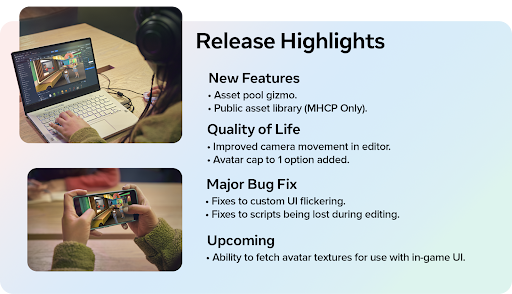

## [New Features](#new-features-24)

- Added an Asset Pool [Gizmo](Gizmos/About%20gizmos.md) that allows players to have prefabs that are generated per player. The Asset Pool Gizmo is a powerful tool for managing objects that should be granted to each player in your world. It automates spawning and assignment of objects to players as they join your world. This is necessary for objects that have different states per-player. It's perfect for creating the following in-game objects or features on a per player basis: HUD and UI, Starting Items, Player Effects, Stats. Review the documentation [here](Gizmos/Asset%20pool%20gizmo.md).
- **3D Heatmap Updates**: Three new features added. Use [this link](https://horizon.meta.com/creator/worlds_all/) to view your worlds and use the **Insight** button to see the 3D heatmap option per world:
  - Added "Center camera on selected point" button to more easily focus/zoom to areas of interest.
  - Dampened camera controls for smoother repositioning and added WASD hotkeys to pan camera
  - Added an option to view the world mesh as a wireframe for better visibility.
- Starting May 27th, the Public Asset Library is live **(MHCP Only)**. - As an asset creator, you can now publish your 3D models and asset templates (such as 3D models with scripts) from **My Assets** to **Public Assets** via the Desktop Editor. This allows other creators to discover your assets from the Public Assets panel in the Desktop Editor and import them into their own worlds. Follow the documentation on how to make your asset public [here](Desktop%20editor/Assets/Making%20assets%20public.md).
- Asset Ratings - Creators can now **upvote** or **downvote** public assets, influencing relevance. The upvote/downvote option is available on the Asset details page and the ratings will be also displayed on hover of each asset, providing a clear indication of its value and effectiveness.

## [Quality of Life Improvements](#quality-of-life-improvements-19)

- Improved camera movement for desktop creators and users when working on other windows. Previously on desktop, the camera would rotate via mouse movements whether the window was focused or not. This was very inconvenient when working with multiple clients, trying to take screenshots/videos, clicking other windows, etc.
- Assets that don't support auto thumbnail generation will no longer emit warnings on import.
- Added a feature to the [Generative AI Mesh Generation Tool](Desktop%20editor/Generative%20AI%20tools/Generative%20AI%20Mesh%20Generation%20Tool.md) to limit prompt text size per generation category, and set the mesh gen limit to 500 characters. The change will make it more clear to the user that there is a character limit up front rather than waiting for a response with an error.
- The trigger zone script template now includes links to the trigger zone [documentation](Gizmos/Trigger%20zone%20gizmo.md).
- Adjusted right margin of keyboard shortcuts modal so text doesn't overlap with scrollbar.
- **Updated**: Starting May 19, 2025, creators are required to identify the intended audience as an additional step when publishing or republishing their worlds. This new step does not impact a world’s content rating and will help us understand who the world is designed for.
- All creators now have the ability to set avatar cap to 1 per world if desired.

## [Bug Fixes](#bug-fixes-24)

- Fixed a bug where every time a user joined a world, the Custom UI of all other players would flicker, disrupting any gameplay reliant on Custom UI.
- Fixed a bug where, when an asset template was updated, and that child object was not part of the asset template, it would get lost if the asset template ever got updated.
- Fixed a bug where creators would lose scripts while editing.
- Fixed incorrect animation name for Carry Heavy causing the animation to default to the wrong value and break.
- Fixed a bug where repeated duplications would incorrectly deform the scale of certain entities.
- Fixed a bug that caused overlay Custom UIs to persist while in preview mode, even after deletion or overlay -> spatial transition.
- Fixed a bug where texture gen AI previews would disappear when the motion type was changed.
- Fixed multiple memory leaks.

## [Documentation Improvements](#documentation-improvements-6)

- Added an article on the [raycast gizmo](Gizmos/Raycast%20gizmo.md) to outline the concepts and provide the description on the latest addition to the Properties panel: On Stop First Hit.
- The “Intro to Desktop Editor and Typescript” tutorial is now the [Build your first game](https://developers.meta.com/horizon-worlds/learn/documentation/tutorial-worlds/build-your-first-game/module-1-build-your-first-game) tutorial.
- Added articles on the [projectile launcher gizmo](Gizmos/Projectile%20launcher%20gizmo.md) and [debug console gizmo](Gizmos/Debug%20console%20gizmo.md) to highlight key concepts, provide access and usage information, and additional resources.

## [Upcoming Release Roadmap](#upcoming-release-roadmap-6)

We've heard your feedback and we're working on shipping the following improvements in the next few releases:

- Add ability to fetch avatar textures for use with in-game UI.
- Improved mobile load times.
- Increased editor hierarchy responsiveness.

---

This week in v214 we are introducing the World capacity guidelines dialog, giving creators more insight into their world capacity information. Additionally, we opened up the avatar pose gizmo API to all creators, which includes two new events: OnPlayerEnterAvatarPoseGizmo and OnPlayerExitAvatarPoseGizmo, which will trigger when a player enters or exits a seat. We also have quality of life fixes including increasing entity limits under a single parent object, giving creators significantly greater flexibility to create complex hierarchies. Finally, we have a large volume of community requested bug fixes including Mesh GenAI softlocks.

Please note that from v215 onwards, we are changing the scripting directory structure to not include the World name in the folder name. This is done to prevent malicious attacks via bad actors. In case you are using a source-control system for managing scripts, you will need to reconfigure the setup after the update.

Read on for more details on Meta Horizon v214:

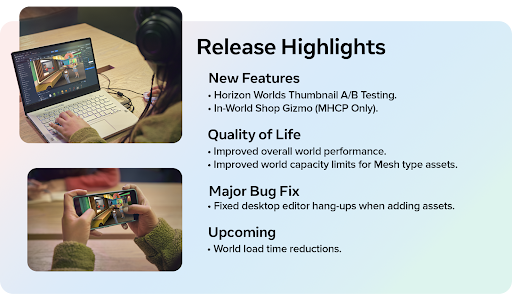

## [New Features](#new-features-25)

- **Introducing the World capacity guidelines dialog**: Desktop users now will be able to see their [world capacity information](Desktop%20editor/Get%20started%20with%20Desktop%20Editor/World%20Capacity%20dialog.md) for Objects, Simulation and animation, World vertex count, and Sounds, bringing the desktop editor more in-line with the functionality already available in the VR Editor. Find this option in the Main Menu within the desktop editor and select **World Capacity** .
- 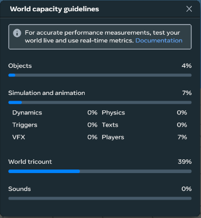
  The avatar pose gizmo typescript API is now open to all creators. This includes two new events: OnPlayerEnterAvatarPoseGizmo and OnPlayerExitAvatarPoseGizmo, which will trigger when a player enters or exits a seat. These new events will provide more flexibility and control for creators building interactive experiences. Learn more [here](Gizmos/Avatar%20pose%20gizmo.md).

## [Quality of Life Improvements](#quality-of-life-improvements-20)

- Increased the entity limit from 1000 to 3000 under a single parent, which gives creators significantly greater flexibility to create complex hierarchies.
- Added UI to all Mesh GenAI features highlighting the 500 character limit max per prompt, making it more clear to creators that there is a character limit up front rather than waiting for a response with an error.
- Improved object manipulation in editor mode.
- Desktop world editor now supports deeplinking. Note: only the desktop editor, installed from the standalone installer will have deeplink capability.
- Horizon Desktop Editor [GenAI](Desktop%20editor/Generative%20AI%20tools/Generative%20AI%20Overview.md) tools are now available in Australia and New Zealand. This includes: Typerscript, sound effects, ambient audio, skybox, and mesh and texture generation tools.
- [Typescript generation](Desktop%20editor/Generative%20AI%20tools/Generative%20AI%20Assistant%20Tool.md) is now powered with Llama 4, Meta's newest LLM, enhancing its quality and accuracy.
- Improved object manipulation in editor mode.

## [Bug Fixes](#bug-fixes-25)

- Fixed a bug where generating a thumbnail for meshes that have a transform would result in artifacts.
- Fixed a bug where uploading multiple meshes at once would result in a pink texture artifact.
- Fixed a bug where generating a thumbnail for a legacy group node mesh would fail to capture the entire mesh.
- Fixed a bug where the release notes would not be fully scrollable when viewing within the desktop editor.
- Fixed a bug where the Mesh GenAI panel could be softlocked when submitting prompts after the server returns an error.
- Fixed a bug where the world rating would not update after adding the rating.
- Fixed a bug where GenAI audio assets could be stuck in a continuous loading state after being dropped into a world.
- Fixed a bug where minimizing the bottom panel would trigger a visual defect within the editor.
- Fixed a bug where the camera position was not saved after entering and exiting preview mode.

## [Documentation Improvements](#documentation-improvements-7)

- Revamped the [Door gizmo](Gizmos/Door%20gizmo.md) article, outlining the steps to travel from one world to another.
- Revamped [Use the Environment gizmo](Gizmos/Environment%20gizmo.md) to highlight the concepts of skydome and cubemap, and to provide resources for creating dynamic environments and custom skydomes.

## [Upcoming Release Roadmap](#upcoming-release-roadmap-7)

We've heard your feedback and we're working on shipping the following improvements in the next few releases:

- Fixes to world UI flickering.
- Render property window.
- Further reduction of mobile load time for high entity count worlds.

---

This week in v213, we are launching Horizon Worlds Thumbnail A/B testing, giving creators valuable data-driven insights to help grow their worlds. Additionally, a new In-World Shop Gizmo is now available for creators, adding depth to world gameplay and offering players more reasons to return (MHCP Only). Our first wave of Mobile Perf Tooling capabilities have also been released, providing creators with the tools they need to optimize their world's performance. Furthermore, we've made numerous quality of life improvements, including optimizations that allow for the creation of larger worlds by reducing mesh type assets world capacity impact. Finally, we've addressed several community-requested bug fixes, such as resolving desktop editor hang-ups when adding or removing assets.

Read on for more details on Meta Horizon v213:

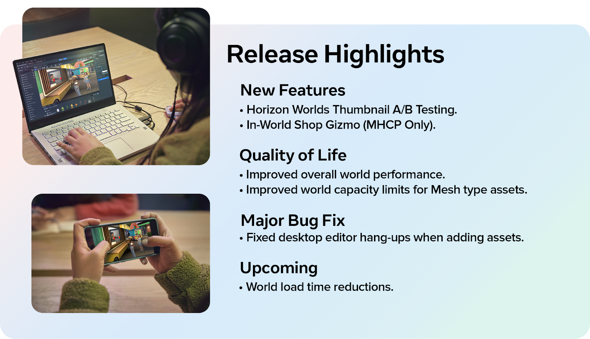

## [New Features](#new-features-26)

- **Horizon Worlds Thumbnail A/B Testing**: The Creative A/B testing tool is now available for all creators! A/B testing helps you get more visitors to your world and increases engagement by publishing two versions of your world thumbnail image and comparing which image drives more visits. You are able to choose the images, the duration of the test and at the end, the tool will recommend which creative you should use moving forward to best engage your audience. Review the documentation and how to use this new tool [here](https://developers.meta.com/horizon-worlds/learn/documentation/performance-best-practices-and-tooling/performance-tools/thumbnail-ab-testing-tool).
- **In-World Shop Gizmo**: We're releasing a new gizmo to make it easy for creators to add a shop to their world. This enables world creators to add in-game shops where players can acquire in-game items in exchange for in-world currency or Meta Credits. Use this gizmo to add depth to your gameplay and offer players more reasons to come back to your world. Review the documentation and how to use this new tool [here](Gizmos/Shop%20gizmo.md).
- Introducing Performance tools for Mobile.
  - Real-time Metrics: View live FPS and CPU time metrics to monitor your content's performance in real-time.
  - Performance Tracing: Take detailed traces of your content's performance to identify bottlenecks and areas for improvement.
- 150 new library assets which can be found in Food, Horror, Plants, Vehicles, Weapons, and Structures.

## [Quality of Life Improvements](#quality-of-life-improvements-21)

- Mesh type assets now only count towards the world entity limit, reducing object capacity impact, allowing creators to create much larger worlds.
- Improved LOD mesh debug visualization for creators.
- Added a prompt for creators to enable the horizon/ui script module when first creating UI scripts.
- Creators can now detect when a player begins and ends focused interactions with CustomUI, Leaderboard, and Debug Console gizmos. Adds firing the [CodeBlockEvents.OnPlayerEnteredFocusedInteraction](Reference/core/Variables/CodeBlockEvents.md) and CodeBlockEvents.OnPlayerExitedFocusedInteraction events when users interact with the Creator Debug Console and Custom UI gizmos.
- Using multiselect to upload LOD files now uploads them in ascending order by default.
- Moved disk writes to worker thread, reducing main thread blockage and increasing overall performance.
- Ability for creators to create worlds with a player cap of 1 (MHCP only).
- You can now select multiple entities in the Desktop Editor and edit shared properties (like position, rotation, and scale) all at once via the updated properties panel. Bringing it in line with the functionality already available in the VR Editor.
- Improved SoundFX and Ambient Audio Generation tooling with 10% faster output as well as enhanced sound quality which you can integrate into the experiences you are building. Learn more about the GenAI Audio tool [here](Desktop%20editor/Generative%20AI%20tools/Generative%20AI%20Creation%20Audio%20Tool.md).
- Creators can now search and attach scripts directly from the properties panel. You can also create and attach new scripts from templates that work out of the box for common use cases such as trigger zones and Custom UI.

## [Bug Fixes](#bug-fixes-26)

- Fixed a bug where replacing or adding assets would hang for up to an hour before timing out.
- Fixed a bug where the In-World Purchase creation flow was broken while an image was imported.
- Fixed a bug where Meta credit balance in product description page would not update after completing a purchase.
- Fixed a bug where an “open in browser” dialog box would appear in the desktop editor when trying to open any link, which should only appear when in MR.
- Fixed a bug in Gen AI tools where 3D Model generation would sometimes hang indefinitely until the editor was restarted.
- Fixed a bug where Mobile and Web users were unable to hear other player audio when prewarming/joining a world.
- Fixed a bug when creating an asset and then trying to update it would lead to an infinite update loop in certain cases.

## [Documentation Improvements](#documentation-improvements-8)

- A topic explaining [World Content Traces](Performance/Performance%20tools/World%20Content%20Traces.md) (a frame-by-frame performance trace of world assets) is now available to all users.
- Added documentation for the [Thumbnail A/B Testing Tool](https://developers.meta.com/horizon-worlds/learn/documentation/performance-best-practices-and-tooling/performance-tools/thumbnail-ab-testing-tool/) in the Performance section.
- Updated the [Spawn Point Gizmo](Gizmos/Spawn%20point%20gizmo.md) topic which introduces the concept of a spawn point and outlines how to use the gizmo to create and manage spawn points in Meta Horizon Worlds.

## [Upcoming Release Roadmap](#upcoming-release-roadmap-8)

We've heard your feedback and we're working on shipping the following improvements in the next few releases:

- World load time reductions.
- Animation imports directly into the editor which converts to Horizon Unity Runtime.
- Texture size reductions for improved editor performance.

---

This week in v212 we are introducing the standalone desktop editor, getting creators into world building even faster. We also launched new Creator Insight Portal features that will help creators make impactful decisions based on data to their worlds such as 3D heatmap visualizations (**these features are now fully live to all creators**). We cut object spawn time by 50%, boosted avatar skinning performance by 20%, and fixed several LOD import issues that were affecting world performance and preventing creators from making larger worlds. Lastly, we have many quality of life and bug fixes requested by the community.

Read on for more details on Meta Horizon v212:

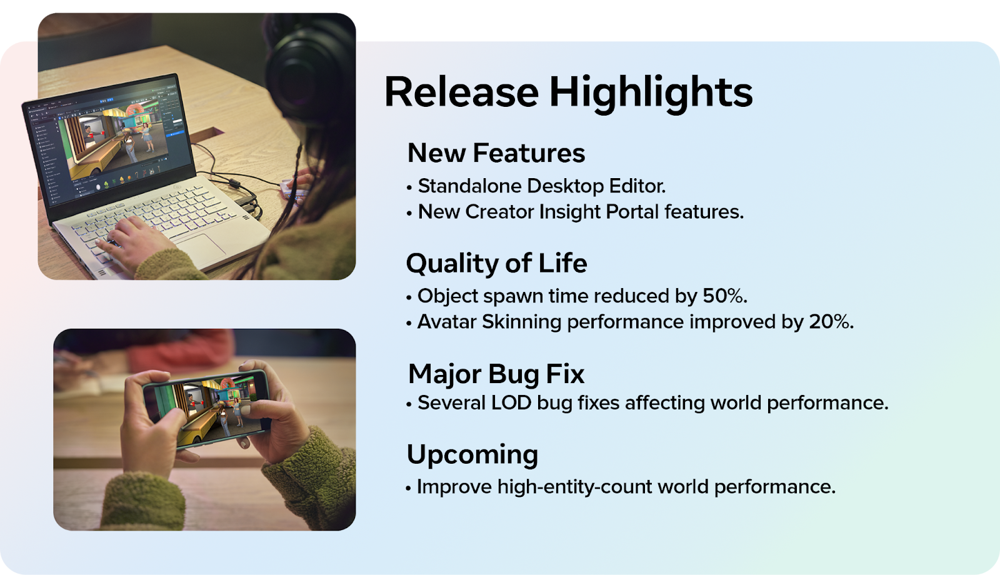

## [New Features](#new-features-27)

- Introducing the **Standalone Desktop Editor**: We are making it easier to access the desktop editor by separating it out from Meta Quest Link software. This helps new creators get into the editor significantly faster and will help existing users access it faster. Click the button to download the desktop editor (Windows only):

  [Download for Windows](https://fb.me/worlds_desktop_editor)
- The Creator Insight Portal has newly added features **now live to all creators**. Use [this link](https://horizon.meta.com/creator/worlds_all/) to view your worlds and use the **Insight** button to see these new features per world:
  - **3D Heatmap: Visualize positional Data**: The 3D heatmap feature allows creators to see time spent, crash and exit positions distribution overlaid on their world mesh. This visualization will help identify areas for improvement.
  - 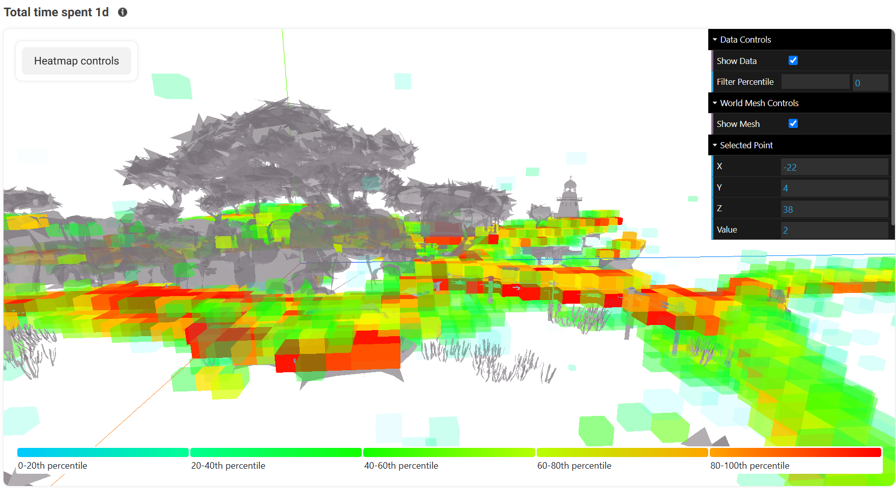
    **Benchmarking - Compare Your World's Performance**: We're introducing a benchmarking feature that allows creators to compare their worlds against the top 100 popular worlds ranked by Weekly Active Users. This update will provide valuable insights into performance and help creators optimize their content.
  - **New Metrics: Enhanced Insights for Creators**: We are launching 7 new metrics. They will provide creators with more detailed information about their world's monetization and integrity. Monetization metrics are only available to the world owner.
- 200 New assets added to the library within Environment/City, Interiors, Weapons, Plants, and Food categories.

## [Quality of Life Improvements](#quality-of-life-improvements-22)

- Reduced the time to spawn objects by 50%.
- Avatar skinning optimizations. Performance improved by 20%.
- Added backing plate to config button.
- After importing an AI Mesh Gen asset, the preview in the chat window displays a button to locate the generated asset in the library panel. This will switch to the library tab if it is not active, select the folder that the asset is in, and select the asset.
- The Properties menu on the right side panel has been reordered based on creator preferences to favor most used preferences at the top and descending from there.
- Creators now have more manual LOD (Level of Detail) control when importing models. This will help creators improve world performance, reduce load of hardware and have better control optimization asset management.
- Creators are now able to move more than one asset at a time to different folders.
- UI Density Improvements targeted to improve editor usability based on creator feedback.

## [Bug Fixes](#bug-fixes-27)

- Fixed a bug where editing an asset template searches the whole scene instead of the specified asset template.
- Fixed several bugs and issues with LOD imports that were preventing creators from effectively using the system and affecting world performance.
- Fixed a bug where channel limits were incorrectly defined when importing audio files leading to errors.

## [Documentation Improvements](#documentation-improvements-9)

- Added the [About Gizmos](Gizmos/About%20gizmos.md) topic to explain Gizmos through scripting and learning with our tutorial worlds.
- Updated the [Text Gizmos](Gizmos/Text%20gizmo.md) topic to include concepts, basic access and usage information, and links to implementation details.

## [Upcoming Release Roadmap](#upcoming-release-roadmap-9)

We've heard your feedback and we're working on shipping the following improvements in the next few releases:

- Allow creators to animate a rig in any DCC (Digital Content Creation) tool for AI mesh generations.
- Allow creators to reduce texture sizes to 512 for improved performance, without leaving the editor.
- Investigate and address longer load times in high-entity-count worlds.

---

This week in v211, creators will now see release notes shown directly within the desktop editor the first time they log in after a new release. We also added over 200 new public library assets. Lastly, we have quality of life improvements and bug fixes requested by the community.

Read on for more details on Meta Horizon v211:

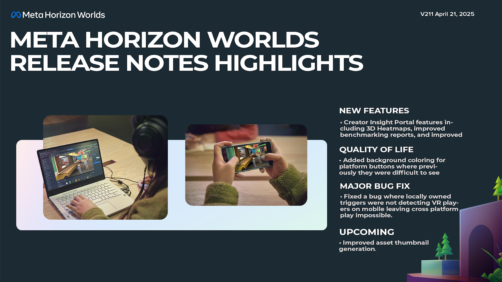

## [New Features](#new-features-28)

- Release notes will now show directly within the desktop editor the first time a user logs in after a new release.
- New Assets: 282 New library assets have been added. These assets can be found in multiple categories and include themed assets for Hospital, High School, Industrial, Ice Palace, Space, and Horror.

## [Quality of Life Improvements](#quality-of-life-improvements-23)

- Added background coloring for platform buttons such as **Pause**, **Mic Settings**, **Emotes**, **Leaving World**, etc. This allows players to more easily see platform buttons where previously they were difficult to see in light environments.

## [Bug Fixes](#bug-fixes-28)

- Typescript raycasting API fixes.
- Fixed a bug where the paste option was not available in the **Attach Script** button.
- Fixed a bug where locally owned triggers were not detecting VR players on mobile leaving cross platform play impossible.
- Fixed multiple bugs with asset templates including templates not properly updating scripts when accepting template updates, adding child entities not triggering overrides, and overrides occasionally unlinking asset templates from their source template.

## [Upcoming Release Roadmap](#upcoming-release-roadmap-10)

We've heard your feedback and we're working on shipping the following improvements in the next few releases:

- Easier navigation of AI Mesh Gen assets after importing.
- Improved asset thumbnail generation on generation.
- Public asset library audit to provide consistent and correct orientations to create more predictable asset behaviors.

---

This week in v210, we introduced the Mesh Generation and Texture Generation tools which allow creators to make 3D meshes and retexture objects for use in their worlds. Additional exciting features were launched as well, including custom audio uploads and making it so creators can upload custom thumbnails to their worlds directly within the editor.

Read on for more details on Meta Horizon v210:

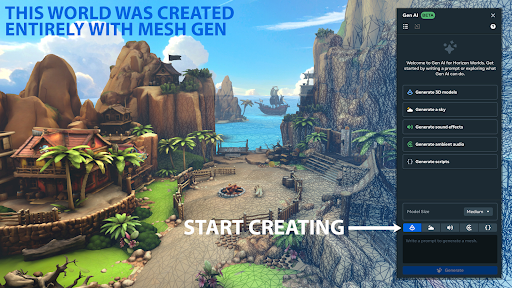

## [New Features](#new-features-29)

- **Introducing Mesh Generation & Texture Generation Tools**: Creators using the Horizon Desktop Editor in the US, UK, and Canada can now use the Mesh Generation and Texture Generation tools in the GenAI panel. Mesh Generation enables creators to easily and quickly create 3D meshes, while Texture Generation will allow creators to modify textures of any mesh, regardless of how it’s created. For more information on our suite of GenAI tools, read our [latest blog post](https://developers.meta.com/horizon/blog/build-faster-smarter-genai-tools-meta-horizon-worlds-mesh-gen/). Review the documentation for Mesh Generation [here](Desktop%20editor/Generative%20AI%20tools/Generative%20AI%20Mesh%20Generation%20Tool.md), and Texture Generation Tools [here](Desktop%20editor/Generative%20AI%20tools/Generative%20AI%20Texture%20Generation%20Tool.md).
- **Introducing the Generative AI Mesh Gen Tool**: Creators using the Horizon Desktop Editor can now use the Mesh Gen tool in the GenAI panel to create textured 3D meshes for use in their worlds. Mesh Gen is rolling out this week for creators in the US, UK, and Canada for ages 13+. For more information on using Mesh Gen to create 3D meshes, review the documentation [here](Desktop%20editor/Generative%20AI%20tools/Generative%20AI%20Mesh%20Generation%20Tool.md).
- Creators can now upload custom audio to their worlds. Review the documentation [here](Desktop%20editor/Help%20and%20reference/Meta%20Horizon%20Worlds%20Audio%20Ingestion.md) (MHCP only).
- Creators can now upload custom thumbnails for their worlds directly from within the desktop editor. Creators can find this option within the **Publishing** tab.

## [Quality of Life Improvements](#quality-of-life-improvements-24)

- In World Purchase (IWP) can now be initiated via a typescript in [IWP Purchase](Reference/core/Classes/InWorldPurchase.md) and [World Inventory](Reference/core/Classes/WorldInventory.md). Additional documentation and implementation guide to come. (MHCP only)
- Reduced the overhead for physics triggers.
- Updated the “Switch to VR” icon within the editor to be more clear.
- Added new themed assets for pirates, carnivals, taverns, general store, winter holidays, school, and music as well as game boards, player pieces and dice. New assets can be found mostly under Environment, Structures, Interiors, and Toys. 10 new explosion VFX have also been added.
- Creators now have the capability to choose a device model when they select the preview device to mobile. This allows creators to be able to properly adapt and preview their UI and controls to different mobile devices.

## [Bug Fixes](#bug-fixes-29)

- Fixed a bug where scripts made to spawn assets would not update properly and spawn assets of older versions.
- Fixed a bug that could lead to creators getting rate limited when creating worlds with many game objects or changing worlds often.
- Fixed a bug where assets folders could disappear from the browsing list in the editor when a large volume of folders were used.
- Fixed a bug where object manipulators may disappear after one use.
- Fixed a bug where top bar buttons had uneven margins.
- Fixed a bug where the max distance parameter was never enforced when setting maximum grab distance.

## [Upcoming Release Roadmap](#upcoming-release-roadmap-11)

We've heard your feedback and we're working on shipping the following improvements in the next few releases:

- Fixes to the UI disappearing when a player joins the world.
- Enable the paste option in the **Attach Script** button.
- Auto-generate thumbnails for asset templates.

---

This week, we introduced the ability to create experiences with dynamically aligned geometry by allowing access to Bounds via Typescript, expanded mobile joystick options with the new dynamic joystick option, increased the ease of importing 3D models, and fixed commonly reported bugs.

Read on for more details on Meta Horizon v209:

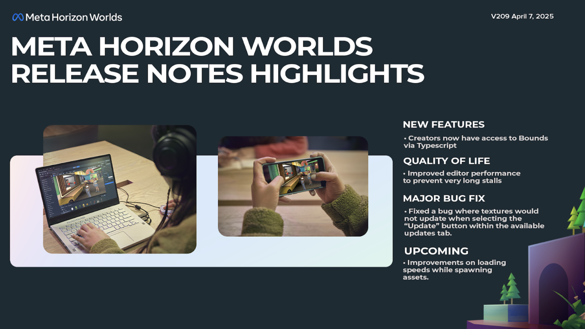

## [New Features](#new-features-30)

- Improved the ability to create experiences with dynamically aligned geometry by allowing access to Bounds via Typescript.
- Creators can now create an item for in-world purchase (IWP) without the restriction of needing a thumbnail image taken from a VR screenshot. Custom images can now be uploaded directly from the desktop editor. (MHCP Only)
- Implemented new Dynamic Virtual Joystick option for mobile experiences. Dynamic joystick will re-orient itself and follow the users' input when the joystick nub has been moved too far from the base joystick container. To enable Dynamic Joystick on mobile you need to go into PUI, navigate to Settings > Controls, then you can change the option of Virtual Joystick to "Dynamic".

## [Quality of Life Improvements](#quality-of-life-improvements-25)

- PNG textures are no longer required for any FBX 3D Model import. If no PNG is specified, it will be imported with the same basic material as the default shapes.
- Increased responsiveness of the top bar within the editor to make it more versatile among varying monitor sizes.
- Improved editor performance to prevent very long stalls while spawning assets.
- Objects spawned from the Shapes tab now spawn with a scale of 1 with uniform dimensions.
- Moving the NPC gizmo in editor will no longer trigger the loading particles.

## [Bug Fixes](#bug-fixes-30)

- Fixed a bug where textures would not update when selecting the “Update” button within the available updates tab.
- Fixed an asset library memory leak.
- Fixed queries that could lead to creators being rate limited.
- Fixed a bug where the publish panel would be opened by the ellipse button while in unfocused preview mode.
- Fixed a bug where the publish panel could be accessed while in unfocused preview mode
- Fixed a bug where the Script holder would show up within the Shapes Gizmo

## [Upcoming Release Roadmap](#upcoming-release-roadmap-12)

We've heard your feedback and we're working on shipping the following improvements in the next few releases:

- Release notes viewable within the editor. (v210)
- Allow players to have prefabs that are generated per player.
- Allow generation of thumbnails for 3d models.

---

This week we improved the backend stability of the desktop editor, simplified the process of importing custom skyboxes, and fixed bugs reported by the creator community.

Read on for more details on Meta Horizon v208:

## [New Feature:](#new-feature)

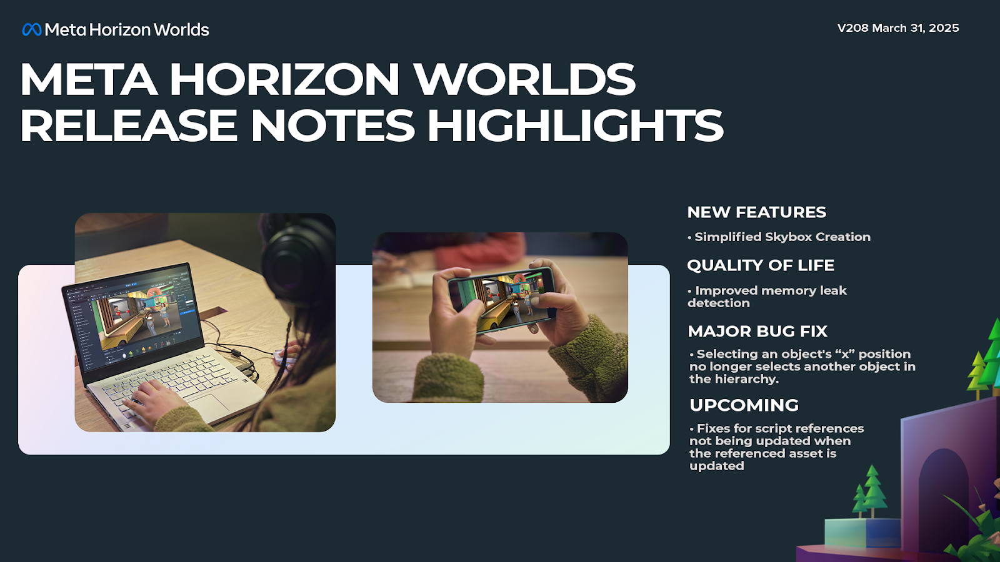

- Simplified skybox creation by only requiring a standard cube map to be uploaded in order for a skybox to appear.

## [Quality of Life Improvements](#quality-of-life-improvements-26)

- Instead of having to use "OnProjectHitObject" to know when a specific object is hit, or "OnProjectileHitWorld" to know when anything is hit, you [can now use "OnProjectileHitEntity"](https://developers.meta.com/horizon-worlds/learn/documentation/tutorial-worlds/simple-shooting-mechanics-tutorial/module-2-projectile) and it will let you know both.
- Improved memory leak detection.

## [Bug Fixes](#bug-fixes-31)

- Fixed a big where selecting an object's “x” position would select another object in the hierarchy.
- Fixed a bug where the publish buttons at times did not appear in the desktop editor UI panel.
- Fixed a bug where custom model imports asset links would break during world editing.
- Fixed a bug that could crash the editor when switching tabs while performance metrics were running.
- Fixed a bug where changes to an avatar's size could cause camera clipping issues. (MR only)

## [Known Issues](#known-issues)

To help us keep improving the desktop editor, use “Report a problem” in the dropdown menu to send us your bugs and feedback.

- [Sound Recorder gizmo](Gizmos/Sound%20recorder%20gizmo.md) is known to appear functional, however recorded audio will not save or playback.

## [Upcoming Release Roadmap](#upcoming-release-roadmap-13)

We've heard your feedback and we're working on shipping the following improvements in the next few releases:

- Release notes will be viewable directly within the desktop editor.
- Improved Asset Creation Flows: Fixes for script references not being updated when the referenced asset is updated.
- Improved loading speeds while spawning assets.

---

This week in v207, we are launching the Meta Horizon Feedback tool, addressing numerous reported bugs and adding many quality of life improvements. .

Read on for more details on Meta Horizon v207:

## [New Feature: Feedback tool](#new-feature-feedback-tool)

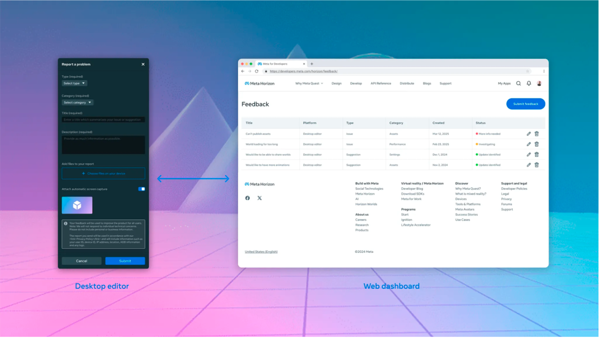

With the new **Feedback too**l you can now track the status of bugs and feedback you have reported through the desktop editor. This new feature offers transparency into how Meta handles your feedback, offering updates as we review, prioritize, and implement your recommendations.

Submit feedback via **“Report a problem”** in the dropdown menu when you encounter bugs or issues or have suggestions for new features and improvements. To check the status of your feedback, visit “Track your reports” in the dropdown menu.

In addition, you can now add images and videos to your reports to help us solve your issues quicker.

Currently Feedback Hub is only available for bugs and feedback submitted through the desktop editor, but we’re looking at how to roll it out to other surfaces. Stay tuned!

## [Quality of Life Improvements](#quality-of-life-improvements-27)

- Changed the “Scale” manipulator prefab's colliders to make the lines themselves clickable, similar to industry conventions.
- Changed the “Translate” manipulator prefab's colliders to make the lines themselves clickable, similar to industry conventions.
- Reduced the amount of steps required to add a UIComponent script to a Custom UI Gizmo.
- Add cursor hover state to Horizon2DLinkText components.
- Renaming entities in the hierarchy will only happen now on a double click, not single click.

## [Bug Fixes](#bug-fixes-32)

- Fixed a bug where mouse camera focus became locked if the user exits preview mode with pop up still present.
- Fixed a bug during collaborative editing where a desktop user's movement doesn't display properly for other editors while a user presses the 'F' button in an unfocused preview state.
- Fixed a bug where taking a picture of the world using the UI gizmo causes a black screen and an inescapable state.
- Fixed a bug where when in unfocused preview mode and editing a template definition, the UI would persist into the preview mode view.
- Fixed a bug where the environment gizmo becomes inactive when entering preview mode.
- Fixed a bug where an unnecessary camera appears while users press the 'E' button.
- Fixed a bug where selecting objects in scene view would immediately trigger a renaming state.
- Fixed a bug where certain NavMesh APIs would fail due to a "failed cast" error when called from TypeScript.

## [Known Issues](#known-issues-1)

To help us keep improving the desktop editor, use “Report a problem” in the dropdown menu to send us your bugs and feedback.

- Custom model import asset links have instances of breaking and are being investigated.

## [Upcoming Release Roadmap](#upcoming-release-roadmap-14)

We've heard your feedback and we're working on shipping the following improvements in the next few releases:

- 3D Model Thumbnail Support Within The Assets Panel
- Additional Premade Particle FX In The Public Asset Library
- Player Pooling Gizmo

---

This week in v206 we have exciting new features to help creators add custom skyboxes to their worlds, quality of life improvements, and bug fixes.

Read on for more details on Meta Horizon v206:

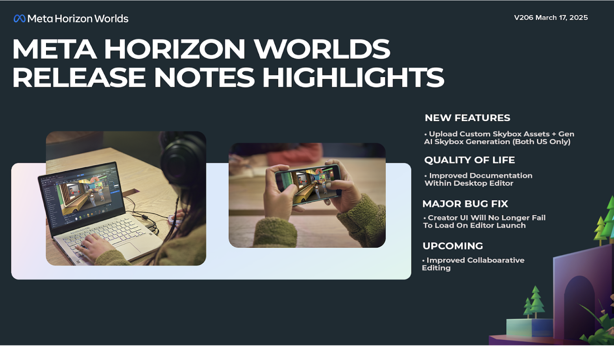

## [New Features](#new-features-31)

- Upload Custom Skybox Assets and GenAI Skybox Generation (Both US Only)
  - (Feature Live on 3/17) Creators using the Horizon Desktop Editor now can upload custom skyboxes. To review requirements and processes for uploading custom skyboxes in your Meta Horizon Worlds, [review the documentation here](Desktop%20editor/Preparing%20Skydome%20Maps%20for%20Meta%20Horizon%20Worlds%20Ingestion.md).
  - Creators using the Horizon Desktop Editor can now use the Horizon GenAI tool to create skyboxes for their created world. There are currently 6 styles supported and, once generated, they can be saved to your asset library or local disk. For more information on using the Horizon GenAI tool to create skyboxes [review the documentation here.](Desktop%20editor/Generative%20AI%20tools/Generative%20AI%20Skybox%20Generation%20Tool.md)

## [Quality of Life Improvements](#quality-of-life-improvements-28)

- Added the ability to disable static lights.
- Added documentation links in asset import dialogs.
- The attached script dropdown is now searchable.
- Asset rendering improvements.
- In-World Purchases setup steps improved for better creator workflows (MHCP Only).

## [Bug Fixes](#bug-fixes-33)

- Fixed a bug where the creator UI would not be present after loading into the desktop editor.
- Moving from build mode to preview mode within the desktop editor no longer gives the falling effect on player avatars.

## [Known Issues](#known-issues-2)

To help us keep improving the desktop editor, use the "Report an issue" option in the menu to report any problems found.

- Custom Model Import are not loading for some users, displaying an exclamation mark in the UI.

## [Upcoming Release Roadmap](#upcoming-release-roadmap-15)

We've heard your feedback and we're working on shipping the following improvements in the next few releases:

- Asset Creation Improvements
- - Simplify Skybox and Model texture import requirements.
  Improved Collaborative Editing
- - Add the ability for co-editors to work on single object manipulation at the same time.
  Improved Creator Experience
  - Allow creators to search, create, and attach scripts from the Properties panel.

---

This week, we continued addressing feedback on the desktop editor. In v205, we have bug fixes (including the heavily reported duplicated rotation bug that slowed creators down), quality of life improvements, a new auto-jump feature and a peek into some upcoming features.

As part of the [$50M Meta Horizon Creator Fund announcements](https://developers.meta.com/horizon/blog/empowering-horizon-creators-with-a-new-50m-fund-and-advanced-tools-for-mobile-and-mr-worlds), we launched a new $1M mobile competition to reward innovative mobile world development. Starting on March 11, 2025, this competition, themed "Mobile Genre Showdown” will reward 30 talented creators with prizes. To learn more, check out this [blog post](https://developers.meta.com/horizon/blog/horizon-worlds-mobile-competition-1M-genre-showdown-creator-quest/)!

To help us keep improving the desktop editor, use the "Report an issue" optin in the menu to report any problems found.

Read on for more details on Meta Horizon v205:

## [New Feature](#new-feature-1)

- Added auto-jump functionlaity in worlds
  - Auto-jump will be enabled through the Player Settings panel for a world and apply to all players in that particular world if enabled. When enabled, a player will jump automatically when approaching walls and objects with low enough heights to jump onto/over.

## [Quality of Life Improvements](#quality-of-life-improvements-29)

- Gizmos are always OFF when in preview mode. Toggle is also now removed when in preview mode.
- Right click cut/copy/paste functionality has been added to the hierarchy in the editor.
- Added a dynamic lighting visibililty toggle to allow creators to more easily test a light's contribution to a scene.
- Asset library subcategories now load with single asset search queries.
- Custom player movement in new worlds is fixed to be enabled ON by default.

## [Bug Fixes](#bug-fixes-34)

- Asset library/marketplace render time speed improved.
- Fixed an issue where duplicated transformations did not keep their original rotation.
- Newly imported assets now do not have continuous blinking icons.
- Additional memory leak fixes on scene change.
- Inputting numerical transform data no longer has a delay on the intended asset.
- Dragging an asset from the asset UI into a scene back and forth no longer leaves a loading graphic overlay.
- Gizmo toggle no longer overlaps Gen AI toolbars.
- Fixed laggy responsiveness of property tab scrolling.

## [Known Issues](#known-issues-3)

We are investigating the following issue:

- VR-only portals may be visible when visiting mobile only worlds. This portal is interactable but will not function when playing on a mobile device.

## [Upcoming Release Roadmap](#upcoming-release-roadmap-16)

We've heard your feedback and we're working on shipping the following improvements in the next few releases:

- Asset Pipeline Improvements
- - Reducing overly strict parameters and processes slowing down creator pipelines.
  Improved Graphics and Performance
- - Improving load time and performance of worlds.
  Better First User (Creator) Experiences
  - Fixing bugs and friction points creators run into during their first hour and into their first week of creating.

---

This week we have bug fixes (including fixing the pesky “jitter” when manipulating objects), quality of life improvements and a peek into some upcoming features for future releases planned.

As a reminder, last month we announced [new $50 million Creator Fund and the early access release of the Meta Horizon desktop editor](https://developers.meta.com/horizon/blog/empowering-horizon-creators-with-a-new-50m-fund-and-advanced-tools-for-mobile-and-mr-worlds) Check out our [documentation](Get%20started/Install%20the%20desktop%20editor.md) for details on how to get started with the desktop editor.

To help us keep improving the desktop editor, use the **“Report an issue”** option in the menu to report any problems found.

Read on for more details on Meta Horizon v204:

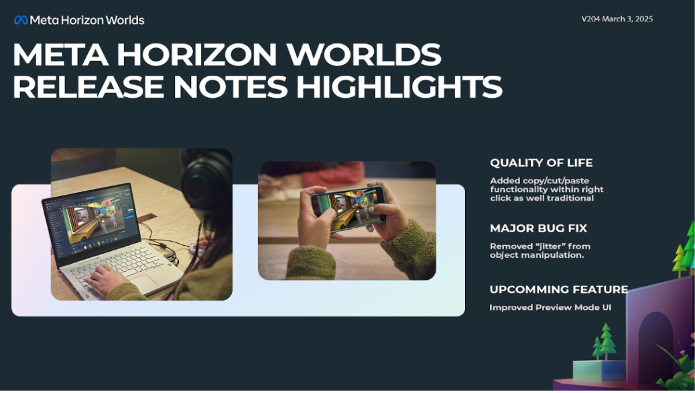

## [Quality of Life Improvements](#quality-of-life-improvements-30)

- Menu icons now have labels when hovering over them.
- The asset library now defaults to open within the bottom tabs.

## [Bug Fixes](#bug-fixes-35)

- Removed "jitter" from object manipulation.
- Fixed an issue where input could become stuck when transitioning between PiP mode states on mobile devices.

## [Known Issues](#known-issues-4)

We are investigating the following issues:

- The player stops rotating with the camera after using reload animation.
- When parenting or unparenting an object, if any interactive option is set, the hierarchy breaks and jumps in position.
- The editor hides the 'Avatar Attachable' parameter for non-collidable entities, causing the parameter to remain active and functional despite being invisible in the properties panel.

## [Upcoming Release Roadmap](#upcoming-release-roadmap-17)

We've heard your feedback and we're working on shipping the following improvements in the next few releases:

- Improving Gizmo behaviors
- - Gizmos will have a toggle to disable them, allowing tuning of NPCs to speed up.
  Improving world loading times.
- - Time from app selection to fully loaded playability
  Auto-jump functionlaity in worlds
- - Auto-jump will be enabled through the Player Settings panel for a world and apply to all players in that particular world if enabled.
  Additional memory leak fixes
  - Cleanup managed memory on scene change.

---

We're back with our first update of the year - and it's an exciting one! Last week, we accounced our [new $50 million Creator Fund and the early access release of the Meta Horizon desktop editor](https://developers.meta.com/horizon/blog/empowering-horizon-creators-with-a-new-50m-fund-and-advanced-tools-for-mobile-and-mr-worlds), where you can build new worlds for mobile and MR right from your PC.

Check out our [documentation](Get%20started/Install%20the%20desktop%20editor.md) for details on how to get started with the desktop editor.

We'll continue to improve the desktop editor to introduce new tools and better support creators over time. As we do, we look forward to working closely with creators to integrate feedback and continue building out our tooling together.

Moving forward, we’ll be adapting our release notes to bring you the latest details on quality of life improvements, bug fixes, known issues and upcoming features. Release notes will continue to be published here, and we’ll also share them in the new [Meta Horizon Creator Program](https://developers.meta.com/horizon-worlds/programs) Forum. If you haven’t signed up yet, now is the time!

We’ll be introducing additional ways to report feedback soon. In the meantime, use the “Report an issue” option in the menu of the desktop editor.

Read on for more details on Meta Horizon's v203 release:

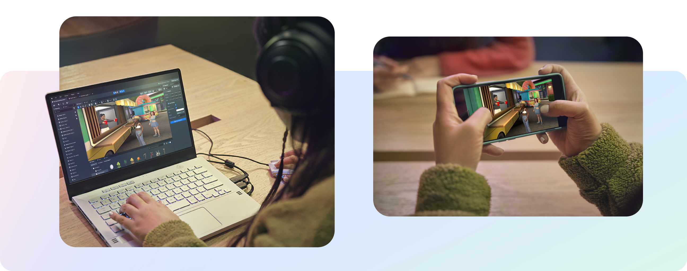

## [Quality of Life Improvements](#quality-of-life-improvements-31)

- World Simulation no longer auto-stops on preview exit when there's another creator in the world.
- Asset search is now category-agnostic. Additionally, an “All” category has been added to the search UI.
- The console can now be used while in play mode.
- - Preview mode will now support an "Unfocused" state in the desktop editor, which allows interaction with the editor without stopping preview mode. When pressing escape while in preview mode, instead of exiting preview mode like before, the editor will now switch to an unfocused preview state, where the user can interact with editor UI. Clicking in the scene view will switch focus back to preview mode and restore normal input functionality. Pressing escape a second time after unfocusing preview mode will cause preview mode to exit entirely.
  The Tabs for Assets, Console, Tests and AI will be expanded by default at the bottom navigation area when opening the desktop editor.
- The backspace key no longer deletes selected objects.
- Single-clicking on a script in the dropdown menu now opens the script to edit in an external tool for ease of use.
- The “ESC” key now deselects objects in the hierarchy view.
- The microphone mute status indicator is now more clear. A microphone blue highlight now correctly indicates an “unmuted” state, while a grey highlight indicates a “muted” state.
- The microphone is now off by default in the editor when opened.
- Duplicating multiple objects now shows up as an option in the right-click menu.
- Changed the play and stop buttons to match expectations. Hitting the play button will now start preview mode and hitting the stop button will return you to the editor console.
- Unhooked “WASD” movement in preview mode when handling is in an unfocused mode.
- Asset library categories and filters are now able to be changed on one screen reducing actions needed to spawn an asset.
- Disabled the preview mode settings dropdown while in preview mode.
- Clicks now propagate through context menus.
- Removed the VR-centric legacy "grouping" functionality from the desktop editor to support a consistent flow of creating parent objects.
- The transform tools now are present in “Unfocused Preview Mode”.
- Updating asset types now updates on creation and edit as well.

## [Bug Fixes](#bug-fixes-36)

- Mobile Horizon Worlds now correctly appear in search/store when renamed after being published.
- Fixed the 'X' Button in the console search bar so it now correctly clears the search term.
- Fixed memory leak changing from deleting a single element to the entire array.
- Fixed major editor memory leaks when adjusting window sizes.
- Fixed memory leak entering and exiting play mode.
- Fixed memory leak with Text Mesh Pro between scene changes.
- UI Refresh for hierarchy no longer degrades as the session goes on.
- A spawn error screen will now display when an asset fails to load.
- Selecting entities in the horizon editor no longer changes their game state.
- Editing an asset in a trimesh world that has a submesh, no longer blocks returning to the world hierarchy.
- The player character is no longer moved when focusing on a selection.
- Asset searches now correctly search for full query, rather than for each letter in the query.
- Fixed the Script Gizmo in Creation -> Gizmos menu to properly create a new script.
- Fixed an issue where duplicated assets sometimes could not be wrapped in an empty object.
- Fixed an issue where original objects accidentally moved while the "Duplicate" action was syncing.

## [Known Issues](#known-issues-5)

- Duplicating a File-Backed script gizmo in VR editing will link to the original script instead of creating a new copy. The flow for creating a deep copy of a script has changed.
- - While our team is actively working to resolve this issue, there is a workaround available in the meantime: In the scripting panel, click the three-dot button, then click “Duplicate”. On the new script click the three-dot button, then “Spawn New Gizmo”
  Slight Jitter when moving assets throughout the scene.
- Some in-world UI changes height when the player is using certain avatars Avatars, making it hard to view (VR Only).
- The loading splash screen has some visual artifacts scattered along the edges of the Meta logo. (MR Only)

---

[Meta Horizon Worlds](https://www.meta.com/experiences/meta-horizon-worlds/2532035600194083?intern_source=blog\&intern_content=meta-horizon-worlds-v192-release-notes) v192, our last release notes installment of the year, is here! As 2024 comes to a close, we’d like to thank the entire Worlds community for your support and creativity. We can’t wait to show you what we’re working on for next year. Until then, stay tuned for a whole lot of winter fun headed to Worlds soon!

---

## [Get ready to strut your stuff—Style Season is here!](#get-ready-to-strut-your-stuffstyle-season-is-here)

Attention all fashion-forward adventurers and style enthusiasts! We are thrilled to announce the upcoming launch of Style Season in Meta Horizon Worlds, kicking off on December 17 and running through the end of February. This is our biggest event in Horizon history, and we’re giving you the chance to earn huge rewards all winter long!

What's in store? Here’s a full rundown of activities:

- **Streetwear Extravaganza:&#x20;**&#x48;orizon Central will be updated to be your Winter Streetwear HQ. During the event, you’ll be able to earn Style Points and redeem them for fabulous avatar rewards in Horizon Central and the Horizon menu.
- **Epic Style Season Quests:&#x20;**&#x54;ry your hand at completing our most challenging limited-time quests, like defeating 100 Sky Rangers as the Kaiju (Rampage Style) and earning 50 Gold in Samurai Tycoon (Style Samurai). Check out your Quest menu to keep track.
- **New Avatars and Exclusive Reward Drops:&#x20;**&#x45;arn fantastical new avatars and streetwear-themed rewards by getting as many Style Points as you can. Keep reading to learn more about these new rewards types!

There’s no shortage of content coming this winter, and we’re excited to share the season with you.

---

## [Quality of Life Improvements](#quality-of-life-improvements-32)

### [General](#general)

- We’re testing [a new way to use emotes](https://www.meta.com/help/quest/articles/horizon/explore-horizon-worlds/use-emotes-meta-horizon-worlds/?intern_source=blog\&intern_content=meta-horizon-worlds-v192-release-notes) to express yourself in Worlds on Quest. For quick access to emotes, pull your right thumbstick back and hold it to open the emotes menu. From there, simply tap the emote you want to use. While in testing, not everyone will have access to this feature.
- We’re introducing live speech, a way for you to type what you want to say and have it spoken out loud in Worlds. [Learn more](https://meta.com/help/530990386475072?intern_source=blog\&intern_content=meta-horizon-worlds-v192-release-notes).

---

[Meta Horizon Worlds](https://www.oculus.com/experiences/quest/2532035600194083/?intern_source=blog\&intern_content=meta-horizon-worlds-v191-release-notes) V191 is here! We recently rolled out community moderators. Find out below how to apply and become one—or if you’re a Creator, how to invite someone to help keep your worlds comfortable and enjoyable. We’re also reintroducing captions! Read on for more details.

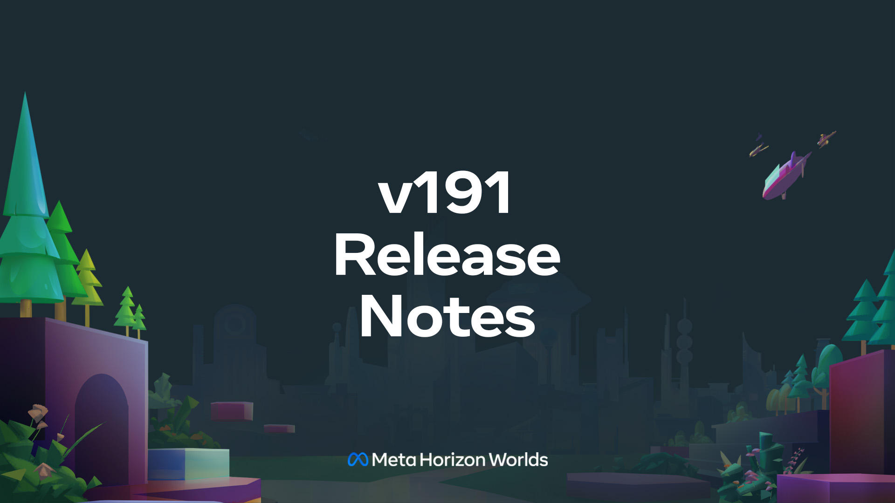

## [Community Moderators](#community-moderators)

**Become a Community Moderator**

Eligible people who are at least 13 years old can now apply or be invited by a world creator to be a community moderator of public worlds. Community moderators can play an important role in helping world creators keep the space comfortable and enjoyable. [Learn more](https://www.meta.com/help/quest/articles/horizon/safety-and-privacy-in-horizon-worlds/community-guides-in-horizon/?intern_source=blog\&intern_content=meta-horizon-worlds-v191-release-notes) about community moderators in Meta Horizon Worlds.

**Community Moderators in Your Worlds**

We are making it possible for you to invite eligible members of your community to be moderators to help maintain your world’s culture and safety. These moderators are here to help, but they should not be considered a replacement for reporting policy violating behavior.

Community moderators have the following abilities:

- **Mute or Unmute:** If someone’s causing trouble, moderators can mute them for 15 minutes. The moderator can also unmute users when things cool down.
- **Warn:** If someone’s causing trouble, they can send a private warning message to a user to inform them that they are not following world norms.
- **Remove:&#x20;**&#x49;n more serious cases, moderators can remove people from the world to keep the peace.

You can invite eligible members of your community to be moderators from the Manage People menu through the World Detail Page. For more information, visit [Documentation](https://developers.meta.com/horizon-worlds/learn/documentation/safety-and-privacy/community-moderation?intern_source=blog\&intern_content=meta-horizon-worlds-v191-release-notes).

---

## [Quality of Life Improvements](#quality-of-life-improvements-33)

### [General](#general-1)

- Captions are available again to help people get the most out of Meta Horizon Worlds. When captions are enabled, you’ll see a text version of other people’s words and sounds from any world you’re in. Only English language voiceover can be transcribed at this time, however you can select to see text translated in Spanish, German, Italian, and French. As of this release, captions aren’t yet available for group audio calls like parties, and they may not work for all non-player characters (NPCs). [Learn how](https://meta.com/help/273423262445175?intern_source=blog\&intern_content=meta-horizon-worlds-v191-release-notes) to turn on captions in Worlds.

---

[Meta Horizon Worlds](https://www.meta.com/experiences/quest/2532035600194083/?intern_source=blog\&intern_content=meta-horizon-worlds-v188-release-notes) v188 is here! This week, we’re launching the new Horizon Mixed Reality Public world, introducing parent-managed Meta account access to Worlds, and more. Let’s jump in!

[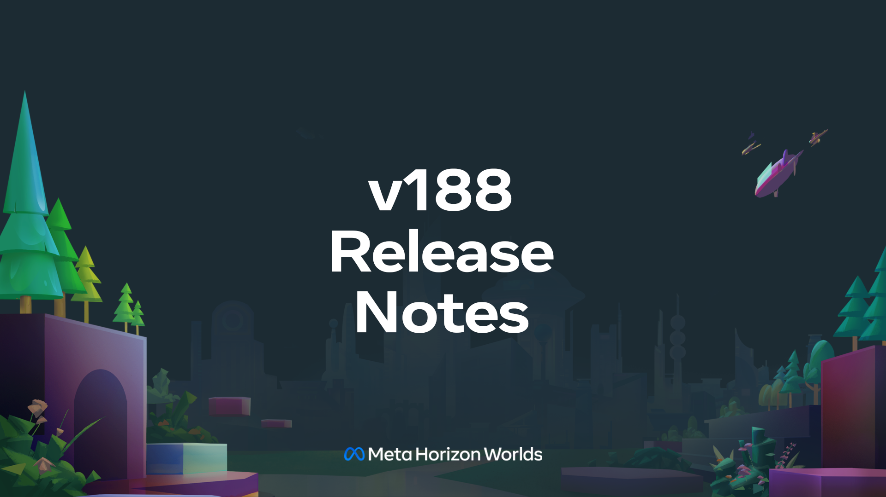](https://www.meta.com/experiences/quest/2532035600194083/?intern_source=blog\&intern_content=meta-horizon-worlds-v188-release-notes)

---

### [New Horizon Mixed Reality Public World](#new-horizon-mixed-reality-public-world)

We’re introducing the new [Horizon Mixed Reality Public](https://horizon.meta.com/world/10161049143694724/?intern_source=blog\&intern_content=meta-horizon-worlds-v188-release-notes) world, where you can now play mixed reality games with others in Worlds! You can also play invite-only games with friends in the [Horizon Mixed Reality With Your Friends](https://horizon.meta.com/world/10160670197769724/?intern_source=blog\&intern_content=meta-horizon-worlds-v188-release-notes) world and use the in-world travel button to seamlessly switch between the two. Try out the new Playing Cards game and updated Darts scoreboard in both worlds, with more exciting games coming soon!

[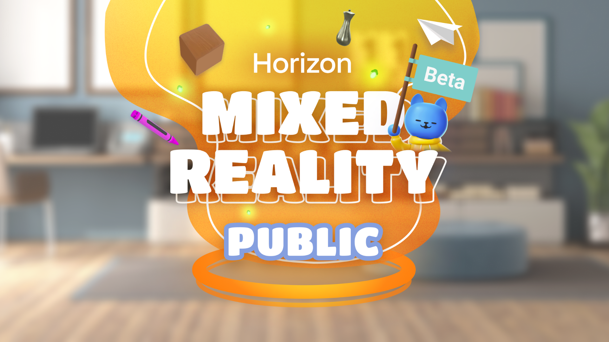](https://horizon.meta.com/world/10161049143694724/?intern_source=blog\&intern_content=meta-horizon-worlds-v188-release-notes)

---

### [Adding Parent-Managed Meta Account Access to Worlds](#adding-parent-managed-meta-account-access-to-worlds)

Starting today, parents will be able to [approve access to age-appropriate experiences in Worlds](https://www.meta.com/blog/quest/preteens-horizon-worlds-family-friendly-vr-mr/) for users of [parent-managed Meta accounts](https://www.meta.com/help/quest/articles/accounts/account-settings-and-management/index-child-accounts/?intern_source=blog\&intern_content=meta-horizon-worlds-v188-release-notes).

The updated experience for this age group will allow them to connect with friends and family while experiencing age-appropriate worlds like [The Space Station](https://horizon.meta.com/world/10166425805805029/?intern_source=blog\&intern_content=meta-horizon-worlds-v188-release-notes), [The Aquarium](https://horizon.meta.com/world/195828436660401/?intern_source=blog\&intern_content=meta-horizon-worlds-v188-release-notes), [Citadel](https://horizon.meta.com/world/279976781332952/?intern_source=blog\&intern_content=meta-horizon-worlds-v188-release-notes), [Spy School](https://horizon.meta.com/world/10228367510030611/?intern_source=blog\&intern_content=meta-horizon-worlds-v188-release-notes), [Bobber Bay Fishing](https://horizon.meta.com/world/365118142359176/?intern_source=blog\&intern_content=meta-horizon-worlds-v188-release-notes), and more.

Here’s how it will work:

- A parent-managed Meta account holder must request access to Horizon Worlds. Once a parent lets their preteen access Horizon Worlds, their preteen will be able to access a limited number of starter worlds rated for ages 10+. The parent can then choose to provide additional access to all worlds ages 10+, all worlds ages 10+ and ages 13+, or they can require their child to ask for permission to access each additional world. As with 13- to 17-year-olds, 18+ worlds are not visible or available to preteens with a parent-managed Meta account.
- We’ve built in a number of default protections and age-appropriate settings that parents can further customize. For example, voice chat is disabled for parent-managed Meta account users in Horizon Worlds except for specific parent-approved contacts.
- We don’t provide 10- to 12-year-olds with recommendations for people to follow. Preteens always need to approve any follower requests, and parents can choose to require parental approval as well.
- [Personal boundary](https://www.meta.com/help/quest/articles/horizon/safety-and-privacy-in-horizon-worlds/personal-boundary-horizon-worlds/?intern_source=blog\&intern_content=meta-horizon-worlds-v188-release-notes) will prevent anyone from getting too close to the avatar of anyone with a parent-managed Meta account, and this setting can’t be changed.
- Preteens’ status and visibility settings will be set to show as “offline” to others by default—and only parents can change this setting.
- A child can collaborate on world building with their approved contacts and others with parent permission.

We’re rolling out parent-managed Meta accounts over time, starting with the US and Canada, so that we can evaluate preteen and parent usage before expanding more broadly. For more information, visit our [Family Center](https://familycenter.meta.com/our-products/horizon-and-quest/?intern_source=blog\&intern_content=meta-horizon-worlds-v188-release-notes).

---

### [New Generative AI Information for Parents in Our Family Center](#new-generative-ai-information-for-parents-in-our-family-center)

Generative AI features are now available in Meta Horizon and Meta Horizon Worlds. These features include things like characters in games and creativity tools that help people make things like backgrounds and avatar clothing. We’ve added information to our [Family Center](https://familycenter.meta.com/dashboard/?entrypoint=fcsite%2F) for parents about what generative AI features their child or teen may experience.

---

### [Mute Assist Is Rolling Out to More Worlds](#mute-assist-is-rolling-out-to-more-worlds)

We’re beginning to roll out mute assist to public worlds, with worlds rated ages 10+ and 13+ being defaulted to “on.” Mute assist is a moderation feature in Worlds that automatically mutes or lets people quickly mute others that they don’t know, who are being loud and/or using profanity or potentially offensive language. World creators can turn mute assist on or off at any time in all of their public worlds from the Publish world menu.

This feature has been designed to help people have fun and build meaningful connections with fewer distractions. People can configure their mute assist settings for when they’re in worlds where mute assist is available. Please note that while this feature gradually rolls out, some people may not see it available in all worlds right away. To learn more about how to manage your microphone and mute settings in Worlds, please visit the [Help Center](https://www.meta.com/help/quest/articles/horizon/safety-and-privacy-in-horizon-worlds/mute-mic-horizon/?intern_source=blog\&intern_content=meta-horizon-worlds-v188-release-notes).

---

### [Meta Credits Are Coming to Worlds](#meta-credits-are-coming-to-worlds)

Meta Credits can be used for in-world purchases, directly from your headset or the Meta Horizon mobile app. We’re rolling out Meta Credits over time starting with players in the US, UK, and Canada.

Once available for your account, Meta Credits can be purchased within Worlds on Meta Quest and in the Meta Horizon mobile app.

---

## [Highlighted Bug Fixes](#highlighted-bug-fixes)

Here are some highlighted bug fixes for this week’s release.

### [General](#general-2)

- We fixed an issue where the camera shake when sprinting on mobile would get more extreme as more mobile players joined the world.
- We fixed a bug that was causing the camera to remain open after exiting safe zone if a person had entered safe zone with the camera open.
- We fixed an issue where the camera was focusing incorrectly on the world promotion panel on mobile.

### [Creators](#creators)

- We fixed a bug where the grab anchor visual hand pose was misaligned from the real pose in Edit mode.
- We fixed a bug where interrupting an existing player animation with a new animation wouldn’t play the new animation fully.
- The event drop down in the CodeBlocks editor is now showing all existing events.

---

## [Select Known Issues](#select-known-issues)

Here are some of the known issues the Worlds team is currently investigating.

### [General](#general-3)

- On mobile, when swapping held items while another is attached at the hip, the attached item is grabbed instead of the item the player is trying to grab.
- Multiple icons (random each time) appear pixelated after selecting “View Profile” for an online friend.
- Some people are reporting issues when attempting to open the main menu when in Worlds on mobile. Sometimes it takes multiple clicks to open this menu.

---

[Meta Horizon Worlds](https://www.oculus.com/experiences/quest/2532035600194083/?intern_source=blog\&intern_content=meta-horizon-worlds-v183-release-notes) V183 is here! This week, we’re sharing more about the next-generation Meta Avatars and what they can do, rolling out the portal from Horizon Home to Horizon Central to more countries, and addressing a few bugs.

---

## [Learn more about your new Meta Avatars!](#learn-more-about-your-new-meta-avatars)

Last week, our [next-generation Meta Avatars arrived in Worlds](https://www.meta.com/blog/quest/meta-horizon-worlds-v182-release-notes?intern_source=blog\&intern_content=meta-horizon-worlds-v183-release-notes)—and if you haven’t checked them out, now is the time! We’ve been happy to hear the reception from you all and look forward to seeing how you choose to show up in Worlds. To get better acquainted with your new Avatar, we wanted to share some additional information:

- All previously purchased items came with you when you migrated to your next-gen Meta Avatar. Find them while you’re editing under Closet > Tops and Bottoms
- First we rolled out full-bodied Avatars (#TBT to getting legs) and now you can sit! Worlds now accommodates sitting and world creators can incorporate this into their own worlds with the new Avatar Pose Gizmo. In Build Mode, from the Gizmo panel, pull out the Avatar Pose Gizmo and place it where you want avatars to sit in your world. We’re so excited to see all the fun things you create now that avatars can sit!
- We’ve introduced the ability to save multiple avatars to your Meta Account so it’s easier than ever to quickly switch up your look and ensure you always arrive in a new world or experience wearing the perfect fit. All saved avatars can be accessed via the Editor.

---

## [The Office World is coming!](#the-office-world-is-coming)

Coming to Worlds on October 10th, immerse yourself in the world of the hit NBC Original series *The Office* like never before and step inside the Dunder Mifflin paper company's offices in [The Office World](https://horizon.meta.com/event/507648575517387/?intern_source=blog\&intern_content=meta-horizon-worlds-v183-release-notes). Get to "work" with fun mini-games and earn “Schrute Bucks” by participating in activities, which you can use to purchase all kinds of interactive trinkets and customize your desk in this new social experience. (Hopefully you don't accidentally get your stapler stuck in a Jell-O mold in the process.)

Don't miss any news or updates on *The Office World*—subscribe to the [RSVP page here](https://horizon.meta.com/event/507648575517387/?intern_source=blog\&intern_content=meta-horizon-worlds-v183-release-notes). And if that's not enough, you can even watch *The Office* series itself via [the Peacock app](https://www.meta.com/experiences/peacock/5821833171264888/?intern_source=blog\&intern_content=meta-horizon-worlds-v183-release-notes) on Meta Quest.

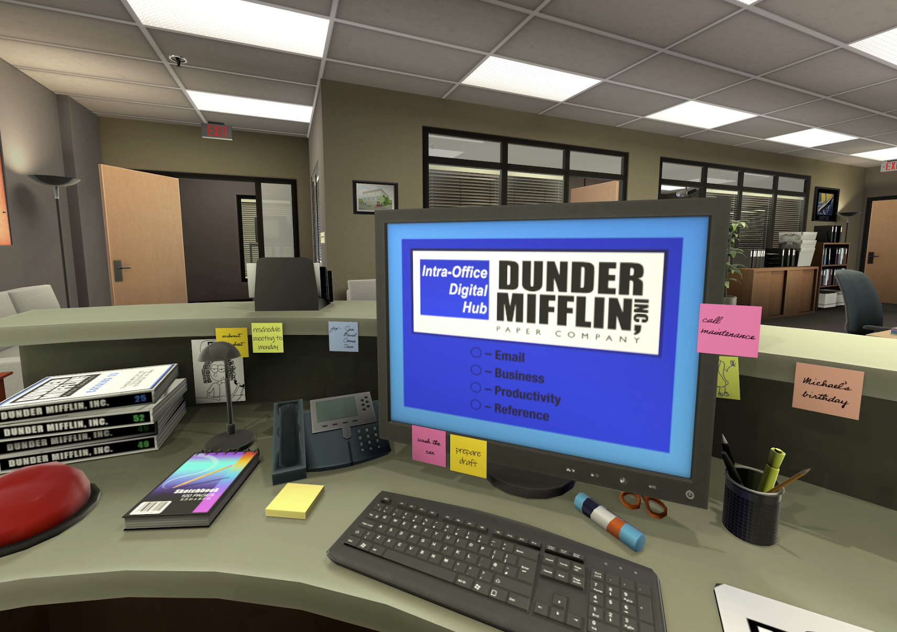

---

## [Quality of Life Improvements](#quality-of-life-improvements-34)

### [General](#general-4)

- We are continuing to roll out the Horizon Home portal to Horizon Central to additional users, and are making it available in additional countries across Europe, Australia, and New Zealand. The portal makes it easier to jump straight into the social experience of Horizon, meet people, and explore new worlds.

---

## [Highlighted Bug Fixes](#highlighted-bug-fixes-1)

Here are some highlighted bug fixes for this week’s release.

### [General](#general-5)

- We fixed a bug on mobile where the Cheer and Like emotes were not exhibiting the correct behaviors.
- We fixed an issue where the camera icon remained disabled on the player’s wrist after exiting from a safe zone.

---

[Meta Horizon Worlds](https://www.oculus.com/experiences/quest/2532035600194083/?intern_source=blog\&intern_content=meta-horizon-worlds-v182-release-notes) v182 is here! A big thank you to all who attended [Connect 2024](https://www.meta.com/blog/quest/connect-2024-keynote-recap-quest-3s-llama-3-2-ai-wearables-mixed-reality?intern_source=blog\&intern_content=meta-horizon-worlds-v182-release-notes) this year—there were a number of exciting announcements and updates shared during the event. This week, updated avatars have landed in Worlds and we addressed a few bugs that were impacting people exploring on their mobile devices. Let’s dive in!

---

## [New and Improved Avatars Arrive in Worlds!](#new-and-improved-avatars-arrive-in-worlds)

We’re excited to announce that our next-generation Meta Avatars have launched in Worlds! Starting today, jump in and customize your new avatar’s look and style. We’re introducing the ability to fine-tune everything from physical proportions to small details like nose shape, eye size, lip size, and more. The next-gen Meta Avatars will work across Meta Horizon, as well as Facebook, Instagram, and Messenger. You can learn more about Meta Avatars [here](https://www.meta.com/avatars/?intern_source=blog\&intern_content=meta-horizon-worlds-v182-release-notes).

**Preparing Your World(s) for Next-Gen Avatars**

For world creators, you may want to ensure that existing structures and furniture, lighting, and other features of your worlds are ready for next-gen avatars. For instance, you might want to try interacting with different parts of your world that could be affected by an avatar’s shape, such as attachables or doorways.

While we don’t anticipate that you’ll need to make any major changes or adjustments to your world(s), consider checking the following:

- **Attachables:&#x20;**&#x44;o these items intersect with the expanded range of avatar sizes and body shapes?
- **Lighting:&#x20;**&#x4E;ext-generation avatars have updated lighting and shading, so you may want to consider selecting a different skybox or updating directional lighting in your worlds.
- **Interactable Objects and Furniture:&#x20;**&#x44;o these items accommodate the expanded range of avatar sizes and different body shapes?
- **Doorways and Walkways:&#x20;**&#x44;o these spaces accommodate the expanded range of avatar sizes and different body shapes?

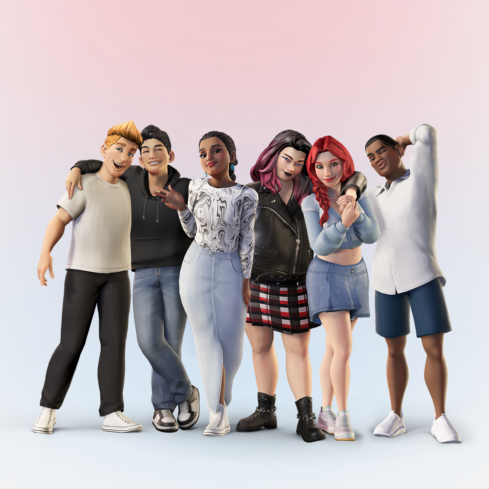

## [Meta Connect 2024 Recap](#meta-connect-2024-recap)

We hope you had as much fun as we did at Connect last week, whether you joined in-person, streamed it digitally, or experienced it in our virtual Connect World. In case you missed it, head to the [Meta Connect 2024 event](https://horizon.meta.com/event/2751429235020383?intern_source=blog\&intern_content=meta-horizon-worlds-v182-release-notes) to watch the replay and redeem exclusive virtual rewards through October 3! You can also watch the keynote on the [Meta Facebook Page](https://www.facebook.com/MetaforDevelopers/videos/449444780818091/?intern_source=blog\&intern_content=meta-horizon-worlds-v182-release-notes).

## [Meta Horizon Worlds Creator Website](#meta-horizon-worlds-creator-website)

Check out the new [Horizon Worlds creator website](https://developers.meta.com/horizon-worlds?intern_source=blog\&intern_content=meta-horizon-worlds-v182-release-notes)! Whether you’re new to Horizon Worlds or have been here since the beginning, this is your new starting point for learning about our tools, finding opportunities and communities, and sharing your creativity.

---

## [Highlighted Bug Fixes](#highlighted-bug-fixes-2)

Here are some highlighted bug fixes for this week’s release.

- We fixed an issue where focusing on the Quests/Achievements boards would zoom the camera in too far on mobile.
- We fixed a bug where avatar emotes did not work when you tapped them on mobile.

---

## [Select Known Issues](#select-known-issues-1)

Here are some of the known issues the Worlds team is currently investigating.

- Emotes are not showing up in the mirror.

---

[Meta Horizon Worlds](https://www.oculus.com/experiences/quest/2532035600194083/?intern_source=blog\&intern_content=meta-horizon-worlds-v180-release-notes) V180 is here! This week, we have a fairly light update, including a few bug fixes and a quality of life improvement related to world ratings. We are T-minus eight days until this year’s [Meta Connect](https://www.meta.com/connect/?intern_source=blog\&intern_content=meta-horizon-worlds-v180-release-notes) kicks off on September 25, and we look forward to seeing you there!

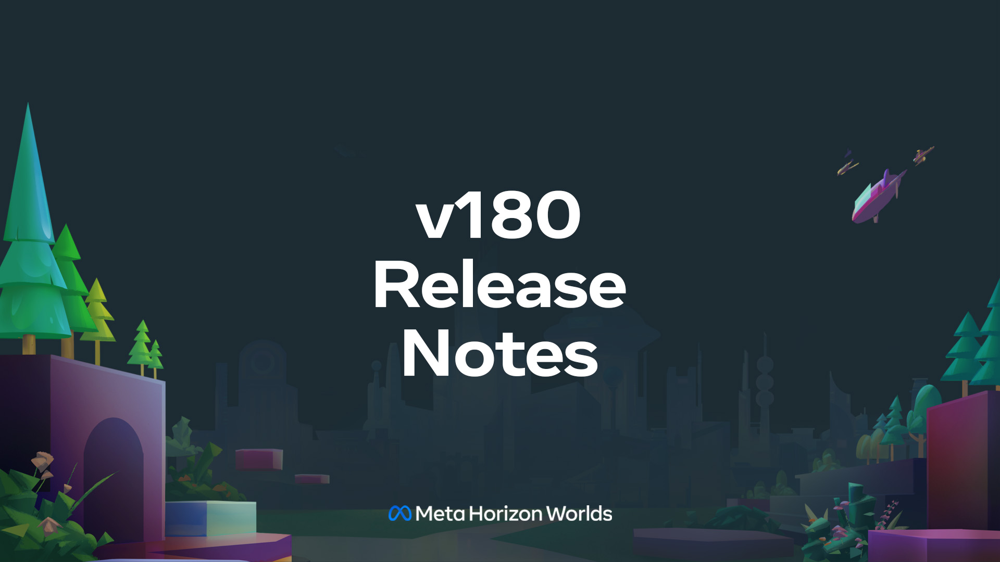

---

**Meta Connect 2024**

Join us for [Meta Connect](https://www.meta.com/connect/?intern_source=blog\&intern_content=meta-horizon-worlds-v180-release-notes) on Wednesday, September 25. Hear from Mark Zuckerberg, Meta leaders, and industry experts as they discuss Meta's latest developments in AI, mixed reality, and wearables!

You can experience the event live in your headset alongside other Worlds attendees. [RSVP now](https://horizon.meta.com/event/2751429235020383?intern_source=blog\&intern_content=meta-horizon-worlds-v180-release-notes) for event reminders. Watch with other people and unlock exclusive rewards in the process.

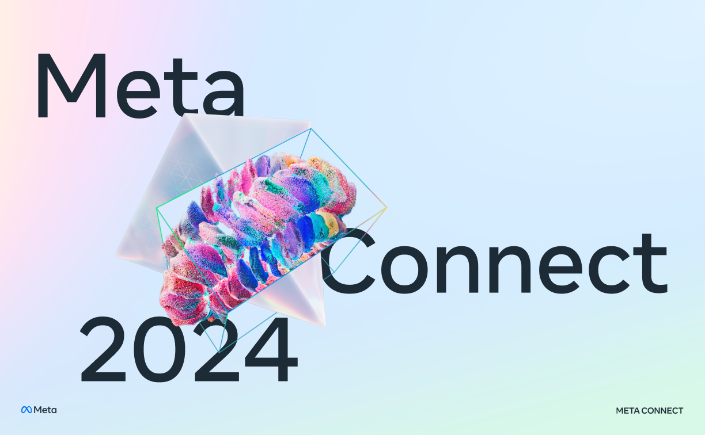

**Required update for Meta Horizon social experiences**

Beginning in October, updating your headset to v69 will be required to continue enjoying Meta Horizon social, co-presence enhanced experiences such as Worlds and Workrooms. Those who have not yet upgraded will be prompted to update to v69 before they can access these experiences.

---

## [Quality of Life Improvements](#quality-of-life-improvements-35)

**Update to World Ratings**

We're excited to announce a three-tier update to our world ratings to make it clearer which age group each world is suitable for. For additional details on the new world ratings please refer to our [Meta Horizon Worlds Content Guidelines](https://www.meta.com/help/quest/articles/horizon/create-in-horizon-worlds/content-guidelines-worlds/?intern_source=blog\&intern_content=meta-horizon-worlds-v180-release-notes).

---

## [Highlighted Bug Fixes](#highlighted-bug-fixes-3)

Here are some highlighted bug fixes for this week’s release.

### [General](#general-6)

- We fixed a bug where the toggles in the properties of an object were white when they should be blue/black.
- We fixed a bug where the Invite to Party button was not responding when activated.
- We fixed a bug where the player loading sparkles never disappeared around other players even after they loaded into the world.

### [Creators](#creators-1)

- We fixed a bug where multiple events were fired from OnPlayerEnterAFK and OnPlayerExitAFK. Only one event is now fired for each of these events.

---

## [Select Known Issues](#select-known-issues-2)

Here are some of the known issues the Worlds team is currently investigating.

### [General](#general-7)

- In certain worlds, the player count and VR-only circle overlap each other on the doors to other worlds.

---

[Meta Horizon Worlds](https://www.oculus.com/experiences/quest/2532035600194083/?intern_source=blog\&intern_content=meta-horizon-worlds-v177-release-notes) V178 is here! This week’s update will make it easier for you to meet up and travel with multiple friends at the same time.

---

## [Quality of Life Improvements](#quality-of-life-improvements-36)

**Invite + Travel Updates:&#x20;**&#x57;e’re updating our invite feature to make it easier for you to meet up with friends in Meta Horizon Worlds. Now you can invite multiple friends to travel with you at once instead of inviting them one by one.

To invite multiple friends at once, head to the right-hand Social panel and choose Invite or Join. Then you can choose who you want to invite to travel, either by selecting them manually or using an invite code.

We’re rolling this improvement out gradually, so it may not be available to everyone while in testing.

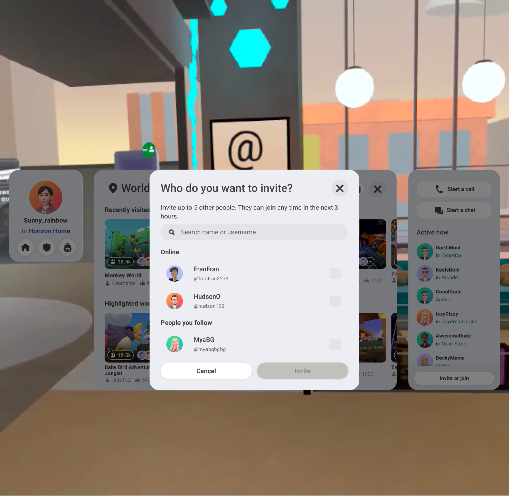

---

## [Highlighted Bug Fixes](#highlighted-bug-fixes-4)

Here are some highlighted bug fixes for this week’s release.

### [Creators](#creators-2)

- We fixed a bug where assets containing file backed scripts can have their scripts run before their dependencies are loaded.

---

## [Select Known Issues](#select-known-issues-3)

Here are some of the known issues the Worlds team is currently investigating.

### [General](#general-8)

- When standing on an object next to a wall, poking your head into the wall causes the camera to shake. This effect is much more drastic when standing on a ramp.
- In the sound settings in the Horizon menu, the “Voice Channel” description is the same color (black) as all the settings titles when it should be the same color as the other settings descriptions (gray).
- It’s not possible to scroll down and read the text of quest rewards on mobile.
- The “Mobile optimized” text overflows on the details page next to a door on mobile.

### [Creators](#creators-3)

- The TextGizmo doesn’t display emoji characters.
- When parenting or unparenting an object, if any interactive option is set, the hierarchy breaks and jumps in position.

---

[Meta Horizon Worlds](https://www.oculus.com/experiences/quest/2532035600194083/?intern_source=blog\&intern_content=meta-horizon-worlds-v177-release-notes) v177 is here! This week, we’re highlighting recent experiments to help with world discovery, making it easier for everyone to access the script library, and rolling out some bug fixes.

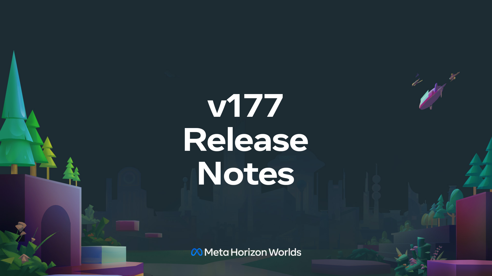

---

## [Quality of Life Improvements](#quality-of-life-improvements-37)

- **Improving world discovery & consideration:&#x20;**&#x57;e’ve begun testing features that give users more context about worlds they discover on Horizon Feed. Selected worlds will now have teaser videos that auto-play on hover. Badges will also begin appearing next to select worlds, providing more context around the recommendation (i.e. “Trending,” “For You”).
- **Opening access to script library:** We opened the script library tab in VR to all creators. This enables you to delete and duplicate scripts in worlds with file-backed scripts enabled.

---

## [Highlighted Bug Fixes](#highlighted-bug-fixes-5)

Here are some highlighted bug fixes for this week’s release.

### [General](#general-9)

- We fixed a bug where the nametag was reversed if the trigger was used to take a photo.
- We fixed a bug where the text on the loading screen was not displayed after the first time you traveled.
- We fixed a bug where visiting a world immediately after publishing it could take you to an older version of the world.

### [Creators](#creators-4)

- We fixed a bug in worlds with file-backed scripts enabled where new variables could not be added to CodeBlock scripts.
- We fixed a bug where the toggles in the properties of an object were white when they should’ve been blue/black.

---

## [Select Known Issues](#select-known-issues-4)

Here are some of the known issues the Worlds team is currently investigating.

### [General](#general-10)

- When standing on an object next to a wall, poking your head into the wall causes the camera to shake. This effect is much more drastic when standing on a ramp.
- In the sound settings in the Horizon menu, the “Voice Channel” description is the same color (black) as all the settings titles when it should be the same color as the other settings descriptions (gray).
- It’s not possible to scroll down and read the text of quest rewards on mobile.
- The “Mobile optimized” text overflows on the details page next to a door on mobile.

### [Creators](#creators-5)

- The TextGizmo doesn’t display emoji characters.

---

[Meta Horizon Worlds](https://www.oculus.com/experiences/quest/2532035600194083/?intern_source=blog\&intern_content=meta-horizon-worlds-v174-release-notes) V174 is here! This week’s update includes a new quality of life improvement that will help you know whether your microphone is on or off when speaking, along with a handful of bug fixes.

---

## [Quality of Life Improvements](#quality-of-life-improvements-38)

### [Introducing Microphone Indicator](#introducing-microphone-indicator)

We’re beginning to roll out a new microphone indicator in Worlds to help you see your microphone status while speaking.

When your microphone is set to OFF, an icon will show up on the left side of your screen showing that your microphone is muted. If your microphone is ON, the icon will indicate that the microphone is unmuted. In VR, the microphone indicator will only appear while you are speaking, but when exploring on mobile or browser/web, the microphone indicator will remain present even when you are not speaking. This feature will be turned on by default but you can choose to disable it from the Sound settings tab.

For more information on microphone and mute settings in Horizon Worlds, please visit the [Meta Help Center](https://www.meta.com/help/quest/articles/horizon/safety-and-privacy-in-horizon-worlds/mute-mic-horizon/?intern_source=blog\&intern_content=meta-horizon-worlds-v174-release-notes).

---

## [Highlighted Bug Fixes](#highlighted-bug-fixes-6)

Here are some highlighted bug fixes for this week’s release.

### [General](#general-11)

- Fixed a bug in which the confirmation screen would not display properly after reporting a user for "profile, name, or bio.”
- We fixed a bug where users entering or exiting a world could sometimes break the menu for creators managing people in the world.

### [Creators](#creators-6)

- We fixed a bug where scaling the Create menu in Edit mode sometimes made it too small to grab the top bar.

---

## [Select Known Issues](#select-known-issues-5)

Here are some of the known issues the Worlds team is currently investigating.

### [General](#general-12)

- Recording or casting while playing can cause Horizon Worlds to crash when using Meta Quest 2.

### [Creators](#creators-7)

- Grabbable objects that are set to force grab and transfer ownership when a player enters a trigger do not work the first time, but further attempts are successful.
- Some creators cannot see worlds where they are collaborators in the [Collaborations: Editor](http://horizon.meta.com/creator/worlds_collaborator?intern_source=blog\&intern_content=meta-horizon-worlds-v174-release-notes) list.
- Accessing player location and other player data in an OnPlayerExitWorld event handler can cause the world to crash.
- Attaching a script to an entity or editing its script will change the motion property from “None” to “Animated.”

---

[Meta Horizon Worlds](https://www.oculus.com/experiences/quest/2532035600194083/?intern_source=blog\&intern_content=meta-horizon-worlds-v172-release-notes) V172 is here! This week, we’re expanding the list of world genre tags that creators can choose from to help people understand what their world has to offer, as well as fixing a few minor bugs. Let’s dive in!

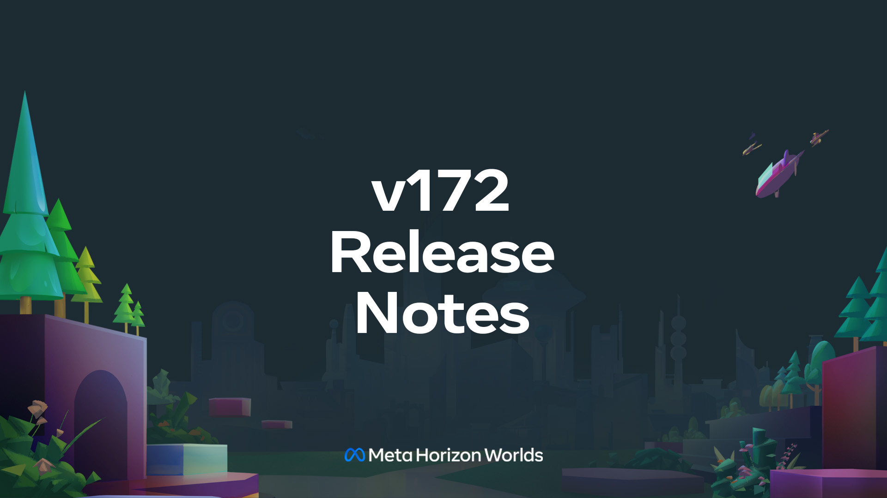

---

## [The Meta Horizon Mobile App](#the-meta-horizon-mobile-app)

Last week we announced [improvements to our mobile app](https://www.meta.com/blog/quest/horizon-mobile-app?intern_source=blog\&intern_content=meta-horizon-worlds-v172-release-notes) that enable you to explore easier than ever, right from your phone. You may need to update the app from your mobile app store on [Android](https://play.google.com/store/apps/details?id=com.oculus.twilight) or [iOS](https://apps.apple.com/us/app/meta-quest/id1366478176) to see the latest changes.

What’s new with this update:

- Express yourself with a new dedicated tab to easily customize your avatar.
- Discover and join new worlds from mobile, connecting with friends over games, music, and more.
- Introducing Light mode to give you a more accessible, comfortable, and customizable viewing experience.

---

## [Quality of Life Improvements](#quality-of-life-improvements-39)

### [Creators](#creators-8)

- Starting today, we’ve expanded the list of world genre tag options and increased the total number of tags that creators can add to their worlds to three tags per world. These tags will be used to build world descriptors, informing people of the experience they can expect in both VR and on mobile. We’ll be rolling this update out over the next few weeks.

---

## [Highlighted Bug Fixes](#highlighted-bug-fixes-7)

Here are some highlighted bug fixes for this week’s release.

### [General](#general-13)

- We fixed a bug where the name tag could appear twice in mirrors.
- We fixed a bug where the legal tab was not highlighted when players opened the legal tab in the settings.

---

## [Select Known Issues](#select-known-issues-6)

Here are some of the known issues the Worlds team is currently investigating.

### [Creators](#creators-9)

- Grabbable objects that are set to force grab and transfer ownership when a player enters a trigger do not work the first time, but further attempts are successful.
- Some creators cannot see worlds where they are collaborators in the [Collaborations: Editor](http://horizon.meta.com/creator/worlds_collaborator?intern_source=blog\&intern_content=meta-horizon-worlds-v172-release-notes) list.
- Accessing player location and other player data in an OnPlayerExitWorld event handler can cause the world to crash.
- Attaching a script to an entity or editing its script will change the motion property from “None” to “Animated.”
- Recording or casting while playing can cause Horizon Worlds to crash when using Meta Quest 2.

---

[Meta Horizon Worlds](https://www.meta.com/experiences/2532035600194083/?intern_source=blog\&intern_content=meta-horizon-worlds-v171-release-notes) V171 is here! This week we’re kicking off Summer Carnival 🌞🎪 and rolling out a few quality of life improvements, including updates to sound settings that will give you more control over who you can hear (and vice versa) and search and discovery improvements for worlds and events. We are also starting to roll out an update to help world creators use and optimize scripts when building, along with a number of bug fixes. Read on for more!

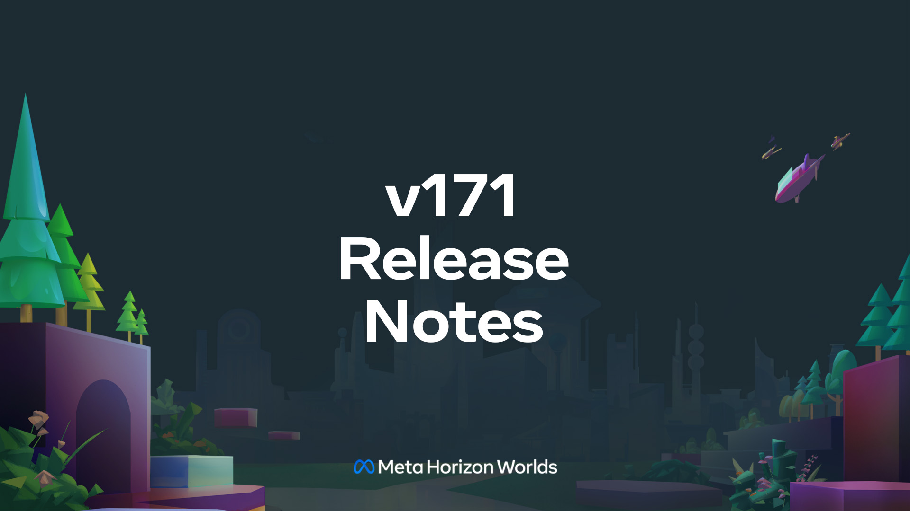

---

### [[Sabrina Carpenter: A VR Concert](https://horizon.meta.com/event/428965920013261/?intern_source=blog\&intern_content=meta-horizon-worlds-v171-release-notes)](#sabrina-carpenter-a-vr-concert)

Fresh off her show-stopping Coachella debut, join Sabrina Carpenter as she brings her chart-topping hits into VR! She’s working late ’cause she’s a singer in Meta Horizon Worlds where you’ll get a better-than-front-row seat to dance and sing along to song of the summer “Espresso” and favorites “Feather” and “Nonsense,” among many others. Fire up your headset as [Sabrina Carpenter: A VR Concert](https://horizon.meta.com/event/428965920013261/?intern_source=blog\&intern_content=meta-horizon-worlds-v171-release-notes) kicks off July 19 in Music Valley.

[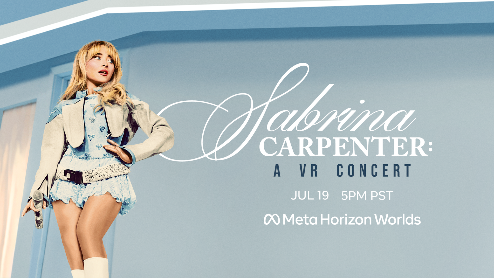](https://horizon.meta.com/event/428965920013261/?intern_source=blog\&intern_content=meta-horizon-worlds-v171-release-notes)

---

### [Summer Carnival Is Coming to Worlds!](#summer-carnival-is-coming-to-worlds)

Summer Carnival is coming to Worlds and the animals are out! During Summer Carnival, you can earn exclusive summer rewards, attend the biggest concerts in Music Valley, and earn carnival tickets to redeem in the brand new rewards shop!

- Get exclusive rewards for completing Summer Quests like earning 2000XP in Kaiju City Showdown, Worlds’ hottest new game.
- Discover new activities, snacks, and adorable carnival animals.
- Complete limited-time quests to earn Summer Carnival tickets, then redeem tickets for avatar items, emotes and more in the brand new rewards shop in Horizon Central.
- Enter doorways to concerts, games and hot new worlds.

With Summer Carnival, we’re launching a brand new rewards shop in Worlds. You can access the shop at any time in Horizon Central or from the menu. In the shop, you’ll find limited-time avatar items, emotes and stickers that can be redeemed with the carnival tickets you’ll earn all summer long!

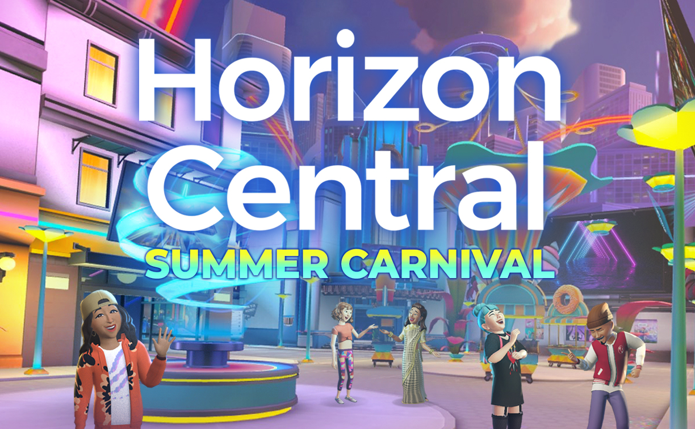

---

## [Quality of Life Improvements](#quality-of-life-improvements-40)

### [Voice Channel](#voice-channel)

We’re improving our sound settings to give you more control over who you can hear (and who can hear you) while in Worlds. The previous **Voices** and **Voice Mode** settings are being replaced with a single setting called **Voice Channel** that makes it easy to choose who you want to interact with.

There are two Voice Channel options:

1. **People you know:&#x20;**&#x57;ith this setting, you’ll only hear and be heard by people you know, a.k.a. people who [follow you and who you follow back within Meta Horizon](https://www.meta.com/help/quest/articles/in-vr-experiences/social-features-and-sharing/meta-horizon-followers/?intern_source=blog\&intern_content=meta-horizon-worlds-v171-release-notes). Other people’s voices will be filtered and sound like quiet and friendly background noise. (In the past, we’ve referred to these “filtered” voices as “garbled.”)
2. **Everyone:** With this setting, you’re open to hearing and being heard by everyone in the world. However, if someone has their voice channel set to only hear people they know, their voice will sound filtered to you.

To adjust Voice Channel settings, go to **Settings > Sound&#x20;**&#x61;nd select your desired Voice Channel option.

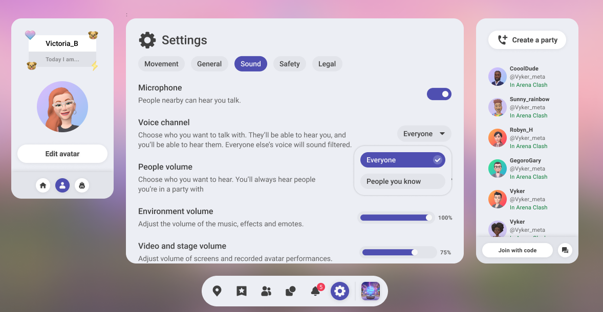

### [Improved Search + Discovery](#improved-search--discovery)

A [previous experiment](https://www.meta.com/blog/quest/meta-horizon-worlds-v164-release-notes/?intern_source=blog\&intern_content=meta-horizon-worlds-v171-release-notes) to improve the search experience has now rolled out to everyone! As a reminder, we were testing out a new “All” default tab that would return both worlds and events when searching.

Separately, we are now testing out a new feature in which worlds will begin showing up in a new Worlds tab within the Horizon Store. We believe this will help users discover more experiences that they want to engage with.

### [Web and Mobile](#web-and-mobile)

- We made the sprint field-of-view transition more responsive and reduced the acceleration of the effect on web and mobile.
- The People profile in the Horizon menu now shows a back button on web and mobile.
- We have added a new shelf of “Hangout Worlds” to the Horizon Feed on mobile.

### [Creators](#creators-10)

- We are beginning to roll out an update that will make file-backed scripts the default for all **new** worlds. This changes how Meta Horizon Worlds stores scripts—but more importantly, it enables you to use more scripts per world, unlocks larger scripts and improves travel times. It should also make script editing more reliable.\
  \
  Check out the [Help Center](https://www.meta.com/help/quest/articles/horizon/create-in-horizon-worlds/file-backed-scripts-horizon-worlds/?intern_source=blog\&intern_content=meta-horizon-worlds-v171-release-notes) for more information on this update, including the benefits of file-backed scripts, how to opt in or out, and more.\
  \
  **Note:** There is currently no plan to automatically update existing worlds to file-backed scripts.

---

## [Highlighted Bug Fixes](#highlighted-bug-fixes-8)

Here are some highlighted bug fixes for this week’s release.

### [General](#general-14)

- We fixed a bug where the sound effect would not play when claiming a reward in the Horizon menu.
- We fixed an issue where door information failed to load in worlds containing large numbers of doors.
- We fixed music not playing when traveling between worlds on web and mobile.
- We fixed the World Volume slider in the Settings menu, which was not functioning in certain worlds in VR.

### [Creators](#creators-11)

- We fixed a rare issue that could cause script properties on spawned assets to be wired to the wrong objects.
- For worlds using file-backed scripts, line numbers will now be correct in the scripting console and logs as soon as the world is loaded in Edit mode. This will only be true for scripts that are modified after this change.

---

