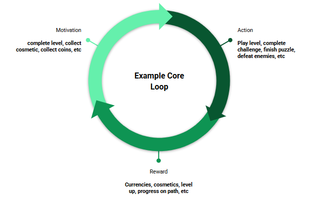
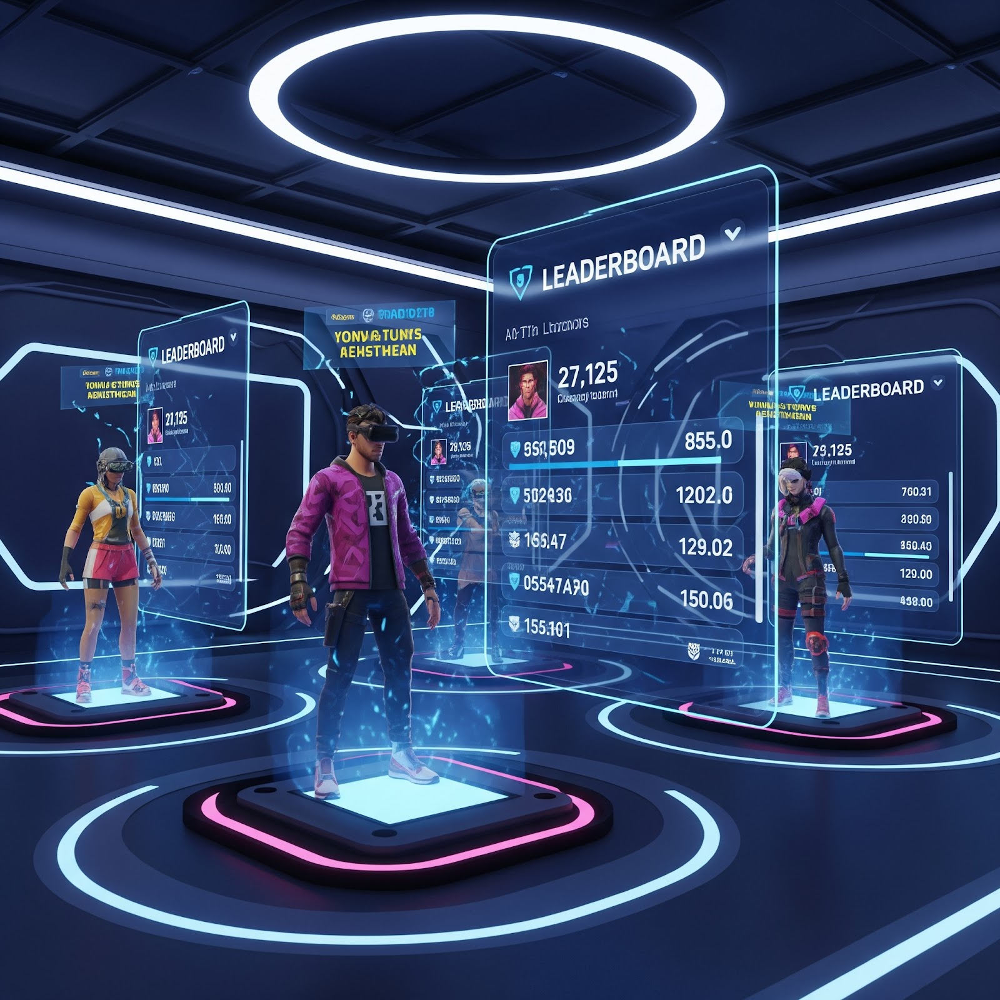
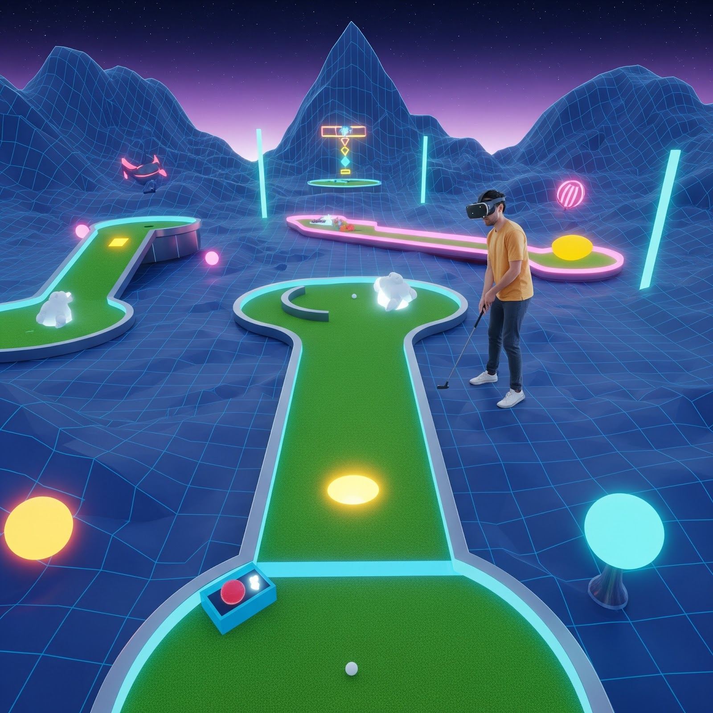
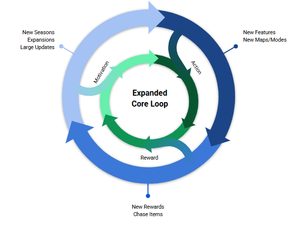

# [Adding Core Loops for Retention](#adding-core-loops-for-retention)

Our mission is to **incentivize users to find the best content in the metaverse and discover deeply engaging experiences that improve the quality of time spent in Horizon.** We want people to feel good about the time they invest and that the things they get from their time investment will make their next sessions more fun and enjoyable. In this article, we will review how leveraging a core loop in your game can help retain and engage users. We will review: the basics of a core loop, why they work, and how they have engaged players in Horizon Worlds.

## [What is a core loop?](#what-is-a-core-loop)

A core loop refers to the repetitive sequence of gameplay mechanics and activities that players engage with repeatedly throughout the game that form the backbone of the “earned economy”. It’s typically the central, most engaging and rewarding part of the game that keeps players coming back for more.

A core loop typically consists of three key elements:

1. **Motivation**: A clear goal or objective that drives the player’s actions.
2. **Action**: The gameplay mechanics and activities that the player performs to achieve the goal.
3. **Reward**: The satisfaction, progress, or benefits that the player receives as a result of completing the action. Users feel a sense of commitment and ownership when they have invested time and effort into gaining items.

The core loop is designed to be engaging, challenging, and rewarding, making it the primary driver of player retention and enjoyment. It is often used in games with high replay value, such as multiplayer online battle arenas (MOBAs), massively multiplayer online role-playing games (MMORPGs), and mobile games with daily challenges.

Example of a Core Loop:

- **Motivation**: Collect 10 coins to unlock a new character skin.
- **Action**: Play through levels, complete challenges, or defeat enemies to collect coins.
- **Reward**: Unlock the new character skin, which provides a sense of accomplishment and visual customization.

## [Why do core loops work? – UX Research insights](#why-do-core-loops-work--ux-research-insights)

Core loops drive players to engage with games and apps repeatedly and earn rewards for their efforts. An “earned economy ecosystem” drives platform-level economy in two ways:

1. Having a path to earn digital goods across the metaverse is key for **driving value** in digital goods by adding dimensions of time and effort into perceived value.
2. Platform core loop systems provide an opportunity for creators to have a **lever for engagement** and traffic into their experiences.

Core loops engage users for several psychological and design-related reasons. By incorporating these elements, core loops can create a highly engaging experience that consistently give players content to enjoy.

1. **Variable Rewards**- Core loops often incorporate variable rewards which activate the brain’s reward system. Players will be eager to continue playing in anticipation of the next reward.
2. **Progression and Accomplishment**- Core loops provide a sense of progression and accomplishment as players complete tasks, collect rewards, or level up. Players are motivated to continue striving for more achievements, as challenges continue to increase in difficulty.
3. **Clear Goals and Feedback**- Core loops typically have clear goals and provide immediate feedback on progress. This clarity helps players understand what they need to do to succeed, giving them a sense of control and agency.
4. **Repetition**- The repetitive nature of core loops makes it easier for players to engage with the game regularly. As players repeat the loop, their brains create a mental shortcut, allowing them to perform the actions without much conscious thought.
5. **Emotional Investment**- Core loops can create an emotional investment in the game by providing a sense of ownership and customization. Players become attached to their characters, items, or progress, making them more likely to enjoy playing.
6. **Social Interaction and Community**- Many core loops involve social interaction, such as multiplayer modes or leaderboards. This social aspect fosters a sense of community, encouraging players to compete, cooperate, or share experiences with others.

## [Core Loops Work – What We Know From Player Data](#core-loops-work--what-we-know-from-player-data)

In this article, we’ve already discussed that core loops refer to the repetitive sequence of gameplay mechanics and activities that drive player engagement. Below we discuss how core loops have already proven successful in the Horizon Worlds ecosystem by following three best practices:

1. **Leverage Core Loop systems to amplify engagement:** Drive users to interact with your most compelling content using Core Loop mechanics.
2. **Compelling rewards are key:** Offer attractive and meaningful rewards with more appealing rewards yield greater impact.
3. **Keep rewards fresh and rotating:** Regularly refresh reward content to maintain effectiveness, as stale rewards lead to diminishing returns over time.

### [**Leverage Core Loop systems to amplify engagement**](#leverage-core-loop-systems-to-amplify-engagement)

An effective core loop quest with compelling rewards significantly engages users. When Giant Paddle Mini Golf introduced reward content, they observed substantial increases in incentivized user actions. For instance, creating a quest that encouraged users to achieve Par at least once led to an increase in the percentage of users achieving Par. More importantly, users who received a reward experienced an even greater increase in their rate of achieving Par.

### [**Compelling rewards are key**](#compelling-rewards-are-key)

As previously noted, users who were offered rewards showed increased engagement with core loop quest content. This was further reinforced by a recent season event featuring weekly new quests and a set of rewards that could be earned throughout the season. Notably, every time a new reward was released, Paddle Mini Golf observed significant spikes in engagement. In contrast, the launch of new quests did not trigger similar spikes in engagement. This suggests that the promise of rewards is a key driver of user behavior, supporting the hypothesis that rewards are the primary motivator for core loop engagement (see graphic below).

### [**Keep rewards fresh and rotating**](#keep-rewards-fresh-and-rotating)

Rewards do not maintain their impact forever, as users will eventually acquire the rewards you offer. To maintain engagement, it’s crucial to establish a consistent flywheel of fresh rewards. A recent case study illustrates this point: when a world on Horizon Worlds introduced a new gun skin, in-world purchases surged. However, within a month, this lift returned to baseline as the content became stale. This highlights the importance of regularly refreshing rewards to sustain user interest and drive continued engagement.

## [Examples of Core Loops](#examples-of-core-loops)

These examples illustrate how core loops can be designed to engage players in different types of games, from casual mobile titles to complex PC games.

1. Clash of Clans
   1. **Motivation**: Build and upgrade your village to defend against other players.
   2. **Action**: Gather resources (gold, elixir, dark elixir) by building and upgrading resource-generating buildings.
   3. **Reward**: Use resources to build and upgrade defensive structures, troops, and heroes to protect your village and attack others.
2. Candy Crush Saga
   1. **Motivation**: Clear levels to progress through the game and unlock new content.
   2. **Action**: Match candies to clear the board and achieve level objectives (e.g., score a certain number of points).
   3. **Reward**: Earn stars, badges, and rewards for completing levels, which can be used to unlock new levels, boosters, and power-ups.
3. World of Warcraft
   1. **Motivation**: Level up your character and acquire better gear to take on more challenging content.
   2. **Action**: Complete quests, kill monsters, and participate in dungeons and raids to earn experience points and loot.
   3. **Reward**: Level up, acquire new abilities, and equip better gear to increase your character’s power and effectiveness.
4. Fortnite
   1. **Motivation**: Be the last player or team standing on the map.
   2. **Action**: Scavenge for resources (wood, stone, metal), build structures, and eliminate opponents.
   3. **Reward**: Earn experience points, level up, and unlock new cosmetic items and emotes.
5. Pokémon Go
   1. **Motivation**: Catch and collect Pokémon to complete your Pokédex and battle at gyms.
   2. **Action**: Explore real-world locations to encounter and catch wild Pokémon, hatch eggs, and battle at gyms.
   3. **Reward**: Earn experience points, level up, and unlock new Pokémon, items, and features.
6. Overwatch
   1. **Motivation**: Win matches and climb the competitive ranks.
   2. **Action**: Play as different heroes, each with unique abilities, to capture objectives and eliminate the enemy team.
   3. **Reward**: Earn experience points, level up, and unlock new cosmetic items, emotes, and hero skins.
7. Minecraft
   1. **Motivation**: Survive and thrive in a blocky world filled with creatures and resources.
   2. **Action**: Gather resources (wood, stone, minerals), craft tools and items, and build structures to protect yourself from monsters.
   3. **Reward**: Explore and discover new biomes, resources, and structures, and build complex creations.

## [Conclusion](#conclusion)

By understanding and optimizing the core loop within your world, you can create an enjoyable experience that keeps players engaged for the long haul. Ensuring that your core loops include a clear motivation, action, and reward will help build experiences that provide value to users and create reasons for them to return.

