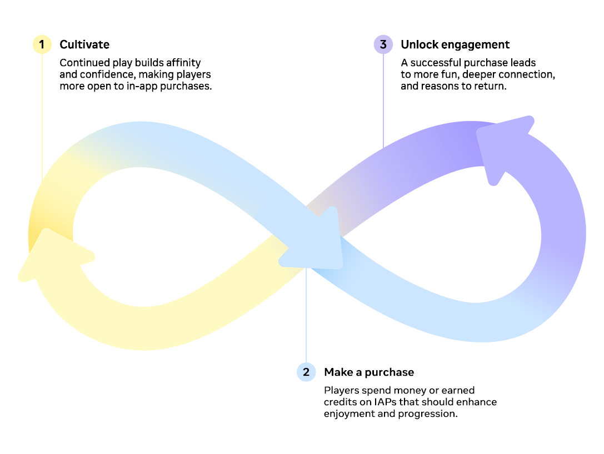

# [Building Monetization and Trust in the Metaverse](#building-monetization-and-trust-in-the-metaverse)

A trusted and profitable digital economy in the metaverse depends on three core pillars:

1. Cultivating deep user engagement.
2. Ensuring a clear and valuable exchange for in-app purchases (IAP).
3. Establishing robust safety nets that protect players and reassure parents.

## [Engagement is paramount](#engagement-is-paramount)

Engagement is the foundation of monetization. Players are more likely to spend, and to keep spending, when they feel emotionally connected to an experience and believe it offers lasting value. Digital assets should meaningfully enhance enjoyment, whether through gameplay depth, progression, social interaction, or even resale potential. Platforms like Meta provide tools that can reinforce trust by giving players the ability to monitor and manage spending, and by encouraging responsible purchasing habits. Devs can support these efforts by leveraging these platform tools, and designing in responsible ways.

## [Value exchange must be clear](#value-exchange-must-be-clear)

Every in-game credit, whether earned or purchased, must deliver clear, tangible value. Players expect a return on investment for IAPs, whether through functional upgrades, aesthetic appeal, or time savings that reduce repetitive grinding. Free-to-play titles have more flexibility, but paid games face higher expectations for quality and integration. Thoughtful design that extends content—rather than restricting it—signals respect for players’ time and money. Creators and developers who reinforce value through transparency, storytelling, and polish build trust and encourage ongoing purchases.

## [Safety nets are essential](#safety-nets-are-essential)

Strong safety nets are essential for protecting players. Large platforms like Meta can offer built-in systems for content integrity, identifying ‘bad actors’, parental controls, and refunds aligned with user expectations. The Meta Quest Store’s strong trust equity — grounded in a consumer-friendly return policy — sets a benchmark for the broader metaverse economy. Integrating trusted payment processors like PayPal further reduces friction by providing buyer protections and secure transactions.

A sustainable metaverse economy requires all three pillars working together. By fostering engagement through valuable experiences, ensuring transparent value exchange, and implementing robust safety nets, the metaverse can evolve into a secure and thriving digital frontier.

These foundations not only drive participation and spending, they also safeguard against the pitfalls that have undermined other digital ecosystems — cementing Meta’s role as a responsible leader in shaping the future of the metaverse.

