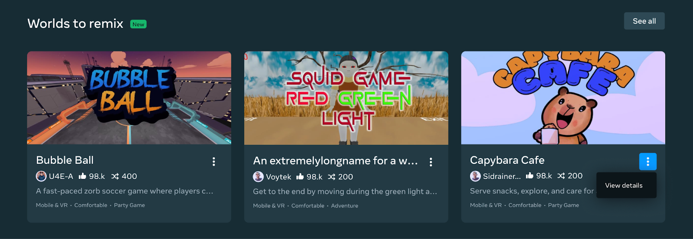
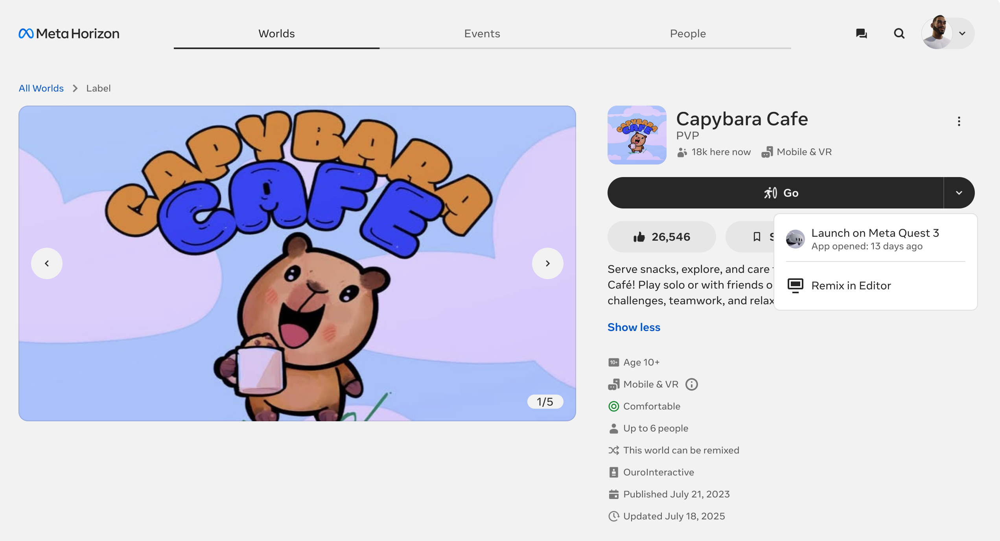
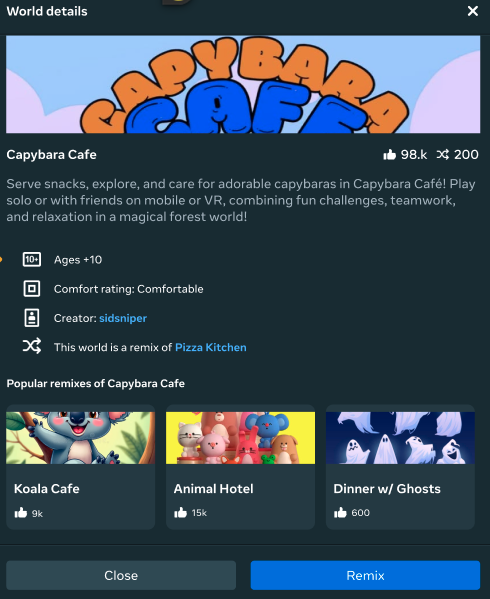
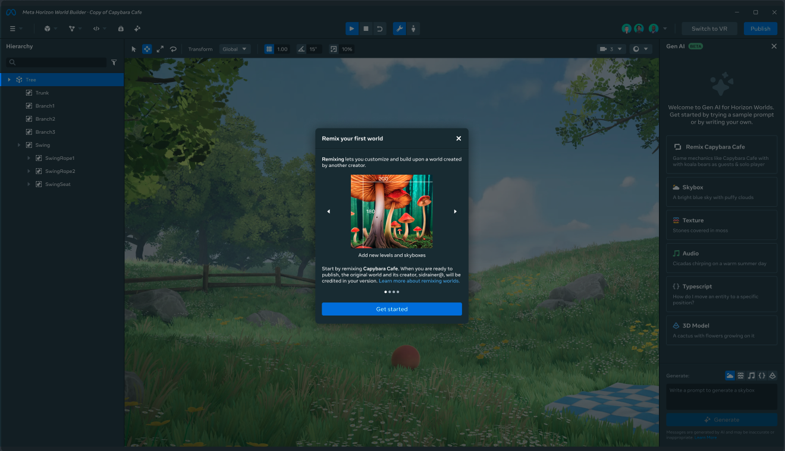
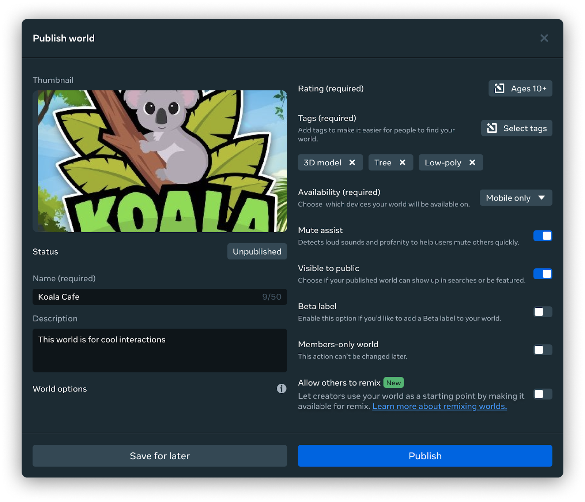
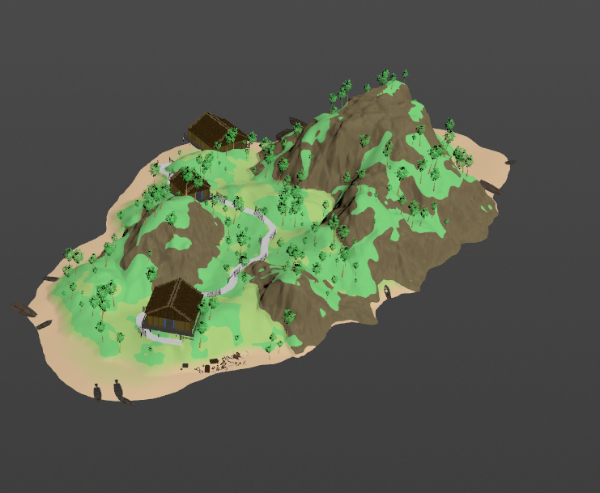
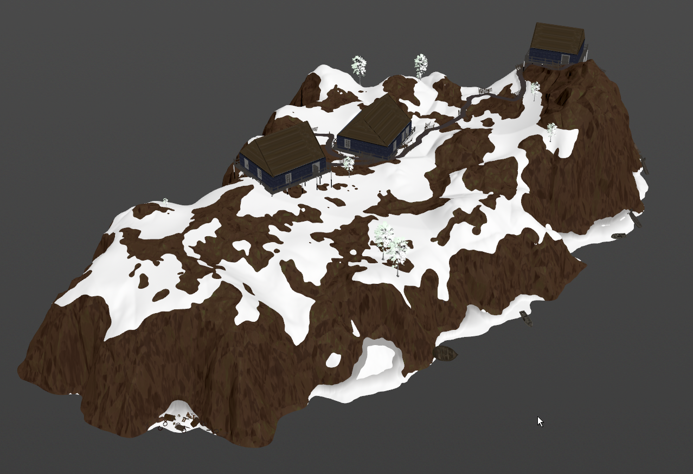
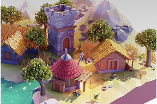
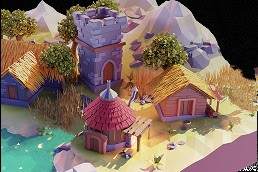
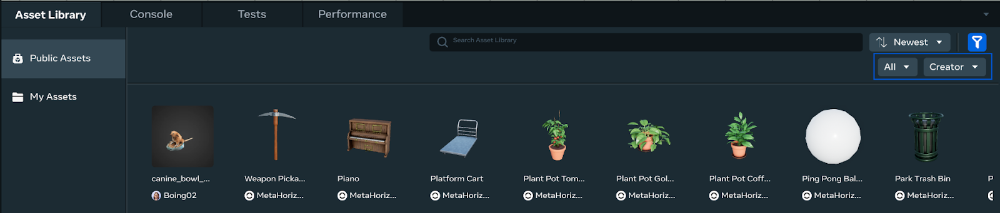

# [Horizon Remix Worlds](#horizon-remix-worlds)

## [Remix Worlds Overview](#remix-worlds-overview)

Remix Worlds is a feature in Horizon that allows creators to make their worlds clonable and editable by other creators. By beginning the world creation journey with a remixed world, creators can help solve the “blank page” problem by offering a proven starting template for creating worlds. Through world remixes, you can accelerate your world creation process and focus on creating and improving gameplay elements, which will help expedite the development process.

## [Finding Remix Worlds](#finding-remix-worlds)

Remixable worlds can be found on the **Creation Home** page of the Horizon editor in the **Worlds to remix** section. Any worlds on this carousel have been carefully selected as ideal starting places for a creator looking to begin the creation process from a remixed world.

Click **See all** to view all the currently available remixable worlds on the **Creation Home** page.

You can view details about the world by selecting the three-dot menu and selecting **View details**. When a world is open for remixing, it will feature other worlds created from it on its page. This can help inspire ideas when remixing a world to create.

You can also view a remixable world that is shared with you via a URL. You will be informed about the ability to remix a world on the linked world’s detail page.

Select **Remix in Editor** from the drop-down menu to begin the process of creating a new remix world from the linked world.

## [Create a remix world](#create-a-remix-world)

To create a remix world, use the following process:

1. Select the three dot menu of a remixable world from the **Creation Home** page to view the **World details page**. 
2. Click **Remix** to clone the selected world to begin remixing the world in the Horizon desktop editor.
3. Once open in your editor, you are free to begin updating the remixed world to create a new world. 
4. Once your world is created, you can publish for users to enjoy in the Horizon ecosystem. Note that your world must be materially different from the original remixed world to be published.
5. Once your world is created, you can publish it for users to enjoy in the Horizon ecosystem. Note that your world must be materially different from the original remixed world to be published.

## [Publish a remixable world](#publish-a-remixable-world)

When creating an original world, you can also set it to be remixable by the community. This will allow any creator to use your world as a building block to build their own world, and helps expand the Horizon ecosystem.

To set your world as remixable, use the following process:

1. Select **Publish world** from the top left drop-down menu in the Horizon desktop editor.
2. In the **Publish world** window, set a name for your world and a description. Then in the toggles on the right side, enable **Allow others to remix**. **Note**: You can also toggle this off after your world is published. Any worlds remixed from your world will still be visible to the Horizon community. 
3. Select any other options for your world to configure. Once finished, click **Publish**. Note that you must use a distinct world name when publishing a world. This helps ensure variety when enabling your world to be remixed by the Horizon community.
4. You can disable the **Allow others to remix** toggle at any time. However any remixes people have created from your world will continue to exist and will still be visible to the Horizon community.
5. You can disable the **Allow others to remix** toggle at any time. However, any clones or remixes people have created from your world will continue to exist and remain visible to the Horizon community.

## [Best Practices](#best-practices)

- For a remixable world:
  - Build a solid, well-implemented foundation for your game with clear gameplay mechanics, even if it’s a simple concept. This gives others a clear starting point to build upon.
  - Allow for easy customization of aesthetics, visuals, or other elements that encourage remixers to put their own stamp on the game. For example, instead of hard coding settings, you can allow multiple presets. You can create multiple sizes or versions of the same assets to facilitate remixing.
  - Employ clear and consistent naming conventions and hierarchy for your assets, scripts, and variables to ensure clarity for those who might remix your work.
  - Once you publish your world, try remixing it just like another user would to ensure everything works smoothly.
  - Explicitly mention in your world’s description that it’s open for remixing and suggest potential avenues for creative iteration.
  - Document the design and structure of your world. This is best done on a 2D panel in the world
  - Ensure that your base world performs smoothly by following [performance best practices](../Performance/Performance%20best%20practices/CPU%20and%20TypeScript%20optimization%20and%20best%20practices.md) \*
- For a remix: Make your world unique:
  - A successful remix should introduce enough new elements to make the world feel like a fresh experience, even if it is recognizable from the original.
  - Remixes can introduce new characters, gameplay, items, or locations, which extend the longevity and immersiveness of a world.

### [Do’s and Don’ts for remix worlds](#dos-and-donts-for-remix-worlds)

| Do                                                                                                                                                                                                                                                   | Don’t                                                                                                                                                                                                                            |
| ---------------------------------------------------------------------------------------------------------------------------------------------------------------------------------------------------------------------------------------------------- | -------------------------------------------------------------------------------------------------------------------------------------------------------------------------------------------------------------------------------- |
| Think about how your world can be distinct from the original.  | Change a few assets or items and publish.  |
| Think about how you can leverage the original world’s themes or gameplay to create an engaging gameplay loop.                                                                                                                                        | Remix worlds just for assets - consider using the [Public Assets Library](../Desktop%20editor/Assets/Public%20Assets.md) instead.     |

- Naming Conventions: When creating an Open World, use clear and descriptive names to help other creators understand the purpose and content of the world.
- Attribution: Consider adding visible attribution UI when the world loads, such as “Made with \[Creator’s Name] Open World,” to acknowledge the original creator. By default, we provide attribution to the immediate parent world.

