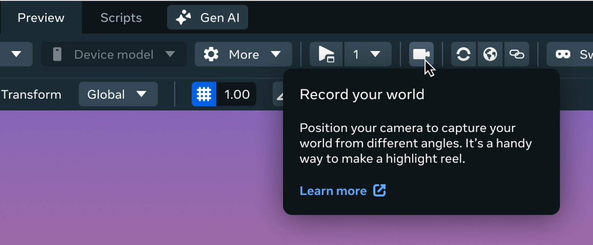
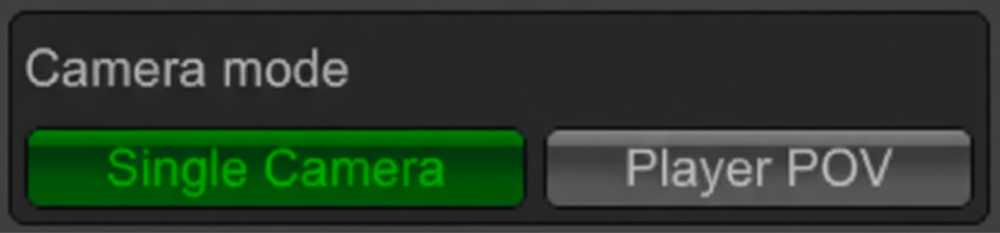
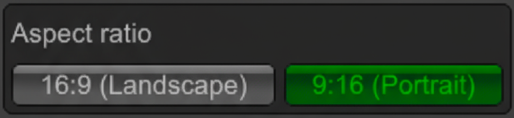
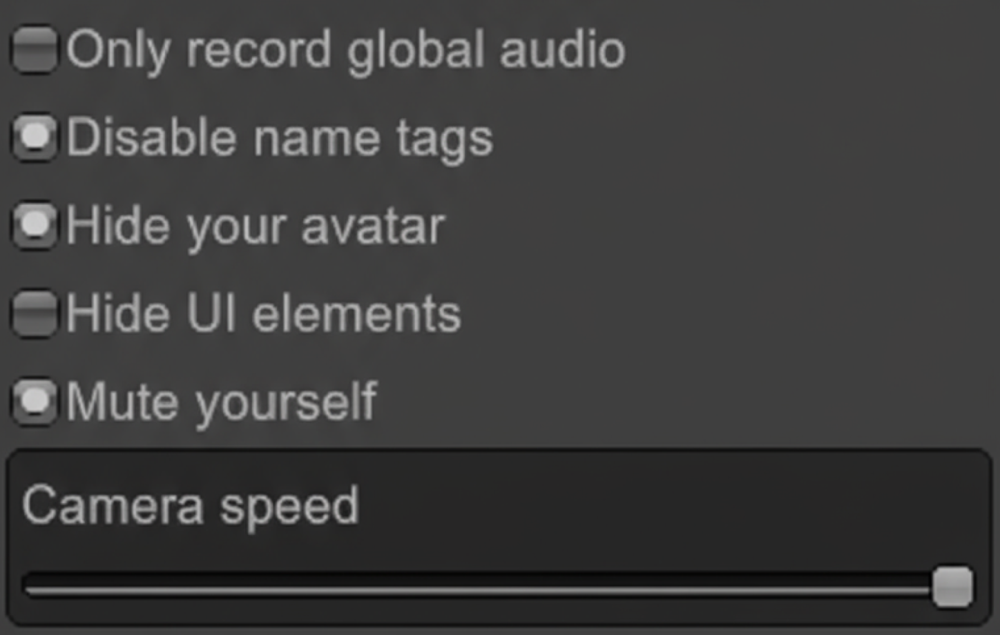
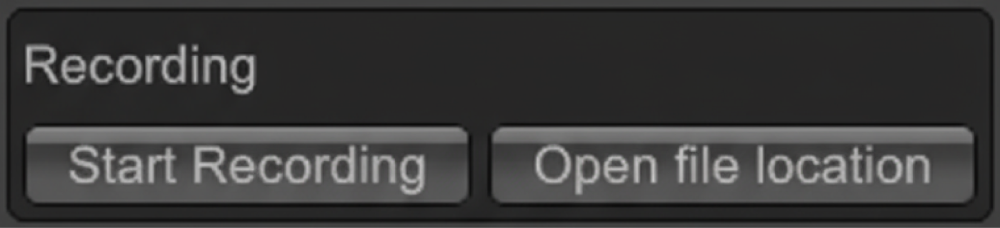

# Record world videos

It’s now easier than ever to make promo videos of your world. With just a few clicks, you can record high-quality footage of your creations, capture gameplay from any angle, and share your videos to attract new visitors, promote events, or showcase your latest updates on social media.

## What you can do

* Capture video footage. You can capture and export footage from a player POV or place a camera anywhere you want.
* Control what’s included in your recording: global audio, name tags, your avatar and audio, and UI elements.
* Adjust camera speed for smooth, cinematic movements.

## How to record your world

- While in preview mode in the Worlds Desktop Editor, click the camera icon in the top navigation. 
- Choose your camera mode.

**Single Camera**: Full-screen, controllable camera.

**Player POV**: Records from the player’s perspective (the way it looks during gameplay). The camera will follow behind the player.

Single Camera

Player POV

- Choose an aspect ratio for your video.

If you want your video to look great on phones and social media, choose 9:16 (portrait). This vertical format is the standard for mobile screens. For desktop or standard YouTube videos, use 16:9 (landscape).

- Toggle additional settings for your recording as needed.

See below for a full breakdown of each setting.

- Record!

This is the best part. When you’re ready, click the record button to start capturing your world. You can stop recording at any time by clicking the stop button.

- Adjust your camera sensitivity.

Drag the slider to change how fast you want the camera to move when you’re navigating with WASD or a controller. A lower sensitivity means slower camera movement while a higher sensitivity means faster camera movement.

## Share your recorded video

Once you’ve recorded your footage, export your video and share it on Reels, Instagram, TikTok, or anywhere you want to showcase your world. Promo videos are a powerful way to attract new visitors, promote events, and build your community.

## Settings and how they work

There are many settings to help you record your world. Here’s a breakdown of how each setting works.

| **Toggle** | **What it does** |
| --- | --- |
| Camera mode | Choose the POV of your camera.  *Single Camera*: Full-screen, controllable camera. See controls for single camera [below](Record%20world%20videos.md#controls-for-single-camera-mode).  *Player POV*: Records from the player’s perspective (the way it looks during gameplay). The camera will follow behind the player. |
| Aspect ratio | If you want your video to look great on phones and social media, choose 9:16 (portrait). This vertical format is the standard for mobile screens. For desktop or standard YouTube videos, use 16:9 (landscape). |
| Only record global audio | When on, anyone speaking *anywhere* in the world will be captured. Your recording will ignore audio zones you may have set for your world. |
| Disable name tags | Hides all player name tags in your recording, making the video look cleaner and more private. |
| Hide your avatar | Make your avatar invisible in the recording, so you don’t accidentally appear in your own video. |
| Hide UI elements | Removes all on-screen menus and buttons from your recording, so the video only shows the world itself. |
| Mute yourself | Turns off your microphone for the recording, so your own voice or background noise isn’t captured. |
| Camera speed | Adjusts how fast the camera moves when you use the controls. Set this lower if you want smother, slower camera movement. |
| Recording | Start the recording process after configuring other options. |

## Controls for single camera mode

When using single camera mode, you’ll manually adjust the camera’s position using either a keyboard/mouse or a controller. The following is a breakdown of the controls used for each input method:

### Keyboard and mouse

* Left click + Drag mouse: Pan/Tilt camera
* Right click + Drag mouse: Roll camera
* W/Up arrow: Move camera forward
* S/Down arrow: Move camera backward
* A/Left arrow: Move camera left
* D/Right arrow: Move camera right
* Q/Right Ctrl: Move camera dow
* E/Right Shift: Move camera up
* Scroll mouse wheel: Adjust camera’s field of view

### controller

* Left stick: Move camera forward/backward and left/right
* Right stick: Pan and tilt camera
* Triggers: Move camera up and Down
* LB/L1 + Right stick: Zoom
* RB/R1 + Left stick: Roll camera

## **Tips and best practices**

* Hide UI elements and name tags for a clean, professional look.
* Adjust camera speed for smooth pans and dynamic shots.
* Use “Only record global audio” for event coverage to avoid picking up localized sounds.
* Try different camera modes to showcase different aspects of your world.